# Competency Hub — HLD

Reverse-engineered from `frac-backend`, `frac-dictionary`,
`sunbird-cb-portal`, `sunbird-cb-orgportal`, `sunbird-cb-uiproxy`,
`sunbird-cb-ext`, `cb-ext-course-service`, `igot_karmayogi_mobile`,
`knowledge-platform-jobs`, `knowledge-platform`, `sunbird-course-service`,
and `sunbird-devops`.

## Topology

There *is* a real competency-taxonomy service now — `frac-backend` — closing
what was originally documented as an external gap. But closing that gap
revealed a bigger one: most of the platform doesn't talk to it. Read
traffic for `kcmfinal_fw` goes to a same-shaped-but-separate taxonomy inside
`knowledge-platform`'s generic Framework API, and the two are never
reconciled anywhere in these 13 repos.

```mermaid
flowchart TB
    subgraph LearnerWeb["Learner Web - sunbird-cb-portal"]
        PassbookW["Competency Passbook"]
        BrowseW["Browse-by-Competency v1/v2"]
        SelfAttestW["Profile-v3 self-attestation"]
        AuthorTag["Content authoring tagging"]
    end

    subgraph LearnerMobile["Learner Mobile - igot_karmayogi_mobile"]
        PassbookM["Competency Passbook feature module"]
        ExploreM["Explore-by-Competency"]
        StrengthM["MDO/microsite Competency Strength"]
    end

    subgraph OrgAdmin["MDO Admin Web - sunbird-cb-orgportal"]
        ODCS["ODCS bulk-upload UI"]
        WAT["Work Allocation Tool"]
        TagWidget["Shared competency-add widget - community/event/content-request"]
    end

    GW["sunbird-cb-uiproxy - competency.ts + frac.ts (direct) - generic Kong pass-through (everything else)"]

    subgraph CbExt["sunbird-cb-ext"]
        SearchBy["SearchByService - browse/search directory"]
        ODCSWorker["OrgDesignationCompetencyMappingServiceImpl + Kafka consumer"]
        WATVerify["AllocationService/V2 - competency verification"]
    end

    subgraph CbCourse["cb-ext-course-service"]
        LearnerComp["LearnerCompetencyController + CompetencyServiceImpl"]
    end

    subgraph KPJobs["knowledge-platform-jobs (Flink)"]
        CertGen["3x certificate-generator jobs"]
        UCU["user-competency-updater"]
    end

    subgraph KP["knowledge-platform"]
        Schema["content schema - competencies..v6 fields, unvalidated"]
        KMFramework["Generic Framework/Category/Term API - hosts kcmfinal_fw"]
    end

    subgraph FB["frac-backend - THE real taxonomy system of record"]
        FRACCtrl["FRACController - /frac/*"]
        ConfigPanel["ConfigurationPanel - in-memory node+mapping cache"]
        Verify["VerificationServiceImpl - L1/L2 review workflow"]
    end

    MySQL[("MySQL frac_tool - data_node, additional_properties, node_mapping_parent/child")]
    FracES[("Elasticsearch - frac-commentrating, frac-collection-logs, frac-dictionary, frac-verifiedmapping")]
    FracKafka(["Kafka dev.telemetry.raw - producer-only audit events"])

    subgraph FD["frac-dictionary - public read mirror, bypasses frac-backend's REST API"]
        Gatsby["Gatsby static site - build-time ES pull"]
        DictProxy["Express/Apollo proxy - runtime ES re-query for facet filters"]
    end

    Cass[("Cassandra user_competency_mapping")]
    Redis[("Redis - passbook cache")]
    Kafka(["Kafka - COMPETENCY_ACQUIRED - competency.designation.bulk.upload"])
    ContentSvc[("Content service - reads competencies_v6")]

    PassbookW --> GW
    BrowseW --> GW
    SelfAttestW --> GW
    AuthorTag --> GW
    PassbookM --> GW
    ExploreM --> GW
    StrengthM --> GW
    ODCS --> GW
    WAT --> GW
    TagWidget --> GW

    GW -->|"FRAC direct: searchNodes, getAllNodes"| FRACCtrl
    GW -->|"Kong pass-through /competency/*"| FRACCtrl
    GW -->|"framework/v1/read/kcmfinal_fw"| KMFramework
    GW -->|"Kong pass-through"| SearchBy
    GW -->|"Kong pass-through"| LearnerComp

    SearchBy -->|"reads"| FRACCtrl
    SearchBy -.->|"also reads"| KMFramework
    ODCSWorker -->|"createFrameworkTerm/publishFramework - NOT frac-backend"| KMFramework
    WATVerify -->|"verify/create nodes"| FRACCtrl

    ODCS -->|"upload"| ODCSWorker
    ODCSWorker <-.->|Kafka| Kafka

    FRACCtrl --> ConfigPanel
    FRACCtrl --> Verify
    ConfigPanel -->|"boot-time load, primary read path"| MySQL
    FRACCtrl -->|"search/feedback/ratings/logs"| FracES
    FRACCtrl -.->|"every mutation"| FracKafka
    FRACCtrl -.->|"on verify/update: push + webhook"| Gatsby

    Gatsby -->|"build-time bulk pull"| FracES
    DictProxy -->|"runtime _search"| FracES

    LearnerComp -->|"read/write"| Cass
    LearnerComp -->|"cache"| Redis
    LearnerComp -.->|"first-time-user event"| Kafka

    CertGen -.->|"COMPETENCY_ACQUIRED"| Kafka
    Kafka -.-> UCU
    UCU -->|"upsert"| Cass
    UCU -->|"resolve tag"| ContentSvc
    ContentSvc -->|reads| Schema

    NoLink["No code anywhere reconciles frac-backend's MySQL/ES data with the kcmfinal_fw mirror"]
    FRACCtrl -.- NoLink
    KMFramework -.- NoLink
```

## Responsibilities

| Component | Owns | Repo |
|---|---|---|
| `FRACController` (`/frac/*`) | The **real** competency-taxonomy CRUD/search API — one generic `DataNode` model for Competency, CompetencyArea, Role, Activity, Position, KnowledgeResource, Sector, ... | `frac-backend` |
| `VerificationServiceImpl` | The two-tier (L1 technical review, L2 review board) approval workflow every new/edited node goes through | `frac-backend` |
| `ConfigurationPanel` | Loads every node + every parent/child mapping into an in-memory cache at boot; almost all reads go through this, not the DB directly | `frac-backend` |
| Gatsby build (`gatsby-source-elasticsearch`) + Express/Apollo proxy | Public, unauthenticated mirror of `frac-backend`'s Elasticsearch data — never calls `frac-backend`'s own REST API | `frac-dictionary` |
| Generic Framework/Category/Term API | Hosts the `kcmfinal_fw` framework — a **second**, separately-maintained competency taxonomy that most read traffic and the ODCS write path actually use | `knowledge-platform` |
| `competency.ts` / `frac.ts` | The only two hand-written (non-pass-through) competency routers — call `frac-backend` directly | `sunbird-cb-uiproxy` |
| `whitelistApis.ts` | Per-path role gating for every competency route, ~30 entries | `sunbird-cb-uiproxy` |
| `SearchByService` | Browse/search-by-competency directory, Redis-cached facets pulled from Composite Search + `frac-backend` | `sunbird-cb-ext` |
| `OrgDesignationCompetencyMappingServiceImpl` + Kafka consumer | ODCS bulk-upload processing — writes new terms into the `kcmfinal_fw` mirror, **not** `frac-backend` | `sunbird-cb-ext` |
| `AllocationService`/`AllocationServiceV2` | Work Allocation competency-to-role mapping, verify/create against the real `frac-backend` | `sunbird-cb-ext` |
| `LearnerCompetencyController` + `CompetencyServiceImpl` | The learner's own competency read API — Cassandra + Redis + first-time-user Kafka trigger | `cb-ext-course-service` |
| Three certificate-generator jobs | Fire `COMPETENCY_ACQUIRED` on certificate/achievement issuance | `knowledge-platform-jobs` |
| `user-competency-updater` | The **only** consumer that actually resolves a competency tag and upserts the learner's Cassandra record | `knowledge-platform-jobs` |
| Content schema (`schemas/content/1.0/schema.json` etc.) | Reserves `competencies` through `competencies_v6` as opaque, unvalidated array fields | `knowledge-platform` |
| Competency Passbook feature module | Full independent client implementation — screens, widgets, models, repository, service | `sunbird-cb-portal`, `igot_karmayogi_mobile` (two separate implementations, no shared code) |
| `competency-add` shared widget | Reused, independently wired, across community/event/content-request tagging | `sunbird-cb-orgportal` |

**Not found in any of the 13 repos traced** (external, out of scope): the
content-service component that actually populates `competencies_v6` when
content is tagged, `knowledge-platform`'s Framework/Term implementation in
full depth (only its role as ODCS's write target was confirmed here), and —
searched for specifically, found nowhere — any code that keeps
`frac-backend` and the `kcmfinal_fw` mirror in sync.

## Key design decisions

- **Two taxonomies, not one, with no reconciliation between them.** This is
  the central finding of this pass. `frac-backend` is a real, purpose-built
  CRUD+review service for Competency/Role/Activity/Position data. Separately,
  `knowledge-platform`'s generic, content-agnostic Framework/Category/Term
  API — the same mechanism behind course subject/board/medium taxonomies —
  also hosts a competency framework, `kcmfinal_fw`. Most read traffic
  (`framework/v1/read/kcmfinal_fw`) and the ODCS admin write path hit the
  *second* one; only `sunbird-cb-uiproxy`'s dedicated FRAC routers and
  `sunbird-cb-ext`'s Work Allocation verification hit the *first*. Neither
  service's code references the other. Whether they're kept in sync by a
  process outside these 13 repos, or have simply diverged over time, isn't
  answerable from source.
- **`frac-backend` is a real system of record with a genuine review
  workflow — invisible to every other repo.** New or edited nodes go
  through an L1 "technical review" then an L2 "review board" before
  counting as verified (tracked via parallel `status`/`secondaryStatus`
  columns); an L2 rejection sends a node *back* to L1 rather than killing
  it. None of the 11 repos that call into FRAC/`kcmfinal_fw` for reads show
  any awareness that written data might sit in an unverified state.
- **`frac-dictionary` bypasses `frac-backend`'s API on principle, not by
  accident.** It reads Elasticsearch directly — at build time via a bulk
  index pull, at runtime via its own proxy re-querying the same ES
  `_search` endpoint — and is wired to rebuild only via a webhook
  `frac-backend` fires on verify/update. This makes it a fourth read path
  into competency data, alongside the two taxonomies and the learner's own
  Cassandra record.
- **Content tagging is a metadata field, not a relationship.** A content
  item's competencies live in one opaque JSON array
  (`competencies_v6`) on the content node itself — not a join table, not a
  graph edge. `knowledge-platform` reserves five versioned variants of this
  field across its content-model schemas with no structural validation on
  any of them, and no migration path that retires the older versions
  (`competencies`, `competencies_v3`, `test_competencies_v4`,
  `competencies_v5` all still exist alongside `competencies_v6`).
- **Two independent write paths converge on one Cassandra table,
  uncoordinated.** `cb-ext-course-service` writes a learner's first
  competency record synchronously, in-request; `user-competency-updater`
  writes every subsequent one asynchronously, off a Kafka event chain three
  jobs deep. Neither pipeline calls the other or shares code — they
  coordinate purely by writing to the same table and by
  `cb-ext-course-service` publishing the same event type the Flink job
  already consumes. This is a third, distinct data store from either
  taxonomy above — a learner's *acquired* competencies, not the taxonomy
  itself.
- **No competency self-assessment or gap-scoring engine exists in this
  trace.** Everything described as "assessment" here is either opt-in
  self-attestation (current/desired, no scoring) or a disabled/unreachable
  module (`app/competencies` on web). A real competency quiz/gap-analysis
  engine, if one exists, is out of scope — see
  [AI CBP Tool](../learning-hub/ai-cbp-tool/index.md) for the closest analogue, a
  gap-analysis dashboard that compares a role's *required* competencies
  (AI-generated, from a fourth static copy of the taxonomy bundled into
  that service) against its recommended courses — a distinct mechanism
  from anything in this trace.

See [LLD](lld.md) for the storage reality, state machines, and sequence
flows, and the [Operations Manual](operations-manual.md) for how these
decisions show up in day-2 support.
