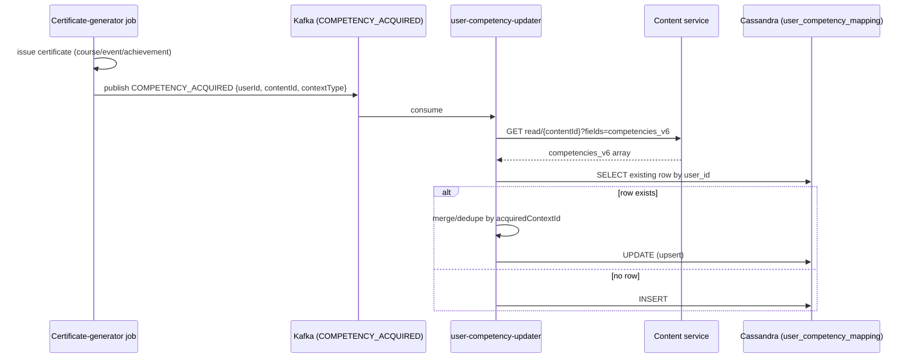
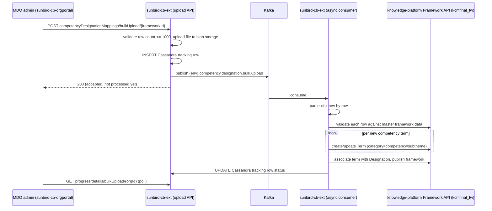
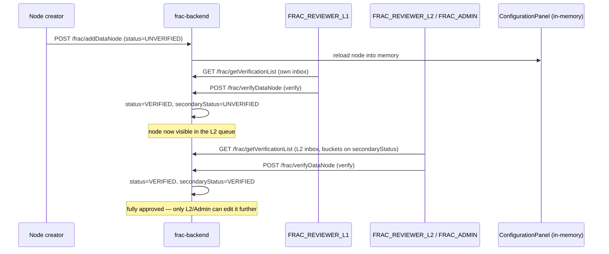
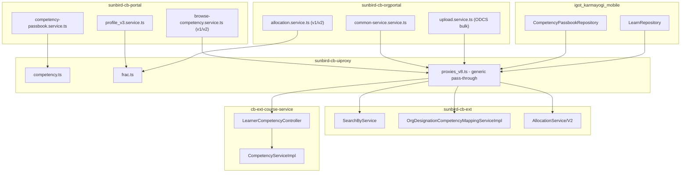
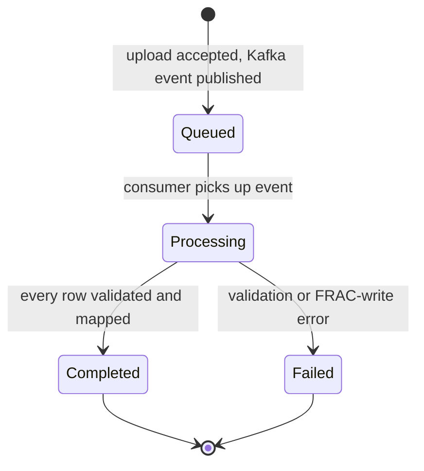
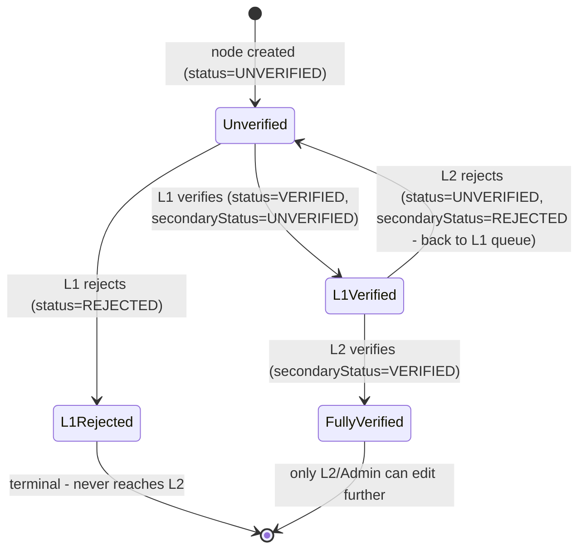

# Competency Hub — LLD

Reverse-engineered from code. Where no schema/migration file exists to
confirm a structure, that absence is stated explicitly rather than assumed.

## Storage reality

### `frac-backend` — the real taxonomy system of record

One generic model, `DataNode` (`models/DataNode.java`), not a class per
entity type:

```
DataNode {
  type, id, name, description, status, secondaryStatus, source, active,
  department, bookmark, level, reviewComments, secondaryReviewComments,
  additionalProperties: Map<String,Object>,   // type-specific fields live here
  children: List<DataNode>, childCount, similarities, userInfo, levelId,
  createdDate/By, updatedDate/By, reviewedDate/By
}
```

**Node types** (`Entities` enum): `POSITION, ROLE, ACTIVITY, COMPETENCY,
KNOWLEDGERESOURCE, COMPETENCIESLEVEL, COMPETENCYAREA, COMPETENCYTYPE,
SECTOR`. `CompetencyType` is `BEHAVIOURAL, DOMAIN, FUNCTIONAL` (an
`additionalProperties` value, not a separate node type). `NodeStatus` is
`UNVERIFIED, VERIFIED, REJECTED, DRAFT`.

Dead code note: standalone `Role.java`/`Position.java`/`Activity.java`/
`KnowledgeResource.java` model classes exist but are never instantiated
anywhere in the repo — vestiges of an earlier per-type design collapsed
into the generic `DataNode`.

**Hierarchy** is neither a tree table nor a graph DB — a hardcoded
parent→child map (`TaggingConstants.CHILD_NODE`) plus a MySQL mapping table
pair:

```
POSITION → [ROLE]
ROLE → [ACTIVITY, COMPETENCY]
COMPETENCY → [COMPETENCIESLEVEL]        (the 5 proficiency levels)
ACTIVITY → [KNOWLEDGERESOURCE]
```

`COMPETENCYAREA` and `SECTOR` are flat lookup lists, not part of this
parent/child chain — stored as `additionalProperties` rows instead.

**MySQL** (`frac_tool` database, hand-written JDBC via `Sql.java` — no JPA
entities despite `spring-boot-starter-data-jpa` being a declared, unused
dependency; no migration files of any kind):

| Table | Columns (from `Sql.java`) |
|---|---|
| `data_node` | id, type, name, description, status, secondary_status, source, level, is_active, review_comments, secondary_review_comments, created/updated/reviewed date+by |
| `additional_properties` | node_id, prop_key, prop_name, prop_value — EAV side table backing `additionalProperties` |
| `node_mapping_parent` / `node_mapping_child` | split parent/child tables, joined on `id`, representing one-parent-to-many-children |
| `bookmarks` | node_id, type, user_id |
| `node_keys` | id, type, prefix, count — the ID generator: each type mints new node IDs as `prefix + (count+1)`, in memory |

**Elasticsearch** — four named indices: `frac-commentrating` (per-user
feedback/rating docs, doc id `{userId}_{type}_{id}`), `frac-collection-logs`
(the node change/audit log, also replayed as a Kafka backfill tool via
`/frac/triggerAuditEvent`), `frac-dictionary` (a cache pushed via
`FRACDictionaryService`, also posted to an external webhook — see below),
`frac-verifiedmapping` (mapping-level verification decisions, distinct from
node-level verification).

**Kafka** — producer-only. Every node mutation (create/update/publish/
verify/delete) emits one Sunbird-style `Audit` telemetry event onto
`dev.telemetry.raw`. A `@KafkaListener`-capable consumer is fully wired in
code (`KafkaConsumerConfig`) but grepping the whole repo for actual
`@KafkaListener` usages returns zero — the consumer side is dead
infrastructure.

**Caching**: `ConfigurationPanel` loads every node and every mapping into
static in-process maps at boot; almost all reads go through this cache, not
the DB directly. `/frac/flushReloadCache` exists specifically to bust and
reload it by type or in full.

### `kcmfinal_fw` — the second taxonomy, inside `knowledge-platform`

`sunbird-cb-ext`'s ODCS worker calls a "framework term create/update/
publish" API hosted by `knowledge-platform`'s generic, content-agnostic
Framework/Category/Term system (the same mechanism used for course
subject/board/medium taxonomies) — **not** `frac-backend`, which has no
"framework," "term," or "publish" concept anywhere in its code (confirmed
by an exhaustive case-insensitive search: `framework` only matches Spring
Framework package names, `term` has zero matches). This system's own
storage was not re-traced in this pass — see that repo's own analysis for
`taxonomy-api`'s `FrameworkController`/`ObjectCategoryController`.

### `frac-dictionary` — reads Elasticsearch directly, no REST calls

Never calls any `/frac/*` endpoint. At Gatsby build time,
`gatsby-source-elasticsearch` bulk-pulls an entire ES index into the site's
static data layer; at runtime, a bundled Express/Apollo server re-queries
the same ES `_search` endpoint for interactive facet filtering. The index
name isn't in `frac-dictionary`'s own repo (env-templated), but
`frac-backend` names an ES index literally `frac-dictionary` and pushes
node updates to a webhook (`frac-dictionary-backend.../api/v1/site/update`)
matching `frac-dictionary`'s own rebuild-trigger route — strong
circumstantial evidence these are the same data, though no single file
states the connection directly.

### `user_competency_mapping` (Cassandra) — the learner's acquired-competency record

A third, unrelated data store — a learner's own history, not the taxonomy
itself. No `.cql` or migration file for this table exists in any of the 13
repos traced; its shape is reconstructed from a generic Cassandra
column-alias properties file and unit-test fixtures in
`cb-ext-course-service`, cross-checked against the read/write code in both
writers (`CompetencyServiceImpl` and `user-competency-updater`'s
`UserCompetencyPreProcessorFn`):

| Column | Cassandra name | Notes |
|---|---|---|
| user id | `user_id` | partition key (both writers query/filter by this) |
| competency area id | `competency_area_id` | |
| competency theme id | `competency_theme_id` | |
| competency sub-theme id | `competency_subtheme_id` | |
| competency details | `competency_details` | nested map, holds `selfAchievement` list of `{acquiredContextId, acquired_at, certificateId}` per `CompetencyServiceImplTest` fixtures |

Test fixture IDs follow a `kcmfinal_fw_…` pattern (e.g.
`kcmfinal_fw_competencyarea_test`) — i.e. these look like they trace back
to the `kcmfinal_fw` mirror, not `frac-backend`'s own node-ID scheme
(which mints IDs as `prefix + count`, e.g. `COMP0001`, per its `node_keys`
table). No code in either writer repo actually validates these IDs against
either taxonomy before writing them.

**Two independent writers, one table, no shared code:**

- `cb-ext-course-service` (`CompetencyServiceImpl.upsertCompetency`) writes
  synchronously, in-request, only on a cache-miss read.
- `user-competency-updater` (`knowledge-platform-jobs`,
  `upsertCompetencyWithFetch` → `upsertCompetency`) writes asynchronously,
  off Kafka, merging/deduplicating by `acquiredContextId` and supporting a
  delete-then-reinsert path when an achievement's `changeUrl` changes.

### Content schema — competency tagging fields (`knowledge-platform`)

Five versioned, sibling fields, each declared as an untyped `array` of
`object` in JSON Schema — no internal structure is defined or enforced by
the schema for any of them:

| Field | Declared on | Notes |
|---|---|---|
| `competencies` | content, collection | earliest version |
| `competencies_v3` | content, collection, asset, questionset | |
| `test_competencies_v4` | collection only | naming/scope inconsistent with the rest of the series |
| `competencies_v5` | content, collection | still read by `sunbird-course-service`'s field whitelist and `cb-ext-course-service`'s CB Plan enrichment |
| `competencies_v6` | content, collection, asset, questionset | **current/live** — the only version explicitly copied forward on content re-versioning (`content.copy.fields` in `content-api`'s `application.conf`) |

Because these are opaque `object` arrays, the real internal shape of one
competency-tag entry (area/theme/sub-theme ids, names, proficiency, etc.)
is defined only by whichever client or backend happens to write it — there
is no canonical structural contract anywhere in this trace.

### `designation_competency_mapping_bulk_upload` (Cassandra) — ODCS tracking

Referenced only as a string constant
(`Constants.TABLE_COMPETENCY_DESIGNATION_MAPPING_BULK_UPLOAD`) in
`sunbird-cb-ext`; no `.cql`/schema file exists for it either — it is
presumed pre-provisioned in the keyspace. Rows are inserted on upload and
updated as the async worker progresses; the exact status-value enum was
not enumerated in this trace (see Verification boundary).

### Elasticsearch — Work Allocation competency mapping

`sunbird-cb-ext`'s Work Allocation/Work Order documents are the one place
competency data is actually indexed for search, via generic ES mapping
files (not a dedicated "Competency" index):

- `workallocation.json` / `workallocationv2.json`:
  `roleCompetencyList[].competencyDetails[].additionalProperties.competencyArea`
- `workorderv1.json`: `competenciesCount` (integer rollup)

### Redis — caches only, not sources of truth

| Key pattern | TTL | Owner |
|---|---|---|
| `user_competency_{userId}` | 3600s default | `cb-ext-course-service` |
| `competency`, `competencyByArea`, `competencyByType` | unspecified | `sunbird-cb-ext` `SearchByService` |
| `competency_master_data_{frameworkId}` | unspecified | `sunbird-cb-ext` ODCS upload |
| in-memory, TTL 4h | `ApiTtl.competencyFramework` | mobile `CompetencyPassbookRepository` |

## Sequence: certificate → acquired competency (the load-bearing mechanism)



No synchronous acknowledgement reaches the learner — the Passbook simply
reflects the new row the next time it's read (subject to the Redis cache
TTL on the `cb-ext-course-service` side).

## Sequence: ODCS bulk upload (async, Kafka-mediated)



This is the one flow in the whole feature where application code writes
*into* a competency taxonomy rather than only reading from it — but note
it's the `kcmfinal_fw` mirror inside `knowledge-platform`, not
`frac-backend`'s own MySQL/Elasticsearch store. `frac-backend`'s own write
path (`POST /frac/addDataNode` etc.) goes through the L1/L2 review workflow
below instead.

## Sequence: `frac-backend` node verification (L1 → L2 review)



An L1 rejection is terminal (`status=REJECTED`, never reaches L2). An L2
rejection is not: it sets `secondaryStatus=REJECTED` and
`status=UNVERIFIED`, sending the node back into the **L1** queue rather
than killing it. Either rejection emails the node's creator with a deep
link into the FRAC authoring UI (not present in any repo traced).
`verifyAllDataNode` (bulk-verify every node of a type) has no role check in
the controller, unlike the single-node path — flagged as a possible authz
gap in As-Built Requirements.

## Module map



No shared library exists between `sunbird-cb-portal`,
`sunbird-cb-orgportal`, and `igot_karmayogi_mobile` for competency logic —
each independently implements its own service wrapper around the same
handful of endpoints. This map stays scoped to the client/gateway repos for
readability — see the HLD topology diagram for how `frac-backend`,
`frac-dictionary`, and `knowledge-platform`'s Framework API fit in.

## State machine: ODCS bulk-upload batch



> The diagram above reflects the *shape* of the workflow the code
> implements (accept → queue → async process → terminal state); the exact
> string values written to the Cassandra tracking row's status column were
> not individually confirmed in this trace — see Verification boundary.

## State machine: `frac-backend` node verification

Two parallel status columns (`status`, `secondaryStatus`), both drawn from
`UNVERIFIED, VERIFIED, REJECTED, DRAFT`:



Only `POSITION, ROLE, COMPETENCY, ACTIVITY` nodes go through this workflow
(`TaggingConstants.TAGGING_MAP`) — `KNOWLEDGERESOURCE`, `COMPETENCIESLEVEL`,
`COMPETENCYAREA`, `SECTOR` never enter a review queue at all.

## Validation reality

| Rule | Enforced | Where |
|---|---|---|
| ODCS upload row count ≤ 1000 | Backend | `sunbird-cb-ext`, `maximum.allow.limit.bulk.designation.competency.upload` |
| ODCS row's Competency Area/Theme/SubTheme exists in `kcmfinal_fw` | Backend, async | `validateCompetencyHierarchy()` — against `knowledge-platform`'s framework, not `frac-backend` |
| `competencies_v6` (or any version) internal structure | **Not enforced anywhere** | opaque `object` array in JSON Schema |
| Content-schema field version used (`v3` vs `v5` vs `v6`) | Ad hoc, per client/repo | four independent config points, no shared source (see [HLD](hld.md)) |
| `user_competency_mapping` row uniqueness/merge | Application-level only | `upsertCompetencyWithFetch`'s dedupe-by-`acquiredContextId` logic — no DB-level constraint found |
| Work Allocation competency exists in `frac-backend` before saving | Backend | `AllocationService.verifyCompetencyDetails` → `addOrUpdateCompetencyToFrac` |
| `frac-backend` node edits, once fully verified | Backend | `checkUserAccesstoEdit` — locked to `FRAC_REVIEWER_L2`/`FRAC_ADMIN` only |
| `frac-backend` bulk-verify (`verifyAllDataNode`) | **No role check found in the controller** | contrast with single-node `verifyDataNode`, which does check roles — possible authz gap, not confirmed exploitable from source alone |
| Self-attested current/desired competency proficiency level | Frontend only | Angular form on profile-v3 setup |
| Cassandra table schemas (both `user_competency_mapping` and the ODCS tracking table) | **No migration/schema files found** | assumed pre-provisioned in the keyspace |
| `frac-backend`'s own MySQL schema | **No migration files found either** | hand-written JDBC (`Sql.java`), no Flyway/Liquibase, no JPA entities despite an unused `spring-boot-starter-data-jpa` dependency |

> **Verification boundary:** `frac-backend`'s storage and workflow are now
> traced from source. Still not analysed: `knowledge-platform`'s Framework/
> Term implementation in full (only its role as ODCS's target was
> confirmed), the content-service component that writes `competencies_v6`
> when content is tagged, the exact status-string enum used by the ODCS
> bulk-upload tracking table, and — most notably — **any mechanism that
> synchronizes `frac-backend`'s data with the `kcmfinal_fw` mirror**; an
> exhaustive search of both found none. `frac-backend`'s own
> `application.properties` also contains an unresolved git merge-conflict
> marker at lines 48-55 spanning the SSO/public-key config — flagged in the
> Operations Manual, not resolved here.
