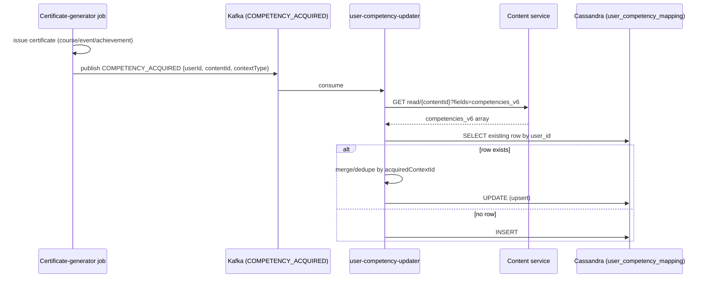
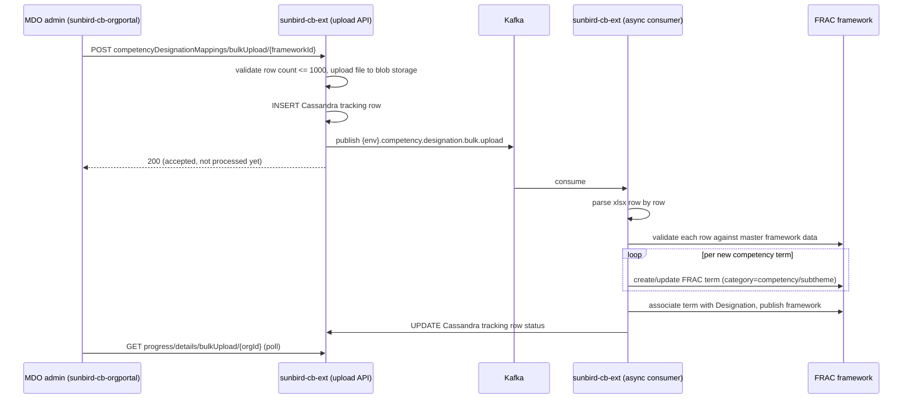
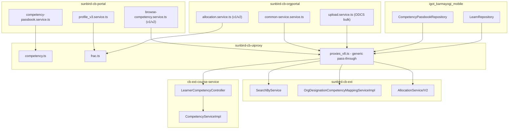
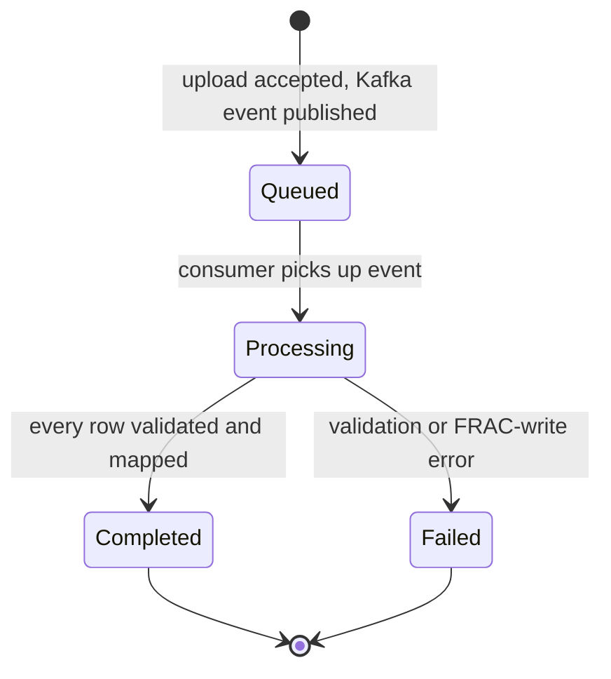

# Competency Hub — LLD

Reverse-engineered from code. Where no schema/migration file exists to
confirm a structure, that absence is stated explicitly rather than assumed.

## Storage reality

### `user_competency_mapping` (Cassandra) — the learner's acquired-competency record

No `.cql` or migration file for this table exists in any of the ten repos
traced; its shape is reconstructed from a generic Cassandra column-alias
properties file and unit-test fixtures in `cb-ext-course-service`, cross-
checked against the read/write code in both writers
(`CompetencyServiceImpl` and `user-competency-updater`'s
`UserCompetencyPreProcessorFn`):

| Column | Cassandra name | Notes |
|---|---|---|
| user id | `user_id` | partition key (both writers query/filter by this) |
| competency area id | `competency_area_id` | |
| competency theme id | `competency_theme_id` | |
| competency sub-theme id | `competency_subtheme_id` | |
| competency details | `competency_details` | nested map, holds `selfAchievement` list of `{acquiredContextId, acquired_at, certificateId}` per `CompetencyServiceImplTest` fixtures |

Test fixture IDs follow a `kcmfinal_fw_…` pattern (e.g.
`kcmfinal_fw_competencyarea_test`), consistent with the `kcmfinal_fw` FRAC
framework referenced everywhere else in this feature — but no code in
either writer repo actually calls the FRAC service to validate these IDs
before writing them.

**Two independent writers, one table, no shared code:**

- `cb-ext-course-service` (`CompetencyServiceImpl.upsertCompetency`) writes
  synchronously, in-request, only on a cache-miss read.
- `user-competency-updater` (`knowledge-platform-jobs`,
  `upsertCompetencyWithFetch` → `upsertCompetency`) writes asynchronously,
  off Kafka, merging/deduplicating by `acquiredContextId` and supporting a
  delete-then-reinsert path when an achievement's `changeUrl` changes.

### Content schema — competency tagging fields (`knowledge-platform`)

Five versioned, sibling fields, each declared as an untyped `array` of
`object` in JSON Schema — no internal structure is defined or enforced by
the schema for any of them:

| Field | Declared on | Notes |
|---|---|---|
| `competencies` | content, collection | earliest version |
| `competencies_v3` | content, collection, asset, questionset | |
| `test_competencies_v4` | collection only | naming/scope inconsistent with the rest of the series |
| `competencies_v5` | content, collection | still read by `sunbird-course-service`'s field whitelist and `cb-ext-course-service`'s CB Plan enrichment |
| `competencies_v6` | content, collection, asset, questionset | **current/live** — the only version explicitly copied forward on content re-versioning (`content.copy.fields` in `content-api`'s `application.conf`) |

Because these are opaque `object` arrays, the real internal shape of one
competency-tag entry (area/theme/sub-theme ids, names, proficiency, etc.)
is defined only by whichever client or backend happens to write it — there
is no canonical structural contract anywhere in this trace.

### `designation_competency_mapping_bulk_upload` (Cassandra) — ODCS tracking

Referenced only as a string constant
(`Constants.TABLE_COMPETENCY_DESIGNATION_MAPPING_BULK_UPLOAD`) in
`sunbird-cb-ext`; no `.cql`/schema file exists for it either — it is
presumed pre-provisioned in the keyspace. Rows are inserted on upload and
updated as the async worker progresses; the exact status-value enum was
not enumerated in this trace (see Verification boundary).

### Elasticsearch — Work Allocation competency mapping

`sunbird-cb-ext`'s Work Allocation/Work Order documents are the one place
competency data is actually indexed for search, via generic ES mapping
files (not a dedicated "Competency" index):

- `workallocation.json` / `workallocationv2.json`:
  `roleCompetencyList[].competencyDetails[].additionalProperties.competencyArea`
- `workorderv1.json`: `competenciesCount` (integer rollup)

### Redis — caches only, not sources of truth

| Key pattern | TTL | Owner |
|---|---|---|
| `user_competency_{userId}` | 3600s default | `cb-ext-course-service` |
| `competency`, `competencyByArea`, `competencyByType` | unspecified | `sunbird-cb-ext` `SearchByService` |
| `competency_master_data_{frameworkId}` | unspecified | `sunbird-cb-ext` ODCS upload |
| in-memory, TTL 4h | `ApiTtl.competencyFramework` | mobile `CompetencyPassbookRepository` |

## Sequence: certificate → acquired competency (the load-bearing mechanism)

No synchronous acknowledgement reaches the learner — the Passbook simply
reflects the new row the next time it's read (subject to the Redis cache
TTL on the `cb-ext-course-service` side).

## Sequence: ODCS bulk upload (async, Kafka-mediated)

This is the one flow in the whole feature where application code writes
*into* the shared FRAC taxonomy rather than only reading from it.

## Module map

No shared library exists between `sunbird-cb-portal`,
`sunbird-cb-orgportal`, and `igot_karmayogi_mobile` for competency logic —
each independently implements its own service wrapper around the same
handful of endpoints.

## State machine: ODCS bulk-upload batch

> The diagram above reflects the *shape* of the workflow the code
> implements (accept → queue → async process → terminal state); the exact
> string values written to the Cassandra tracking row's status column were
> not individually confirmed in this trace — see Verification boundary.

## Validation reality

| Rule | Enforced | Where |
|---|---|---|
| ODCS upload row count ≤ 1000 | Backend | `sunbird-cb-ext`, `maximum.allow.limit.bulk.designation.competency.upload` |
| ODCS row's Competency Area/Theme/SubTheme exists in master framework | Backend, async | `validateCompetencyHierarchy()` |
| `competencies_v6` (or any version) internal structure | **Not enforced anywhere** | opaque `object` array in JSON Schema |
| Content-schema field version used (`v3` vs `v5` vs `v6`) | Ad hoc, per client/repo | four independent config points, no shared source (see [HLD](hld.md)) |
| `user_competency_mapping` row uniqueness/merge | Application-level only | `upsertCompetencyWithFetch`'s dedupe-by-`acquiredContextId` logic — no DB-level constraint found |
| Work Allocation competency exists in FRAC before saving | Backend | `AllocationService.verifyCompetencyDetails` → `addOrUpdateCompetencyToFrac` |
| Self-attested current/desired competency proficiency level | Frontend only | Angular form on profile-v3 setup |
| Cassandra table schemas (both `user_competency_mapping` and the ODCS tracking table) | **No migration/schema files found** | assumed pre-provisioned in the keyspace |

> **Verification boundary:** facts above are read from the ten repos listed
> at the top of this page. Not analysed from source: `fracentity-service`
> (the actual FRAC/competency-CRUD backend), the content-service component
> that writes `competencies_v6` when content is tagged, and the exact
> status-string enum used by the ODCS bulk-upload tracking table. Attaching
> those would close the remaining gaps.
