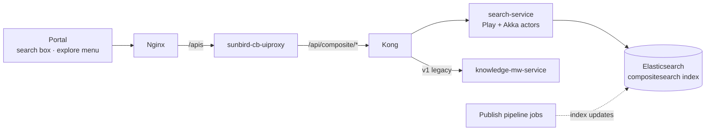

# Explore Content — High-Level Design

## Responsibilities

| Component | Owns | Repo |
|---|---|---|
| Portal search modules | Search UI, facet rail, explore menu, strips | `sunbird-cb-portal` (`search-v3`, `explore-menu`) |
| sunbird-cb-uiproxy | Path mapping (`sunbirdigot/* → composite/*`) | `sunbird-cb-uiproxy › proxies_v8.ts` |
| Kong | Route → upstream mapping | `sunbird-devops › kong-api/defaults/main.yml` |
| search-service | Query parsing, visibility guard, JWT role/org scoping, ES query build | `knowledge-platform › search-api` |
| Elasticsearch | The `compositesearch` index (name configurable) | infra |

## Key design decisions

**Search is read-side only.** The service never touches Neo4j/Cassandra; the
publish pipeline denormalises content into the `compositesearch` index, so
search scales independently of authoring.

**Version = capability, not just age.** v1 (via knowledge-mw) survives for
legacy strips; v4 serves authoring; v5 adds JWT-derived
role/org context so one endpoint serves personalised results.
