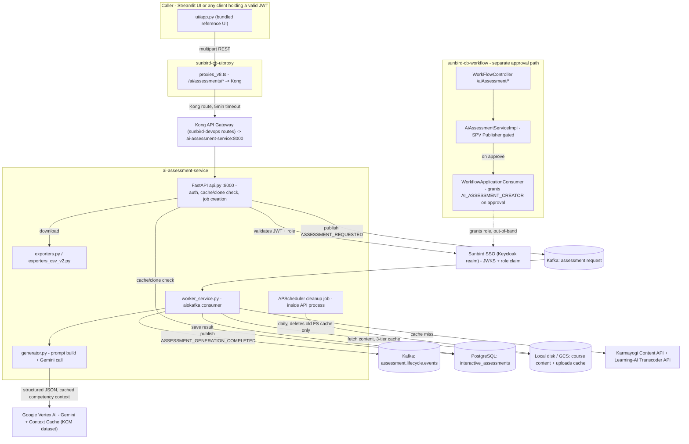

# AI Assessment Tool — HLD

Reverse-engineered from `ai-assessment-service`, `sunbird-cb-uiproxy`,
`sunbird-cb-workflow`, `sunbird-devops`.

## Topology

Unlike Learning Pathway (a content-model overlay) or AI CBP Tool (two
services coordinating through a shared database), AI Assessment Tool is a
genuinely standalone, event-driven microservice — the only cross-repo
coupling is a gateway proxy in front of it and a role claim granted by an
entirely separate approval workflow.

`sunbird-cb-workflow` and `ai-assessment-service` never call each other
directly (dashed line above) — the only link is the `AI_ASSESSMENT_CREATOR`
claim that ends up in a user's JWT, issued by the SSO realm both trust.

## Responsibilities

| Component | Owns | Repo |
|---|---|---|
| `WorkFlowController` + `AiAssessmentServiceImpl` | The `ai_assessment` role-request approval state machine, gated to `SPV Publisher` | `sunbird-cb-workflow` |
| `WorkflowApplicationConsumer` | Granting `AI_ASSESSMENT_CREATOR` on approval, and firing the approval notification | `sunbird-cb-workflow` |
| `proxies_v8.ts` / `whitelistApis.ts` | The only network path from the outside world into `ai-assessment-service`; RBAC checks on the gateway side | `sunbird-cb-uiproxy` |
| `api.py` | Auth, request validation, cache/clone shortcut, job creation, download/export orchestration, the embedded cleanup scheduler | `ai-assessment-service` |
| `worker_service.py` | The entire async pipeline: content fetch → prompt build → Gemini call → persistence → completion event | `ai-assessment-service` |
| `generator.py` | Prompt construction (per assessment type, per question type, per Bloom's distribution), Gemini/Vertex client, KCM context-cache lifecycle | `ai-assessment-service` |
| `fetcher.py` / `storage.py` | Karmayogi content-API + transcoder-API calls, PDF/VTT extraction, the three-tier (disk → GCS → API) content cache | `ai-assessment-service` |
| `exporters.py` / `exporters_csv_v2.py` | JSON/CSV(×2)/PDF/DOCX rendering of the generated assessment | `ai-assessment-service` |
| Kong routes + Helm charts | Deployment topology for three separate workloads (API, worker, Streamlit UI) and the `/ai/assessments/*` route table | `sunbird-devops` |

**Not found in any of the four repos traced**: a UI inside
`sunbird-cb-creationportal` (or any other authoring surface) that actually
calls this service — the only client-side code found is the bundled
Streamlit reference app (`ui/app.py`) and the two repos checked and ruled
out (`cbp-ai-ui`, `sunbird-cb-creationportal`).

## Key design decisions

- **Fully async by construction, with an inline synchronous shortcut.**
  Every non-duplicate request goes through Kafka to a separate worker
  process; only the cache-hit and clone paths skip that and return inline
  from the API process, directly against Postgres.
- **The database is both the job store and the cache.** A single table,
  `interactive_assessments`, holds job status, the full generated JSON, and
  token-usage stats, keyed by a composite hash-derived ID — there's no
  separate cache layer (e.g. Redis) for generated results, unlike Learning
  Pathway's Redis-cached enriched reads.
- **Access control is entirely claim-based, not service-to-service.**
  `ai-assessment-service` reads the `user_roles` claim from the JWT; it
  has no knowledge of, and makes no call to, `sunbird-cb-workflow`.
- **One monolithic prompt template drives every combination.** All five
  assessment types and five question types share a single prompt template
  (`prompts.yaml`), with type-specific behavior expressed as conditionally
  included instruction blocks rather than separate prompts or separate code
  paths — a maintenance point worth knowing (a change to shared prompt
  sections affects every assessment type at once).
- **Documentation describes a system that doesn't quite match the code.**
  `architecture.md` describes a `/api/v2/generate` surface with explicit
  `202`/`200` semantics; the actual code only has `/ai-assessments/v1/*`
  routes and does not set an explicit status code on the async path. The
  README's "ASSESSMENT_COMPLETED" event name is actually
  `ASSESSMENT_GENERATION_COMPLETED` in code. See
  [As-Built Requirements](as-built-requirements.md) for the full list.

See [LLD](lld.md) for the storage schema, sequence flows, and prompt/caching
internals, and the [Operations Manual](operations-manual.md) for how these
decisions show up in day-2 support.
