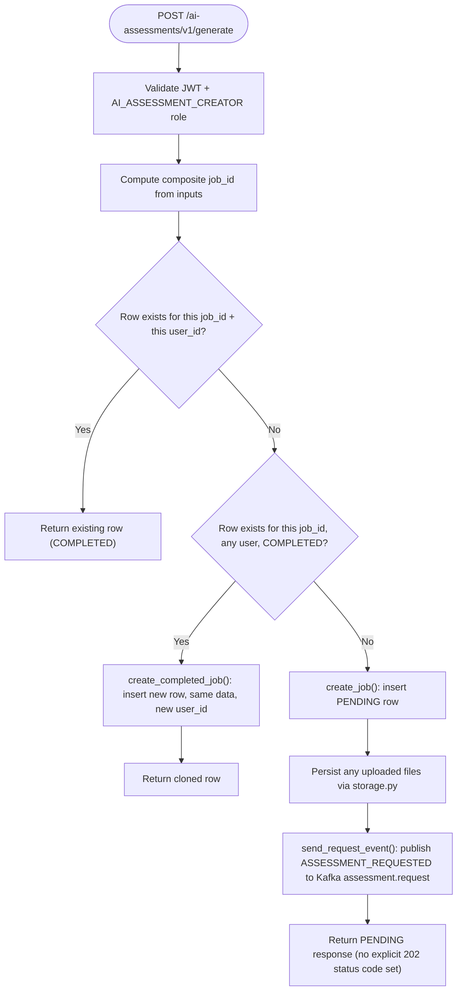
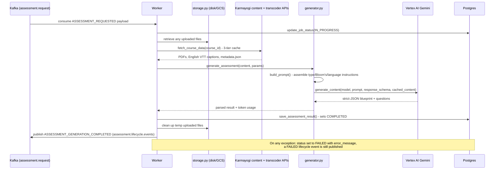
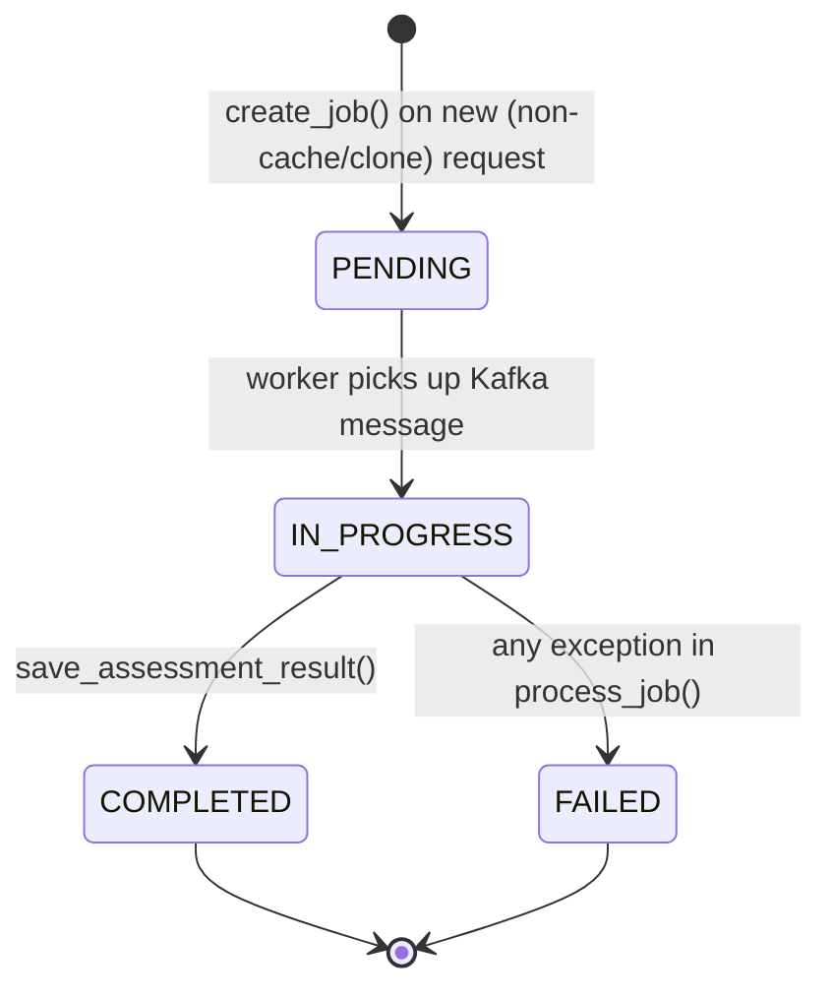

# AI Assessment Tool — LLD

Reverse-engineered from `ai-assessment-service` at commit `82fef3e`, cross-
checked against its own `architecture.md`/`DEPLOYMENT.md` where those
documents' claims could be verified against code (discrepancies are called
out, not silently reconciled).

## Storage reality

One table, Postgres, via `asyncpg` (pool min 5 / max 20):

```sql
CREATE TABLE IF NOT EXISTS interactive_assessments (
    course_id TEXT PRIMARY KEY,   -- legacy name; actually the composite job_id
    user_id TEXT,
    status TEXT NOT NULL,         -- PENDING | IN_PROGRESS | COMPLETED | FAILED
    created_at TIMESTAMP DEFAULT NOW(),
    updated_at TIMESTAMP DEFAULT NOW(),
    metadata JSONB,               -- input parameters (audit trail)
    assessment_data JSONB,        -- the generated blueprint + questions
    token_usage JSONB,            -- LLM token consumption stats
    error_message TEXT
);
```

`course_id` is the primary key despite its name — it actually holds the
job's composite ID, described in `architecture.md` as
`{Sorted_Course_IDs}_{MD5(Params)}`, with params including difficulty,
question counts, prompt version, Bloom's distribution, and other inputs.
This single hash is what makes the cache-hit and clone-into-new-user paths
possible: two requests with identical inputs produce the identical ID
regardless of who's asking.

There is no separate `jobs`, `questions`, or `users` table — ownership,
generation parameters, and the full result all live in one JSONB-heavy row.

## Sequence: generate request, all three branches



## Sequence: worker processing (`worker_service.py:33-146`)



## Prompt construction (`generator.py`, `resources/prompts.yaml`)

One template (`system_prompt_template`, version `"4.1"`), built entirely by
string substitution in `build_prompt()`:

- **Assessment-type logic** — a fixed section covering all five types
  (practice/final/comprehensive/standalone/competency), substituted via
  `{assessment_type}`.
- **Question-type instructions** — assembled per request: each of
  mcq/ftb/mtf/multichoice/truefalse gets either an explicit "generate N of
  these" line or an explicit "[DO NOT GENERATE]" line, joined into
  `{question_type_instructions}`.
- **Bloom's taxonomy** — three modes: disabled (`enable_blooms=false`);
  enabled with hardcoded per-difficulty defaults; or enabled with an
  explicit percentage map, converted by `compute_blooms_by_type()`
  (largest-remainder rounding, then round-robin distribution and shuffle)
  into a fixed, ordered, "NON-NEGOTIABLE" per-question-type/per-position
  Bloom's-level list written straight into the prompt.
- **KCM dataset** — the full `competencies.json` hierarchy (area → theme →
  sub-theme names only) is injected verbatim as `{kcm_dataset}` into
  *every* prompt call, uncached, alongside the separately Gemini-cached
  detailed descriptions (below).
- **Language governance** — the target language is substituted directly;
  the instructions explicitly tell the model to *generate*, not merely
  translate, every value in the target language.

Output is constrained via `response_schema` (`resources/schemas.json` →
`full_schema`) with `response_mime_type="application/json"` and
`temperature=0.1` — the model cannot return free text, only the schema's
`blueprint`/`questions` shape.

## Gemini context caching for KCM competencies

`get_or_create_kcm_cache()` uploads the full contents of
`resources/kcm_descriptions.json` (rich `Description`, `Behavioral_Indicators`,
per-`Level` text) as a Vertex `CachedContent` object, held in a
module-level variable and reused across every generation call via
`config.cached_content = cache_name`, until a cache-expiry error forces
recreation. This is separate from, and larger than, the lightweight
`competencies.json` hierarchy injected directly into every prompt.

- `competencies.json`: 112 sub-theme names across 2 areas (Behavioural,
  Functional) — the lightweight index, injected every call.
- `kcm_descriptions.json`: 109 entries (108 unique labels) — the detailed
  dataset, Gemini-cached rather than re-sent every call.
- The README and `architecture.md` both describe "110" cached KCM
  definitions; neither JSON file actually contains exactly 110 entries —
  treat "110" as an approximate/unverified figure, not a literal count to
  design around.

## Retry behavior (`generator.py:509-529`)

`tenacity`-decorated: up to 3 attempts, exponential backoff 5–30s, retrying
on `ServerError`/timeout, on Vertex `ClientError` messages indicating an
expired/missing cache (forcing cache recreation on the next attempt), or on
`429`/`RESOURCE_EXHAUSTED`. There is no retry of the worker's own job-level
processing if all LLM retries are exhausted — the job is simply marked
`FAILED`.

## Content fetch & three-tier caching (`fetcher.py`)

1. **Local disk** — `INTERACTIVE_COURSES_PATH/{course_id}/metadata.json`
   check; if present, download is skipped entirely and local files reused.
2. **GCS** (when `DOCUMENT_STORAGE_TYPE=gcs`) — restored from a shared
   bucket, populated after first fetch, shared across pods.
3. **Karmayogi content API** (`search_content()`) — only hit on a cold
   GCS/disk miss; results synced back to GCS afterward for reuse by other
   pods.

Auth to the Karmayogi content/transcoder APIs is a **static service-account
bearer token** (`KARMAYOGI_API_KEY`), not a passthrough of the calling
user's own JWT — every fetch looks the same to the Karmayogi platform
regardless of which `AI_ASSESSMENT_CREATOR` triggered it. Signed CDN URLs
for VTT downloads are fetched with a separate, unauthenticated HTTP client
specifically to avoid sending the service headers (which would cause a 401
on a pre-signed URL).

## Export schemas

**CSV "V2" (7-option)** (`exporters_csv_v2.py:7-157`): header
`QuestionNo, QuestionType, Question, QuestionTagging, Option1..7,
isOption1..7Correct`. `QuestionType` remapped (`Multiple Choice
Question`→`MCQ-SCA`, `Multi-Choice Question`→`MCQ-MCA`, `True/False
Question`→`T/F`, `MTF Question`→`MTF`, `FTB Question`→`FTB`). Per-type
option filling: MCQ writes `Yes`/`No` against the correct index/indices;
True/False hardcodes `Option1=TRUE`/`Option2=FALSE`; **MTF abuses the
`isOptionNCorrect` column to store the matched right-hand text**, not a
boolean; FTB maps blank answers into `OptionN` with an `isOptionNCorrect`
value of `"BlankN"` — none of these three are literal booleans despite the
column name.

**CSV "basic"** (`exporters_csv_v2.py:160-217`): MCQ-only (SCA+MCA), 6
options, `TRUE`/`FALSE` string values (not `Yes`/`No` — a second, different
boolean convention from the V2 schema above).

**PDF** (`exporters.py:187-197`): WeasyPrint, HTML→PDF, Noto Sans fonts
embedded for Devanagari/Tamil/Telugu/Kannada/Malayalam/Bengali/Gujarati/
Gurmukhi (8 font files covering 7 of the 12 supported `Language` values —
no dedicated font for Odia or Assamese scripts).

**DOCX** (`exporters.py:200-289`): `python-docx`, same content structure as
the PDF; no special multilingual font handling needed since Word renders
Unicode natively.

## State machine



A cache-hit or clone never enters `PENDING` at all for the *caller* — the
row they get back is already `COMPLETED` (their own prior row, or a fresh
copy of someone else's).

## Validation reality

| Rule | Enforced | Where |
|---|---|---|
| `AI_ASSESSMENT_CREATOR` role required | Backend, every `/ai-assessments/v1/*` route | `auth.py:110-112` |
| `competency_area`/`themes`/`sub_themes` required for `competency` type | Backend | `api.py:188-190` |
| `format` must be one of 5 supported values on download | Backend | `api.py:394` |
| Job ownership on update/download/status | Backend, per-row `user_id` match | `db.py:136-144`, `api.py:354-356` |
| Requested `language` in the 12-value enum | Backend (Pydantic enum) | `api.py:93-105` |
| Uploaded file type/size limits | **Not found** — no explicit MIME/size validation on the `files` upload field | — |
| `question_type_counts` internal consistency vs. `total_questions` | **Not found** — no cross-check that the two agree | — |

> **Verification boundary:** everything above is read from
> `ai-assessment-service` alone. Not verified: the Jenkins shared libraries
> (`deploy-conf`, `central-pipeline-lib`) that actually build/push/validate
> this service's images; the private `google.genai`/Vertex AI SDK's own
> internal retry/quota behavior beyond what `generator.py` catches; and any
> Kubernetes-level resource limits or probes, which live in `sunbird-devops`
> (see [Operations Manual](operations-manual.md)) rather than this repo.
