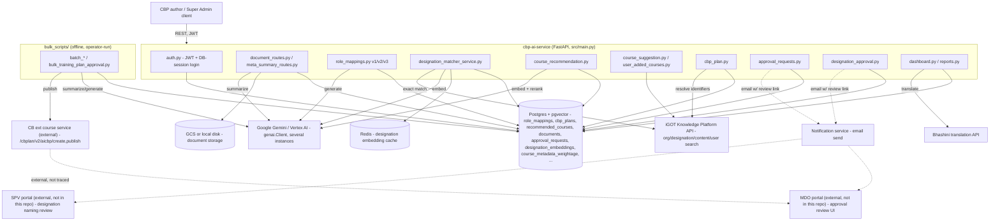

# AI CBP Tool — HLD

Reverse-engineered from `cbp-ai-service` at `origin/cbrelease-4.8.39`,
commit `119a42b`.

## Topology

A single FastAPI monolith, backed by one Postgres database (with the
`pgvector` extension) and Redis, calling out to Google Gemini/Vertex AI and
several external iGOT-side services. A separate `bulk_scripts/` directory
holds standalone offline tooling that talks to the **same** database
directly, bypassing the HTTP API for bulk operations.

Dashed arrows mark the boundary of what this repo actually implements: this
service can create an approval request and send a notification email with a
review link, but the review/approve/reject/publish action happens entirely
inside `MDO`/`SPV` — systems not present in this repo. The only place in
this codebase that reaches the actual publish API is the offline
`bulk_training_plan_approval.py` script, which talks to `CBExt` directly.

## Responsibilities

| Component | Owns | File(s) |
|---|---|---|
| `document_routes.py` / `meta_summary_routes.py` | PDF upload, storage, Gemini summarization, cross-document meta-summary | `src/api/v1/document_routes.py`, `meta_summary_routes.py` |
| `role_mappings.py` (v1/v2/v3) | Turning document summaries into a designation hierarchy with role/competency data — three materially different implementations, not versions of one shared engine | `src/api/v{1,2,3}/role_mappings.py`, `src/services/{,v2/,v3/}role_mapping_service.py` |
| `designation_matcher_service.py` | Reconciling a free-text designation name against iGOT's designation master (exact + semantic) | `src/services/designation_matcher_service.py` |
| `course_recommendation.py` | Hybrid vector search + Gemini reranking to produce a scored course list per role mapping, run as an in-process background task | `src/api/v1/course_recommendation.py`, `src/crud/course_recommendation.py` |
| `course_suggestion.py` / `user_added_courses.py` | Two non-AI course pools (iGOT-searched, fully manual) that a CBP Plan can also draw from | `src/api/v1/course_suggestion.py`, `user_added_courses.py` |
| `cbp_plan.py` | Merging the three course pools (recommended, suggested, user-added) into one persisted plan per role mapping | `src/api/v1/cbp_plan.py` |
| `approval_requests.py` / `designation_approval.py` | Creating and emailing two independent, unrelated approval requests; neither implements the actual approve/reject step | `src/api/v1/approval_requests.py`, `designation_approval.py` |
| `dashboard.py` / `reports.py` | Org-wide and self-scoped KPIs/gap analysis; PDF export of plans via Jinja2 + Playwright/Chromium | `src/api/v1/dashboard.py`, `reports.py` |
| `bulk_scripts/` | A parallel, offline execution path for the same pipeline stages, for bulk state/ministry onboarding — several scripts import and reuse live-app code (e.g. document summarization), others fully reimplement the logic standalone | `bulk_scripts/*.py` |

**Not found in this repo** (external, out of scope for this trace): the MDO
portal's review/approve/reject/publish UI and logic, the SPV portal's
designation-naming approval UI and logic, and the "CB ext course service"
that actually publishes a plan to iGOT.

## Key design decisions

- **No single orchestrating pipeline.** Document summarization, role-mapping
  generation, designation matching, course recommendation, and CBP-plan
  creation are five independently-triggered steps, chained only by foreign
  keys and precondition checks at the API layer (e.g. a CBP Plan requires a
  recommendation to already exist; sending for approval requires a CBP plan
  to already exist). Each has its own status field and its own background
  task, not a shared workflow engine.
- **Three unrelated implementations share the "role mapping" name.** v1, v2,
  and v3 differ in document source, Gemini call shape (single call vs.
  three-pass structured output), competency schema richness, KCM
  reconciliation, error-retry behavior, and automatic designation matching —
  and expose different subsets of the CRUD surface. There is no fallback
  from a version's missing endpoint to another version's route.
- **In-process background tasks, not a task queue.** Course recommendation
  and role-mapping generation both run as FastAPI `BackgroundTasks` inside
  the same process that served the request — there is no Celery/RQ worker
  anywhere in the repo, despite a design-note comment mentioning one.
  Latency is instead controlled by aggressive internal parallelization
  (`asyncio.gather` for embeddings, DB searches, and LLM calls).
  Background-task CRUD methods open their **own** DB session
  (`sessionmanager.session()`) rather than reusing the request-scoped
  session, specifically so they survive past the request/response cycle.
- **Three independent course pools converge only at CBP-plan time.** AI
  recommendations, iGOT-searched suggestions, and fully manual entries are
  stored in three separate tables with no shared schema; `cbp_plan.py`'s
  save/update handlers are the only code that unions them into one array.
- **The approval loop is open, by construction.** This repo can create,
  snapshot, and email an approval request, and can revoke a pending one —
  but nothing in its live API ever sets a request or a designation-naming
  request to `APPROVED`/`REJECTED`, and nothing here calls the actual
  publish-to-iGOT API. That logic lives in a separate MDO-facing system;
  the only code in this repo that reaches it is an offline operator script.
- **Auth is self-contained, not iGOT-SSO passthrough.** End-user
  authentication into this service is its own JWT + DB-session mechanism
  (`UserSession` rows enable server-side logout/blacklisting); the service
  separately acts as an *outbound* client to iGOT using a static bearer
  token (`KB_AUTH_TOKEN`) — the two are unrelated.
- **No schema-migration tool.** There is no Alembic (or any other migration
  tool) anywhere in the repo — tables are created idempotently via
  `Base.metadata.create_all` on every app startup. Schema evolution has no
  tracked history; it can only be read from the current model files.
- **Runs as root in the container.** The `Dockerfile` on this branch has no
  `USER` instruction — the app runs as the container's default root user.
  (A later, unrelated `main` branch history adds a non-root user; that work
  is not present on `cbrelease-4.8.39`.)

See [LLD](lld.md) for the storage reality, state machines, and sequence
flows, and the [Operations Manual](operations-manual.md) for how these
decisions show up in day-2 support.
