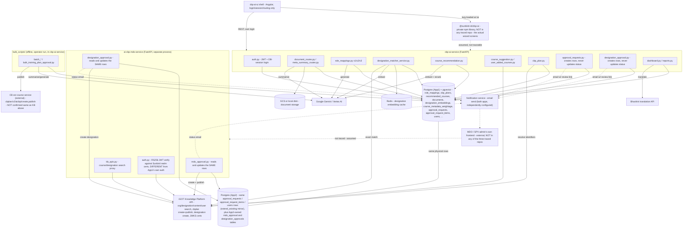

# AI CBP Tool — HLD

Reverse-engineered from `cbp-ai-service` (`origin/cbrelease-4.8.39`, commit
`70d7175`), `ai-cbp-mdo-service` (`origin/cbrelease-4.8.39`, commit
`88040de`), and `cbp-ai-ui` (`origin/cbrelease-4.8.39`, commit `15a3b9a`).

## Topology

Two independent FastAPI monoliths, each with its own Postgres connection
string, that **never call each other's API**. They coordinate entirely by
reading and writing three shared tables (`approval_requests`,
`approval_request_items`, `users`) in what is, in practice, one physical
database — `ai-cbp-mdo-service` declares its own SQLAlchemy models for
those tables with `extend_existing=True`, a mirror of a schema it doesn't
own. `cbp-ai-ui` is a thin Angular shell whose actual feature UI is a
private npm library (`@sunbird-cb/cbp-ai`) not present in any of the three
repos — drawn below as an unverified box. A separate `bulk_scripts/`
directory in `cbp-ai-service` holds offline tooling that talks to the same
database directly, bypassing both services' HTTP APIs.

Dashed arrows mark boundaries this trace cannot cross: the notification
email is the only signal `cbp-ai-service` ever sends toward the approval
outcome, `ai-cbp-mdo-service` is only reachable (as far as any of the three
repos shows) from a frontend none of them contain, and the private
`@sunbird-cb/cbp-ai` library's calls into `cbp-ai-service` are assumed, not
observed, since its source isn't here. The **solid** line between `PG` and
`PG2` is the actual finding: it isn't a network call at all, just two
services' connection strings pointed at the same rows.

## Responsibilities

| Component | Owns | Repo · File(s) |
|---|---|---|
| `document_routes.py` / `meta_summary_routes.py` | PDF upload, storage, Gemini summarization, cross-document meta-summary | `cbp-ai-service:src/api/v1/document_routes.py`, `meta_summary_routes.py` |
| `role_mappings.py` (v1/v2/v3) | Turning document summaries into a designation hierarchy with role/competency data — three materially different implementations, not versions of one shared engine | `cbp-ai-service:src/api/v{1,2,3}/role_mappings.py`, `src/services/{,v2/,v3/}role_mapping_service.py` |
| `designation_matcher_service.py` | Reconciling a free-text designation name against iGOT's designation master (exact + semantic) | `cbp-ai-service:src/services/designation_matcher_service.py` |
| `course_recommendation.py` | Hybrid vector search + Gemini reranking to produce a scored course list per role mapping, run as an in-process background task | `cbp-ai-service:src/api/v1/course_recommendation.py`, `src/crud/course_recommendation.py` |
| `course_suggestion.py` / `user_added_courses.py` | Two non-AI course pools (iGOT-searched, fully manual) that a CBP Plan can also draw from | `cbp-ai-service:src/api/v1/course_suggestion.py`, `user_added_courses.py` |
| `cbp_plan.py` | Merging the three course pools (recommended, suggested, user-added) into one persisted plan per role mapping | `cbp-ai-service:src/api/v1/cbp_plan.py` |
| `approval_requests.py` / `designation_approval.py` | *Creating and emailing* two independent approval requests; **never** implements the approve/reject step itself | `cbp-ai-service:src/api/v1/approval_requests.py`, `designation_approval.py` |
| `dashboard.py` / `reports.py` | Org-wide and self-scoped KPIs/gap analysis; PDF export of plans via Jinja2 + Playwright/Chromium | `cbp-ai-service:src/api/v1/dashboard.py`, `reports.py` |
| `bulk_scripts/` | A parallel, offline execution path for the same pipeline stages, for bulk state/ministry onboarding, plus the only in-repo code that drives an approval to `APPROVED` against a *different* external publish target than `ai-cbp-mdo-service` uses | `cbp-ai-service:bulk_scripts/*.py` |
| `mdo_approval.py` / `controller` / `crud` | Owns the actual approve/reject/publish decision and its per-item retry semantics, reading/writing the rows `cbp-ai-service` created | `ai-cbp-mdo-service:src/api/v1/mdo_approval.py`, `controller/mdo_approval.py`, `crud/mdo_approval_request.py` |
| `designation_approval.py` (MDO service) | Owns the SPV admin's approve/reject decision for designation-naming requests, calling iGOT to create the designation on approval | `ai-cbp-mdo-service:src/api/v1/designation_approval.py`, `controller/designation_approval.py` |
| `kb_apis.py` (MDO service) | A second, independent proxy to iGOT content/designation search, for the MDO/SPV side | `ai-cbp-mdo-service:src/api/v1/kb_apis.py` |
| `cbp-ai-ui` shell | Login, session/token storage, routing, and the ~40-endpoint `SharedService` API client — the one part of the author-facing client that is actually verifiable | `cbp-ai-ui:src/app/app.component.*`, `src/app/modules/shared/services/shared.service.ts` |

**Not found in any of the three repos**: the MDO/SPV admin's own frontend
(whatever renders `ai-cbp-mdo-service`'s API), and the CBP author's
step-by-step wizard screens, which ship inside the private
`@sunbird-cb/cbp-ai` library rather than `cbp-ai-ui`. Also unresolved:
whether `bulk_scripts/bulk_training_plan_approval.py`'s
`CB_EXT_COURSE_SERVICE_URL` target and `ai-cbp-mdo-service`'s own
`KB_BASE_URL` target are the same physical iGOT-side service.

## Key design decisions

- **Two backend services integrate through a shared database, not an API.**
  This is the single most important mechanism in the whole feature.
  `cbp-ai-service` snapshots a role mapping/CBP plan into
  `approval_requests`/`approval_request_items` and stops; `ai-cbp-mdo-service`
  declares the *same* tables with `extend_existing=True` and treats them as
  its own inbox, reading rows it never created and writing status columns
  the creator never reads back. There is no webhook, no polling client, no
  message queue — the row itself is the contract. This also means the two
  services can disagree about schema in ways neither would catch at review
  time (see LLD).
- **`cbp-ai-ui` is a thin host shell, not the feature.** The real
  step-by-step UI — document upload, role-mapping review, course selection,
  CBP-plan export — ships as a private, version-pinned npm library
  (`@sunbird-cb/cbp-ai@0.1.117`) imported into the shell's root Angular
  module. None of that library's source is in this repo or either backend
  repo; everything about its actual screens in these docs is either
  cross-checked against the shell's own API client or drawn from the
  shell's static Help-Sidebar copy, never from the library's own code.
- **No single orchestrating pipeline, on either backend.** In
  `cbp-ai-service`: document summarization, role-mapping generation,
  designation matching, course recommendation, and CBP-plan creation are
  five independently-triggered steps, chained only by foreign keys and
  precondition checks. In `ai-cbp-mdo-service`: publish, reject, and item
  edits are likewise independent calls, not steps in a stored workflow —
  the *parent* request's status is sometimes set directly (publish) and
  sometimes *recomputed* from its items after the fact (single-item
  reject).
- **Three unrelated implementations share the "role mapping" name.**
  `cbp-ai-service`'s v1, v2, and v3 differ in document source, Gemini call
  shape, competency schema richness, KCM reconciliation, error-retry
  behavior, and automatic designation matching — and expose different
  subsets of the CRUD surface. `cbp-ai-ui`'s shipped client calls v3 for
  generation but v1/v2 for everything else (reorder, match, CRUD,
  add-designation), confirming there is no fallback from a version's
  missing endpoint to another version's route — the client is required to
  know which version owns which action.
- **In-process background tasks, not a task queue, on the author side.**
  Course recommendation and role-mapping generation both run as FastAPI
  `BackgroundTasks` inside the same process that served the request — no
  Celery/RQ worker exists in `cbp-ai-service`. Background-task CRUD methods
  open their **own** DB session (`sessionmanager.session()`) rather than
  reusing the request-scoped session, specifically so they survive past the
  request/response cycle. `ai-cbp-mdo-service` has no equivalent background
  job at all — its publish/approve calls do the iGOT round-trip
  synchronously inside the request; only the outcome *email* is a
  background task on that side.
- **Approval is a per-item, partial-success operation on the MDO side.** A
  single "publish" call can leave one request `APPROVED` with some items
  `FAILED` and others published — the all-or-nothing framing a single-repo
  read of `cbp-ai-service` would suggest ("the approval loop is open by
  construction") turns out to be finer-grained than that once
  `ai-cbp-mdo-service` is in view: the loop is closed, but item-by-item, not
  request-by-request.
- **Two independent, differently-shaped auth systems for two different
  audiences.** `cbp-ai-service` authenticates its own end users with a
  self-issued JWT + `UserSession` DB-session pair (server-side
  logout/blacklisting); `ai-cbp-mdo-service` instead *verifies* an
  externally-issued RS256 JWT against iGOT/Sunbird's own realm certificate
  endpoint, using a custom `x-authenticated-user-token` header rather than
  `Authorization: Bearer`. Neither service authenticates the other's users
  — they never call each other, so there is no cross-service auth to
  design.
- **No schema-migration tool, on either backend.** Neither repo has Alembic
  (or any other migration tool) — `cbp-ai-service` creates its tables
  idempotently via `Base.metadata.create_all` on every startup;
  `ai-cbp-mdo-service` does the same for the two tables it owns
  (`mdo_approval`, `designation_approvals`) while relying on the
  already-existing mirrored tables for everything else. Schema evolution on
  either side has no tracked history — it can only be read from the current
  model files, and a change to one service's mirror of a shared table
  cannot be enforced against the other's.
- **`cbp-ai-ui` has no global auth-header interceptor.** Every
  `SharedService` method individually rebuilds its own `Authorization`
  header from `localStorage` (or, in some methods, reuses a header captured
  once at service construction) — there is no single request interceptor
  attaching credentials, only a response interceptor that reacts to `401`s.
- **Runs as root in the `cbp-ai-service` container on this branch.** The
  `Dockerfile` has no `USER` instruction. `ai-cbp-mdo-service`'s own
  `Dockerfile`, by contrast, does create and switch to a non-root `appuser`
  — the two sibling services differ on this point.

See [LLD](lld.md) for the storage reality, state machines, and sequence
flows, and the [Operations Manual](operations-manual.md) for how these
decisions show up in day-2 support.
