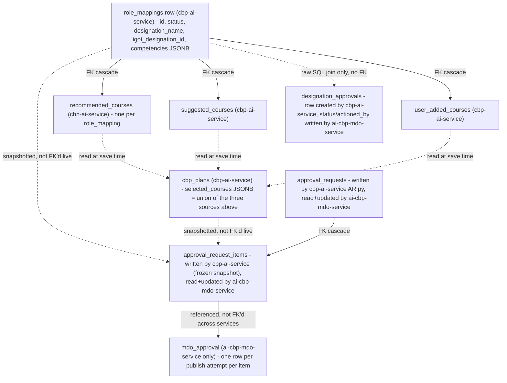
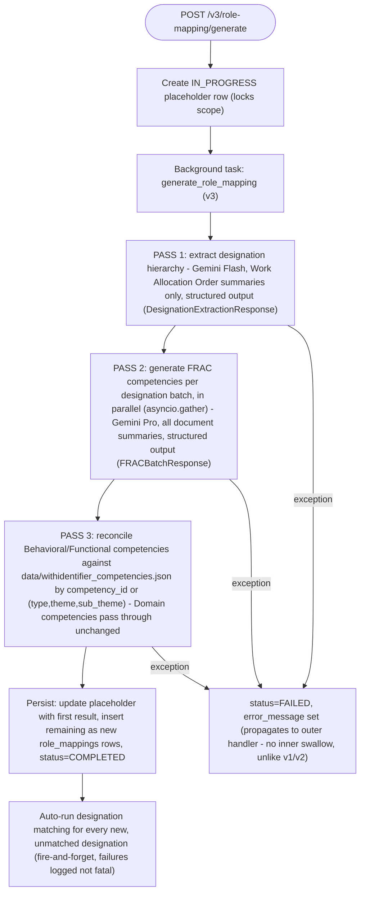
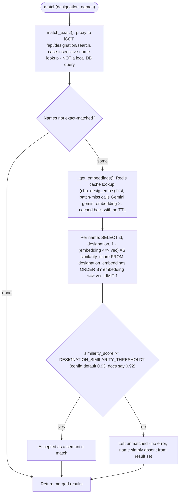
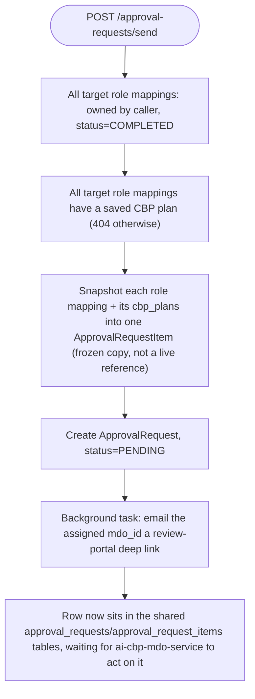
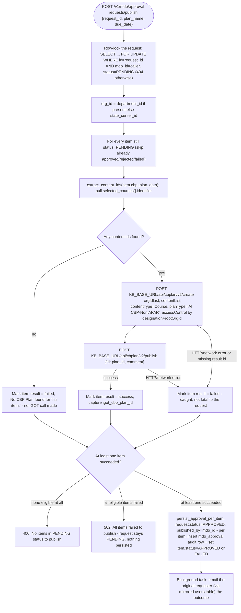
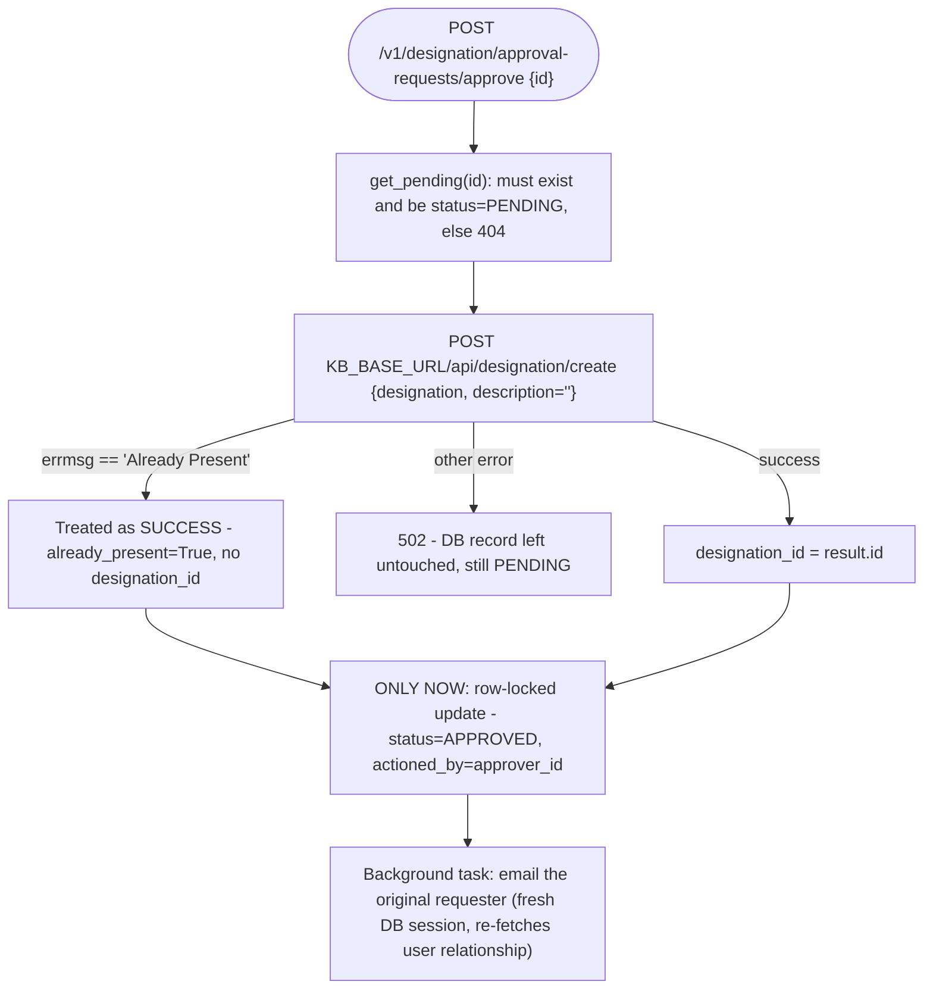
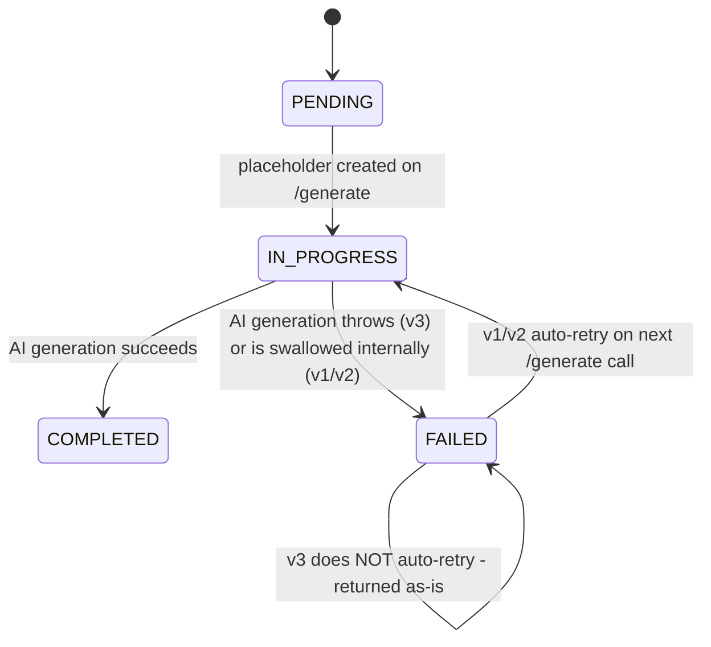
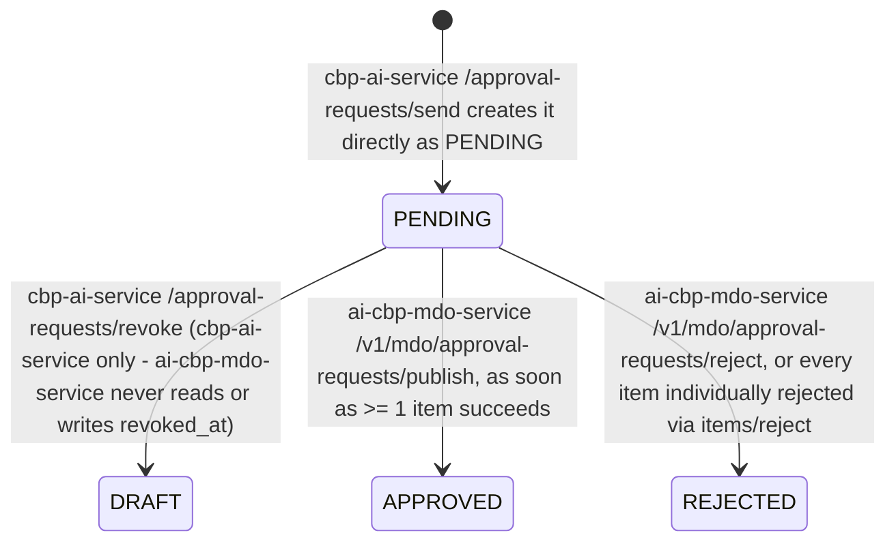
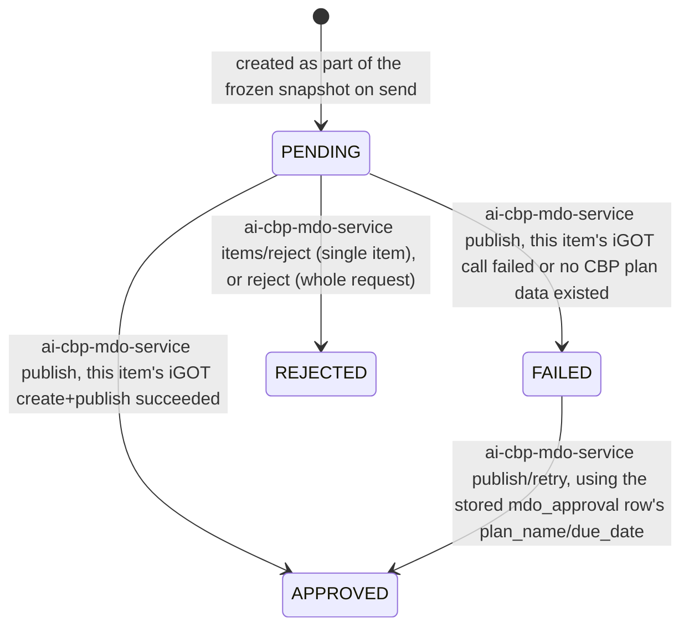
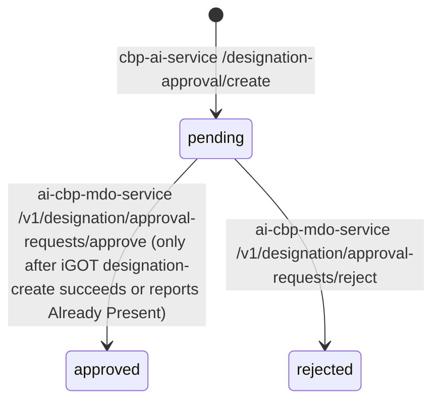

# AI CBP Tool — LLD

Reverse-engineered from code: `cbp-ai-service` (`origin/cbrelease-4.8.39`,
commit `70d7175`), `ai-cbp-mdo-service` (`origin/cbrelease-4.8.39`, commit
`88040de`), `cbp-ai-ui` (`origin/cbrelease-4.8.39`, commit `15a3b9a`). Neither
backend has Alembic or any other migration tool — both create their schema
idempotently via `Base.metadata.create_all` on startup
(`cbp-ai-service:src/main.py:24`, `ai-cbp-mdo-service:src/main.py:21-26`), so
there is no migration history to trace; everything below is read from the
current model files only.

## Storage reality — `cbp-ai-service`

**Postgres, async (SQLAlchemy 2.0 + `asyncpg`)**, engine configured in
`src/core/database.py` (`pool_size=20, max_overflow=40, pool_recycle=1800`).
`CREATE EXTENSION IF NOT EXISTS vector` also runs at startup
(`src/main.py:23`).

| Table | Model | Key columns | Notes |
|---|---|---|---|
| `users` | `src/models/user.py` | `user_id` PK, `username`/`email` unique, `role_id` FK, `organization_ids` ARRAY | **Same table name** `ai-cbp-mdo-service` mirrors read-only, minus most columns |
| `roles` | `src/models/role.py` | `role_id` PK, `role_name` unique, `permissions` JSONB | |
| `user_sessions` | `src/models/user_session.py` | `id` PK, `user_id` FK (cascade), `access_token_jti`/`refresh_token_jti` unique | Backs JWT blacklisting/logout — `cbp-ai-service`'s own auth only; `ai-cbp-mdo-service` has no equivalent table, since it verifies externally-issued tokens instead of issuing its own |
| `login_attempts` | `src/models/login_attempt.py` | `id` PK, `username` unique, `attempt_count` | Brute-force lockout |
| `designation_embeddings` | `src/models/designation_embedding.py` | `id` (String PK, iGOT designation id), `designation`, `content`, **`embedding` `Vector(768)`** | Populated **offline only**, by `scripts/ingest_designation_embeddings.py` — not by the live app |
| `role_mappings` | `src/models/role_mapping.py` | `id` PK, `user_id`, `state_center_id`, `department_id`, `designation_name`, `role_responsibilities`/`activities`/`competencies` JSONB, `status` (`ProcessingStatus`), `igot_designation_name`/`igot_designation_id`, `sort_order` | Cascades to recommendations, CBP plans, suggestions, user-added courses. **No SQLAlchemy model exists for this table in `ai-cbp-mdo-service`** — that service only ever reads it via raw `sqlalchemy.text()` SQL, confirming `cbp-ai-service` is its sole owner |
| `recommended_courses` | `src/models/course_recommendation.py` | `id` PK, `role_mapping_id` FK (cascade), `status` (`RecommendationStatus`), `vector_query` text, **`embedding` JSONB** (not pgvector — audit only), `actual_courses`/`filtered_courses` JSONB | |
| `suggested_courses` | `src/models/course_suggestion.py` | `id` PK, `role_mapping_id` FK (cascade), `course_identifiers` JSONB | Plain iGOT-searched list, no scoring |
| `cbp_plans` | `src/models/cbp_plan.py` | `id` PK, `role_mapping_id` FK (cascade), `recommended_course_id` FK (SET NULL), `selected_courses` JSONB | **No status/lifecycle column at all** — its data is copied wholesale into `approval_request_items.cbp_plan_data` at submission time (see below), and *that* copy is what `ai-cbp-mdo-service` actually mutates |
| `user_added_courses` | `src/models/user_added_course.py` | `id` PK, `role_mapping_id` FK (cascade), `identifier` unique, `name`, `platform`, `public_link`, `relevancy`, `competencies` JSONB | |
| `designation_approvals` | `src/models/designation_approval.py` | `id` PK, `rolemapping_id` FK, `user_id`, `designation_name`, `status` (plain `String(20)`), `actioned_by` | **The same table `ai-cbp-mdo-service` owns and writes to** — `actioned_by` is added here but never written by any code path in *this* repo; it's `ai-cbp-mdo-service`'s approve/reject endpoints that populate it |
| `approval_requests` | `src/models/approval_request.py` | `id` PK, `user_id` FK (cascade), `mdo_id`, `designation_count`, `status` (native Postgres `Enum(ApprovalStatus, name="approval_status_enum")`), `published_by` | `items` relationship, cascade + selectin. **Also mirrored (`extend_existing=True`) by `ai-cbp-mdo-service`**, which reads and updates `status`/`published_by`/`rejected_at`/`revoked_at`/`updated_at`/`reviewer_comments` on it |
| `approval_request_items` | `src/models/approval_request.py` | `id` PK, `approval_request_id` FK (cascade), `source_role_mapping_id`, `designation_name`, `role_responsibilities`/`activities`/`competencies` JSONB, `cbp_plan_data` JSON, `status` (native `Enum(..., name="approval_request_item_status_enum")`) | A **frozen snapshot** of a role mapping + its CBP plan at submission time, not a live reference. **Also mirrored by `ai-cbp-mdo-service`**, which is the only code path anywhere that actually writes a non-`PENDING` value to this `status` column |
| `documents` | `src/models/document.py` | `file_id` PK, `state_center_id`, `department_id`, `uploader_id`, `stored_path`, `document_type`, `summary_status`, `summary_text`/`summary_error` | |
| `meta_summaries` | `src/models/meta_summary.py` | `id` PK, `request_id` unique, `file_ids` JSONB, `status`, `summary_text` | |
| `state_center_data` | `src/models/state_center_data.py` | `id` PK, `state_center_id`, `department_id`, `acbp_plan_summary`, `work_allocation_order_summary`, `status` | Legacy, feeds v1 role-mapping generation only |

**Two more pgvector-backed tables exist but have no SQLAlchemy model** —
they're populated and queried entirely via raw `sqlalchemy.text()` SQL, and
are **not** created by `Base.metadata.create_all`:

- `public.course_metadata_weightage` — created by
  `scripts/course_embedding_pipeline.py`; columns include
  `keywords_embedding`, `description_embedding`, `combined_embedding`
  (`vector(N)`, `N = EMBEDDING_OUTPUT_DIMENSIONALITY`, default 1536),
  `competencies_v6`, `duration`, `organisation`. This is the primary
  course-recommendation search table (`src/crud/course_recommendation.py:212-360`).
- `public.course_metadata_v3` — legacy, single `embedding` column, queried
  only as a fallback path that is not actually called from
  `process_recommendation_task` (`src/crud/course_recommendation.py:304-315`).

## Storage reality — `ai-cbp-mdo-service`

**Postgres, async (SQLAlchemy 2.0 + `asyncpg`)**, `pool_size=20,
max_overflow=40, pool_timeout=30, pool_recycle=1800`
(`src/core/database.py:40-47`), `async_sessionmaker(autoflush=False,
expire_on_commit=False)`.

| Table | Model | Key columns | Notes |
|---|---|---|---|
| `approval_requests` | `src/models/mdo_approval.py:14-82` (`ApprovalRequestRead`) | Same columns as `cbp-ai-service`'s model — `mdo_id`, `status`, `published_by`, `rejected_at`, `revoked_at`, `reviewer_comments`, plus `items`/`user` relationships | `extend_existing=True` — documented in its own docstring as a **read/partial-write mirror** of a table this service does not own |
| `approval_request_items` | `src/models/mdo_approval.py:85-149` (`ApprovalRequestItemRead`) | Same base columns as `cbp-ai-service`'s model, plus this service writes `status`, `cbp_plan_data`, `igot_designation_name`, `igot_designation_id`, `reviewer_comments`, `rejected_at`, and role-mapping fields | Also `extend_existing=True` |
| `mdo_approval` | `src/models/mdo_approval.py:152-183` | `id` PK, `approval_request_id` FK (cascade), `approval_request_item_id` FK (cascade), `plan_name`, `due_date`, `igot_cbp_plan_id` (nullable — set only on a successful publish), `created_at` (nullable — set only alongside `igot_cbp_plan_id`) | **Fully owned by this service.** One row per (request, item) publish attempt; `igot_cbp_plan_id IS NULL` marks a failed attempt eligible for retry |
| `designation_approvals` | `src/models/designation_approval.py:18-52` | `id` PK, `user_id` FK (SET NULL), `rolemapping_id` FK (SET NULL, **no local model** — same table `cbp-ai-service` owns), `designation_name`, `wing_division_section`, `status` (plain `String(20)`, default `PENDING`), `reviewer_comments`, `actioned_by`, timestamps | **Fully owned by this service** — unlike the two tables above, this one is not documented as a mirror, even though `cbp-ai-service` also has a model pointed at a table of the same name |
| `users` | `src/models/user.py:8-16` | `user_id` PK, `username`, `email` unique | A **minimal** mirror (3 columns) of the same `users` table `cbp-ai-service` owns; never written to, only joined for email lookups |

`role_mappings` is referenced (by `state_center_name`/`department_name`
ILIKE search and by id) **only via raw SQL** in
`crud/designation_approval.py:45-61,106-108` — there is no ORM model for it
in this repo, confirming `cbp-ai-service` is its sole owner even from this
service's perspective.

Dashed arrows are resolved by application code at a point in time (save, or
submit-for-approval), not maintained as a live relationship. The
`AReq`/`ARI` rows are the one place two *different services'* SQLAlchemy
metadata both describe the same physical table — there is no database-level
mechanism (no FK from `mdo_approval` back into `cbp-ai-service`'s schema,
no shared migration) keeping the two models' understanding of that table in
sync; they simply happen to agree today.

## Sequence: role mapping generation (v3, the current three-pass pipeline)

v1 and v2 use a single Gemini call each (no PASS 1/2/3 split), swallow
exceptions inside the background task itself (setting `FAILED` with a
generic message rather than the real error), and auto-retry a prior
`FAILED` state instead of returning it as-is. `cbp-ai-ui`'s shipped client
calls this v3 endpoint for generation (`generateRoleMapping()`,
`shared.service.ts:298-361`).

## Sequence: designation matching

`designation_embeddings` is populated entirely offline
(`scripts/ingest_designation_embeddings.py`), indexed with an HNSW index
(`vector_cosine_ops`, `m=16, ef_construction=64`) — the live app only
reads it.

## Sequence: course recommendation background task

`get_general_courses_from_gemini` (a Google-Search-tool-based general course
fetch) is called in parallel with the LLM filter step but is currently
disabled in code (`return []` immediately) — flagged in its own inline
comment as temporary. The designation-group-based Domain/Behavioral/
Functional mix ratio (AB vs. CD groups) is computed as a rule in code but
the classification call feeding it is commented out, so it is currently
unused (`designation_group` is hardcoded `None`).

## Sequence: CBP Plan save (the three-pool merge)

## Sequence: send for approval (`cbp-ai-service`)

## Sequence: MDO publish (`ai-cbp-mdo-service`) — the other half of the chain above

## Sequence: SPV designation approval (`ai-cbp-mdo-service`) — order of operations matters

iGOT is called **before** the database is touched, and a failure leaves the
record exactly as it was — this is the inverse order from the MDO publish
flow above, where DB persistence happens once, after every item's iGOT
outcome (success or failure) is already known.

## State machines

**`RoleMapping.status`** (`ProcessingStatus`,
`cbp-ai-service:src/models/role_mapping.py:13-17`):

**`RecommendedCourse.status`** (`RecommendationStatus`,
`cbp-ai-service`) — same PENDING → IN_PROGRESS → COMPLETED/FAILED shape, no
auto-retry logic found for this one; a `FAILED`/`IN_PROGRESS` record is
returned as-is by `GET /course-recommendations`, and must be explicitly
deleted before regenerating.

**`ApprovalRequest.status`** (`ApprovalStatus`: `DRAFT, PENDING, APPROVED,
REJECTED` — `cbp-ai-service:src/schemas/comman.py:14-19`, mirrored by
`ai-cbp-mdo-service:src/schemas/comman.py:4-17`). **Corrected from the
single-repo trace**: `cbp-ai-service`'s own live API never performs the
`PENDING → APPROVED`/`REJECTED` transitions, but `ai-cbp-mdo-service`'s does
— against the identical Postgres row:

`ai-cbp-mdo-service`'s live API is also the only place that ever sets
`ApprovalRequestItem.status` to `APPROVED`, `REJECTED`, or `FAILED` — the
`cbp-ai-service`-only trace's claim that "nothing in this repo's live API
ever marks one APPROVED or REJECTED" is correct as written (about that one
repo) but was previously read as if the transition didn't exist anywhere.
It does; it's just owned by a different service.

The offline `bulk_scripts/bulk_training_plan_approval.py` in `cbp-ai-service`
independently sets these same enum values by writing directly to the shared
database — a **third** code path (alongside `ai-cbp-mdo-service`'s live API)
that can transition this row, targeting a different downstream publish
service (`CB_EXT_COURSE_SERVICE_URL`, not `ai-cbp-mdo-service`'s
`KB_BASE_URL`) whose relationship to `ai-cbp-mdo-service`'s target is
unconfirmed. The script's own comments additionally note the **actual
Postgres enum it targets has no `FAILED` value** in at least one deployment
it was written against — not independently re-verified against
`ai-cbp-mdo-service`'s or `cbp-ai-service`'s current enum definitions,
which both do include values beyond `DRAFT/PENDING/APPROVED/REJECTED`
(`ApprovalItemStatus` adds `FAILED`).

**`ApprovalRequestItem.status`** (`ApprovalItemStatus`: `PENDING, APPROVED,
REJECTED, FAILED`):

**`DesignationApproval.status`** (plain string,
`pending`/`approved`/`rejected` per
`cbp-ai-service:src/models/designation_approval.py:12-15` and
`ai-cbp-mdo-service:src/models/designation_approval.py:12-15`, same table).
**Corrected from the single-repo trace**: `cbp-ai-service`'s own code never
assigns `approved`/`rejected` and never writes `actioned_by` — true, but
`ai-cbp-mdo-service`'s approve/reject endpoints do exactly that, against the
same row:

## Validation reality

| Rule | Enforced | Where |
|---|---|---|
| Course identifiers required (non-empty) on CBP plan save | Backend | `cbp-ai-service:src/api/v1/cbp_plan.py:97-101` |
| Recommendation must exist before CBP plan creation | Backend | `cbp-ai-service:src/api/v1/cbp_plan.py:104-110` |
| Role mappings must be `COMPLETED` + have a CBP plan before sending for approval | Backend | `cbp-ai-service:src/api/v1/approval_requests.py:77,103-109` |
| Revoke only allowed from `PENDING` | Backend (route + CRUD `WHERE` both) | `cbp-ai-service:src/api/v1/approval_requests.py:368-373`, `src/crud/approval_request.py:156,165` |
| Publish/reject only allowed on a request the caller's `mdo_id` owns, and only while `PENDING` | Backend, row-locked (`SELECT ... FOR UPDATE`) | `ai-cbp-mdo-service:crud/mdo_approval_request.py:157-175` |
| Item edit (`items/update`) requires the *item itself* to be `PENDING` | Backend | `ai-cbp-mdo-service:crud/mdo_approval_request.py:636-638` |
| Course add/remove on an item requires only the *parent request* to be `PENDING` — **not** the item's own status | Backend, asymmetric vs. the rule above | `ai-cbp-mdo-service:crud/mdo_approval_request.py:447-593` |
| SPV designation approval DB write only happens after the iGOT create call succeeds (or reports "Already Present") | Backend | `ai-cbp-mdo-service:controller/designation_approval.py:69-108` |
| Designation-approval creation blocked once a role mapping has an iGOT match | Backend | `cbp-ai-service:src/api/v1/designation_approval.py:52-57` |
| Duplicate designation-approval request | Backend, keyed on `(rolemapping_id, user_id, designation_name, wing_division_section)` excluding `REJECTED` | `cbp-ai-service:src/crud/designation_approval.py:13-32` |
| Designation similarity threshold | Backend, but the effective value is ambiguous — config default `0.93` vs. documented `0.92` | `cbp-ai-service:src/core/configs.py:35` vs. `.env.example:26` |
| PDF-only, ≤10 files, ≤50MB each | Backend | `cbp-ai-service:src/api/v1/document_routes.py:78-103` |
| Meta-summary requires all input documents already `COMPLETED` | **Not actually enforced as a hard precondition — silently fails instead** (see missing-`await` bug) | `cbp-ai-service:src/api/v1/meta_summary_routes.py:47,49` |
| `cbp_plans` schema/shape | **Not enforced** — `selected_courses` is unvalidated JSONB, merged from three differently-shaped sources | `cbp-ai-service:src/models/cbp_plan.py` |
| `cbp_plan_data` schema/shape on `approval_request_items` | **Not enforced across the service boundary** — `ai-cbp-mdo-service` reads/mutates this JSON with its own assumptions about its shape (`records[0]`, `selected_courses[].identifier`), with no shared schema definition between the two repos | `ai-cbp-mdo-service:crud/mdo_approval_request.py:410-593` |

> **Verification boundary:** facts above are read from `cbp-ai-service`
> (`origin/cbrelease-4.8.39`, `70d7175`) and `ai-cbp-mdo-service`
> (`origin/cbrelease-4.8.39`, `88040de`). Not analysed from source: the
> MDO/SPV admin's own frontend (not present in any of the three traced
> repos — only the API it must be driving is visible), the private
> `@sunbird-cb/cbp-ai` library behind `cbp-ai-ui`'s `/ai` route, and
> whether `CB_EXT_COURSE_SERVICE_URL` (used only by `cbp-ai-service`'s
> offline bulk script) is the same physical service as
> `ai-cbp-mdo-service`'s `KB_BASE_URL`. Also unconfirmed: which enum values
> the live `approval_status_enum`/`approval_request_item_status_enum`
> Postgres types actually contain in a given deployed environment, versus
> what each repo's own Python enum declares.
