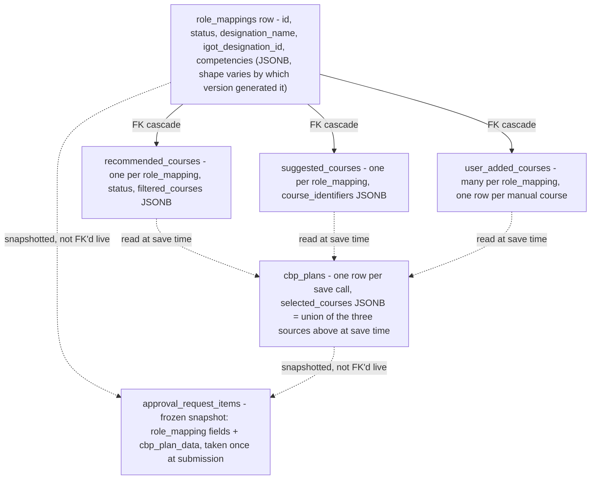
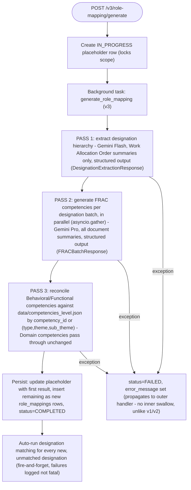
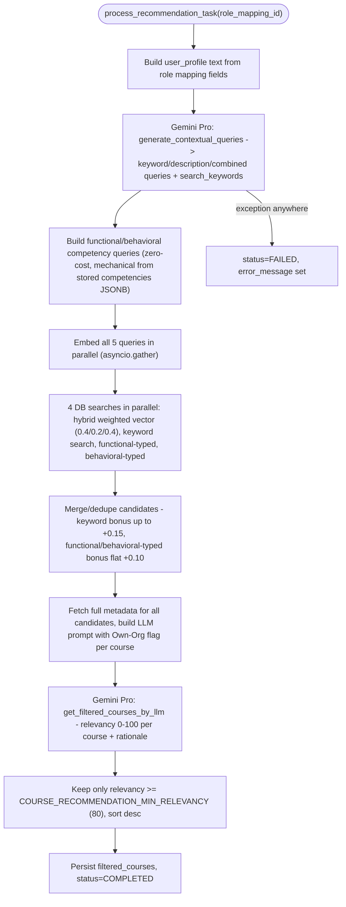
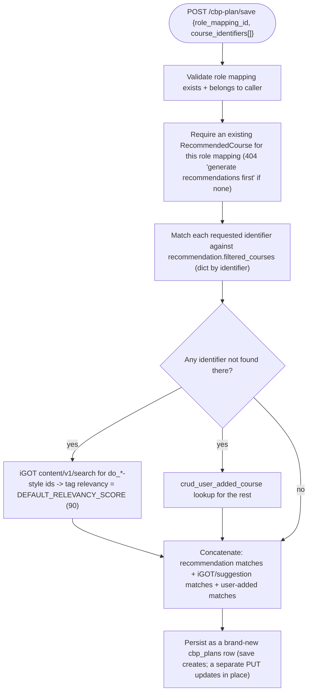
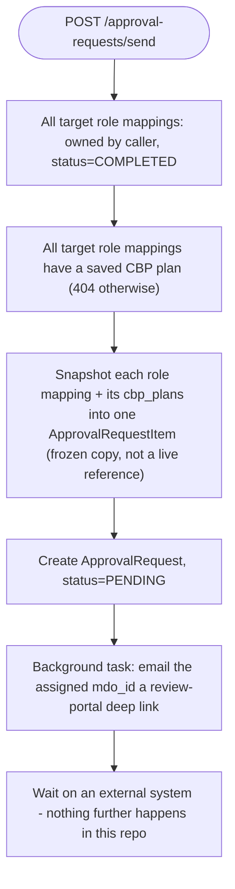
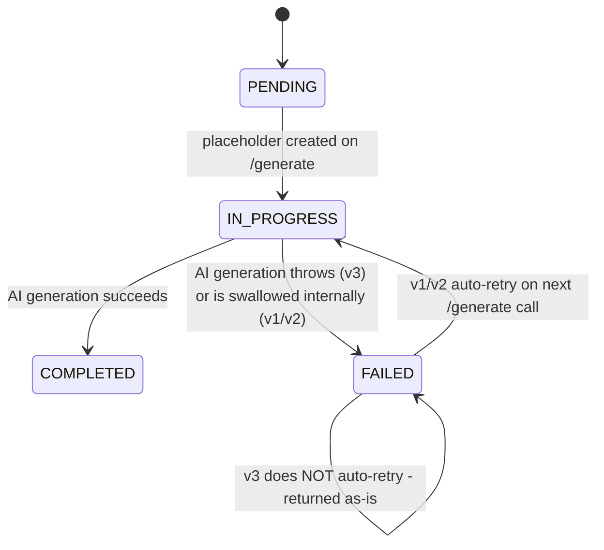
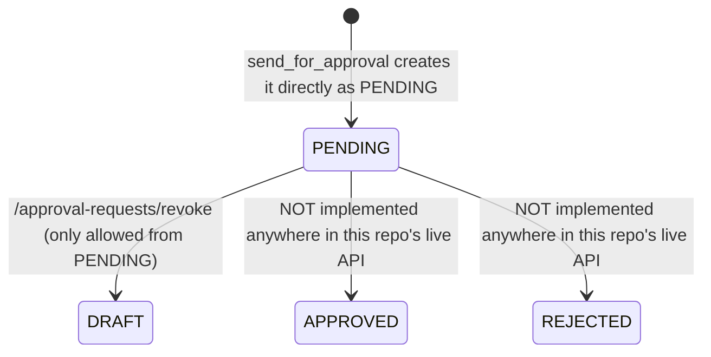

# AI CBP Tool — LLD

Reverse-engineered from code (`cbp-ai-service`, `origin/cbrelease-4.8.39`,
commit `119a42b`). No Alembic or other migration tool exists in this repo —
schema is created idempotently via `Base.metadata.create_all`
(`src/main.py:24`) on every app startup, so there is no migration history to
trace; everything below is read from the current model files only.

## Storage reality

**Postgres, async (SQLAlchemy 2.0 + `asyncpg`)**, engine configured in
`src/core/database.py` (`pool_size=20, max_overflow=40, pool_recycle=1800`).
`CREATE EXTENSION IF NOT EXISTS vector` also runs at startup
(`src/main.py:23`).

| Table | Model | Key columns | Notes |
|---|---|---|---|
| `users` | `src/models/user.py` | `user_id` PK, `username`/`email` unique, `role_id` FK, `organization_ids` ARRAY | |
| `roles` | `src/models/role.py` | `role_id` PK, `role_name` unique, `permissions` JSONB | |
| `user_sessions` | `src/models/user_session.py` | `id` PK, `user_id` FK (cascade), `access_token_jti`/`refresh_token_jti` unique | Backs JWT blacklisting/logout |
| `login_attempts` | `src/models/login_attempt.py` | `id` PK, `username` unique, `attempt_count` | Brute-force lockout |
| `designation_embeddings` | `src/models/designation_embedding.py` | `id` (String PK, iGOT designation id), `designation`, `content`, **`embedding` `Vector(768)`** | Populated **offline only**, by `scripts/ingest_designation_embeddings.py` — not by the live app |
| `role_mappings` | `src/models/role_mapping.py` | `id` PK, `user_id`, `state_center_id`, `department_id`, `designation_name`, `role_responsibilities`/`activities`/`competencies` JSONB, `status` (`ProcessingStatus`), `igot_designation_name`/`igot_designation_id`, `sort_order` | Cascades to recommendations, CBP plans, suggestions, user-added courses |
| `recommended_courses` | `src/models/course_recommendation.py` | `id` PK, `role_mapping_id` FK (cascade), `status` (`RecommendationStatus`), `vector_query` text, **`embedding` JSONB** (not pgvector — audit only), `actual_courses`/`filtered_courses` JSONB | |
| `suggested_courses` | `src/models/course_suggestion.py` | `id` PK, `role_mapping_id` FK (cascade), `course_identifiers` JSONB | Plain iGOT-searched list, no scoring |
| `cbp_plans` | `src/models/cbp_plan.py` | `id` PK, `role_mapping_id` FK (cascade), `recommended_course_id` FK (SET NULL), `selected_courses` JSONB | **No status/lifecycle column at all** |
| `user_added_courses` | `src/models/user_added_course.py` | `id` PK, `role_mapping_id` FK (cascade), `identifier` unique, `name`, `platform`, `public_link`, `relevancy`, `competencies` JSONB | |
| `designation_approvals` | `src/models/designation_approval.py` | `id` PK, `rolemapping_id` FK, `user_id`, `designation_name`, `status` (plain `String(20)`), `actioned_by` | `actioned_by` added recently, never written to anywhere in the traced code |
| `approval_requests` | `src/models/approval_request.py` | `id` PK, `user_id` FK (cascade), `mdo_id`, `designation_count`, `status` (native Postgres `Enum(ApprovalStatus, name="approval_status_enum")`), `published_by` | `items` relationship, cascade + selectin |
| `approval_request_items` | `src/models/approval_request.py` | `id` PK, `approval_request_id` FK (cascade), `source_role_mapping_id`, `designation_name`, `role_responsibilities`/`activities`/`competencies` JSONB, `cbp_plan_data` JSON, `status` (native `Enum(..., name="approval_request_item_status_enum")`) | A **frozen snapshot** of a role mapping + its CBP plan at submission time, not a live reference |
| `documents` | `src/models/document.py` | `file_id` PK, `state_center_id`, `department_id`, `uploader_id`, `stored_path`, `document_type`, `summary_status`, `summary_text`/`summary_error` | |
| `meta_summaries` | `src/models/meta_summary.py` | `id` PK, `request_id` unique, `file_ids` JSONB, `status`, `summary_text` | |
| `state_center_data` | `src/models/state_center_data.py` | `id` PK, `state_center_id`, `department_id`, `acbp_plan_summary`, `work_allocation_order_summary`, `status` | Legacy, feeds v1 role-mapping generation only |

**Two more pgvector-backed tables exist but have no SQLAlchemy model** —
they're populated and queried entirely via raw `sqlalchemy.text()` SQL, and
are **not** created by `Base.metadata.create_all`:

- `public.course_metadata_weightage` — created by
  `scripts/course_embedding_pipeline.py`; columns include
  `keywords_embedding`, `description_embedding`, `combined_embedding`
  (`vector(N)`, `N = EMBEDDING_OUTPUT_DIMENSIONALITY`, default 1536),
  `competencies_v6`, `duration`, `organisation`. This is the primary
  course-recommendation search table (`src/crud/course_recommendation.py:212-360`).
- `public.course_metadata_v3` — legacy, single `embedding` column, queried
  only as a fallback path that is not actually called from
  `process_recommendation_task` (`src/crud/course_recommendation.py:304-315`).

## Milestone-equivalent: `milestones_v1` has no analogue here — the closest
comparable "opaque JSON blob with no schema" pattern in this service is
`role_mappings.competencies` (a JSONB list whose shape has changed three
times across v1/v2/v3 with no versioning marker on the row itself) and
`cbp_plans.selected_courses` (a JSONB array merged from three different
source tables at save time, also with no schema).

Dashed arrows are resolved by application code at a point in time (save, or
submit-for-approval), not maintained as a live relationship — editing a
`RecommendedCourse` after a `CBPPlan` was saved from it does not change the
plan; editing a `RoleMapping` after an `ApprovalRequestItem` snapshot was
taken does not change the snapshot.

## Sequence: role mapping generation (v3, the current three-pass pipeline)

v1 and v2 use a single Gemini call each (no PASS 1/2/3 split), swallow
exceptions inside the background task itself (setting `FAILED` with a
generic message rather than the real error), and auto-retry a prior
`FAILED` state instead of returning it as-is.

## Sequence: designation matching

`designation_embeddings` is populated entirely offline
(`scripts/ingest_designation_embeddings.py`), indexed with an HNSW index
(`vector_cosine_ops`, `m=16, ef_construction=64`) — the live app only
reads it.

## Sequence: course recommendation background task

`get_general_courses_from_gemini` (a Google-Search-tool-based general course
fetch) is called in parallel with the LLM filter step but is currently
disabled in code (`return []` immediately) — flagged in its own inline
comment as temporary. The designation-group-based Domain/Behavioral/
Functional mix ratio (AB vs. CD groups) is computed as a rule in code but
the classification call feeding it is commented out, so it is currently
unused (`designation_group` is hardcoded `None`).

## Sequence: CBP Plan save (the three-pool merge)

## Sequence: send for approval

## State machines

**`RoleMapping.status`** (`ProcessingStatus`, `src/models/role_mapping.py:13-17`):

**`RecommendedCourse.status`** (`RecommendationStatus`) — same PENDING → IN_PROGRESS → COMPLETED/FAILED shape, no auto-retry logic found for this one; a `FAILED`/`IN_PROGRESS` record is returned as-is by `GET /course-recommendations`, and must be explicitly deleted before regenerating.

**`ApprovalRequest.status`** (`ApprovalStatus`: `FAILED, DRAFT, PENDING, APPROVED, REJECTED` — `src/schemas/comman.py:14-19`):

`APPROVED`/`REJECTED` are only ever assigned by the offline
`bulk_scripts/bulk_training_plan_approval.py`, which talks to the external
CB-ext-course-service directly and mirrors what that script's own docstring
describes as a separate MDO-service controller's logic — that controller's
code is not in this repo. The script's own comments additionally note the
**actual Postgres enum it targets has no `FAILED` value** — a failing
item/request there simply stays `PENDING` for retry, which may or may not
match this repo's own `Enum(ApprovalStatus, ...)` definition; **not
independently verified** which enum values the live database's
`approval_status_enum` type actually contains in a given environment.

**`DesignationApproval.status`** (plain string, values `pending/approved/rejected`
per `src/models/designation_approval.py:12-15`): only `pending` is ever
assigned anywhere in the traced Python source. No code path sets
`approved` or `rejected`, and `actioned_by` — a column that looks built to
record who did so — is never written to.

## Validation reality

| Rule | Enforced | Where |
|---|---|---|
| Course identifiers required (non-empty) on CBP plan save | Backend | `src/api/v1/cbp_plan.py:97-101` |
| Recommendation must exist before CBP plan creation | Backend | `src/api/v1/cbp_plan.py:104-110` |
| Role mappings must be `COMPLETED` + have a CBP plan before sending for approval | Backend | `src/api/v1/approval_requests.py:77,103-109` |
| Revoke only allowed from `PENDING` | Backend (route + CRUD `WHERE` both) | `src/api/v1/approval_requests.py:368-373`, `src/crud/approval_request.py:156,165` |
| Designation-approval creation blocked once a role mapping has an iGOT match | Backend | `src/api/v1/designation_approval.py:52-57` |
| Duplicate designation-approval request | Backend, keyed on `(rolemapping_id, user_id, designation_name, wing_division_section)` excluding `REJECTED` | `src/crud/designation_approval.py:13-32` |
| Designation similarity threshold | Backend, but the effective value is ambiguous — config default `0.93` vs. documented `0.92` | `src/core/configs.py:35` vs. `.env.example:26` |
| PDF-only, ≤10 files, ≤50MB each | Backend | `src/api/v1/document_routes.py:78-103` |
| Meta-summary requires all input documents already `COMPLETED` | **Not actually enforced as a hard precondition — silently fails instead** (see missing-`await` bug) | `src/api/v1/meta_summary_routes.py:47,49` |
| `ApprovalRequest`/`DesignationApproval` approve/reject | **Not enforced anywhere in this repo — the transition doesn't exist here** | — |
| `cbp_plans` schema/shape | **Not enforced** — `selected_courses` is unvalidated JSONB, merged from three differently-shaped sources | `src/models/cbp_plan.py` |

> **Verification boundary:** facts above are read from `cbp-ai-service` at
> commit `119a42b`. Not analysed from source: the MDO portal, the SPV
> portal, and the "CB ext course service" — their behaviour is only visible
> as calls made *into* them from this repo (the notification-email links
> and the offline publish script). Attaching those repos would close the
> gap, as would confirming which enum values the live `approval_status_enum`
> Postgres type actually contains in a given deployed environment.
