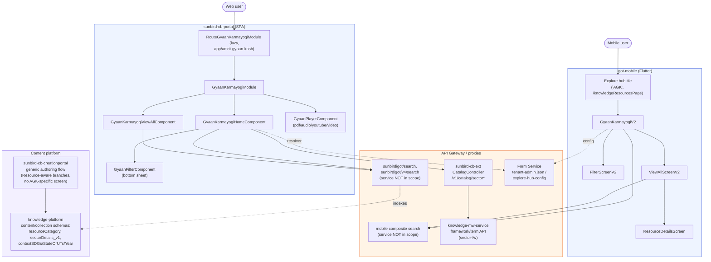

# Amrit Gyaan Kosh — HLD

Reverse-engineered from eight repos: `sunbird-cb-portal`
(`origin/cbrelease-4.8.40`, `eafc3ea71c`), `sunbird-cb-creationportal`
(`origin/cbrelease-4.8.40`, `1e6a35c52`), `igot-mobile` (`origin/master`,
`e0deaf599`), `knowledge-platform` (`origin/cbrelease-4.8.41`, `ce1a624f77`),
`sunbird-cb-ext` (`origin/cbrelease-4.8.41`, `55e79421`),
`sunbird-cb-uiproxy` (`origin/cbrelease-4.8.41`, `175d24c4`),
`cb-ext-course-service` (`origin/cbrelease-4.8.41`, `f8ef968f2a`) and
`sunbird-course-service` (`origin/cbrelease-4.8.41`, `38ec8c536d`). The last
two are confirmed to have zero involvement — included for completeness, not
because they contribute anything.

## Topology

Amrit Gyaan Kosh is not a service — it is a client-side feature composed, in
parallel and independently, on the web portal (Angular module
`GyaanKarmayogiModule`) and the mobile app (Flutter feature module
`gyaan_karmayogi`). Both clients query generic Sunbird content search for
`Resource`-type content carrying a handful of metadata fields
(`resourceCategory`, `sectorDetails_v1`, `contextSDGs`, `contextStateOrUTs`,
`contextYear`), and both call a sector-taxonomy API to populate filter
dropdowns.

## Responsibilities

| Module / Repo | Responsibility |
|---|---|
| `sunbird-cb-portal` — `GyaanKarmayogiModule` | Web landing page, filter panel, view-all grid, and a mime-type-dispatching player (thin wrappers over `@ws/viewer`) |
| `igot-mobile` — `gyaan_karmayogi` feature | Same set of screens natively, plus a remote-config-driven "know more" banner and share action |
| `sunbird-cb-ext` — `CatalogController` | The only confirmed backend piece: CRUD + list for the sector/sub-sector taxonomy, backed by a dedicated Sunbird framework (`sector-fw`) via knowledge-mw-service |
| `knowledge-platform` — content/collection JSON schemas | Defines the metadata fields (`resourceCategory`, `sectorDetails_v1`, `contextSDGs`, `contextStateOrUTs`, `contextYear`) both clients filter/search on — all untyped/unconstrained (plain strings or arrays of untyped objects, no enums) |
| `sunbird-cb-creationportal` | Authors "Resource" content through the platform's pre-existing generic content-creation flow, which has `Resource`-type-aware form branches for these same fields — no dedicated AGK authoring screen |
| `sunbird-cb-uiproxy` | Touches AGK only incidentally — `resourceCategory` appears in generic field-projection lists (`default-meta.ts`, `content.model.ts`); no AGK-named route |
| `cb-ext-course-service`, `sunbird-course-service` | **No involvement** — confirmed by repo-wide search; both are course-enrollment/batch services unrelated to Resource content discovery |

**Not present in any repo analyzed**: the service that actually implements
`sunbirdigot/search` / `sunbirdigot/v4/search` (web) and the mobile
composite-search endpoint — both clients call these as if they exist, but no
repo in this trace defines them. See [APIs](apis.md) for the full gap.

## Key design decisions

- **No dedicated backend, by construction.** Both clients treat "AGK" as a
  filtered view over generic `Resource`-type content search — there is no
  AGK controller, AGK database table, or AGK service anywhere in the eight
  repos traced. The feature's entire backend footprint is a handful of
  schema fields in `knowledge-platform` and a generic sector-taxonomy CRUD
  API in `sunbird-cb-ext`.
- **Two independent client implementations, not a shared library.** The web
  portal and mobile app each declare their own field-name constants, their
  own request-building logic, and their own route naming
  (`app/amrit-gyaan-kosh` vs `/knowledgeResourcesPage`) for what is
  conceptually the same feature. They agree closely on the metadata field
  names because both target the same underlying content schema, but no
  shared contract/interface enforces that agreement — a schema field rename
  would need to be applied in both codebases independently.
- **Case Studies vs. Other Resources is a data filter, not a permission.**
  Both clients split tabs using a `createdFor`/org-id match against a
  configured CBC org id (`environment.cbcOrg` on web,
  `amritGyaanOrgId`/`cbcOrg` from remote config on mobile) — any user can see
  both tabs; the split is about which org authored the content, not who is
  viewing it.
- **Configured by generic mechanisms, not an AGK-specific flag.** Web
  uses a `GyaanResolverService` fetch of a tenant
  `feature/tenant-admin.json` file — not AGK-aware beyond the route key
  string. Mobile visibility comes from a generic,
  remotely-overridable `explore-hub-config` JSON shared by every hub tile.
- **Content authoring reuses the platform, deliberately.** No AGK-specific
  authoring screen exists in `sunbird-cb-creationportal`; `Resource`-type
  content (including AGK content) is created through the same
  `additional-details` form used by every content type, which already had
  conditional branches for these fields. The only AGK-named artifact found
  in that repo is an unused, commented-out `AGKPublicSurvey` form-type
  constant, unrelated to content creation.
- **Player is a dispatcher, not a renderer.** `GyaanPlayerComponent`
  (web) and `ResourceDetailsScreen`'s player (mobile) both determine a
  viewer type from mime type and delegate to shared, pre-existing viewer
  components/libraries — none of the actual PDF/audio/video/YouTube
  rendering logic lives in AGK-specific code.

See the [LLD](lld.md) for routing tables, component detail and sequence
flows, and the [Operations Manual](operations-manual.md) for how these
decisions show up in day-2 support.

---

> **Verification boundary:** facts above are read from the eight repos and
> commits listed at the top of this document. Not analysed from source: the
> service implementing `sunbirdigot/search`/`sunbirdigot/v4/search` and the
> mobile composite-search endpoint (not found in any repo traced), the
> knowledge-mw-service `framework/term` API that `sunbird-cb-ext`'s catalog
> controller calls, and the `@ws/viewer` / `@sunbird-cb/consumption` library
> internals used by the players on both platforms. Attach those repos to
> close the gaps.
