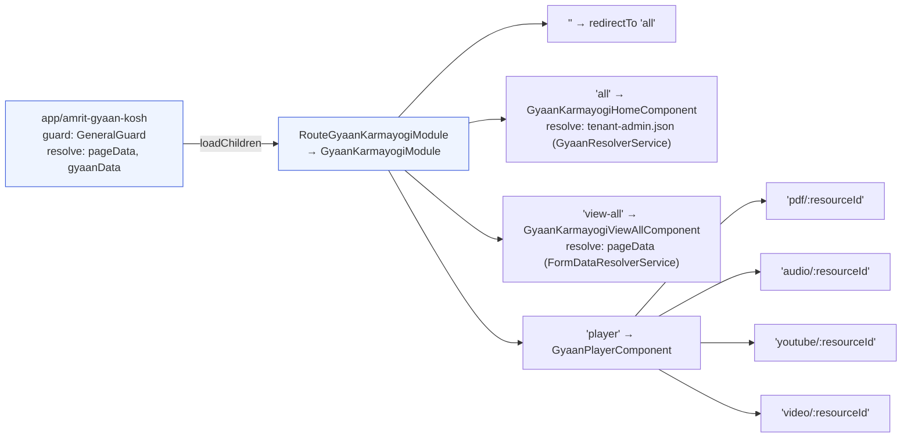
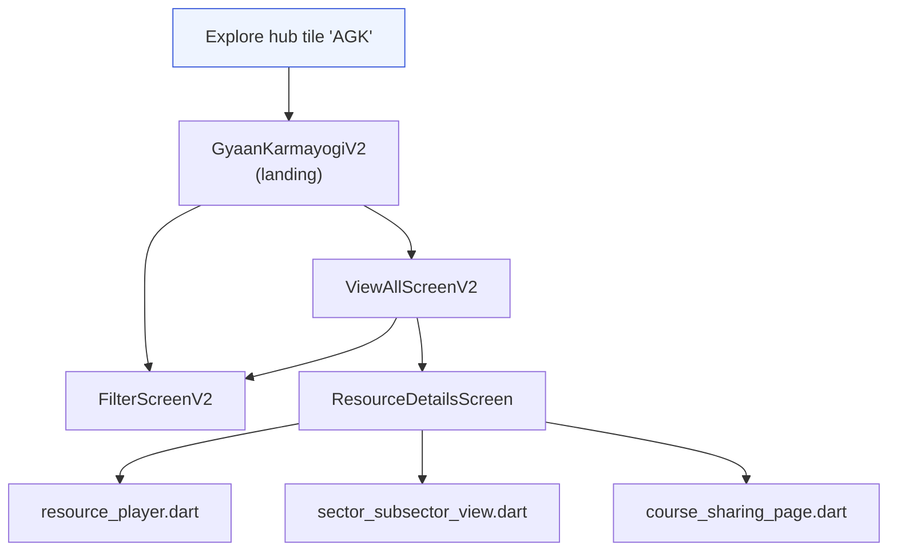

# Amrit Gyaan Kosh — LLD

File paths below are relative to each repo's root. Companion to the
[HLD](hld.md). Commits: `sunbird-cb-portal` `origin/cbrelease-4.8.40`
`eafc3ea71c`; `igot-mobile` `origin/master` `e0deaf599`;
`sunbird-cb-creationportal` `origin/cbrelease-4.8.40` `1e6a35c52`;
`knowledge-platform` `origin/cbrelease-4.8.41` `ce1a624f77`;
`sunbird-cb-ext` `origin/cbrelease-4.8.41` `55e79421`.

## Web portal (`sunbird-cb-portal`)

### File inventory — `project/ws/app/src/lib/routes/gyaan-karmayogi/`

| File | Role |
|---|---|
| `gyaan-karmayogi.component.ts` | Empty shell hosting the routed children |
| `gyaan-karmayogi-routing.module.ts` | Child routes: `all` (home), `view-all`, `player/{pdf,audio,youtube,video}/:resourceId` |
| `models/gyaan-contants.model.ts` | Field-name constants (`sectorDetails_v1.sectorName`/`subSectorName`, `resourceCategory`, `contextStateOrUTs`, `contextSDGs`, `contextYear`), UI labels, debounce/limit constants, sector-chip color palette |
| `services/gyaan-karmayogi.service.ts` | `searchV6`, `fetchSearchData`, `trendingContentSearch`, `getSeeAllConfigJson` |
| `resolver/gyaan-resolver.service.ts` | Fetches `/<sitePath>/feature/tenant-admin.json`; redirects to `/` on failure |
| `components/gyaan-karmayogi-home/` | Landing page: facet dropdowns, content strips, Case Studies / Other Resources tabs |
| `components/gyaan-karmayogi-view-all/` | Filterable, paginated/infinite-scroll grid |
| `components/gyaan-filter/` | Bottom-sheet filter panel (sector, sub-sector, category, state, SDG checkboxes, year range slider) |
| `components/gyaan-player/` | Mime-type dispatcher, breadcrumbs, sector/sub-sector display, related-resources strip |
| `components/players/gyaan-youtube/`, `gyaan-audio/`, `gyaan-video/`, `pdf/` | Thin wrappers delegating to `@ws/viewer`'s Youtube/Audio/Video/Pdf modules — no logic of their own |

### App-shell integration

| File | Role |
|---|---|
| `src/app/app-routing.module.ts` (route `app/amrit-gyaan-kosh`) | Lazy-loads `RouteGyaanKarmayogiModule`; `canActivate: [GeneralGuard]`; resolves `pageData: FormDataResolverService`, `gyaanData: AppGyaanKarmayogiService` |
| `src/app/routes/route-gyaan-karmayogi.module.ts` | Thin wrapper re-exporting `GyaanKarmayogiModule` from `@ws/app` |
| `src/app/services/app-gyaan-karmayogi.service.ts` | Route-resolver service: parallel `forkJoin` of facet search (`sunbirdigot/v4/search`) and sector list (`catalog/v1/sector`) |
| `src/app/guards/general.guard.ts` | Generic guard — can globally disable the route via `globalConfig.routes['amrit-gyaan-kosh']`; no AGK-specific role/feature check declared on this route |
| `src/app/component/igot-sarthi/igot-sarthi.component.ts`, `src/app/component/support-ai/support-ai.component.ts` | Build deep-link URLs (`app/amrit-gyaan-kosh/player/<pdf\|video>/<id>?...`) into the AGK player from AI-assistant search results |
| `project/ws/app/src/lib/routes/search-v3/components/course-content-card/course-content-card.component.ts` | Builds the same deep-link pattern for global search results |
| `project/ws/app/src/lib/routes/kalp/bharat-kalp-see-all/bharat-kalp-see-all.component.ts` | Same deep-link pattern from Bharat Kalp's content browser |

### Routing table (web)

### Component detail

**`GyaanKarmayogiHomeComponent`** — builds a `gyaanForm` (sector/sub-sector/
category dropdowns), calls `GyaanKarmayogiService.searchV6` for facet counts
(`callFacetApi`) and dynamically reconfigures a `stripConfig` of content
carousels per selected sector/category/tab (`callStrips`,
`callPaticualrStrip`). Two tabs (`selectedTabIndex`): Case Studies
(`contentType: ['Resource','Course']`, filtered to `environment.cbcOrg` via
`createdFor`) and Other Resources (`contentType: ['Resource']`).
`viewAllSector()` navigates to `view-all`.

**`GyaanKarmayogiViewAllComponent`** — builds the richer facet set
(`contentType`, sector, sub-sector, `resourceCategory`, `contextYear`,
`contextStateOrUTs`, `contextSDGs` — `getFacetsData`), issues paged
`searchV6` requests, extends on scroll (`onScrollEnd`), and opens
`GyaanFilterComponent` in a `MatBottomSheet` on narrow viewports.

**`GyaanPlayerComponent`** — resolves viewer type via a mime-type lookup
(`getMimeType` / `VIEWER_ROUTE_FROM_MIME`), builds breadcrumbs differently
depending on entry point (TOC/preview vs. normal browsing), fetches a
related-resources strip filtered by sector/sub-sector/resourceCategory, and
parses `sectorDetails_v1` into `sectorsList`/`subSectorsList` for display.

## Mobile app (`igot-mobile`)

### File inventory — `lib/features/gyaan_karmayogi/`

| File | Role |
|---|---|
| `presentation/screens/gyaan_karmayogi_screen.dart` (`GyaanKarmayogiV2`) | Landing screen: app bar, `TopSection` (search/filter/view-all trigger), `AgkForm` info banner, `GyaanKarmayogiCarousel`, 2-tab bar (Case Studies / Other Resources) |
| `presentation/screens/mobile/filter_screen/filter_screen.dart` (`FilterScreenV2`) | Filter sheet: sector, sub-sector, resource category, SDGs, state/UT, year slider |
| `presentation/screens/mobile/view_all_screen/view_all_screen.dart` (`ViewAllScreenV2`) | Paginated resource list for a given sector/sub-sector/category/tab |
| `presentation/screens/mobile/details_screen/details_screen.dart` (`ResourceDetailsScreen`) | Single-resource detail: header, player, sector/sub-sector display, share |
| `presentation/widgets/agk_form.dart` | Informational "know more" banner sourced from remote config — not a filter or entry form |
| `presentation/controllers/gyaan_karmayogi_controller.dart` | State/controller layer (CBC-org filter logic, tab data) |
| `data/services/gyaan_karmayogi_service.dart` | `getGyaanKarmayogiData`, `getGyaanKarmaYogiResources`, `getGyaanConfig` |
| `data/repositories/gyaan_karmayogi_repository.dart` | Repository wrapping the service layer |
| `data/models/gyaan_karmayogi_sector_model.dart`, `gyaan_karmayogi_resource_model.dart` | Response models |

### App-shell integration

| File | Role |
|---|---|
| `lib/core/configurations/explore_hub_config.dart` | Static fallback hub-tile config: `title: "AGK"`, `navigationRoute: "/knowledgeResourcesPage"`, `telemetryId: "amritGyaanKosh"` |
| `lib/features/explore/presentation/screens/mobile/mobile_explore_screen.dart` | Renders hub tiles from remote `AppConfiguration.exploreHubConfigData` (falls back to the static config above); reads each entry's `enabled` flag |
| `lib/core/router/app_routes.dart`, `lib/core/router/routes.dart` | Route constants `knowledgeResourcesPage`, `resourceDetailsScreen`; `routes.dart` maps `knowledgeResourcesPage → GyaanKarmayogiV2` |
| `lib/core/shared_repositories/feature_config_repository.dart` | Exposes `amritGyaanOrgId` (from remote `cbcOrg` field) — the CBC-org filter value used to split Case Studies vs. Other Resources |
| `lib/core/constants/api_endpoints.dart` | `gyaanKarmayogiConfig = '/assets/configurations/feature/knowledge-resource.json'` |
| `lib/core/telemetry/constants/telemetry_constants.dart` | `amritGyaanKoshPageId = '/app/amrit-gyaan-kosh/all'`; env constants `'amrit-gyaan-kosh'` / `'Amrit Gyaan Kosh'` |
| `lib/features/toc/presentation/screens/about_tab/about_tab.dart` | Reuses `SectorSubsectorView` (built for AGK) generically for any content with `sectorDetails` |
| `lib/l10n/app_en.arb`, `lib/l10n/app_hi.arb` | Official display strings: `"Amrit Gyaan Kosh"` / `"AGK"` / `"AGK Case Studies"`, English and Hindi |

### Screen flow

## Content schema (`knowledge-platform`)

`schemas/content/1.0/schema.json` (and, near-identically,
`schemas/collection/1.0/schema.json`; `sectorDetails_v1`/`createdFor` only in
`schemas/questionset/1.0/schema.json`):

| Field | Type | Constraint |
|---|---|---|
| `resourceCategory` | string | none — free text, no enum |
| `sectorDetails_v1` | array of object | untyped — no nested property schema for `sectorName`/`subSectorName` |
| `contextYear` | array of string | none |
| `contextSDGs` | array of string | none |
| `contextStateOrUTs` | array of string | none |
| `createdFor` | array | untyped items |
| `contentType` (existing, unrelated to AGK) | enum, first value `"Resource"` | pre-existing Sunbird content type, not added for AGK |

These five AGK-relevant fields sit contiguously in the schema, alongside
`competencies_v5/v6`/`referenceNodes`/`durationInSeconds` — evidence of one
coordinated schema change, not scattered individual additions. Traced (via
`git log -m -S` across a merge commit) to merge commit `e4b68cc3` ("Merge
branch 'cbrelease-4.8.29' into cbrelease-4.8.29.1", 2025-09-29), which also
touched `SearchActor.java`/`SearchProcessor.java`/`SearchConstants.java`
(search-side support for the same fields) — a plausible but not
explicitly-labelled origin commit; no commit message anywhere in this repo's
history contains "gyaan"/"amrit"/"AGK" as literal text.

Two other matches for `resourceCategory` in this repo are confirmed
**unrelated** to AGK: `content-api/content-service/conf/application.conf`
(a generic ~60-field list added for the unrelated Learning Pathway feature,
KB-12556) and `ContentActor.scala` (a generic notification-suppression
fallback check, KB-11220).

## Content authoring (`sunbird-cb-creationportal`)

No AGK-specific authoring component exists. `Resource` is a pre-existing
`EContentTypes` value (`widget-content.model.ts`), and the generic, shared
authoring component
`project/ws/author/.../collection-v2/components/additional-details/additional-details.component.ts`
has `Resource`-aware conditional branches (~lines 1241, 2111-2130, 2172-2178)
that surface `resourceCategory` as required, and keep
`contextStateOrUTs`/`contextSDGs`/`contextYear`/`additionalTags` controls
only for standalone-resource or case-study content — the same component
handles every other content type. The one AGK-named artifact in this repo,
`FORM_TYPES.AGK_PUBLIC_SURVEY` (`widget-content.model.ts`), is commented out
of the active `FORM_TYPES_LIST` and used only to gate a submission-count UI
element in the surveys-list component — unrelated to content creation.

## Sector taxonomy API (`sunbird-cb-ext`)

`src/main/java/org/sunbird/catalog/controller/CatalogController.java`
(`@RequestMapping("/v1/catalog")`) and
`.../catalog/service/CatalogServiceImpl.java` implement `getSectors()`,
`readSector()`, `createSector()`, `createSubSector()` by calling the
Knowledge-Mw framework/term API against a dedicated framework
(`sector.framework.name=sector-fw`, `sector.category.name=sector`,
`application.properties:146-158`). Config surfaced via
`CbExtServerProperties.java` (`getSectorFrameworkName()`,
`getSectorCategoryName()`, `getSectorFields()`, `getSubSectorFields()`).

---

> **Verification boundary:** facts above are read from the repos/commits
> listed at the top of this document. The `sunbirdigot/search`,
> `sunbirdigot/v4/search`, and mobile composite-search endpoints, and the
> knowledge-mw-service framework/term API itself, are not present in any repo
> analyzed — behaviour is inferred from the request/response handling in the
> calling code only.
