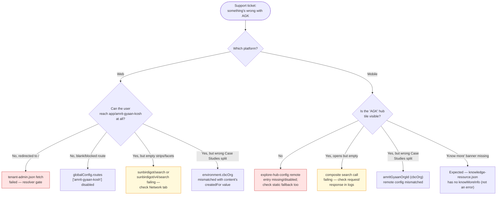

# Operations Manual — Amrit Gyaan Kosh

How to operate, support and troubleshoot Amrit Gyaan Kosh as it exists
today — two independent client implementations (web + mobile) over generic
content search, with a real backend footprint limited to a sector-taxonomy
API. Verified against `sunbird-cb-portal` (`origin/cbrelease-4.8.40`,
`eafc3ea71c`), `igot-mobile` (`origin/master`, `e0deaf599`) and
`sunbird-cb-ext` (`origin/cbrelease-4.8.41`, `55e79421`); companion to the
[HLD](hld.md) and [LLD](lld.md).

## System overview

Amrit Gyaan Kosh (AGK) is a knowledge-resource browsing feature at
`app/amrit-gyaan-kosh` (web) and `/knowledgeResourcesPage` (mobile, hub tile
"AGK"). There is **no AGK backend service** — content is ordinary Sunbird
`Resource`-type content tagged with generic metadata fields, retrieved
through generic search, filtered by a sector taxonomy served from
`sunbird-cb-ext`.

## Important fields

| Field | Meaning | Where | Why it matters |
|---|---|---|---|
| `resourceCategory` | Free-text category on a content item | Content schema (`knowledge-platform`) | Unconstrained — any string an author types becomes a filter value; no enum to keep values consistent |
| `sectorDetails_v1` | Array of untyped `{sectorName, subSectorName}`-shaped objects | Content schema | No schema validation on the object shape — a malformed entry from authoring silently fails to filter/display correctly rather than being rejected |
| `contextSDGs`, `contextStateOrUTs`, `contextYear` | Arrays of free-text strings | Content schema | Same lack of enum constraint |
| `createdFor` | Org id(s) a content item is attributed to | Content schema | The **entire** mechanism distinguishing "Case Studies" from "Other Resources" on both clients — a content item is a Case Study purely because its `createdFor` matches the configured CBC org id |
| `environment.cbcOrg` (web) / `amritGyaanOrgId` from remote `cbcOrg` (mobile) | The CBC org id used in the `createdFor` filter | Web: build-time environment file. Mobile: remote assets config | If these two values ever drift apart, the two clients will disagree on what counts as a Case Study |
| `globalConfig.routes['amrit-gyaan-kosh']` | Web route kill-switch | Portal `GeneralGuard` | Disables the entire web route; independent of the tenant-admin resolver below |
| `tenant-admin.json` (web) | Per-tenant feature-flag JSON fetched by `GyaanResolverService` | `/<sitePath>/feature/tenant-admin.json` | Fetch failure redirects the user to `/` — this is a second, separate gate from the route guard above |
| `explore-hub-config` (mobile) | Remote JSON listing hub tiles, incl. AGK's `enabled` flag | `AppConfiguration.exploreHubConfigData`, falls back to a bundled static config | Setting the AGK entry's `enabled` to `false` (or omitting it) hides the hub tile; the route itself isn't separately guarded |
| `knowledge-resource.json` (mobile) | Remote config for the "know more" banner | `{baseUrl}/assets/configurations/feature/knowledge-resource.json`, 10-min cache | Missing `knowMoreInfo` simply renders nothing — not an error state |

## How to enable/disable the feature

- **Web, whole feature**: set `globalConfig.routes['amrit-gyaan-kosh']` to
  `false` (or `{enabled: false}`), or make `tenant-admin.json` fail/404 for
  the tenant (soft-gates the module via the resolver).
- **Mobile, hub visibility**: set the AGK entry's `enabled` to `false` in the
  `explore-hub-config` remote JSON. This only hides the entry-point tile —
  if a user has the route/deep-link memorized, no separate guard was found
  blocking direct navigation to `/knowledgeResourcesPage` on mobile.
- **Case Studies vs Other Resources split**: controlled entirely by the CBC
  org id config (`environment.cbcOrg` web / `cbcOrg` remote config mobile) —
  there is no separate toggle for this; changing the org id changes what
  counts as a Case Study platform-wide.
- There is no admin UI for any of the above in the repos traced — all are
  set via environment files (web) or backend-managed remote config records
  (mobile).

## Dependencies to watch

Neither client has a dedicated backend; both directly depend on generic
platform services, none of which are AGK-aware:

| Service | Endpoint | Impact if down/erroring |
|---|---|---|
| Search (web) | `POST sunbirdigot/search`, `sunbirdigot/v4/search` — **implementing service not found in any repo traced** | Home strips, facets and view-all grid fail to load |
| Search (mobile) | Composite-search equivalent — **implementing service not found in any repo traced** | Carousel and view-all list fail to load |
| Sector taxonomy | `GET catalog/v1/sector` (`sunbird-cb-ext` → knowledge-mw-service `framework/term`) | Sector/sub-sector filter dropdowns are empty on both clients |
| Form/config service | `tenant-admin.json` (web), `explore-hub-config` / `knowledge-resource.json` (mobile) | Web: whole module inaccessible (resolver redirects to `/`). Mobile: hub tile may disappear, or the "know more" banner silently stays empty |
| `@ws/viewer` library (web) | n/a — bundled | A version change to this library can alter player behaviour with no commit in `sunbird-cb-portal`'s own history |

## Troubleshooting guide

### "Web user can't reach AGK at all"
Two independent gates can cause this — distinguish by what the user actually
sees:
1. Redirected to `/` immediately → the `tenant-admin.json` resolver fetch
   failed. Check that `/<sitePath>/feature/tenant-admin.json` resolves for
   the tenant.
2. Route inert / never loads the module → check
   `globalConfig.routes['amrit-gyaan-kosh']` hasn't been disabled.

### "Content is missing or facets are empty"
Both platforms' search calls were not traced to an implementing service in
this codebase set — start with the Network tab / API gateway logs for
`sunbirdigot/search` (web) or the mobile composite-search call, not with the
AGK client code itself, which has no server-side logic to be at fault.

### "A resource is in the wrong tab (Case Study vs Other Resources)"
Check the content's `createdFor` value against the currently configured CBC
org id on **each platform separately** — `environment.cbcOrg` (web) and the
remote `cbcOrg` field (mobile) are two independently maintained values with
no shared source of truth found in this trace; a change to one without the
other will make the two clients disagree.

### "Sector/sub-sector filter list is empty or wrong"
Check `GET catalog/v1/sector` directly against `sunbird-cb-ext` — if that
call succeeds but values look wrong, the issue is in the underlying
`sector-fw` taxonomy framework data (knowledge-mw-service), not in
`sunbird-cb-ext`'s controller itself.

### "Mobile 'know more' banner isn't showing"
This is very likely expected behaviour, not a bug — `AgkForm` renders
nothing unless `knowledge-resource.json`'s `knowMoreInfo` key is present.
Confirm the remote config actually has that key before treating it as a
defect.

## Monitoring recommendations

No AGK-specific telemetry/logging was found for search failures on either
platform — mobile does emit an impression telemetry event on page load
(`amritGyaanKoshPageId`), but no failure/error telemetry was located for the
search or config calls on either client. Recommend:
- A synthetic check that `catalog/v1/sector` and the two search endpoints
  return 2xx with non-empty data.
- Client-side error telemetry on the search/config `catchError`/failure
  paths on both platforms, tagged distinctly from generic content-search
  telemetry, so AGK-specific degradation is visible separately.
- A periodic reconciliation check comparing `environment.cbcOrg` (web
  build config) against the mobile `cbcOrg` remote-config value, to catch
  drift between the two Case-Studies definitions before it reaches users.

## Release and deploy notes

- The web module is lazy-loaded (`RouteGyaanKarmayogiModule` →
  `GyaanKarmayogiModule`) — a broken build of just this module surfaces as a
  chunk-load failure only for users navigating to `app/amrit-gyaan-kosh`.
- The mobile feature's config (`gyaanKarmayogiConfig` →
  `knowledge-resource.json`) is fetched from the app's configured `baseUrl`
  with a 10-minute in-memory cache — a config change may take up to 10
  minutes to reach an already-running app session.
- Sector taxonomy changes (`POST /v1/catalog/sector/create`,
  `/subsector/create` in `sunbird-cb-ext`) propagate to both clients only
  through the next `GET /v1/catalog/sector` call each client makes — there
  is no push/invalidation mechanism found in this trace.
- Any rename of the metadata field names (`resourceCategory`,
  `sectorDetails_v1`, etc.) in the `knowledge-platform` schemas must be
  applied independently in **both** `sunbird-cb-portal`'s
  `gyaan-contants.model.ts` and `igot-mobile`'s
  `gyaan_karmayogi_service.dart` — no shared constants file exists between
  them.

## Known operational constraints

See the [LLD](lld.md) for the engineering-facing version of these:
1. No shared contract between the web and mobile clients for AGK's metadata
   field names or search request shape — they were built independently and
   happen to agree, not because they're generated from a common source.
2. All five AGK metadata fields are schema-unconstrained (no enums) — a
   typo in `resourceCategory` at authoring time creates a new, silently
   uncatalogued filter value on both clients.
3. Two independently configured CBC-org values (web `environment.cbcOrg`,
   mobile remote `cbcOrg`) with no reconciliation mechanism.
4. The search service both clients depend on for all content discovery is
   outside the scope of every repo analyzed for this feature.

## Escalation

Owners below are functional, derived from the dependency list — no named
team or on-call rotation for this feature was found in the repos traced.

| Issue type | Owner | Escalate when |
|---|---|---|
| AGK unreachable on web (redirect to `/` or blocked route) | Web portal team | `tenant-admin.json` / `globalConfig.routes` gates behave unexpectedly |
| AGK hub tile missing on mobile | Mobile app team | `explore-hub-config` looks correct but the tile still doesn't render |
| Content/facets missing on either platform | Platform search team | `sunbirdigot/search` / composite-search calls return non-2xx or empty results |
| Sector/sub-sector list wrong or empty | `sunbird-cb-ext` / knowledge-mw-service owners | `catalog/v1/sector` itself errors, or its data looks stale/incorrect |
| Wrong Case-Studies split | Whoever owns `environment.cbcOrg` (web config) and the mobile remote `cbcOrg` value | The two values disagree, or a known-CBC content item lands in the wrong tab |
| Content authoring issues for Resource-type items | Content/creation-portal team | Authors report the generic `additional-details` form's Resource-aware fields behaving incorrectly |

Before escalating, capture: which platform, the exact route/screen, the
content id(s) affected (if content-specific), and the raw response from the
relevant endpoint (`sunbirdigot/search`, `catalog/v1/sector`, or the mobile
composite-search call) — none of this feature's failure paths were found to
produce a distinct client-side error state, so the raw network response is
usually the only evidence.

---

> **Verification boundary:** operational facts above are read from
> `sunbird-cb-portal`, `igot-mobile` and `sunbird-cb-ext` at the commits
> listed at the top of this document. Not verified: no dashboards, alerts,
> or on-call rotation were found for this feature specifically; the
> monitoring recommendations above are proposed, not existing,
> instrumentation. The search service both clients depend on was not located
> in any repo analyzed — attach it to close that gap.
