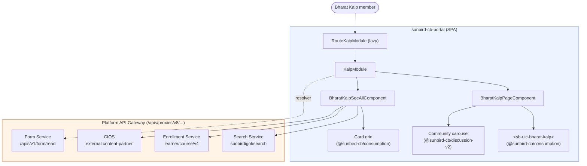

# Bharat Kalp — HLD

Reverse-engineered from `sunbird-cb-portal` (`origin/cbrelease-4.8.40`, commit
`b80a6327`). Scope is the Bharat Kalp feature only.

## Topology

Bharat Kalp is a gated, time-boxed (week-by-week) learning program surfaced as
a microsite inside the portal, visible only to members flagged for it. There
is no box below labelled "Bharat Kalp service" because none exists — the
feature is one portal module composing existing platform APIs, and it provides
just two surfaces:

- A landing page with program hero/progress content (rendered by an external
  UI library component) plus a community-cards carousel.
- A "see all" content browser: search, week selector, content-type tabs,
  enrollment-status filters, paginated card grid.

All backend calls go through the portal's existing API gateway/proxy layer
(`/apis/proxies/v8/...`); there is no separate Bharat Kalp backend service —
it composes existing platform APIs (form config, search, enrollment,
content-partner) into one feature module. Access is restricted by a
user-profile attribute rather than a build-time feature flag: the program is
cohort-specific, not a rollout toggle.

## Responsibilities

| Module | Responsibility |
|---|---|
| `src/app/routes/route-kalp.module.ts` | Thin app-shell wrapper; owns nothing feature-specific — just re-exports the library module for lazy loading |
| `project/ws/app/src/lib/routes/kalp/kalp.module.ts` (`KalpModule`) | Declares the two feature components, wires Material UI, community/consumption UI libraries, and a **feature-local** ngx-translate loader |
| `BharatKalpFormService` | Single source of the program's configuration (`bkConfig`, `sectionList`, `weekProgress`) fetched once per session and cached |
| Home page integration (`Home2ResolverService`, `InSpotlightV2Component`) | Conditionally injects/removes the Bharat Kalp spotlight card |
| `InSightSideBarComponent` | Notification banner entry point into the feature |

The feature deliberately does **not** own its content-rendering primitives —
the landing page hero and card rendering are delegated to shared UI library
components (`@sunbird-cb/consumption`, `@sunbird-cb/discussion-v2`) that are
versioned and released independently of this repo.

**Not present in this repo** (external, out of scope for this trace): the
internal implementation of `<sb-uic-bharat-kalp>`, `<sb-uic-card-portrait>`,
`<sb-uic-card-portrait-ext>` and `<d-v2-community-card>`, which live in the
`@sunbird-cb/consumption` and `@sunbird-cb/discussion-v2` packages; the
backend services themselves (form config authoring UI, search indexing,
enrollment, CIOS integration), of which only the portal-side consumption is
documented here; and the content-authoring workflow that produces the
`bkConfig`/`weekProgress` JSON.

## Key design decisions

- **Composition over ownership.** The module hosts external Angular
  Elements/library components (`<sb-uic-bharat-kalp>`,
  `<d-v2-community-card>`, `<sb-uic-card-portrait>`) rather than building UI
  natively. This keeps look and behaviour consistent with the rest of the
  platform and leaves less code to maintain here, but this repo cannot fully
  control or observe those components' internal behaviour (loading states,
  telemetry) — they are black boxes from this codebase's point of view, and a
  version bump to either package can change the feature with no commit here.
- **Access hangs on one profile attribute.** There is no
  environment or config-based feature flag; membership is entirely
  user-attribute driven. Appropriate for a cohort-restricted program rather
  than a staged rollout, but it means enabling or disabling the feature for
  QA/staging requires backend profile data, not a config toggle.
- **Config-driven content, no domain model.** Weeks, tabs and content buckets
  are all shaped by a backend-authored JSON blob (`bkConfig`/`weekProgress`)
  consumed as `any`. The content team can reshape the program without a
  frontend release, at the cost of any compile-time safety: a malformed config
  silently degrades to an empty state rather than failing loudly.
- **Composed, not centrally orchestrated, data fetching.** Four independent
  REST calls (internal search, external/CIOS search, internal enrollment,
  per-item external enrollment) are triggered ad hoc from the see-all
  component rather than through a single orchestrating backend endpoint.
  Simpler to build, but it pushes fan-out and error handling entirely to the
  client — and external enrollment status costs one HTTP GET per item with no
  batching, which is fine for small weekly sets and a scaling concern once a
  week's `extCourses` list grows. See the data-fetching detail in the
  [LLD](lld.md).
- **Silent degradation by construction.** Every network call swallows errors
  and falls back to empty state, so the feature never crashes — but it also
  never tells anyone, with no user-facing error message, retry, or distinct
  error state to separate "nothing configured" from "something broke".
- **Config cached for the SPA's lifetime, not the session.** The form-config
  cache is an unkeyed singleton with no invalidation, tied to the SPA rather
  than the user — so config changes need a full reload. See the
  [Operations Manual](operations-manual.md) for the day-2 implication.
- **A feature-local i18n loader.** The module declares its own ngx-translate
  instance in addition to whatever the app shell configures — functionally
  isolated, but a duplicate-loader pattern worth revisiting.

See the [LLD](lld.md) for component detail and
sequence flows, and the [Operations Manual](operations-manual.md) for how
these decisions show up in day-2 support.

---

> **Verification boundary:** facts above are read from `sunbird-cb-portal`
> (`origin/cbrelease-4.8.40`, commit `b80a6327`). Not analysed from source:
> the Form Service, Search Service, Enrollment Service and CIOS
> (content-partner) service — behaviour inferred from the requests/responses
> the portal code sends and reads. The `@sunbird-cb/consumption` and
> `@sunbird-cb/discussion-v2` library components are also out of this repo's
> scope. Attach those repos to close the gaps.
