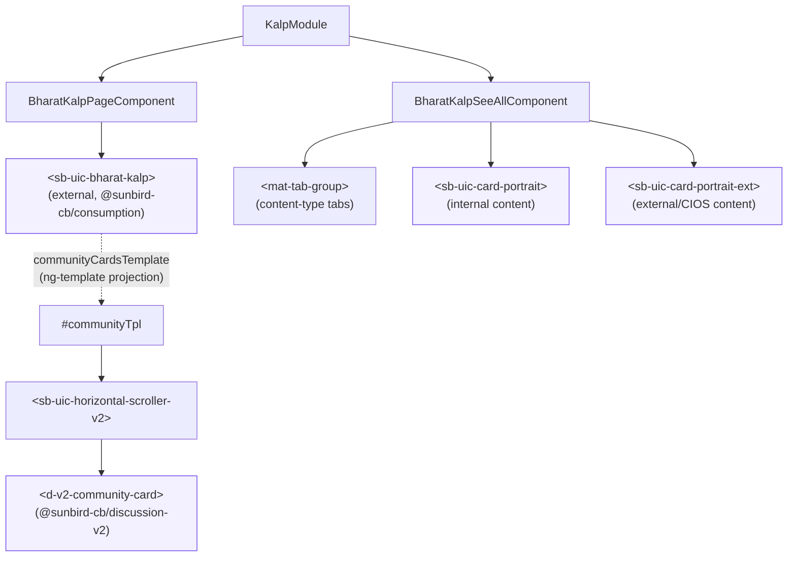
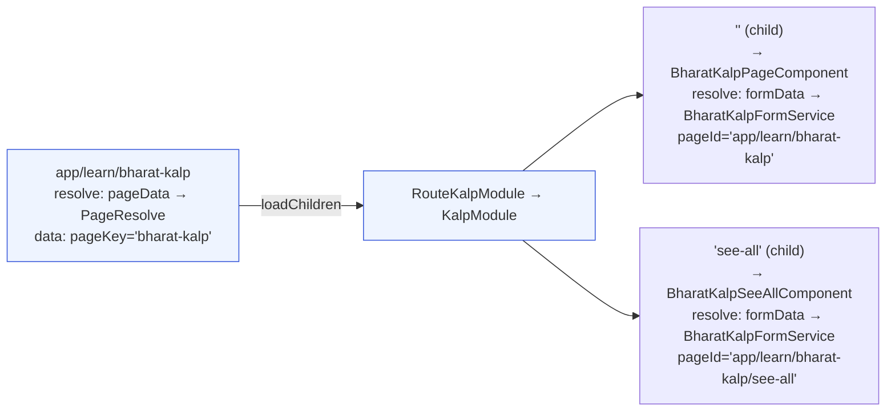
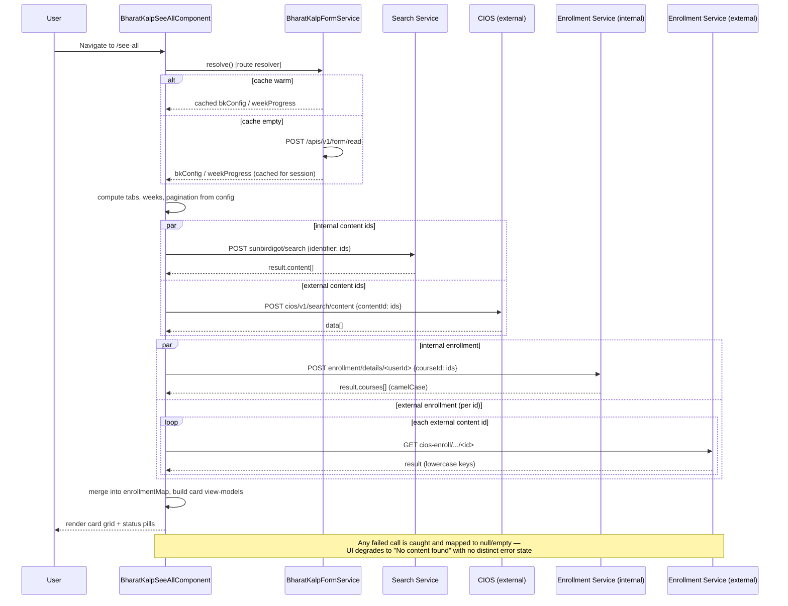

# Bharat Kalp — LLD

Reverse-engineered from `sunbird-cb-portal` (`origin/cbrelease-4.8.40`, commit
`b80a6327`). File paths below are relative to the repo root; companion to the
[HLD](hld.md).

## File inventory

### Feature module (`project/ws/app/src/lib/routes/kalp/`)
| File | Role |
|---|---|
| `kalp.module.ts` | NgModule: declarations, imports (Material, `CommunityCardModule`, `BharatKalpModule`/`CardsModule`/`HorizontalScrollerV2Module`, feature-local `TranslateModule.forRoot`), `CUSTOM_ELEMENTS_SCHEMA` |
| `kalp-routing.module.ts` | Child routes `''` and `'see-all'`, both resolving `formData` via `BharatKalpFormService` |
| `bharat-kalp-form.service.ts` | Fetches and caches program configuration |
| `bharat-kalp/bharat-kalp.component.ts` / `.html` | Landing page: hosts `<sb-uic-bharat-kalp>`, community carousel |
| `bharat-kalp-see-all/bharat-kalp-see-all.component.ts` / `.html` | Content browser: search, week filter, tabs, status pills, pagination |

### App-shell integration
| File | Role |
|---|---|
| `src/app/routes/route-kalp.module.ts` | Wraps `KalpModule` for the app-level lazy route |
| `src/app/app-routing.module.ts` (route entry `app/learn/bharat-kalp`) | Registers the lazy route, resolver, route data |
| `src/app/home/home-v2/home-v2-resolver.service.ts` | Filters the home spotlight config to hide the Bharat Kalp card for non-members |
| `src/app/home/home-v2/in-spotlight-v2/in-spotlight-v2.component.ts` | Conditionally renders the spotlight card |
| `src/app/component/in-sight-side-bar/in-sight-side-bar.component.ts` | Notification banner click/visibility handling for `bharat-kalp` |
| `src/app/component/root/root.component.ts` | Full-width mobile layout special-casing for the landing route |

## Component tree


*Purple nodes are external library components — opaque to this repo, versioned
via `@sunbird-cb/consumption` and `@sunbird-cb/discussion-v2`.*

## Routing table



## Component detail

### `BharatKalpPageComponent` (landing page)

- Reads `route.snapshot.data.formData.data.result.form.data` → destructures
  `sectionList`, `individualSection` (carries `weekProgress`), `bkConfig`.
- Renders `<sb-uic-bharat-kalp [sectionList] [bkConfiguration]
  [individualSection] [communityCardsTemplate]>`, projecting a `<ng-template
  #communityTpl let-loading let-communities>` that renders:
  - loading: `<sb-uic-horizontal-scroller-v2 [fetching]="true">` skeleton
  - loaded: horizontal scroller of `<d-v2-community-card>` per community
  - empty: "No communities available" message
- Card click handler navigates to
  `/app/discussion-forum-v2/community/<communityId>`.
- Community data itself is supplied by the external `<sb-uic-bharat-kalp>`
  component (not fetched in this repo) — this component only supplies the
  *template* for rendering it.

### `BharatKalpSeeAllComponent` (content browser)

**Inputs derived from resolver data:**
- `bkConfig.startDate` / `endDate` → parsed by `_parseBkDate()` (heuristic:
  treats a 3-part, dash-separated string with a 4-digit third segment as
  `DD-MM-YYYY`; otherwise falls back to native `Date` parsing) → used to
  compute `totalWeeks` and `currentWeek`.
- `individualSection.weekProgress.weeks.tabs[]` → each week: `{ id, name,
  content_ids: { [tabKey]: string[] } }`.
- `individualSection.weekProgress.exploreContent.tabs` → localized tab labels,
  keyed by tab id, with `<lang>Text` fields; falls back to
  `localStorage.getItem('websiteLanguage')` for the active language key rather
  than `TranslateService`.

**Derived UI state:**
- Content-type tabs are computed dynamically — a tab is shown only if the
  currently selected week(s) has ≥1 id under that tab key.
- Status pills (All/In Progress/Completed/Not Started) are hidden entirely
  when the active tab is a resource tab (resources are not enrollable).
- Pagination: page size selector (10/20/50/100), page-number control with
  ellipsis compression for large page counts.

**Data fetching (all via `HttpClient`, all `catchError(() => of(null))`):**

| Call | Method & Path | Request body | Response shape read |
|---|---|---|---|
| Internal content search | `POST /apis/proxies/v8/sunbirdigot/search` | `{ locale: ["en"], request: { filters: { identifier: [...ids] }, limit: ids.length + 5 } }` | `res.result.content[]` |
| External content search | `POST /apis/proxies/v8/cios/v1/search/content` | `{ filterCriteriaMap: { "contentPartner.isActive": true, contentId: [...ids] }, requestedFields: [], pageNumber: 0, pageSize: ids.length+10, orderBy: "createdOn", searchString: "", facets: [...] }` | `res.data[]` |
| Internal enrollment status | `POST /apis/proxies/v8/learner/course/v4/user/enrollment/details/<userId>` | `{ request: { courseId: [...ids] } }` | `res.result.courses[]` — camelCase (`courseId`, `identifier`, `contentId`, `completionPercentage`) |
| External enrollment status | `GET /apis/proxies/v8/cios-enroll/v1/readby/useridcourseid/<id>` (one call **per id**, no batching) | — | `res.result` flat, **lowercase** keys (`completionpercentage`, `courseid`) — a different shape from the internal API; merged into `enrollmentMap` via spread so earlier responses aren't clobbered |

**Card view-model** produced for both search results: `{ content, cardSubType:
'standard', context: { pageSection: 'bharat-kalp-see-all', position },
stateData: {} }`.



**Navigation on card click:**
- Resource content type → `/app/amrit-gyaan-kosh/player/...` (internal player
  route)
- External (`extCourses`) content → `/app/toc/ext/<contentId>`
- All other content types → `/app/toc/<identifier>/overview`

### `BharatKalpFormService`

```ts
resolve(route): Observable<IResolveResponse<any>>
```
- In-memory `_cache` field (module singleton, `providedIn: 'root'`), returned
  directly on any call after the first success — no TTL, no key by
  user/session/pageKey.
- Delegates to `FormExtService.formReadData(...)` → `POST /apis/v1/form/read`
  with:
  ```json
  { "request": { "type": "<route.data.pageKey || 'bharat-kalp'>", "subType": "microsite", "action": "page-configuration", "component": "portal", "rootOrgId": "*" } }
  ```
- On error: returns `{ data: null, error }` rather than throwing — downstream
  components must always null-check `formData?.data?.result?.form?.data`.

## Program membership

Visibility of the feature is driven by one profile attribute,
`unMappedUser.profileDetails.additionalProperties.isBharatKalpMember`. There
is no environment or config-based feature flag — the program is entirely
user-attribute driven, presumably set by an out-of-band
enrollment/eligibility process on the backend. The home spotlight card and
the notification banner are shown only for members.

## Module wiring detail

`kalp.module.ts`:
- `CUSTOM_ELEMENTS_SCHEMA` is required because the templates reference
  unregistered custom elements (`<sb-uic-bharat-kalp>`,
  `<d-v2-community-card>`, `<sb-uic-card-portrait>`,
  `<sb-uic-card-portrait-ext>`) supplied by imported library modules.
- Declares its own `TranslateModule.forRoot()` with a fresh
  `KalpHttpLoaderFactory` (an `HttpClient`-backed `TranslateHttpLoader`) —
  this is a **separate loader instance** from whatever the app shell
  configures at the root. Translation keys used by this feature (e.g.
  `home.spotlightCards.bharatKalp` used elsewhere in
  `in-spotlight-v2.component.ts`) must resolve correctly under both loader
  instances; verify no duplicate network fetch of the same i18n asset and no
  key-namespace collision.

## Layout coupling

`root.component.ts`:
- `fullWidthMobileRoutes` array hardcodes `/app/learn/bharat-kalp` (line ~115)
  to force edge-to-edge mobile layout for the landing page only.
- `isFullScreenBharatKalp` (lines ~292-295) does an **exact-match** (not
  prefix) check against the current URL — so `/app/learn/bharat-kalp/see-all`
  intentionally does *not* get the full-screen treatment. Any new route added
  under the Bharat Kalp module must be deliberately added here if the same
  layout behavior is desired — it will not inherit automatically.

## Data contracts consumed (informal — no TS interfaces exist)

Because there is no dedicated `IBharatKalp*` type file, the following shapes
are implicit contracts with the Form Service backend. Treat as the source of
truth for schema validation on the CMS/authoring side:

```
form.data:
  sectionList: any[]                       // passed through to <sb-uic-bharat-kalp>, opaque to this repo
  bkConfig:
    startDate: string                      // "DD-MM-YYYY" or JS Date-parseable
    endDate: string                        // same
    totalWeeks: number
  individualSection:
    weekProgress:
      weeks:
        tabs: Array<{
          id: string                       // e.g. "week_1"
          name: string
          content_ids: { [contentTypeKey: string]: string[] }
        }>
      exploreContent:
        tabs: {
          [tabId: string]: { [langKey: string /* e.g. "enText" */]: string }
        }
```

## Recommendations carried forward (design debt, not bugs to silently fix)

1. Batch the per-item external enrollment GET calls if a week's `extCourses`
   list is expected to grow (see Component detail).
2. Introduce typed interfaces for the `bkConfig`/`weekProgress` contract (see
   Data contracts consumed) to catch malformed CMS-authored config at
   compile/runtime instead of silently degrading to empty UI.

---

> **Verification boundary:** facts above are read from `sunbird-cb-portal`
> (`origin/cbrelease-4.8.40`, commit `b80a6327`) — file paths,
> request/response
> shapes and line numbers cited throughout are from that repo. Not analysed
> from source: the Form Service, Search Service, internal and external
> (CIOS) Enrollment Services — their response shapes are documented as read
> by the portal code, not verified against their own implementations. Attach
> those repos to close the gaps.
