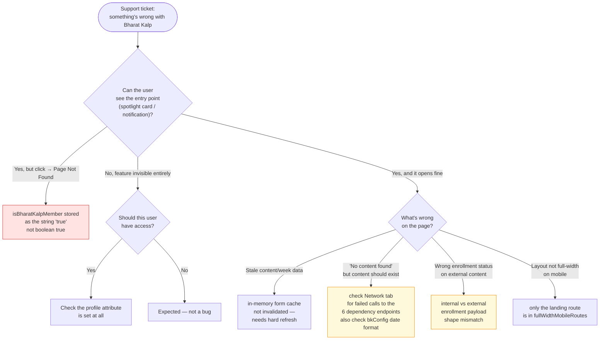

# Operations Manual — Bharat Kalp

How to operate, support and troubleshoot Bharat Kalp as it exists today — a
cohort-gated microsite with no backend of its own, composed from existing
platform services. Verified against `sunbird-cb-portal`
(`origin/cbrelease-4.8.40`, commit `b80a6327`); companion to the
[HLD](hld.md) and [LLD](lld.md).

## System overview

Bharat Kalp is a cohort-gated, week-based learning microsite at
`app/learn/bharat-kalp` (landing) and `app/learn/bharat-kalp/see-all` (content
browser). Access is controlled purely by a backend user-profile attribute —
there is **no environment config flag** to toggle the feature on/off
portal-wide.

## Important fields

| Field | Meaning | Why it matters |
|---|---|---|
| `…additionalProperties.isBharatKalpMember` | Membership flag on the user profile | The only thing gating the whole feature; boolean `true` vs the string `"true"` behaves differently (see below) |
| `bkConfig.startDate` / `endDate` | Program window, `DD-MM-YYYY` or `Date`-parseable | Feeds the week calculation; malformed values silently produce wrong or empty weeks |
| `bkConfig.totalWeeks` | Declared number of weeks | Drives the week selector alongside the dates |
| `individualSection.weekProgress.weeks.tabs[]` | Per-week `{ id, name, content_ids }` | The actual content of each week; an empty `content_ids` bucket is indistinguishable from a failed call in the UI |
| `individualSection.weekProgress.exploreContent.tabs` | Localized tab labels, keyed by tab id | Missing a `<lang>Text` entry leaves a tab unlabelled |
| `sectionList` | Passed through to the landing hero component | Opaque to this repo — shape is owned by `@sunbird-cb/consumption` |

All of these are authored on the Form Service side (`type: <pageKey>`,
`subType: microsite`, `action: page-configuration`) and are consumed untyped,
so none of them is schema-validated before it reaches the browser.

## How access is granted and revoked

Controlled entirely by:
`unMappedUser.profileDetails.additionalProperties.isBharatKalpMember` on the
user's profile (backend-managed, outside this repo).

- To grant a user access: set this attribute to boolean `true` in their
  profile record.
- To revoke: unset or set to `false`.
- **Caution:** do not set it to the string `"true"` — the route guard
  (`bharat-kalp.guard.ts`) only accepts a strict boolean `true`. A string
  value will cause the user to see the entry point (home spotlight card,
  notification banner) but be redirected to `/page-not-found` when they
  actually click through, since three other visibility checks in the codebase
  accept `'true'` while the guard does not. This is the single most likely
  source of "I can see it but can't open it" support tickets for this feature
  — see the troubleshooting guide below.
- There is no admin UI in this repo for toggling the attribute; it must be set
  via whatever backend/profile-service tooling manages `additionalProperties`.

## Where the feature surfaces

| Surface | Condition | File |
|---|---|---|
| Home page spotlight card | Member only | `in-spotlight-v2.component.ts`, `home-v2-resolver.service.ts` |
| Notification banner | Member only (re-checked on click) | `in-sight-side-bar.component.ts` |
| Direct/deep link to `app/learn/bharat-kalp` | Guarded (`GeneralGuard` + `BharatKalpGuard`) | `app-routing.module.ts` |

If a user reports the feature "disappeared," check (a) whether their profile
attribute changed, and (b) whether `GeneralGuard`'s broader
account-restriction logic is blocking them for an unrelated reason (account
status, not Bharat Kalp specific).

## Dependencies to watch

Bharat Kalp has no dedicated backend of its own — it composes existing
platform services. An outage or contract change in any of these directly
degrades the feature:

| Service | Endpoint | Impact if down/erroring |
|---|---|---|
| Form Service | `POST /apis/v1/form/read` | Entire feature breaks — no `bkConfig`/week data resolves; landing page and see-all render with nothing to show (no error banner surfaces to the user — see the troubleshooting guide) |
| Search Service | `POST /apis/proxies/v8/sunbirdigot/search` | Internal course/program/resource cards fail to load in see-all; grid appears empty |
| Content-Partner (CIOS) Search | `POST /apis/proxies/v8/cios/v1/search/content` | External-course tab appears empty |
| Enrollment Service (internal) | `POST /apis/proxies/v8/learner/course/v4/user/enrollment/details/<userId>` | Status pills (In Progress/Completed/Not Started) default to "Not Started" or don't filter correctly |
| Enrollment Service (external/CIOS) | `GET /apis/proxies/v8/cios-enroll/v1/readby/useridcourseid/<id>` (one call per content id) | Same as above, scoped to external content only; a week with many external items generates a burst of individual GETs — watch for rate-limiting or latency under load |

Also depends on shared UI libraries `@sunbird-cb/consumption` (landing page
hero, card rendering) and `@sunbird-cb/discussion-v2` (community cards) — a
version bump to either can change Bharat Kalp's rendered behavior without any
change in this repo's own commit history. When triaging a visual/behavioral
regression, check the installed version of these packages first
(`package.json`) before assuming the bug is local to the Bharat Kalp files.

## Troubleshooting guide

### "User can see the Bharat Kalp card/notification but gets 'Page Not Found' on click"
Root cause: `isBharatKalpMember` is likely stored as the string `"true"`
instead of boolean `true` for that user. Fix at the profile-data source; see
How access is granted and revoked.

### "User sees stale week/content data after we updated the program config"
`BharatKalpFormService` caches the form-read response in memory for the
lifetime of the SPA session (`_cache` field, no TTL, `providedIn: 'root'`). A
full page reload (not just in-app navigation) is required to pick up new
config. If multiple users share a browser/kiosk session and switch accounts
without a full reload, the second user may see the first user's cached config
— advise a hard refresh after login in shared-device scenarios until this is
fixed (see the [LLD](lld.md) recommendations for the proposed engineering
fix).

### "Grid shows 'No content found' but content should exist"
Every API call in this feature (`form/read`, internal search, CIOS search,
both enrollment lookups) silently swallows errors and falls back to an
empty/partial result — there is no distinct error state shown to the user, and
no client-side console error guaranteed to surface clearly. To diagnose:
1. Check browser DevTools Network tab for non-2xx responses on the six
   endpoints listed under Dependencies to watch.
2. Check that the `bkConfig.startDate`/`endDate` values are in `DD-MM-YYYY`
   format or otherwise `Date`-parseable — malformed dates silently produce
   wrong `totalWeeks`/`currentWeek` calculations (`_parseBkDate`,
   `bharat-kalp-see-all.component.ts`), which can make the week selector show
   wrong or empty weeks.
3. Check that `weekProgress.weeks.tabs[].content_ids` actually contains ids
   for the selected week/tab combination — an empty array is indistinguishable
   from a backend error in the UI.

### "External course enrollment status looks wrong"
The external (CIOS) enrollment endpoint returns a different, lowercase-keyed
shape (`completionpercentage`, `courseid`) than the internal enrollment
endpoint (camelCase `completionPercentage`, `courseId`). If a future backend
change normalizes these to match, the merge logic in
`bharat-kalp-see-all.component.ts` (`enrollmentMap` construction) must be
updated in lockstep or status pills will silently stop working for external
content.

### "Layout looks wrong / not full-width on mobile"
Only the landing page (`app/learn/bharat-kalp`, exact match) is configured for
full-width mobile layout, in `root.component.ts`. The `see-all` page is
intentionally excluded. If a new Bharat Kalp route is added and expected to
have the same full-width treatment, it will not get it automatically — must be
added to `fullWidthMobileRoutes` explicitly.

## Monitoring recommendations

Since none of this feature's API calls currently emit telemetry/logging on
failure (all `catchError` paths are silent), standard portal-wide API
monitoring (gateway-level error rates/latency dashboards) is the only current
signal for degradation of this feature. Recommend adding:
- Client-side telemetry event on `catchError` paths in
  `bharat-kalp-see-all.component.ts` and `bharat-kalp-form.service.ts`, tagged
  distinctly from generic search/enrollment calls, so Bharat Kalp-specific
  failures are visible separately from portal-wide API health.
- A synthetic check that a known test member account can load
  `app/learn/bharat-kalp/see-all` and see ≥1 content tab, to catch form-config
  authoring errors before real users do.

## Release and deploy notes

- No environment-specific configuration exists for this feature (confirmed: no
  "kalp" references in any `src/environments/environment*.ts` file) —
  deploying this branch to any environment exposes the feature to any user
  whose profile has the member attribute set, with no additional environment
  gating.
- The feature's translation strings are loaded via a feature-local
  `ngx-translate` HTTP loader, separate from the app-shell's loader. When
  adding/updating translation keys for Bharat Kalp UI text, confirm the
  relevant i18n asset is deployed and reachable at the path this loader
  expects, independently of the app-shell's i18n asset location.
- The module is lazy-loaded (`route-kalp.module.ts` → `KalpModule`), so a
  broken build of just this module surfaces as a chunk-load failure only when
  a member navigates to `app/learn/bharat-kalp` — it will not fail the app
  shell's initial load or affect non-member users.

## Known operational constraints

See the [LLD](lld.md) recommendations for the engineering-facing version of
these:
1. Inconsistent truthy-check for `isBharatKalpMember` across 4 call sites (see
   How access is granted and revoked, and the troubleshooting guide).
2. Unbounded, non-invalidated in-memory config cache (see the troubleshooting
   guide).
3. No batching on per-item external enrollment lookups — potential burst-load
   concern for weeks with many external courses (see Dependencies to watch).
4. No typed data contracts for CMS-authored `bkConfig`/`weekProgress` —
   malformed config degrades silently rather than failing loudly (see the
   troubleshooting guide).

## Escalation

Owners below are functional, derived from the dependency list — no named team
or on-call rotation for this feature was found in the traced repo.

| Issue type | Owner | Escalate when |
|---|---|---|
| Member can't see or can't open the feature | Profile / user-service owner | The profile attribute is set as expected but access still behaves wrongly |
| Wrong or empty weeks, wrong tab labels | Form Service / CMS config owner | The authored `bkConfig`/`weekProgress` looks right but the page disagrees |
| Internal content or enrolment status missing | Platform search / enrolment team | The six dependency endpoints return non-2xx or unexpected shapes |
| External (CIOS) content or status missing | Content-partner integration owner | CIOS search or `cios-enroll` fails, or its response shape changes |
| Hero, cards or community carousel render wrongly | UI library owners (`@sunbird-cb/consumption`, `@sunbird-cb/discussion-v2`) | Behaviour changed with no commit in this repo — check the installed package versions first |
| Routing, guard or layout bugs | Web portal team | The failure is in this repo's own module rather than a dependency |

Before escalating, capture: the user's id and whether their profile attribute
is boolean or string, the selected week and tab, and the DevTools Network log
for the six dependency endpoints — all of this feature's failures are silent,
so that log is usually the only evidence.

---

> **Verification boundary:** operational facts above (guard behaviour, cache
> lifetime, dependency endpoints, environment config) are read from
> `sunbird-cb-portal` (`origin/cbrelease-4.8.40`, commit `b80a6327`). Not
> verified: no dashboards, alerts, or on-call rotation were found for this
> feature specifically — the monitoring recommendations above are proposed,
> not existing, instrumentation. Attach the observability/infra repo or
> dashboard config to close this gap.
