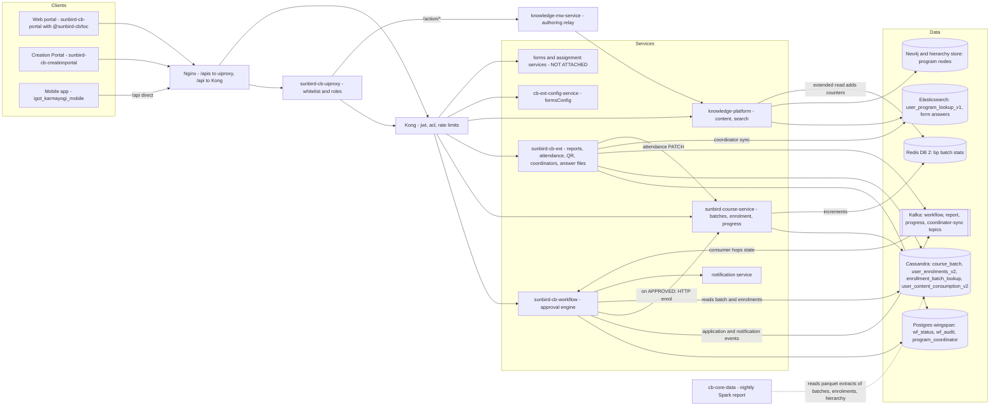

# Blended Program — High-Level Design

Reverse-engineered from `sunbird-cb-portal`, `sb-cb-ui-components`,
`sunbird-cb-creationportal`, `igot_karmayogi_mobile`, `sunbird-cb-workflow`,
`sunbird-course-service`, `sunbird-cb-ext`, `knowledge-platform`,
`cb-core-data`, `cb-ext-config-service` and `sunbird-devops` (commits on the
[overview](index.md)).

A Blended Program is a **content-model overlay plus an approval workflow**,
not a service of its own. The program is an ordinary course collection
(`primaryCategory = courseCategory = "Blended Program"`); the only
Blended-Program-aware code is in the workflow service, the course service's
enrolment/batch actors, `sunbird-cb-ext` (reports, attendance, QR,
coordinators) and two small spots in `knowledge-platform` (coordinator-scoped
search and per-batch counters on extended read).

## Topology

## Responsibilities

| Component | Owns | Repo |
|---|---|---|
| Web portal + `@sunbird-cb/toc` | The program page: batch picker, profile / survey / confirm gates, status messages, seat chips, start gating, sessions, attendance **display**, learner assignments | `sunbird-cb-portal` + `sb-cb-ui-components › sb-cb-ui-toc` |
| Creation Portal | Authoring (create → review → publish), batches and sessions, co-trainers and coordinators, the PC request console, nomination, attendance marking, assignments (create / evaluate), reports, QR PDFs | `sunbird-cb-creationportal` (+ `collection-v2` package) |
| Mobile app | Learner flow only: batch picker, gates, withdraw, QR self-enrol, **QR + geofenced attendance**, assignments. No approver, nominate or batch-admin screens | `igot_karmayogi_mobile` |
| uiproxy | Browser-side whitelist and role lists per route; `/action/*` authoring relay; multipart bulk-CSV special case | `sunbird-cb-uiproxy` (not pinned) |
| Workflow service | The `wf_status` row and its state hops, seat / start-date / schedule checks, nomination, QR enrol, CSV bulk approve, emails, the callback that writes the enrolment | `sunbird-cb-workflow` |
| Course service | Batch create / update / delete, the enrolment record, progress writes (incl. session attendance), bulk enrol, per-batch Redis counter | `sunbird-course-service` |
| `sunbird-cb-ext` | Attendance entry point and email, report generation, session / self-enrol QR PDFs, assignment answer files, Program Coordinator service and its search-index sync | `sunbird-cb-ext` (served as `sb-cb-ext-service`, by path match) |
| `knowledge-platform` | Generic content lifecycle; `/v4/bp/search` coordinator filter; Redis batch counters merged into extended read | `knowledge-platform` |
| `cb-ext-config-service` | `formsConfig` rows (the TOC page config comes from here or from a static `feature/toc.json`). **Holds no Blended Program configuration in code** | `cb-ext-config-service` |
| `cb-core-data` | Nightly `BlendedProgramReport.csv` per MDO / CBP provider and the `bp_enrolments` warehouse table | `cb-core-data` |
| Forms / assignment services, `cb-ext-course-service`, `sb-cb-ext-service`, `sunbird-content-service` | Assignment draft / submit / evaluate and notification templates; form submissions | **not attached** |

## Key design decisions

**The batch is the workflow application.** `application_id = batchId` on the
`wf_status` row. The approver queue, seat counts and the learner's "current
request" are all scoped by batch, and the portals pick *the latest request
across all batches* as the one that drives the UI.

**Approval topology is data, not code.** Which states exist, which action
leads where, and who is named per action is read at runtime from the LMS
`system_settings` table (keys `oneStepMDOApproval`, `oneStepPCApproval`,
`twoStepMDOAndPCApproval`, `twoStepPCAndMDOApproval`; legacy
`wfBlendedProgramServiceConfig`). The approval type is a **program** field
(`wfApprovalType`). The workflow service parses the roles list but never
enforces it — authorisation lives in the uiproxy whitelist and Kong ACLs.

**Enrolment is a callback, so it is asynchronous and can diverge.** An
`enrol` call returns as soon as a row exists; a Kafka consumer moves it to the
first approval state; on `APPROVED` the workflow service makes an HTTP call to
the course service to write the enrolment. If that call fails or the batch
has since filled, the row stays `APPROVED` with no enrolment (generic path)
or is reverted to `SEND_FOR_PC_APPROVAL` (Blended Program endpoint).

**Two shortcuts skip the approval route**, and so carry their own checks:
*nomination* writes an `APPROVED` row directly (role-precedence override of
earlier requests, hard cap, schedule check, 200-user cap) and *QR
self-enrolment* writes `APPROVED` and calls the course service
synchronously (self-enrolment flag, start-date window, one batch per course).

**Seat enforcement is layered and uneven.** Client: display only. Workflow
service: soft cap (size + 20%) on requests, hard cap on approvals and
nominations. Course service: caps only the bulk-enrol paths; its
single-user Blended Program enrol and the learner `/v2/course/enroll` do not.
`currentBatchSize` must be a **string** in `batch_attributes`.

**Attendance is a progress write.** There is no attendance table. Marking
someone present writes `status 2 / 100%` on the session node's content
state; the Spark report and the learner's session card both read that
status. The coordinator path is asynchronous (Kafka → course service),
the mobile path writes the generic progress endpoint directly.

**The coordinator's view is a lookup, not a filter in code.** `/v4/bp/search`
adds an Elasticsearch terms-lookup: only programs whose id is in the
caller's document in `user_program_lookup_v1`, which `sunbird-cb-ext` keeps in
step with its `program_coordinator` Postgres table via a Kafka sync topic.
A coordinator with no document sees nothing.

**Authoring bypasses Kong.** The Creation Portal's `/action/*` calls go from
the uiproxy straight to `knowledge-mw-service`, so Kong's ACL, rate and size
plugins do not apply to program create / update / publish.

**Reports are asynchronous by construction, and there are two worlds.** The
in-product Enrollment (v1) and Consumption (v2) reports are built on demand
from `wf_status` + Cassandra by a Kafka consumer in `sunbird-cb-ext`; the
attendance picture exists only in the nightly Spark job.

## Honest gaps

- The deployed state machine (the `system_settings` rows) is not in any repo.
- No MDO-side screen was found in the attached UI repos even though the
  workflow endpoints and role whitelist for MDO exist.
- Completion rules ("online *and* offline sessions required") and
  certificate issuance run in downstream event jobs (Flink / Samza style) that
  were not attached; course-service has no Blended-Program completion branch.
- The assignment lifecycle and the notification templates are outside the
  attached repos.

> **Verification boundary:** facts above are read from the repos named at
> the top. Not analysed from source: `sb-cb-ext-service` and
> `sunbird-content-service` (could not be resolved to a cloneable repo),
> the forms service, `cb-ext-course-service`, the Kafka consumer jobs behind
> course completion and certificates, and the deployed `knowledge-mw-service`
> (the attached checkout is a 2021 `master`). The uiproxy read is a sibling
> clone at `175d24c4`, not a pinned commit. Linking `sunbird-cb-workflow` to
> the Kong upstream `workflow-handler-service` is by port and controller
> path, not by an image reference. Platform context:
> [Content Lifecycle](../../platform/content-lifecycle.md) and
> [API Gateway](../../platform/api-gateway.md).
