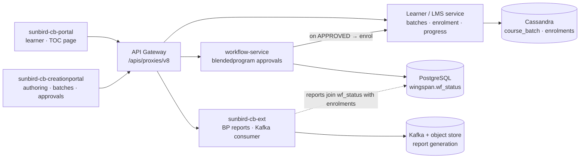

# Blended Program — High-Level Design

A Blended Program is an ordinary course collection
(`primaryCategory = "Blended Program"`) whose **enrolment is indirected
through an approval workflow**. The defining decision:

> A learner never writes to the enrolment table directly; only an approved
> workflow does.

## Topology

## Responsibilities

| Component | Owns | Repo |
|---|---|---|
| Portal (TOC module) | Batch cards, conflict & seat checks, survey gating, state display, approver consoles | `sunbird-cb-portal` + `sb-cb-ui-toc` |
| Creation Portal | Authoring (create→review→publish), batch CRUD with full `batchAttributes`, nomination & bulk enrol, request console, sessions & attendance, certificate templates | `sunbird-cb-creationportal` |
| workflow-service | The `blendedprogram` workflow: state machine, approval routing, transition validation; persists to `wf_status` | *not in the attached set — contract inferred from clients* |
| Learner / LMS service | Batch create/read/list, the enrolment record once approved, progress, certificates | Sunbird LMS (upstream) |
| cb-ext-course-service | Progress state read/update, assignment notifications | `cb-ext-course-service` |
| sunbird-cb-ext | Async BP reports: role validation, tracking rows, Kafka-driven generation | `sunbird-cb-ext › bpreports` |

## Key design decisions

**The batch is the workflow application.** `applicationId = batchId`,
`serviceName = "blendedprogram"` — one live application per learner per batch,
and the approver queue is naturally scoped by batch.

**Approval topology is configuration, not code.** Four approval types
(one-step MDO, one-step PC, two-step in either order) select the state route
at runtime; a new topology is workflow config, not a portal release.

**Reports are asynchronous by construction.** Generation joins two datastores
(Postgres workflow state + Cassandra enrolment) and can be large, so the API
only enqueues; a Kafka consumer materialises the file and the client polls.

**Attendance is a progress write** — no separate attendance store. See
[LLD](lld.md#attendance--a-progress-write).
