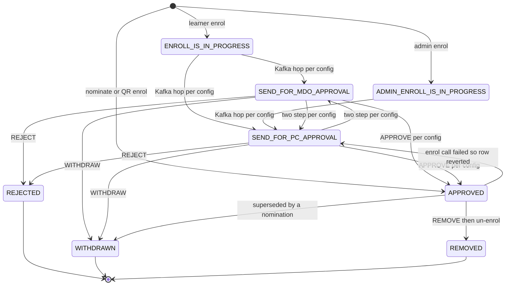
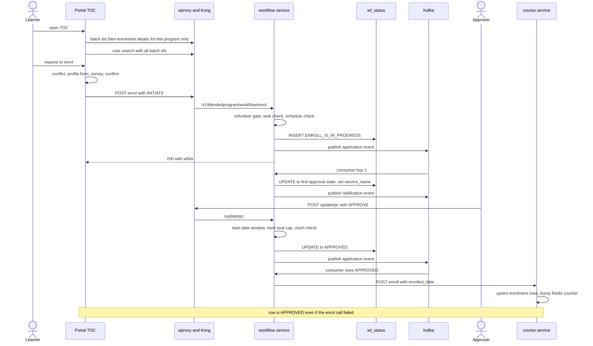

# Blended Program — Low-Level Design

Citations are `repo › path:line` at the commits on the [overview](index.md).
Abbreviations: **WF** = `sunbird-cb-workflow › src/main/java/org/sunbird/workflow/`
(main class `service/impl/BPWorkFlowServiceImpl.java`, **BPSI**; generic
engine `WorkflowServiceImpl.java`, **WSI**); **CS** = `sunbird-course-service`;
**EXT** = `sunbird-cb-ext`; **CP** = `sunbird-cb-creationportal`; **TOC** =
`sb-cb-ui-components › sb-cb-ui-toc/library/sunbird-cb/toc/src/lib`.

## 1 · The workflow row and its states

### What the code proves

The state machine itself (states, actions, next-state, roles) is **not in
any repo**: it is fetched at runtime from the LMS over HTTP,
`GET {lms.service.host}v1/system/settings/get/<key>`, with `<key>` one of
`oneStepMDOApproval`, `oneStepPCApproval`, `twoStepMDOAndPCApproval`,
`twoStepPCAndMDOApproval` (legacy fallback `wfBlendedProgramServiceConfig`),
and the value parsed as `{"wfstates":[{state, isStartState, isLastState,
isNotificationEnable, actions:[{action, nextState, roles[]}]}]}`
(BPSI:921-951; `application.properties:41-47`; `Constants.java:228-231`).
The approval type to use is the program's `wfApprovalType`
(read from content with `fields=primaryCategory,wfApprovalType,selfEnrollment`);
a blank value falls back to the literal `blendedprogram`.

What *is* proven in code is the persisted vocabulary and the transitions the
Java itself performs. The diagram shows **only** those; every arrow that
belongs to the configured route is drawn once, dashed, as "per config".



- `INITIATE` is an **action and request state** the clients send; it is not
  a stored status. The first stored status is `ENROLL_IS_IN_PROGRESS`
  (`BPSI:970`) or `ADMIN_ENROLL_IS_IN_PROGRESS` (`BPSI:607`).
- Which of the dashed arrows exists for a given approval type is **inferred**
  from the nominate switch (BPSI:1703-1721): `oneStepPCApproval` and
  `twoStepMDOAndPCApproval` end at `SEND_FOR_PC_APPROVAL → APPROVE`;
  `oneStepMDOApproval` and `twoStepPCAndMDOApproval` end at
  `SEND_FOR_MDO_APPROVAL → APPROVE`. The web client independently treats a
  two-step route as "withdraw blocked once the *second* approver's state is
  current" (`TOC › app-toc-banner.component.ts:878-894`).
- Whether `WITHDRAW` is accepted from `APPROVED`, `REJECTED` or `REMOVED`
  depends on the config JSON. The web client offers an auto-withdraw prompt
  from `REJECTED` / `REMOVED` once the batch has started; whether the server
  accepts it is a **boundary**.
- `service_name` in the row is the approval type after the first hop (not
  `blendedprogram`), which is why the web's `disableWithdrawnBtn` compares
  `wfItem.serviceName` to `twoStepMDOAndPCApproval` etc.

### Approval-type routing

| Approval type (`wfApprovalType`) | Final-step state (inferred from nominate) | UI success message (Creation Portal) |
|---|---|---|
| `oneStepPCApproval` | `SEND_FOR_PC_APPROVAL` | "Request is approved successfully!" |
| `oneStepMDOApproval` | `SEND_FOR_MDO_APPROVAL` | — (MDO UI not attached) |
| `twoStepMDOAndPCApproval` | `SEND_FOR_PC_APPROVAL` | "Request is approved successfully!" |
| `twoStepPCAndMDOApproval` | `SEND_FOR_MDO_APPROVAL` | "…Further needs to be approved by MDO admin." |

`wfApprovalType` is required at review / publish, chosen from
`${sitePath}/feature/batch-approval-workflow-config.json` (not in any repo),
and the control is disabled once the program is Live
(`CP › additional-details.component.ts:663-667`).

### `wingspan.wf_status` (PostgreSQL)

`WF › postgres/entity/WfStatusEntity.java`; native queries hard-code schema
`wingspan.`; DDL is not in the repo.

| Column | Meaning |
|---|---|
| `wf_id` (PK, UUID string) | One row per request |
| `userid` | The learner |
| `rootOrg`, `org` | Headers at creation |
| `actor_uuid` | Last actor (on create: the requester or nominator) |
| `current_status` | The state |
| `application_id` | **The `batchId`** |
| `in_workflow` | `false` once the next state `isLastState` (but see nomination, below) |
| `service_name` | `blendedprogram` at creation, then the approval type |
| `created_on`, `lastupdated_on` | Timestamps (queue ordering, report windows) |
| `update_field_values` | JSON of `wfRequest.updateFieldValues` |
| `dept_name`, `comment` | Org scoping; reject / conflict reason (emailed) |
| `modification_history` | JSON `[{modifiedDate, modifiedBy, action, role}]`, appended **only** when a `userId` header is present and action ∈ `wfstatus.allowed.action.for.modification.history.entry` = `REMOVE,REJECT,APPROVE` |
| `additional_properties` | `isNominatedByMdo:true\|false` (admin enrol) |
| `request_type` | Profile workflows only; unused by Blended Program |

`wingspan.wf_audit` receives the **incoming request's** state and action
(pre-transition) for every Kafka application message
(`WorkflowAuditProcessingServiceImpl.java:19-37`). `sunbird-cb-ext` reads
the same `wf_status` table through its own entity
(`bpreports/postgres/entity/WfStatusEntity.java`, `@Table(name="wf_status", schema="wingspan")`).

Other stores the workflow service reads (it **writes nothing to Cassandra**
for Blended Program):

| Store | Used for |
|---|---|
| `sunbird_courses.course_batch` (`batch_attributes` JSON string, `enrollment_enddate`, `start_date`, `end_date`) | Seat cap, start window, schedule clash |
| `sunbird_courses.enrollment_batch_lookup` (`active=true` rows) | Approved count |
| `sunbird_courses.user_enrolments_v2` | User's active enrolments (clash, "already enrolled") |
| `sunbird.user_roles` | `VOLUNTEER` check |
| `sunbird.email_template`, `<hierarchy keyspace>.content_hierarchy` | Email HTML and course name |
| ES `org_eligibility_alias` (doc id = rootOrg, field `courseids`) | Volunteer eligibility |

## 2 · Enrolment sequence (ordinary path)



Hop 1 (`handleEnrollmentRequest`, BPSI:881-913) re-reads the course's
`wfApprovalType`, loads that config, finds the state and action the client
named and writes the next state. An exception there is only logged and the
caller has already received 200, so a row can stay at
`ENROLL_IS_IN_PROGRESS` — and still counts toward the seat buffer.

### The enrolment call (`updateEnrolmentDetails`, BPSI:197-241)

1. Re-checks the **hard** seat cap; if it fails the method silently does
   nothing — the row stays `APPROVED` with no enrolment.
2. Body `{"request":{"userId","batchId":<applicationId>,"courseId"}}`, no auth
   token.
3. URL: course service `/v2/blended/program/admin/enroll` **only if** the
   payload `state == SEND_FOR_PC_APPROVAL` and `serviceName == "blendedprogram"`
   (it adds `enrolled_date` = the row's `created_on`); otherwise
   `/v2/course/admin/enroll`. Nominate (serviceName = approval type) and QR
   (state `APPROVED`) therefore use the generic endpoint.
4. Failure on the Blended Program endpoint → `reverseApprovedRequest` sets
   `current_status = SEND_FOR_PC_APPROVAL` (leaving `in_workflow` false).
   Failure on the generic endpoint is only logged.
5. `REMOVED` → `POST /v1/course/admin/unenroll`. `WITHDRAWN` and `REJECTED`
   **never** un-enrol.

## 3 · Validation inside the workflow service

### Seat capacity — `validateBatchEnrolment` (BPSI:302-322)

`size = batch_attributes.currentBatchSize` (a **string**; a JSON number throws
`ClassCastException`, is caught, and makes the batch read as full).
`approved = count(enrollment_batch_lookup where active=true)`.

| Phase | Rule |
|---|---|
| Any | `approved >= size` ⇒ full (so size 0 or absent is always full) |
| Request time (`ENROLL_STATE`: learner enrol, admin enrol, QR) | allowed iff `live requests < size + 20%` where `live requests` = `wf_status` rows for the batch whose status is **not** in `bp.batch.full.validation.exclude.states` (`REJECT,WITHDRAW,REJECTED,WITHDRAWN,REMOVED`) — so pending, approved and stuck `ENROLL_IS_IN_PROGRESS` all count. The buffer is `bp.batch.enrol.limit.buffer.size = 20` |
| Approval time (`UPDATE_STATE`: update, nominate, remove-approved, the enrol callback) | `approved < size`, no buffer |

### Start-date window (BPSI:378-413)

Skipped when the **action** is in the exclude list (`REJECT`, `WITHDRAW`).
If the request's `serviceName` is `blendedprogram` (or primaryCategory is
Blended Program), allowed iff the batch's IST start date ≥ today's IST date
(approval is still possible **on** the start day). Otherwise a strict
timestamp compare is used. `updateBPWorkFlow` does not put primaryCategory
in the map, so which branch runs depends on the `serviceName` the client
sends — **boundary**. `REMOVE` is not excluded, so removing an approved
learner after the batch starts, or while it is full, is refused.

### Schedule conflict (BPSI:692-743, 838)

Collects all the user's active `user_enrolments_v2` rows (any course — the
`INVITE_ONLY` filter is commented out), loads their batches' start / end,
and flags a conflict iff the **existing** batch's start or end lies inside
the target `[start, end]` (inclusive). A fully enclosing existing batch is
not detected. Used by learner enrol (HTTP 400), admin enrol (406, key
`message`), nominate (`SCHEDULE_CONFLICT`) and — importantly — on **every**
`updateBPWorkFlow` action except `REMOVE`: the action is rewritten to
`REJECT`, the comment set to `blended.program.enrol.conflict.reject.reason`,
the transition **executed**, and only then HTTP 400 returned. That can reject
a request on approve or withdraw, and for an already-enrolled learner the
check can collide with the learner's own enrolment in the same batch
(**boundary**: runtime).

### Other gates

| Gate | Behaviour |
|---|---|
| Volunteer eligibility | A user with the `VOLUNTEER` role whose rootOrg has no ES `org_eligibility_alias` doc listing the course gets HTTP 406 |
| `validateWfRequest` | Needs state, applicationId, actorUserId, userId, action, serviceName; `updateFieldValues` required unless action is `WITHDRAW` |
| Row lookup | Matched on `(rootOrg, org, applicationId, wfId)`; an unknown `wfId` hits an unguarded null (NPE → 500) at WSI:182 |
| Wrong state | `Application is in <X> State but trying to be move in <Y> state!` (400) |
| Unknown action / state | `No action found on given action!` / `No wf state found on given state!` (400) — case-sensitive |
| Error codes | `InvalidDataInputException`, `BadRequestException` → 400; `ApplicationException` → 500; no `@ControllerAdvice` |

## 4 · The shortcuts: nominate, QR enrol, admin enrol, remove

### Nominate (BPSI:1617-1804)

Actor role from the caller's profile (`organisations[].roles`):
`PROGRAM_COORDINATOR` or `BP_PROGRAM_TRAINER` → PC; `MDO_ADMIN` or
`MDO_LEADER` → MDO; anything else → HTTP 403. Per user, in this order:

1. Existing active rows for the batch (`in_workflow = true`): override
   matrix — same role never overrides, PC overrides MDO and self, MDO
   overrides only self. An overridden row is set `in_workflow=false`,
   `WITHDRAWN`, comment "Superseded by <ROLE> nomination" — directly, with
   **no Kafka, audit, un-enrol or email**. If it can't override: `ALREADY_EXISTS`.
2. Approval type from `wfApprovalType`; `blendedprogram` / blank →
   `INVALID_APPROVAL_TYPE` (nominate fails for programs without an approval
   type).
3. Start-date window then hard seat cap (`Batch Start Date Error`, `Batch Size
   Error`); already actively enrolled in the course → `ALREADY_EXISTS`;
   schedule clash → `SCHEDULE_CONFLICT`.
4. `persistApprovedStateDirectly` writes `APPROVED`, `in_workflow=true`
   (sic — nominated rows stay "in workflow"), comment "Auto-approved via
   nomination wrapper (PC final)", then publishes to both topics; the
   consumer's `APPROVED` branch calls the generic enrol endpoint.

Ordering defect: the override in step 1 happens **before** the checks in
3, so a nomination that then fails leaves the earlier row `WITHDRAWN` while
the learner's enrolment is still active. Not applied to nominate: volunteer
check, `selfEnrollment`, enrolment end date.

### QR self-enrol (`QrCodeSelfEnrolmentServiceImpl:52-155`)

Token → userId. Rejects: missing / blank ids, `selfEnrollment != "Yes"`,
batch not found, no dates, **now after the batch start date** (so enrolment
is allowed any time up to and including the start day — the constant that
says "only on the start date" is unused), already active in this batch, or
in another batch of the same course ("one batch of a course at a time"), seat
check (with buffer), an existing non-terminal request. Then writes `APPROVED`
(`in_workflow=false`, `updateFieldValues=[]`), calls `updateEnrolmentDetails`
**synchronously**, writes an audit row and returns 200. No Kafka, no
emails. Because `updateEnrolmentDetails` swallows failure (and re-checks the
hard cap), the response can say "successfully enrolled" with no enrolment.

### Admin enrol (BPSI:541-586) and remove

`POST /admin/enrol` takes a **list**: seat check, clash (406), then any
existing row for `(client serviceName, user, batch)` of any status →
"Not allowed to enroll the user to the Blended Program" (200); otherwise
action `INITIATE`, `ADMIN_ENROLL_IS_IN_PROGRESS`, `isNominatedByMdo:true`.
`POST /remove/approved/user` needs `applicationId`, `userId`, `courseId`;
errors: no rows (404), no `APPROVED` row (400), more than one `APPROVED`
row (500), unparsable stored `update_field_values` (500). It then runs
`updateBPWorkFlow` with action `REMOVE` and **actor = the learner's id**, so
`modification_history.modifiedBy` records the learner, not the admin.

### Bulk approval CSV (BPSI:1153-1424)

Export: `email, userName, wfId, userId, action(approve/reject)`, fixed temp
file `BP_user_approval_data_log.csv` (concurrent exports collide). Import:
`.csv` only; headers must contain the five names (case-insensitive, but cells
are then keyed by the *actual* header text, so a case difference passes
validation and later reads null); empty action → row skipped; other than
approve / reject → whole file 400; role chosen from the row's current state
(`SEND_FOR_MDO_APPROVAL` → `MDO_ADMIN`, `SEND_FOR_PC_APPROVAL` →
`PROGRAM_COORDINATOR`). Each row goes through `updateBPWorkFlow` with the
*learner's* id as the acting user. Result: `<name>_updated.csv` with
`Updated` / `Not updated`.

## 5 · Kafka, notifications, caching

| Purpose | Property → default | Consumer |
|---|---|---|
| Application events | `kafka.topics.workflow.request` → `workflowContentTopic` | `ApplicationProcessingConsumer` (group `workflowContentTopic-consumer`) → state hop → audit |
| Notifications | `kafka.topics.workflow.notification` → `workflowNotificationTopic` | `NotificationConsumer` |
| v2 pair | `…V2` | handles the same five Blended Program service names |
| Batch stats | `kafka.topics.bp.batch.stats` → `bp.batch.enrollment.stats` | **no producer or consumer found** |
| Karma points | `kafka.topics.karma.points.unified.event` | no Blended Program use found |

Messages are fire-and-forget, consumed in `CompletableFuture.runAsync`, with
no retry or dead-letter in code. In `ApplicationProcessingServiceImpl` and
its V2 the `case DOMAIN:` has no `break` and falls into the Blended Program
handler.

**Emails** (only if the state's `isNotificationEnable` is true): learner
subject by status (`Enrollment APPROVED`, `Enrollment REJECTED|REMOVED`,
`Enrollment Request Forwarded to PROGRAM COORDINATOR|MDO`, otherwise
`Your request is <STATE>`); approvers are looked up by role — PCs in the
**course's** rootOrg, MDO admins in the **learner's**. A reject comment is
appended ("due to <comment>"). Sender and bodies are `notification.sender.mail`
and `bp.mail.body.*`.

**Caches:** the status-count call is cached in a local LRU keyed by the
**first** application id only; the property `…timetolive=30` is multiplied
by 60 and compared to milliseconds, so the effective TTL is ≈ 1.8 s
(`LRUCache.java:28,46`). Redis batch stats (`bp:batch:enrollment:stats:<batchId>`
hash: `pending, withdrawn, rejected, approved`; DB 2; TTL 14400 s) are
**read** by `knowledge-platform` and **incremented** (`approved` only, never
decremented on un-enrol) by the course service; the workflow service's own
Redis-sync code exists but nothing calls it.

## 6 · Course service (`sunbird-course-service`)

### Batch create / update / delete (`CourseBatchManagementActor`)

| Operation | Rules |
|---|---|
| Create | `enrollmentType` ∈ {open, invite-only}; `startDate` ≥ today; `endDate ≥ startDate`; `enrollmentEndDate ≤ endDate`. **Blended Program:** `batchAttributes.currentBatchSize` must be present, a **string**, integer ≥ 1 (`INVALID_FIELD_CURRENT_BATCH_SIZE`). Status `STARTED(1)` if start is today (IST) else `NOT_STARTED(0)`. Each `instructorsUserId` is verified; new instructors get an email + in-app notification. The batch is **not** appended to the program's `batches` array (other categories are) |
| Update | Caller must be `createdBy` or in `mentors` (else 401). `batchAttributes` are **merged** (`putAll`), so a re-sent `sessionDetails_v2` replaces the whole array. No re-validation of `currentBatchSize` and **no check against the approved count** — size can be lowered below enrolled. On an **expired** batch only `id, courseId, batchAttributes` survive, and inside it only `instructorsUserId, instructors` |
| Delete | **Blended Program only**; before the start date; sets status 3, removes from the program's `batches`, **deactivates every enrolment** of the batch and emails all learners. The actor has **no permission check** (the portal gates it) |

### Single-user Blended Program enrol (`/v2/blended/program/admin/enroll`)

Validates content category ∈ `course_enroll_allowed_primary_category`,
language present, batch exists, `enrollmentType` ∈ {invite-only, open}, batch
not completed, **start-date cut-off (end of the start date, IST)** — and
ignores `enrollmentEndDate` for Blended Programs; mandatory
`preEnrolmentResources` complete; `lastEnrollmentDate` not passed; and, if
`accessSettingsEnabled`, access rules keyed by **batchId** for this category.
It does **not** check `currentBatchSize` and does **not** enforce one batch
per program. `enrolled_date` is required (`yyyy-MM-dd HH:mm:ss.SSS`, missing → NPE). Then children are auto-enrolled
(never Blended Programs), rows upserted into `user_enrolments_v2` and
`enrollment_batch_lookup`, caches deleted, karma-points event emitted and
`incrementBatchApprovedCount` run. The v1 route validates with the wrong
flags and looks like dead code.

### Bulk enrol (`/v3/program/admin/bulkEnroll`, Kong `program/v2/admin/bulkEnroll`)

Category must be in `admin_program_enroll_allowed_primary_category` (repo
default `Program,Standalone Assessment`; the devops env adds `Blended
Program,Curated Program`). For Blended Programs the seat cap is enforced:
`active participants + requested > size` rejects the **whole** request
(`BATCH_SIZE_EXCEEDED`, "Only {n} more users can be enrolled"); a missing
size is `BATCH_SIZE_NOT_DEFINED`. Per user: already in this batch / in a
different batch of the same program → failure. Defect: failed users are
reported with a shared `status` map that can read `SUCCESS`.

### Progress and completion

Session attendance and content progress land in
`sunbird_courses.user_content_consumption_v2` (and an aggregate in
`user_enrolments_v2`). The only Blended Program branch in progress
validation (`blended_program_allowed_primary_categories` = Offline Session,
Course Assessment, Learning Resource, Practice Question Set) is guarded by
`program_categories`, which does not contain "Blended Program" in the repo
default or the devops env — so it is **unreachable as shipped**. No code in
the course service decides "complete = all online *and* offline". That
roll-up, and certificate issuance, run in downstream jobs (**boundary**).
Programme duration (hours) is computed from offline `sessionDuration` plus
content durations and cached at `bp:{courseId}:{batchId}:duration` (no TTL,
recomputed on batch update).

## 7 · `batch_attributes`: what is really read and written

| Key | Written by | Read by | Notes |
|---|---|---|---|
| `currentBatchSize` | Creation Portal (string, 1–200) | workflow (cap), course service (create, bulk), web / mobile (chips) | Must be a **string** |
| `sessionDetails_v2[]` | Creation Portal | web / mobile sessions, `sunbird-cb-ext` (email, QR, Illumine), Spark, duration cache | see object below |
| `instructors[]`, `instructorsUserId[]` | Creation Portal (also on archived batches) | course service (email), Creation Portal filters, report | |
| `batchLocationDetails`, `latlong` | Creation Portal | mobile geofence (1000 m) | `latlong` required when attendance mode is Enable QR |
| `state`, `district`, `pincode` | Creation Portal | — | optional |
| `userProfileFileds` (sic) | Creation Portal | web / mobile profile gate | `"Available user filled iGOT profile"` / `"Full iGOT profile"` / `"Custom iGOT profile"` |
| `bpEnrolMandatoryProfileFields[]` | Creation Portal | web / mobile form, report columns | |
| `profileSurveyId`, `profileSurveyLink` | Creation Portal | profile submit | |
| `cadreList[]` | Creation Portal | web / mobile eligibility | Compared to `cadreDetails.civilServiceName` |
| `selfEnrolQrGenerated` | `sunbird-cb-ext` | Creation Portal | Whether the PDF was generated, not scans |
| `enableQR` | Creation Portal | **nobody server-side**; mobile parses it and ignores it | Self-enrol QR is gated by the program's `selfEnrollment` |
| `resources[]` | Creation Portal | — | |
| `enrollmentEndDate` | top-level batch field | web, mobile, `QR` flow | not used by the BP single-enrol path |
| `coTrainers[]` | **top level** of the batch, not in `batchAttributes` | Creation Portal guards | max 5 per lead-trainer type |

`sessionDetails_v2[]` object (`CP › content-create-session.component.ts:677-691`):

```jsonc
{ "sessionId": "<Offline Session node do_id>", "title": "<template name>",
  "sessionHandouts": [{"title","url","mimeType"}], "attachLinks": [{"title","url"}],
  "facilatorIDs": ["<id>"], "facilatorDetails": [{"id","name","email"}],   // sic: "facilator"
  "sessionDuration": "1hr30min" | "45min" | "2hr",
  "startDate": "YYYY-MM-DD", "startTime": "H:mm", "endTime": "H:mm",      // 24 h, not zero padded
  "description": "...", "sessionType": "Offline" | "Online", "resources": [] }
```

## 8 · Attendance — three writers, one status

| Path | Who | How | Checks |
|---|---|---|---|
| Coordinator | PC / trainer in the Creation Portal | `POST blendedprogram/v1/update/progress` → `sunbird-cb-ext` `ContentProgressController.updateContentProgress` pushes to Kafka `dev.update.content.progress` and returns **200 whenever the push succeeds** (500 only if the push throws; nothing about the later PATCH is reported) → consumer `PATCH {course service}/v2/content/state/admin/update` → on `responseCode OK` sends "ATTENDANCE MARKED" email | **None server-side**: no role, ownership or date check in `sunbird-cb-ext`; gate = uiproxy role + Kong ACL; the button window (start date → batch end + 7 days) is Creation-Portal-only |
| Learner (mobile) | Learner | `PATCH course/v5/content/state/update` with `contentId = sessionId`, `status 2`, `100` | Live window (start → start + whole hours of duration + 1 h), 1000 m geofence, QR `sessionId` and `batchId` match (the QR's `courseId` is **not** checked) |
| Illumine | External | `POST blendedprogram/v1/attendance/update` → `external_content_integration` lookup → marks the **first** session of the batch | Kong ACL `illumineAccess`; forwards no headers (works only if the course service path is auth-exempt) |

A learner is "attended" when the session node's status is `2`. The web
session card shows "marked" iff `completionStatus === 2`, matching
`sessionId == contentId`; the nightly Spark report uses the same rule.

The QR PDF for sessions (`PdfGeneratorServiceImpl.generateBatchSessionQRCode`,
`:394-460`) carries `{courseId, batchId, sessionId}` but, due to an argument
order slip at `:445`, the `courseId` field holds the **program name**.
Mobile ignores that field for attendance; the self-enrol QR uses a
different payload (`selfEnrol:true`) and is built from the real id.

## 9 · Program Coordinator service (`sunbird-cb-ext`)

Postgres tables (DDL `docs/program_coordinator_ddl.sql`, run by hand):
`program_coordinator_role(id smallint PK, role_code, role_name, is_active)`
seeded `10 NATIONAL_LEAD_TRAINER`, `20 STATE_LEAD_TRAINER`, `30
STATE_MASTER_TRAINER`; `program_coordinator(program_id, user_id uuid, role_id,
status smallint 1/0, created_by, created_on, updated_by, updated_on)`, PK
`(program_id, user_id)`.

- Startup requires a role literally named **"Program Coordinator"**; the
  shipped DDL does not seed it (service fails to start unless added by hand).
- Upsert guard: caller's token roles ∩ `program.coordinator.allowed.roles`
  (`PROGRAM_COORDINATOR`). No check that the caller coordinates that
  program. Re-adding an active user is a no-op; removal is soft
  (`status = 0`).
- The admin upsert's role list in the repo default includes `PUBLIC`
  (`CONTENT_CREATOR,CONTENT_REVIEWER,SPV_PUBLISHER,PUBLIC`); the devops
  template drops it.
- A change publishes `{eventType:"COORDINATOR_LIST_SYNCED", userIds[]}` to
  `cb.program.coordinator.sync`; the consumer rewrites each user's document
  in ES `user_program_lookup_v1` (`{userId, programIds[], updatedOn}`).

### Coordinator-scoped program search

`POST /v4/bp/search` → `ExtendedSearchController.blendedProgramSearch`
(`knowledge-platform › search-api`). It decodes the JWT payload with **no
signature check** (trust rests on the Kong `jwt` plugin), takes `sub` as the
user id, and adds an ES **terms lookup** so only identifiers listed in
`programIds` of `user_program_lookup_v1/<userId>` match. No document → no
hits. `NO_PROGRAM_SENTINEL` is declared but unused.

## 10 · Reports

| Aspect | v1 Enrollment Report | v2 Consumption Report |
|---|---|---|
| Tracking table | `sunbird.bp_enrolment_report` | `sunbird.bp_enrolment_report_v2` (+ `context_type = "Blended Program Consumption Report"`) — a **separate** table |
| Key | `orgId, courseId, batchId, reportRequester` | + `contextType` |
| Source | `wf_status` (paged, `WITHDRAWN` skipped) + `sunbird.user` + ES survey answers (`fs-forms-data-alias-v2`) | + `user_enrolments_v2.issued_certificates`, program content read, org search, instructors |
| Columns | by requester: MDO → `bp.report.default.field.map`; PC → the batch's `bpEnrolMandatoryProfileFields[].displayName` | 44 headers (`bp.report.v2.headers`), **no session / attendance / progress** |
| Status literals | `IN-PROGRESS` (hyphen), `COMPLETED`, `FAILED` | same |
| Idempotency | an `IN-PROGRESS` row returns without a new event; otherwise reset and re-published | same |
| File | `{epochMillis}_{batchId}.xlsx` in container `gcpbpreports` under `{orgId}/{courseId}/{batchId}/` | `BlendedProgramConsumptionReport_{ms}_{batchId}.xlsx` |

Both ride Kafka topic `{env}.bp.report.generation` (flat message; v2 adds
`version:"v2"`, `contextType`). An org guard requires the caller's rootOrg
to equal `orgId`; there is no check that the caller holds the requested
`reportRequester` role or coordinates that batch.

**Nightly Spark** (`cb-core-data › jobs/stage-2/blendedReport.py`, 05:25 daily):
inputs are Live / Retired programs with category "Blended Program"; one row
per (learner, component). "Attended" iff the component's status is `2`;
completed-on for offline components is the session **start date**, not when
attendance was marked. Outputs: per-MDO CSV (unmasked email / phone), per-CBP
provider CSV (masked), and warehouse table `bp_enrolments`. Only learners
with `userStatus == 1` are reported.

## 11 · Authoring specifics (Creation Portal)

- **Create**: radio *Program / Blended Program*; name required, ≥ 10 chars,
  character class from `noSpecialChar`; image mandatory; body in
  [APIs](apis.md). `cumulativeTracking: true` is kept for Blended Programs.
- **Hierarchy**: for a Blended Program the client **strips every Course
  node's children** before saving (`store.service.ts:977-1000`). Allowed
  children: Pre Assessment (must be first), Course, Module, Resource,
  Final Assessment (must be last), Survey, and **Session Template**
  (`primaryCategory "Offline Session"`, `mimeType "application/offline"`,
  duration entered `hh:mm`, toggle `contentUploadEnabled`).
- **Program fields**: `programDuration` (days), `programDirectorName`,
  `programDirectoryDesignation`, `selfEnrollment` (string `Yes|No`),
  `wfApprovalType`, `batchSettings` (coordinator-type cards; activity
  `MANAGE_OWN_BATCHES` is mandatory), `preEnrolmentResources[]`
  (`isMandatory`, …). Up to **5** Program Coordinators, persisted *after* the
  content PATCH via `PUT program/admin/coordinator/upsert/:doId`.
- **Validation before review / publish** (`validate-content.service.ts`):
  name, thumbnail, description, learning outcome, keywords, competencies,
  reviewer, authors, license, `programDuration` > 0, `wfApprovalType`,
  knowledge level, target audiences; at least one learning resource; each
  resource needs name, duration and the right `artifactUrl`; a Program
  Coordinator must exist (async check via the coordinator list); a
  completion survey is required for the category; a Module with no children
  is refused.
- **Publish**: children first, then the parent (`PublishContentModal`);
  reject sends children back via `changeStatusToDraft`. The CQF quality gate
  is skipped for Blended Programs.
- **Retire**: `DELETE v1/content/retire`; scheduled retirement is Course-only.
- **Date-gated features:** custom profile fields, cadre list and automatic
  profile-survey creation exist only for programs whose `createdOn` is on or
  after `environment.pbPhaseTwo` (a deploy-time value not in any repo).

## 12 · Client rules worth knowing

- **Web gate order** (`TOC › app-toc-banner.component.ts:583-672`): conflict
  → profile form (if `userProfileFileds` set and not the "Available…"
  sentinel; cadre check inside) → `wfSurveyLink` survey → confirm → enrol.
- **Web conflict check**: touching ranges count as clashes, but the list it
  iterates is `userEnrollmentList`, fetched with `courseId:[thisProgram]`
  only — the course service returns just that program's enrolments, so the
  check cannot see another program.
- **Seat chips**: "Full" when `enrolled >= currentBatchSize` (0 / "" ⇒ full)
  for the selected batch; the dropdown chip and "all batches full" use strict
  equality (`Number(size) === approvedCount`), so an over-subscribed batch is
  not flagged. 80% → "limited seats".
- **Status text** comes from keys in `tocConfig` (`BatchEnrollL1Msg`,
  `BatchEnrollL2Msg`, `BatchEnrollApprovedMsg`, `BatchEnrollRejectedMsg`,
  `BatchEnrollWithdrawMsg`, `BatchEnrollRemoveMsg`, `BatchListExpiredMsg`),
  loaded by `POST formsConfig/v1/read` (`type:page, subType:toc, portal:portal`)
  or the static `feature/toc.json`; mobile reads `subType:tocConfig,
  portal:mobile`. The strings themselves are in no attached repo.
- **Start button** (web): status `APPROVED` and `isBatchInProgress`; mobile:
  today ≥ start date and < end date + 1 day.
- **Mobile status** uses the *latest* request across all batches
  (`lastUpdatedOn` ascending, `.last`); `REJECTED` / `REMOVED` swap the
  request button for a message; a failure of `requestToEnroll` throws an
  unhandled string, so the screen shows nothing.
- **Pre-enrolment completion** (web): the mandatory-resources gate passes
  when the number of state rows equals the number of resources, regardless of
  status; mobile requires status ≥ 2.

## 13 · Known defects

Read from code, not executed — treat as leads to confirm.

| # | Defect | Where |
|---|---|---|
| 1 | `/remove/pc` and `/remove/mdo` likely always throw: `Date.from((Instant) <java.util.Date>)` | BPSI:647 |
| 2 | Unknown `wfId` on update → NPE (500) | WSI:182 |
| 3 | `REMOVE` not in the exclude list → removal blocked once the batch starts or is full | config + BPSI:383 |
| 4 | `currentBatchSize` as a JSON number ⇒ batch permanently "full" | BPSI:282 |
| 5 | `/stats` counts only `SEND_FOR_PC_APPROVAL` as new and filters `service_name='blendedprogram'` literally, missing rows renamed after the first hop | BPSI:416-507 |
| 6 | Status-count cache TTL ×60 unit bug (≈ 1.8 s) | `LRUCache.java:28` |
| 7 | Nomination marks the earlier row `WITHDRAWN` before later checks can fail | BPSI:1657-1748 |
| 8 | Bulk-enrol failures reported with a shared status map | course service `:1500-1512` |
| 9 | v2 report drops the **last page** for batches with > 100 rows | `BPReportsServiceV2Impl.fetchEnrolledUsers:471-486` |
| 10 | Session QR carries the program **name** in `courseId` | `PdfGeneratorServiceImpl:445` |
| 11 | Assignment answer read has no ownership check and an unsanitised `fileName`; upload is open to any signed-in user | `StorageServiceImpl` |
| 12 | Attendance notification lookup unguarded `.get(0)` — a bad session id drops the message and **aborts the progress update** | `UpdateContentProgressConsumer:149-152` |
| 13 | `Delete batch` un-enrols everyone, with no permission check in the actor | `CourseBatchManagementActor:901-976` |
| 14 | Redis counters only increment | `ExtendedCourseEnrollmentActor` |
| 15 | Web: after a withdraw the request object lacks `wfId`/`applicationId` until a refetch; `checkWithdrawn` compares to `WITHDRAWN` twice | `app-toc-banner.component.ts:743` |
| 16 | Creation Portal: Rejected tab always says "rejected" even for approve; attendance dialog can post one learner several times; Assessments and Batch-settings tabs are stubs; assignment delete is UI-only | Creation Portal |
| 17 | Creation Portal nominate result handling looks for `BATCH_FULL`, the server returns `Batch Size Error` — counted under "failed" | `content-nominate-learner.component.ts:127-190` |
| 18 | `DOMAIN` case falls through into the Blended Program handler | `ApplicationProcessingServiceImpl:56-58` |

## 14 · Configuration reference

| Key | Default | Where |
|---|---|---|
| `bp.batch.enrol.limit.buffer.size` | `20` (%) | workflow `application.properties` |
| `bp.batch.full.validation.exclude.states` | `REJECT,WITHDRAW,REJECTED,WITHDRAWN,REMOVED` (devops adds `REMOVE`) | workflow; devops env |
| `wfstatus.allowed.action.for.modification.history.entry` | `REMOVE,REJECT,APPROVE` | workflow |
| `course.service.host`, `course.admin.enrol`, `course.admin.blended.program.enrol`, `course.admin.unenrol` | `http://lms-service:9000`, `/v2/course/admin/enroll`, `/v2/blended/program/admin/enroll`, `/v1/course/admin/unenroll` | workflow |
| `ms.system.settings.multilevelBPEnroll.path` | `v1/system/settings/get/` | workflow (sic `ms.`) |
| `enrol.status.count.local.cache.size` / `.timetolive` | `10000` / `30` | workflow |
| `es.org.eligibility.index` | `org_eligibility_alias` | workflow |
| `admin_program_enroll_allowed_primary_category` | `Program,Standalone Assessment` (env adds BP) | course service |
| `course_enroll_allowed_primary_category` | `Course,Blended Program,Standalone Assessment,Multilingual Course` | course service |
| `course_unenroll_allowed_primary_category` | `Course,Moderated Course` (no Blended Program) | course service |
| `blended_program_allowed_primary_categories` | `Offline Session,Course Assessment,Learning Resource,Practice Question Set` | course service |
| `bp_batch_stats_cache_index` / `_ttl` | `2` / `14400` | course service, workflow, knowledge-platform |
| `bp.assignment.answer.file.upload.max-size-kb` / `.allowed-extensions` / `bp.assignment.ans.folder.name` | `5000` / `pdf,doc,docx` / `bp-assignment` | `sunbird-cb-ext` |
| `kafka.topic.bp.report` | `dev.bp.report.generation` (`{env}.bp.report.generation`) | `sunbird-cb-ext` |
| `progress.api.update.endpoint` | `/v1/content/state/admin/update` (devops: `/v2/…`) | `sunbird-cb-ext` |
| `program.coordinator.allowed.roles` / `.admin.allowed.roles` | `PROGRAM_COORDINATOR` / `CONTENT_CREATOR,CONTENT_REVIEWER,SPV_PUBLISHER,PUBLIC` (devops: no `PUBLIC`) | `sunbird-cb-ext` |
| `extended.content.enrichment.fields` | repo default omits `batches`; devops template includes it | `knowledge-platform` |
| `window.env.pbPhaseTwo`, `karmYogi`, `portalsForNotifications`, `doptOrg` | deploy-time | portals |

> **Verification boundary:** facts above are read from `sunbird-cb-workflow`,
> `sunbird-course-service`, `sunbird-cb-ext`, `knowledge-platform`,
> `cb-core-data`, `sunbird-cb-portal`, `sb-cb-ui-components`,
> `sunbird-cb-creationportal`, `igot_karmayogi_mobile` and `sunbird-devops`.
> Not analysed from source: the stored `system_settings` rows that define the
> approval routes and who may act; the Postgres DDL for `wf_status`; the
> Cassandra DDL for the report tables; the downstream jobs that roll up
> completion and issue certificates; the forms / assignment services;
> `sb-cb-ext-service` and `sunbird-content-service`; the Neo4j
> `ObjectCategoryDefinition` rows for "Blended Program" and "Offline
> Session"; and the `@sunbird-cb/micro-surveys` package. The Creation
> Portal pins `@sunbird-cb/toc 0.1.11`, the analysed source is 0.1.12.
> Defects above are code-read and were not run.
