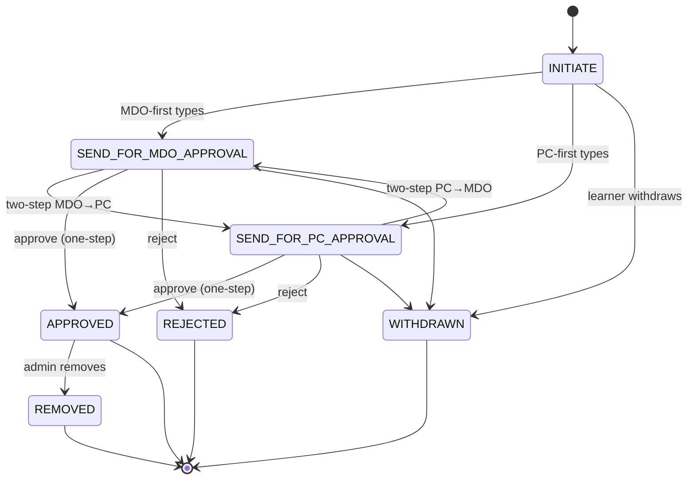
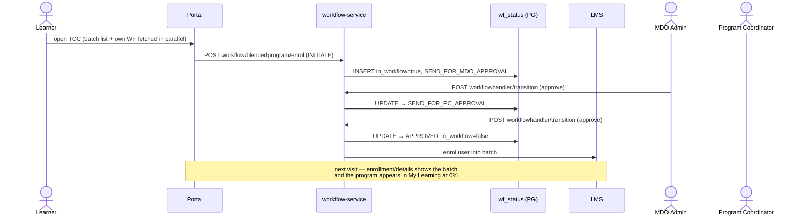

# Blended Program — Low-Level Design

## Workflow state machine



### Approval-type routing (`WFBlendedProgramApprovalTypes`)

| Approval type | Route after INITIATE |
|---|---|
| `oneStepMDOApproval` | SEND_FOR_MDO_APPROVAL → APPROVED |
| `oneStepPCApproval` | SEND_FOR_PC_APPROVAL → APPROVED |
| `twoStepMDOAndPCApproval` | SEND_FOR_MDO_APPROVAL → SEND_FOR_PC_APPROVAL → APPROVED |
| `twoStepPCAndMDOApproval` | SEND_FOR_PC_APPROVAL → SEND_FOR_MDO_APPROVAL → APPROVED |

## Workflow persistence — `wingspan.wf_status` (PostgreSQL)

Verified from `sunbird-cb-ext › WfStatusEntity`, which reads the same table
the workflow service writes.

| Column | Meaning |
|---|---|
| `wf_id` | Primary key of the workflow application |
| `userid` / `actor_uuid` | The learner / the last actor |
| `application_id` | **The batchId** — the batch is the application context |
| `service_name` | `blendedprogram` (the engine is multi-tenant across services) |
| `current_status` / `in_workflow` | State-machine position; `in_workflow` false once terminal |
| `root_org` / `org` / `dept_name` | Org scoping used by the MDO approver queue |
| `update_field_values` | JSON payload carried by the request |
| `created_on` / `lastupdated_on` | Queue ordering and report windows |

## Enrolment sequence (happy path, two-step MDO → PC)



## Batch attributes that drive the feature

| Attribute | Effect |
|---|---|
| `currentBatchSize` | Seat cap — compared against approved count from `enrol/status/count` |
| `sessionDetails_v2[]` | Session plan; each session's completion matched against content-state |
| `userProfileFileds` | When set (not the "available iGOT profile" sentinel), forces the profile survey pre-enrol |
| approval type | Selects the workflow route |
| `enrollmentEndDate` | Closes the request window client-side |
| `enableQR` | QR-based attendance/enrolment |
| `batchLocationDetails` / `latlong` | Venue for offline sessions |
| `instructors` / `instructorsUserId` | Instructor assignment |
| `cadreList` | Audience restriction by cadre (options from `cadreConfig`) |
| `bpEnrolMandatoryProfileFields` | Required profile fields (master list is a system setting) |
| `profileSurveyLink` / `profileSurveyId` | Auto-created pre-enrolment form |
| `resources` | Supporting material |

## Batch creation payload (Creation Portal, verified)

```jsonc
// POST learner/course/v1/batch/create — as built by content-create-batch-bp
{ "request": {
    "courseId": "<program do_id>",
    "name": "<batch name>",
    "description": "Batch for <program name>",
    "startDate": "YYYY-MM-DD", "endDate": "YYYY-MM-DD",
    "enrollmentEndDate": "YYYY-MM-DD",
    "enrollmentType": "invite-only",     // BP batches are never open-enrol
    "createdBy": "<admin userId>", "createdFor": ["<rootOrgId>"],
    "mentors": ["<admin userId>"],
    "batchAttributes": {
      "enableQR": true, "currentBatchSize": "<seat cap>",
      "batchLocationDetails": "<address>", "latlong": "<lat,long>",
      "sessionDetails_v2": [ ],
      "instructors": [ ], "cadreList": [ ],
      "profileSurveyLink": "<auto-created form URL>"
} } }
// on success: default certificate template read from system settings and attached
```

## Attendance = a progress write

There is no separate attendance store. Marking a learner present writes
**content state on the session node**: `status: 2, completionPercentage: 100`
(absent = 0) via `blendedprogram/v1/update/progress`, per user, keyed by
`contentId + batchId + courseId`. The consumption portal's session-completion
percentage and the program's overall completion both read the same
content-state records. QR attendance is the same write triggered by a scan.

## Report generation internals (sunbird-cb-ext)

The v2 flow validates the request (courseId, batchId, orgId, requester role in
the allowed BP roles), then checks `sunbird.bp_enrolment_report` for an
existing row: an `IN_PROGRESS` row short-circuits the API (de-dup guard).
Otherwise it writes a tracking row and emits a Kafka message;
`BPReportConsumer` builds the file by joining `wf_status` (Postgres, via
`WfStatusEntityRepository`) with enrolment records (Cassandra); the client
polls `bpreport/status` until the download link is live.

---

> **Verification boundary:** facts above are read from the attached repos
> (sunbird-cb-portal, sb-cb-ui-components, sunbird-cb-creationportal,
> sunbird-cb-ext, cb-ext-course-service). Not analysed from source: the
> workflow service (state machine inferred from client contracts and the
> shared `wf_status` table) and the LMS batch/enrolment service. The knowledge
> platform content lifecycle is now **verified from source** — see
> [Content Lifecycle](../../platform/content-lifecycle.md).
