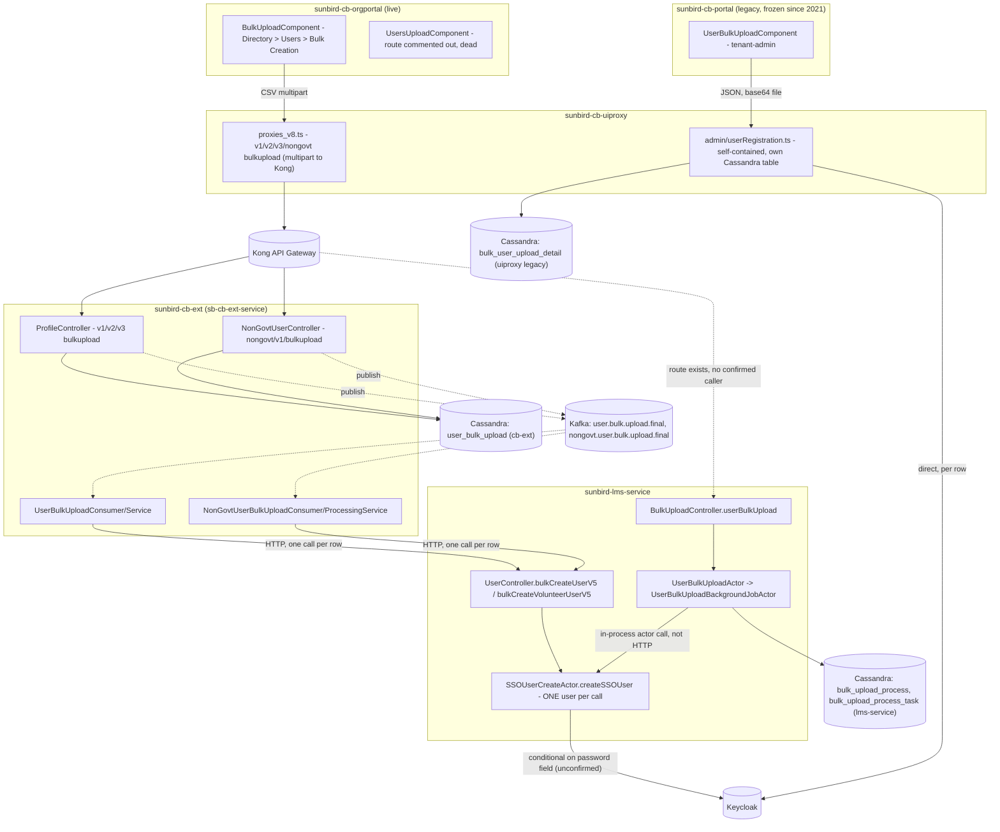

# Bulk Registration — HLD

Reverse-engineered from `sunbird-cb-orgportal`, `sunbird-cb-adminportal`,
`sunbird-cb-portal`, `sunbird-cb-uiproxy`, `sunbird-cb-ext`,
`sunbird-cb-workflow`, `sunbird-lms-service`, and `sunbird-devops`.

## Three independent bulk-registration pipelines

The single biggest architectural fact about this feature: there are
**three separate implementations of "upload a CSV and create user
accounts,"** built at different times, sharing almost no code, and only
one of them is reachable from a live, routed UI.

1. **The live pipeline** — `sunbird-cb-orgportal`'s Bulk Creation tab →
   `sunbird-cb-uiproxy` → Kong → `sunbird-cb-ext` (parses the CSV, tracks
   the batch, publishes to Kafka) → a Kafka consumer that calls
   `sunbird-lms-service`'s `/v5/cb/user/bulkcreate` (or
   `/ngo/bulkcreate`) **once per row over HTTP**.
2. **The native, unconnected pipeline** — `sunbird-lms-service` also has
   its own complete, self-contained CSV pipeline (`/v1/user/upload`),
   with its own actor, its own Cassandra tables, and its own status API.
   It reaches the same underlying user-creation code
   (`SSOUserCreateActor.createSSOUser`) as pipeline 1, but via a direct
   in-process Akka call rather than HTTP — and no UI in any of the 8
   repos was found calling it. A Kong route exists for it; nothing
   observed uses that route.
3. **The legacy, bypass pipeline** — `sunbird-cb-portal`'s tenant-admin
   "user-bulk-upload" page, functionally unchanged since 2021, posts to
   `sunbird-cb-uiproxy`'s own `admin/userRegistration.ts`, which parses
   the file and calls **Keycloak directly**, never touching
   `sunbird-cb-ext` or `sunbird-lms-service` at all.

`sunbird-cb-adminportal` has **no bulk-registration UI**; its only
"bulk user" feature moves existing users between org nodes, a different
capability. `sunbird-cb-workflow` was also traced and confirmed to have
no role in registration — its "bulk" code paths update profile fields
on **existing** users through a workflow/approval engine.

## Topology

## Responsibilities

| Component | Owns | Repo |
|---|---|---|
| `BulkUploadComponent` | Live CSV upload UI, OTP gate, org/NGO branching | `sunbird-cb-orgportal` |
| `UsersUploadComponent` | Orphaned predecessor — route commented out, superseded | `sunbird-cb-orgportal` |
| `UserBulkUploadComponent` | Legacy tenant-admin CSV upload, unchanged since 2021 | `sunbird-cb-portal` |
| `proxies_v8.ts` bulkupload handler | Multipart-to-Kong forwarding, header/role gating | `sunbird-cb-uiproxy` |
| `admin/userRegistration.ts` | Self-contained legacy pipeline direct to Keycloak | `sunbird-cb-uiproxy` |
| `ProfileController` / `ProfileServiceImpl` | Govt/MDO CSV parsing, batch tracking, Kafka publish | `sunbird-cb-ext` |
| `NonGovtUserController` / `NonGovtUserBulkUploadServiceImpl` | NGO/volunteer CSV parsing, batch tracking, Kafka publish | `sunbird-cb-ext` |
| `UserBulkUploadConsumer` / `NonGovtUserBulkUploadConsumer` | Per-row HTTP call into lms-service's bulkcreate endpoints | `sunbird-cb-ext` |
| `UserController.bulkCreateUserV5` / `bulkCreateVolunteerUserV5` | Single-user create endpoint, despite the name | `sunbird-lms-service` |
| `SSOUserCreateActor` | Shared user-creation logic for every path in this feature | `sunbird-lms-service` |
| `BulkUploadController` / `UserBulkUploadActor` / `UserBulkUploadBackgroundJobActor` | The native, self-contained CSV pipeline with no confirmed UI caller | `sunbird-lms-service` |
| `UserBulkTransferComponent` | Adjacent, out-of-scope: bulk org-transfer of **existing** users | `sunbird-cb-adminportal` |
| `UserBulkUpdateConsumer` / workflow bulk-update files | Adjacent, out-of-scope: bulk profile-field update for **existing** users | `sunbird-cb-workflow` |

## Key design decisions

- **"Bulk create" at the API layer is a misnomer.** `SSOUserCreateActor`
  creates one user per call for both `BULK_CREATE_USER_V5` and
  `NGO_BULK_CREATE_USER_V5`. The multi-row batching that makes this
  feature "bulk" is implemented entirely in `sunbird-cb-ext`'s consumer
  loop, a full layer above the endpoint whose name suggests it does the
  batching.
- **The live UI's CSV never reaches `sunbird-lms-service` directly.** It
  is fully parsed, validated, and tracked by `sunbird-cb-ext`
  (`sb-cb-ext-service`) first; `sunbird-lms-service` only ever sees one
  synthesized single-user request per row, arriving over plain HTTP from
  another internal service.
- **Two independent user-creation loops exist for the same net effect.**
  `sunbird-cb-ext`'s Kafka consumer calls the bulkcreate endpoints over
  HTTP; `sunbird-lms-service`'s own native `/v1/user/upload` pipeline
  reaches the identical underlying actor via an in-process Akka `ask` —
  built, seemingly, to do the same job a second, unconnected way. Neither
  reuses the other's CSV-parsing, batch-tracking, or Cassandra schema.
- **A fourth, fully separate implementation bypasses both services.**
  `sunbird-cb-portal`'s legacy tenant-admin page talks straight to
  Keycloak through a dedicated uiproxy route, with its own Cassandra
  table, no OTP gate, and no size cap — and its business logic hasn't
  changed since 2021 even though the surrounding codebase has been
  actively developed.
- **OTP verification protects the admin, not the new users.** Before any
  upload, the submitting admin must verify an OTP sent to *their own*
  email/phone — a safeguard against an unattended/compromised session
  initiating bulk account creation, not a check on the uploaded rows
  themselves.
- **Failure is per-row, not per-batch, in every pipeline traced.** A bad
  row does not fail the whole file in either `sunbird-cb-ext`'s consumers
  or `sunbird-lms-service`'s native background actor; each row
  independently ends success or failure, surfaced only via a downloadable
  result file — no pipeline has per-row detail inline in its UI.
- **No pipeline polls.** All three UIs (live, legacy) re-fetch a status
  list once, on load and once after submit. An admin must manually
  reopen the page to see whether an async batch has finished.

See [LLD](lld.md) for storage detail, sequence flows, and validation
rules, and the [Operations Manual](operations-manual.md) for how these
decisions surface in day-2 support.