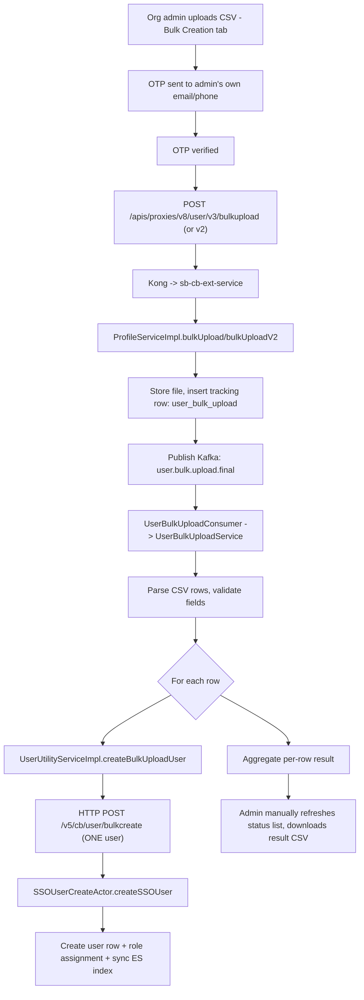
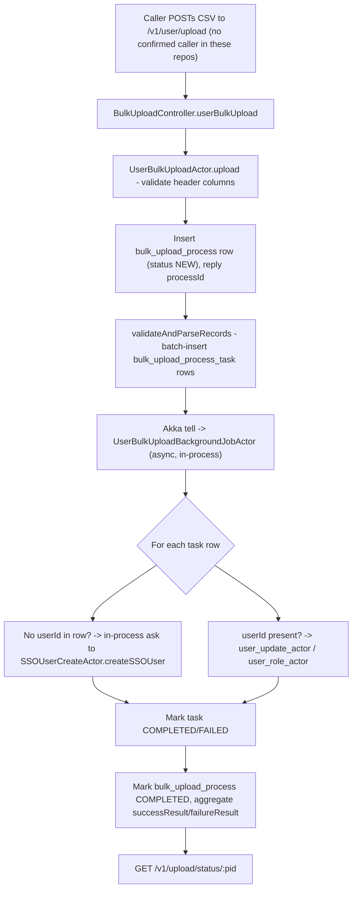
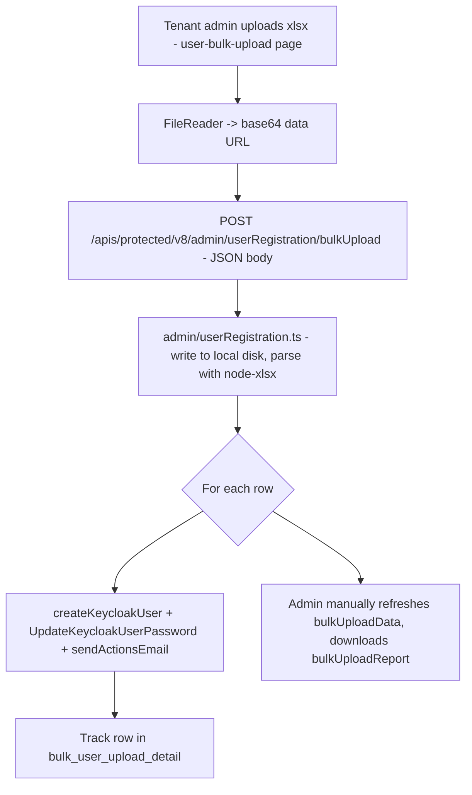

# Bulk Registration — LLD

Reverse-engineered from code. Three pipelines exist (see [HLD](hld.md));
each has its own storage, its own status model, and its own validation
rules — nothing here is shared across all three unless stated.

## Storage reality

### Cassandra (`sunbird-cb-ext`, keyspace `sunbird`)

| Table | Written by | Purpose |
|---|---|---|
| `user_bulk_upload` | `ProfileServiceImpl.bulkUpload`/`bulkUploadV2`, `NonGovtUserBulkUploadServiceImpl` | Shared batch-tracking table for **both** the govt and NGO CSV pipelines — composite key `(rootOrgId, identifier)` |

### Cassandra (`sunbird-lms-service`, keyspace `sunbird`)

| Table | Written by | Purpose |
|---|---|---|
| `bulk_upload_process` | `BulkUploadProcessDaoImpl` | Batch-level record for the **native**, unconnected `/v1/user/upload` pipeline: `id, status, data, successResult, failureResult, uploadedBy, uploadedDate, processStartTime, processEndTime, objectType, organisationId, retryCount` |
| `bulk_upload_process_task` | `BulkUploadProcessTaskDaoImpl` | Per-row record: `processId, sequenceId, status, data, successResult, failureResult, createdOn, lastUpdatedOn, iterationId` |

`bulk_upload_process_task`'s DDL was **not found** in `sunbird-devops`'s
CQL migration file, unlike `bulk_upload_process` (which is present,
`cassandra-cql-update/templates/cassandra.cql:378-379,486`) — its schema
must be created elsewhere or bootstrapped outside this checkout's range.

### Cassandra (`sunbird-cb-uiproxy`, legacy pipeline)

| Table | Written by | Purpose |
|---|---|---|
| `bulk_user_upload_detail` | `admin/userRegistration.ts` | Batch/row status for the legacy, Keycloak-direct pipeline. No DDL found in `sunbird-devops` either — same open gap as above. |

### Kafka topics

| Topic | Producer | Consumer |
|---|---|---|
| `user.bulk.upload.final` | `ProfileServiceImpl` (`sunbird-cb-ext`) | `UserBulkUploadConsumer` (same repo) |
| `nongovt.user.bulk.upload.final` | `NonGovtUserBulkUploadServiceImpl` (`sunbird-cb-ext`) | `NonGovtUserBulkUploadConsumer` (same repo) |

No Kafka topic connects any of these to `sunbird-lms-service` — the
handoff from `sunbird-cb-ext` to `sunbird-lms-service` is plain
synchronous HTTP, not an async message.

### Status model

`sunbird-lms-service`'s `BulkProcessStatus` enum (native pipeline only):
`NEW(0)`, `IN_PROGRESS(1)`, `INTERRUPT(2)`, `COMPLETED(3)`, `FAILED(9)`.
`IN_PROGRESS` and `INTERRUPT` are only ever **read**, never set, by the
user-bulk-upload code path — a batch/row goes straight
`NEW → COMPLETED` or `NEW → FAILED`. The status API
(`GET /v1/upload/status/:pid`) collapses anything other than `COMPLETED`
or the (never-set) `IN_PROGRESS` down to a generic `NOT_STARTED` string —
so a batch that actually failed reports as `NOT_STARTED` until/unless it
later flips to `COMPLETED`.

`sunbird-cb-ext`'s two pipelines were not confirmed to share this exact
enum — their status column semantics were traced only as far as
"batch-level total/success/failed counts," per the frontend trace.

## Sequence: live pipeline, government/MDO user

## Sequence: native, unconnected pipeline (`/v1/user/upload`)

## Sequence: legacy pipeline (`sunbird-cb-portal` tenant-admin)

## Validation reality

| Rule | Enforced | Where |
|---|---|---|
| `.csv` extension only, ≤10 MB | Frontend | `BulkUploadComponent.handleOnFileChange`/`uploadCSVFile` (orgportal, live) |
| `.xlsx` only | Frontend | `UserBulkUploadComponent` (cb-portal, legacy) |
| OTP verification of the *submitting admin* | Frontend, gates the upload call | `BulkUploadComponent.sendOTP`/`generateAndVerifyOTP` |
| Mandatory CSV columns | Backend, dynamic-or-hardcoded field list | `UserBulkUploadActor.upload` / `system_settings` `userProfileConfig`/`csv` |
| Max 10,000 rows (NGO CSV) | Backend config | `sb-cb-ext-service-env.j2`: `nongovt.bulk.upload.max.rows=10000` |
| Row/size cap (native `/v1/user/upload`) | Backend config | `sunbird_lms-service.env`: `sunbird_user_bulk_upload_size=1001` |
| `firstName` required; `email`/`phone`/`managedBy` (mutually exclusive with the latter) required | Backend | `UserRequestValidator.validateUserCreateV3` |
| Non-empty `profileDetails` required | Backend, explicit exception | `SSOUserCreateActor.updateMinistryDetailsForUsers` — throws `bulkUserCreateProfileValidation` |
| NGO bulk-create: target org's ministry/state must match the calling admin's org (unless either record is empty) | Backend | `SSOUserCreateActor.isSameMinistryOrState` — throws `errorConflictingRootOrgId` |
| NGO bulk-create: role forced to `VOLUNTEER` only if the resolved org is `NGO`-typed | Backend | `SSOUserCreateActor.populateVolunteerRoles` |
| Duplicate-submission guard (email/phone, Redis TTL) | Backend | `SSOUserCreateActor.processSSOUser` — Redis keys `sso:email:<email>`/`sso:phone:<phone>` |
| Welcome email/SMS + Keycloak required-action link | **Conditional on `context.callerId` being set** — not set by either bulkcreate controller method | `SSOUserCreateActor.processSSOUser:259-261` vs. `UserController.bulkCreateUserV5`/`bulkCreateVolunteerUserV5` (no `CALLER_ID` set) |
| Keycloak account/password provisioning | **Conditional on a `password` field being present in the request** | `UserUtil.updatePassword` → `KeyCloakServiceImpl`, called only `if (password present)` |

> **Verification boundary:** the storage, sequence, and validation facts
> above are read directly from the four traced repos at the file/line
> citations gathered during this analysis. Not verified from source:
> whether `UserUtilityServiceImpl.constructBulkUserCreateRequest`
> (`sunbird-cb-ext`) includes a `password` field in the per-row request
> it sends to `/v5/cb/user/bulkcreate` — this single fact determines
> whether Keycloak accounts are actually provisioned for CSV-bulk-created
> government/MDO users, and whether any welcome email/SMS ever reaches
> them. Also unverified: the exact Cassandra schema for
> `bulk_upload_process_task` and `bulk_user_upload_detail` (DDL not found
> in `sunbird-devops`); and whether `sunbird-cb-ext`'s status-tracking
> columns share `sunbird-lms-service`'s `BulkProcessStatus` enum values.