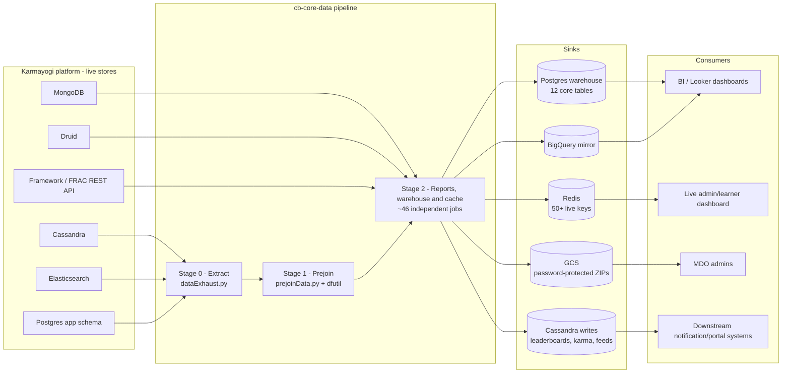

# CHS / cb-core-data — High-Level Design

## Topology

## Responsibilities

| Component | Owns | Repo |
|---|---|---|
| Stage 0 extract | Point-in-time snapshot of every operational store into local Parquet, zero business logic | `KB-iGOT/cb-core-data` — `jobs/stage-0/dataExhaust.py` |
| Stage 1 prejoin | The reusable "computed" tables (user×org, content master, enrolment facts) that ~30 of the 46 Stage 2 jobs read; also runs the ACBP allocation engine | `cb-core-data` — `jobs/stage-1/prejoinData.py`, `dfutil/` |
| Stage 2 jobs | Compliance reports, warehouse/dashboard sync, gamification & scoring, leaderboards & campaigns, surveys & export — ~46 independently runnable scripts | `cb-core-data` — `jobs/stage-2/*.py` |
| CSV export layer | Size-adaptive per-org CSV writing (direct Spark under 100k rows, DuckDB-mediated above) shared by ~15 report jobs | `cb-core-data` — `dfutil/dfexport/dfexportutil.py` |
| ACBP allocation engine | Chunked, DuckDB-based criteria matching (9 criteria types, ~40 joins/run) reused by both ACBP and CAP allocation | `cb-core-data` — `dfutil/enrolment/acbp/acbpDFUtil_v3.py` |
| Deployment | Artifact build (Jenkins) → Ansible-driven deploy, config templated per environment from a private vaulted inventory | `cb-core-data` — `Jenkinsfile`, `ansible/` |
| Scheduling | Not implemented in this repository — an external Airflow instance (out of repo) invokes jobs | *(not in this repo)* |

## Key design decisions

**No orchestrating DAG, by convention not by contract.** `jobs/main.py` chains exactly 5 of
the ~46 jobs; everything else is an independently `spark-submit`-able script whose ordering
dependency on another job is discoverable only by noticing they read/write the same named
Parquet constant. There is no import graph and no automated dependency check — a refactor can
silently reorder two jobs that depend on each other.

**Every warehouse write is a full truncate-and-reload — never incremental.** This is a
deliberate simplicity/cost trade: it removes an entire class of upsert bugs at the price of
reprocessing the full user base every run (`userReport.py`/`userEnrolment.py`) and leaving a
table genuinely empty during a failed or slow sync, since there's no atomic swap.

**Spark for volume, DuckDB for irregular joins.** PySpark handles the bulk extract/transform
work; DuckDB is used specifically where the join graph is too complex or high-cardinality for
Spark — most notably the ACBP/CAP allocation engines (~40 SQL joins per run, chunked at 2M
users) and most CSV/warehouse export scripts.

**Duplicate implementations persist with no declared source of truth.** At least two pairs of
jobs (`dataWarehouse.py`/`dataWarehouseBash.sh` for Postgres sync; three separate
org-hierarchy jobs writing the same tables) implement the same requirement without
cross-referencing each other, and the repository gives no signal which is actually scheduled
in production. This is a structural risk carried forward here rather than resolved, because
resolving it requires information (the external scheduler's configuration) that isn't in this
repository — see the Operations Manual.

> **Verification boundary:** the facts above are read directly from the `cb-core-data`
> repository (branch `cbrelease-4.8.40`) — its job source files, `Jenkinsfile`, `ansible/`
> roles, and its own in-repo `docs/ARCHITECTURE.md`/`docs/JOB_DETAILS.md`. Not verified from
> source: the external Airflow scheduler configuration that actually invokes these jobs, and
> which of each duplicate-implementation pair is live in production — both live outside this
> repository. Attach the Airflow DAG repo (or the infrastructure team) to close that gap.
