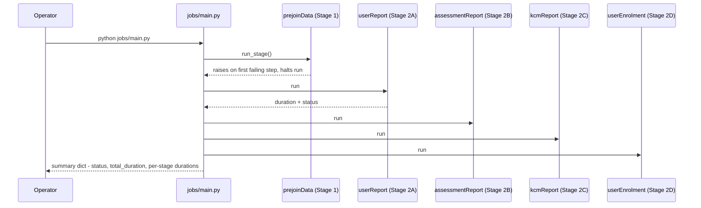

# CHS / cb-core-data — Low-Level Design

## 1. Module layout

```
cb-core-data/
├── jobs/
│   ├── main.py                 # orchestrates Stage 1 + 4 Stage 2 jobs in sequence
│   ├── config.py                # Ansible-templated runtime config (deployed)
│   ├── default_config.py        # local-dev fallback config, hardcoded dev hosts
│   ├── stage-0/dataExhaust.py   # single Stage 0 job
│   ├── stage-1/prejoinData.py   # single Stage 1 orchestrator
│   └── stage-2/                 # ~46 independent report/warehouse/cache jobs
├── dfutil/                      # shared library code (user, content, enrolment, assessment, acbp, dfexport, utils)
├── constants/                   # ParquetFileConstants.py, QueryConstants.py
├── util/schemas.py              # explicit PySpark StructType schemas for JSON columns
├── ansible/                      # deployment role + playbook
├── Jenkinsfile / pipelines/deploy/data-products/Jenkinsfile
├── bq-scripts.sh · cleanup.sh · spark-submit.sh
```

**Coupling model:** Stage 2 jobs never import each other. The only contract between jobs is a
shared set of Parquet path constants in `constants/ParquetFileConstants.py` — whether job B
must run after job A is answered only by checking whether B reads a table A writes.

## 2. Run sequence (orchestrated subset)



The remaining ~41 Stage 2 jobs and Stage 0 are each invoked independently, in an order the
operator derives from the dependency table in §6 — nothing in the codebase enforces it.

## 3. Stage 1 — the 18-step prejoin

`prejoinData.py`'s `run_stage()` wrapper times each step and raises immediately on first
failure — a failure at step 12 leaves steps 1–11's output on disk, but steps 13–18 never run.

| # | Step | Function | Notes |
|---|---|---|---|
| 1 | Assessment pass/fail derivation | `assessmentDFUtil.parse_raw_assessment_data` | Writes back into the raw cache dir, deliberate in-place cleanup |
| 2 | Org + hierarchy | `userDFUtil.preComputeOrgWithHierarchy` | |
| 3 | Content ratings & summary | `contentDFUtil.preComputeRatingAndSummaryDataFrame` | |
| 4 | Course/program catalog (ES) | `contentDFUtil.preComputeAllCourseProgramESDataFrame` | |
| 5 | Content master table | `contentDFUtil.preComputeContentDataFrame` | → `CONTENT_COMPUTED_PARQUET_FILE`, read by ~18 Stage 2 jobs |
| 6 | Content hierarchy | `contentDFUtil.precomputeContentHierarchyDataFrame` | Also writes `CONTENT_HIERARCHY_FLATTENED_PARQUET_FILE` |
| 7 | Assessment ES frame | `assessmentDFUtil.precomputeAssessmentEsDataframe` | |
| 8 | External/marketplace content | `contentDFUtil.preComputeExternalContentDataFrame` | |
| 9 | User profile master | `userDFUtil.preComputeUser` | |
| 10 | Enrolment master table | `enrolmentDFUtil.preComputeEnrolment` | → `ENROLMENT_COMPUTED_PARQUET_FILE`, read by ~15 Stage 2 jobs |
| 11 | External enrolment | `enrolmentDFUtil.preComputeExternalEnrolment` | |
| 12 | User × org master | `userDFUtil.preComputeOrgHierarchyWithUser` | → `USER_ORG_COMPUTED_FILE` — the single most-read table in the repo |
| 13 | Enrolment-warehouse frame | `enrolmentDFUtil.preComputeUserEnrolmentWarehouseData` | Feeds `dashboardSync.py`'s entire query library |
| 14 | User-warehouse frame | `userDFUtil.preComputeUserWarehouseData` | |
| 15 | Content-warehouse frame | `contentDFUtil.preComputeContentWarehouseData` | Overwritten later by `courseReport.py` (§7) |
| 16 | Direct warehouse Parquet writes | `contentDFUtil.writeWarehouseParquetFiles` | Bypasses `output/computed/` |
| 17 | Legacy assessment data | `assessmentDFUtil.precomputeOldAssessmentDataframe` | |
| 18 | ACBP allocation engine | `acbpDFUtil_v3.preComputeACBPData` | Runs in DuckDB, not Spark (§4) |

## 4. Key algorithms

**ACBP allocation engine** (`dfutil/enrolment/acbp/acbpDFUtil_v3.py`) runs in DuckDB because
the join graph is too irregular for Spark. For each of 9 criteria types (org, all-users,
specific user list, designation, cadre, group, batch, service, central-deputation status)
plus optional org-defined custom fields, it runs one INNER match join against exploded plan
criteria, plus a LEFT scoping join for all but the org-wide types — roughly 2 joins per
criterion, run twice via `UNION ALL` (org-scoped, then unrestricted plans): ~40 SQL joins per
run, chunked at 2,000,000 users for memory safety. **Match semantics:** every criterion within
one plan's userGroup must match (AND); any single matching userGroup is sufficient for the
plan to apply (OR across groups). `capAllotment.py` in Stage 2 reuses the identical engine
pattern for CAP access-control resolution — treat the two as one architectural pattern.

**Content hierarchy flattening** (`contentDFUtil.precomputeContentHierarchyDataFrame`) infers
the Elasticsearch hierarchy JSON's schema dynamically by sampling 30% of rows, because
hierarchy depth/shape varies by content type. Flattens up to 4 child levels (22 fields each)
into one wide row per root content id, NULL-backfilled where a level has no children. Feeds
the learning-hours calculation below.

**Learning-hours calculation** (`userReport.py`): for Blended Program, Comprehensive
Assessment Program and Curated Program categories, course duration is summed from each
course's eligible first-level children (via the flattened hierarchy) rather than read from a
single flat parent duration field, since those categories' true duration lives on their
components. Total learning hours also folds in marketplace/external content duration for
users with a completed, certificated external enrolment.

**Per-org CSV export sizing** (`dfutil/dfexport/dfexportutil.py`): organizations with
≤100,000 rows are written directly via Spark; larger ones are routed through a
temp-Parquet → DuckDB → CSV path, parallelized across workers. The threshold is a direct fix
for a measured 30-minute → 3-hour regression under the naive single-path approach, not an
arbitrary number — any new per-org CSV job should reuse this module rather than reimplement it.

## 5. Data model

**Stage 1 computed tables** (~27 Parquet folders, the three load-bearing ones):

| Table | Built by | Consumers |
|---|---|---|
| `USER_ORG_COMPUTED_FILE` | `userDFUtil.preComputeOrgHierarchyWithUser` | ~20 Stage 2 jobs — every user × org/ministry/dept |
| `CONTENT_COMPUTED_PARQUET_FILE` | `contentDFUtil.preComputeContentDataFrame` | ~18 Stage 2 jobs — every course/program × rating × org |
| `ENROLMENT_COMPUTED_PARQUET_FILE` / `ENROLMENT_WAREHOUSE_COMPUTED_PARQUET_FILE` | `enrolmentDFUtil` | ~15 Stage 2 jobs — enrolment/completion facts, two shapes |

**Postgres warehouse schema** (12 core tables): `user_detail`, `content`, `content_resource`,
`assessment_detail`, `bp_enrolments`, `cb_plan`, `org_hierarchy`, `kcm_content_mapping`,
`kcm_dictionary`, `events`/`event_details`, `events_enrolment`/`event_enrolment_details`,
`user_enrolments`. Naming diverges between Postgres and BigQuery for the last two pairs — same
data, different target-system name.

**Schemas**: `util/schemas.py` (559 lines) defines explicit `StructType` schemas for nested
JSON columns (profile/employment/personal details, content hierarchy, assessment
request/response shapes, pre-aggregated KPI shapes). New jobs parsing the same JSON columns
should reuse this file rather than redefine schemas inline.

## 6. Configuration system

`jobs/config.py` is generated at deploy time by Ansible from a Jinja template — every value in
the checked-in file is a `{{ placeholder }}`, not runnable as-is. `jobs/default_config.py` is
the local-dev fallback with real internal-network hostnames baked in.
`config.py.get_config()` merges `DATABASE_CONFIG`, `SPARK_CONFIG`, `REDIS_CONFIG`,
`STORAGE_CONFIG`, `REPORT_PATHS`, `KAFKA_CONFIG`, `JOB_CONFIG`, `EXTERNAL_SERVICES`,
`API_CONFIG` into one flat dict.

**Config gaps found by direct inspection:** `gamificationNotificationConsumer.py`/`Producer.py`
reference config keys (`dwnotificationQueue`, `gamificationNotificationBatchSize`,
`gamificationNotificationEligibilityDays`) absent from both config files and the Ansible
template; `peerValidationNotificationSender.py`'s `kpBrokerList` has no fallback default;
`userReport.py`'s `"user-custom-report"` zip-bundle entry exists in the dev fallback but not
the templated production config.

## 7. Cross-job dependencies

No orchestration DAG exists — these are discoverable only by tracing shared table names:

| Upstream | Downstream | Relationship |
|---|---|---|
| `courseReport.py` | `capAllotment.py` | reads the `content` warehouse table `courseReport.py` writes |
| `kcmReport.py` | `l2Assessments.py` | reads `kcm_dictionary` and `kcm_content_mapping` |
| `userEnrolment.py` | `userActivity.py`, `dsrComputation.py`, `nationalLearningWeek.py`, `odcsRecommendation.py`, `ministryMetrics.py`, `dashboardSync.py` | all read `user_enrolments` |
| `gamificationJob.py` | `gamificationNotificationProducer.py`, `userReport.py` | both read the badge-enrolment Parquet `gamificationJob.py` writes |
| `peerValidationEligibleUsers.py` | `peerValidationNotificationSender.py` | Postgres-table outbox/queue pattern |
| `weeklyClaps.py` | `dataExhaust.py` (next run) | closed read-modify-write loop on Postgres `learner_stats` |
| Stage 1 content-hierarchy flattening | `userReport.py` | hard dependency on `CONTENT_HIERARCHY_FLATTENED_PARQUET_FILE` |
| `org_hierarchy.py` / `orgHierarchyAll.py` / `orgHerarchyUpdatedEmpty.py` | `postgresToParquet.py` | three uncoordinated writers to the same 3 Postgres tables; the reader picks up whichever last ran |

## 8. Known code-level issues

| Severity | Issue |
|---|---|
| Critical | `programProgressSyncList_v5.py`'s entire validation pipeline is wrapped in an unused Python string literal — only a Cassandra→Parquet cache refresh actually executes, despite the file being 994 lines |
| Serious | `surveyStatusReport.py` is a functional duplicate of `surveyQuestionReport.py` with a wrong Mongo config name and wrong batch-size key; both write to the identical output folder |
| Serious | `npsUpgraded.py` has two consecutive `if __name__=="__main__"` blocks — its pipeline and Cassandra writes run twice per invocation |
| Serious | `gamificationNotificationConsumer.py`/`Producer.py` reference config keys absent everywhere in the codebase |
| Serious | `l2Assessments.py` writes to a hardcoded absolute filesystem path instead of the config-driven convention every other job follows |
| Warning | `userDataToRedis.py` always writes to Redis DB 0, ignoring `config.redisDB` |
| Warning | `ministryLeaderboard.py`'s log lines claim "Writing to Cassandra" but the job writes to Postgres |
| Warning | `zipUpload.py`'s disabled `createFullReport` branch references two undefined names — inert only because the flag defaults `False` |
| Info | Two parallel warehouse-sync implementations (`dataWarehouse.py`, `dataWarehouseBash.sh`) — production source of truth unclear from repo |
| Info | `content` warehouse table has two independent producers (Stage 1 + `courseReport.py`); Stage 1's write is silently overwritten |

> **Verification boundary:** facts above are read directly from the `cb-core-data`
> repository (branch `cbrelease-4.8.40`) — its `jobs/`, `dfutil/`, `constants/`, `util/`
> source, and its own in-repo `docs/JOB_DETAILS.md`/`docs/DATA_DICTIONARY.md`. Not analysed
> from source: the external Airflow scheduler that determines real execution order and
> cadence, and which of each duplicate-implementation pair is actually live in a given
> environment — both live outside this repository. Attach the Airflow DAG definitions (or the
> owning infrastructure team) to close that gap.
