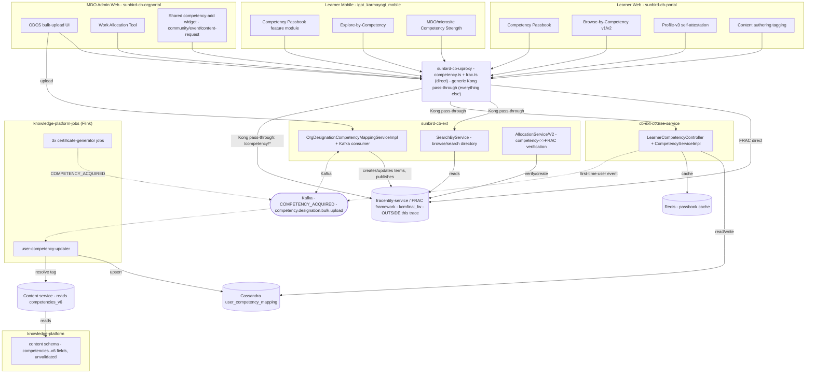

# Competency Hub — HLD

Reverse-engineered from `sunbird-cb-portal`, `sunbird-cb-orgportal`,
`sunbird-cb-uiproxy`, `sunbird-cb-ext`, `cb-ext-course-service`,
`igot_karmayogi_mobile`, `knowledge-platform-jobs`, `knowledge-platform`,
`sunbird-course-service`, and `sunbird-devops`.

## Topology

There is no "Competency Service" box in this diagram because none exists.
What ties the picture together is a taxonomy owned entirely outside these
ten repos (`fracentity-service`, confirmed only by `sunbird-devops`' Kong
config) and one shared Cassandra table that two independent pipelines write
into without coordinating.

## Responsibilities

| Component | Owns | Repo |
|---|---|---|
| `competency.ts` / `frac.ts` | The only two hand-written (non-pass-through) competency routers — call FRAC directly | `sunbird-cb-uiproxy` |
| `whitelistApis.ts` | Per-path role gating for every competency route, ~30 entries | `sunbird-cb-uiproxy` |
| `SearchByService` | Browse/search-by-competency directory, Redis-cached facets pulled from Composite Search + FRAC | `sunbird-cb-ext` |
| `OrgDesignationCompetencyMappingServiceImpl` + Kafka consumer | ODCS bulk-upload processing — the only code in this trace that *writes new nodes* into the FRAC taxonomy | `sunbird-cb-ext` |
| `AllocationService`/`AllocationServiceV2` | Work Allocation competency-to-role mapping, FRAC verify/create | `sunbird-cb-ext` |
| `LearnerCompetencyController` + `CompetencyServiceImpl` | The learner's own competency read API — Cassandra + Redis + first-time-user Kafka trigger | `cb-ext-course-service` |
| Three certificate-generator jobs | Fire `COMPETENCY_ACQUIRED` on certificate/achievement issuance | `knowledge-platform-jobs` |
| `user-competency-updater` | The **only** consumer that actually resolves a competency tag and upserts the learner's Cassandra record | `knowledge-platform-jobs` |
| Content schema (`schemas/content/1.0/schema.json` etc.) | Reserves `competencies` through `competencies_v6` as opaque, unvalidated array fields | `knowledge-platform` |
| Competency Passbook feature module | Full independent client implementation — screens, widgets, models, repository, service | `sunbird-cb-portal`, `igot_karmayogi_mobile` (two separate implementations, no shared code) |
| `competency-add` shared widget | Reused, independently wired, across community/event/content-request tagging | `sunbird-cb-orgportal` |

**Not found in any of the ten repos traced** (external, out of scope): the
FRAC/`fracentity-service` competency-CRUD implementation itself, and the
content-service component that actually populates `competencies_v6` when
content is tagged.

## Key design decisions

- **The taxonomy is entirely external, by construction.** Every repo that
  needs Competency Area/Theme/Sub-Theme data reads it live from FRAC
  (`kcmfinal_fw`) or from `fracentity-service` via Kong — none of the ten
  repos in this trace stores or validates the taxonomy itself. This keeps
  every client thin, but means there is no local cache-invalidation
  contract: `sunbird-cb-portal`, `sunbird-cb-orgportal`, and
  `igot_karmayogi_mobile` each independently call the same read endpoint
  with their own ad hoc caching (Redis on the backend side, in-memory with
  a TTL on mobile), and no shared library exists between them.
- **Content tagging is a metadata field, not a relationship.** A content
  item's competencies live in one opaque JSON array
  (`competencies_v6`) on the content node itself — not a join table, not a
  graph edge. `knowledge-platform` reserves five versioned variants of this
  field across its content-model schemas with no structural validation on
  any of them, and no migration path that retires the older versions
  (`competencies`, `competencies_v3`, `test_competencies_v4`,
  `competencies_v5` all still exist alongside `competencies_v6`).
- **Two independent write paths converge on one table, uncoordinated.**
  `cb-ext-course-service` writes a learner's first competency record
  synchronously, in-request; `user-competency-updater` writes every
  subsequent one asynchronously, off a Kafka event chain three jobs deep.
  Neither pipeline calls the other or shares code — they coordinate purely
  by writing to the same Cassandra table and by `cb-ext-course-service`
  publishing the same event type the Flink job already consumes.
- **ODCS is the one place code writes *to* the taxonomy, not just from
  it.** Every other repo treats FRAC as read-only. `sunbird-cb-ext`'s
  bulk-upload worker is the sole exception: it creates and publishes new
  FRAC framework terms as a side effect of mapping an org's designations,
  meaning a single Excel upload can permanently add nodes to the shared,
  platform-wide competency taxonomy.
- **No competency self-assessment or gap-scoring engine exists in this
  trace.** Everything described as "assessment" here is either opt-in
  self-attestation (current/desired, no scoring) or a disabled/unreachable
  module (`app/competencies` on web). A real competency quiz/gap-analysis
  engine, if one exists, is out of scope — see
  [AI CBP Tool](../ai-cbp-tool/index.md) for the closest analogue, a
  gap-analysis dashboard that compares a role's *required* competencies
  (AI-generated) against its recommended courses, which is a distinct
  mechanism from anything in this trace.

See [LLD](lld.md) for the storage reality, state machines, and sequence
flows, and the [Operations Manual](operations-manual.md) for how these
decisions show up in day-2 support.
