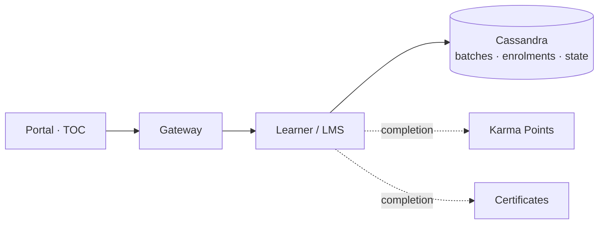

# Course — High-Level Design

Portal → gateway → **Learner/LMS service** (Cassandra: batches, enrolments,
content state). No workflow service in the path — the architectural
difference from Blended Program. Karma Points and certificates are downstream
consumers of completion, served by their own endpoints; content is published
from the Creation Portal through the knowledge platform.

