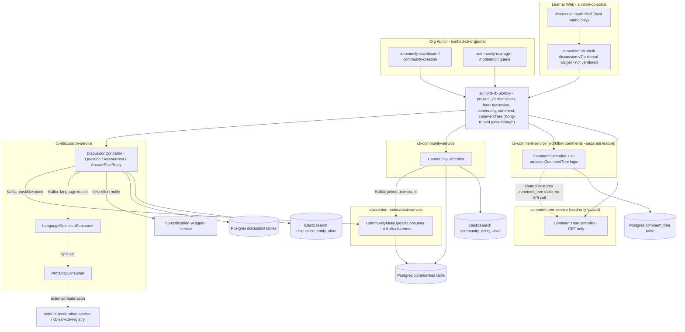

# Discussion Hub — HLD

Reverse-engineered from `cb-discussion-service`, `cb-comment-service`,
`cb-community-service`, `discussion-metaupdate-service`,
`comment-tree-service`, `sunbird-cb-portal`, `sunbird-cb-orgportal`,
`sunbird-cb-uiproxy`, `sunbird-cb-ext`.

## Topology

`sunbird-cb-ext` is **not shown** — confirmed to have no active role in
this feature (see [index.md](index.md#verification-boundary)).

## Two systems, one confusable name

See [index.md](index.md#the-one-decision-that-defines-the-feature). The
diagram above deliberately keeps `cb-comment-service`/`comment-tree-service`
in a separate subgraph with only a dotted, non-API line to make this
explicit: nothing in `cb-discussion-service`, `cb-community-service`, the
Org Portal's moderation screen, or the Learner Portal's discussion route
calls `/comment/*` or `/commentTree/*`. They are gated in
`sunbird-cb-uiproxy`'s whitelist by content-workflow roles
(`CONTENT_CREATOR`, `CONTENT_REVIEWER`, `SPV_PUBLISHER`), not community
roles — a different product surface (comments on courses/CBP content under
review) that happens to share the word "comment"/"discussion" with this
feature.

## Comment-tree duplication

`comment-tree-service` and `cb-comment-service` each independently
implement an identical `CommentTree` JPA entity, an identical
HMAC-signed-JWT primary-key derivation, and identical recursive
tree-traversal logic, against the **same Postgres `comment_tree` table**
(same connection string in both repos' `application.properties`).
`cb-comment-service` has the write methods (`createCommentTree`,
`updateCommentTree`, `setCommentTreeStatusToResolved`); `comment-tree-service`
only reads, through a Redis-first cache-aside path. There is no REST call,
Feign client, or Kafka topic between the two — they are coupled solely by
the shared table and a shared, weak, checked-in HMAC secret
(`jwt.secret.key=comment-hub` in both repos). A schema/key-derivation change
in one repo that isn't mirrored in the other would fail silently (stale
cache, or `findTargetNode` returning null with no error).

## Domain model: one service owns all three thread levels

Unlike a typical forum design (separate post/comment/reply tables or a
recursive adjacency structure), `cb-discussion-service` stores **Questions
and Answer Posts in the same Postgres table** (`discussion`), discriminated
purely by a `type` field inside a `jsonb` blob, and Answer Post Replies in
a second, structurally-identical table
(`discussion_answer_post_reply`). There is no relational schema — title,
votes, tags, media, mentions all live inside the JSON blob, validated only
at the API boundary via JSON-Schema files. Every write is also
synchronously indexed into Elasticsearch with `Refresh.True` (forces a
segment refresh on every single write) — Elasticsearch, not Postgres, is
the actual read/search path.

Communities are a **separate service and datastore**
(`cb-community-service`, its own `communities`/`community_category`
Postgres tables) — a Discussion carries only a `communityId` foreign-key
value (no DB constraint; `cb-discussion-service` only reads
`cb-community-service`'s `communities` table to validate the id exists).
Membership itself lives in neither service's primary datastore but in
shared **Cassandra** tables (`user_community`, `community_user_lookup`)
that both `cb-community-service` and `cb-discussion-service` read directly.

## Asynchronous moderation pipeline

Every create/update of a Question, Answer Post, or Answer Post Reply
triggers a two-stage Kafka pipeline inside `cb-discussion-service` itself:

1. `LanguageDetectionConsumer` — either defaults to English
   (`enable.english.language.by.default=true`, the default, meaning the
   real language-detection call is normally skipped) or calls an external
   content-moderation service; on success, calls profanity-check logic
   **synchronously inside the same Kafka listener thread**, which makes a
   second outbound HTTP call to `cb-service-registry`'s generic
   "call external API" proxy.
2. `ProfanityConsumer` — receives the moderation verdict, updates
   `isProfane`/`profanityCheckStatus` in Postgres + re-syncs Elasticsearch,
   and if profane, notifies the author and decrements the parent's
   answer-post/-reply counters (hiding without deleting).

There is **no retry, backoff, or dead-letter queue** anywhere in this
pipeline — a transient outage of the language/moderation service
permanently leaves a post's `profanityCheckStatus` in a failed state.

## Asynchronous counter sync

`discussion-metaupdate-service` is a pure Kafka-consumer worker (plus one
small REST endpoint) that keeps 4 denormalized Community counters
(`countOfPeopleJoined`, `countOfPostCreated`, `countOfAnswerPost`,
`countOfPeopleLiked`) in sync by consuming 4 topics produced by
`cb-discussion-service` and `cb-community-service`, then read-modify-writing
the counter inside the community's Postgres JSON blob and reindexing to
Elasticsearch. Despite its name, **it never touches a Discussion/Question
row** — its entire domain is Community engagement counters plus a
per-user post-count cache endpoint (`GET /v1/postcount/{userId}`, backed
by an Elasticsearch query against `cb-discussion-service`'s own index).

Delivery model is at-least-once **without** idempotency: Kafka auto-commit
is decoupled from the async task's completion (`CompletableFuture.runAsync`
per message, no dedicated executor), and counter updates are unlocked
read-modify-write with no optimistic-lock column — concurrent messages for
the same community can lose an increment.

## Gateway routing

`sunbird-cb-uiproxy` contains **three parallel, unrelated route families**
for content that looks discussion-shaped — the single biggest source of
confusion when mapping "the" Discussion Hub API:

1. **`discussionHub` module** (`/protected/v8/discussionHub/*`) — a direct
   NodeBB forum wrapper. Only 2 of ~27 routes are present in the
   whitelist; the entire write path (create topic/reply, vote, bookmark,
   follow) is missing and would 403. Legacy/likely dead.
2. **`/proxies/v8/discussion*` + `feedDiscussion*` + `community*` +
   `comment*` + `commentTree*`** — generic Kong pass-through proxies,
   comprehensively whitelisted. **This is the live path** actually used by
   both portal frontends.
3. **Legacy `social.ts` "Forum"** (`createForum`/`editForum`/`viewForum`) —
   a third, entirely separate and completely un-whitelisted feature on a
   different backend (`NODE_API_BASE`), unrelated to 1 and 2.

Role gating on family 2 (the live path): almost everything is
`ROLE.PUBLIC` (any logged-in user); community create/update/delete/publish
require `ROLE.MDO_LEADER`; the two admin moderation actions
(`activatePost`/`removePost`) and `getReportStatistics` require
`ROLE.MDO_ADMIN`, `ROLE.MDO_LEADER`, or `ROLE.COMMUNITY_MODERATOR` — **at
the gateway only**. Neither backend service (`cb-discussion-service`,
`cb-community-service`) itself checks any role; the gateway whitelist is
the only enforcement point for these actions.

## Storage summary

| Concern | Store | Owning service |
|---|---|---|
| Question / Answer Post / Answer Post Reply | Postgres (`jsonb`) | `cb-discussion-service` |
| Discussion search/listing | Elasticsearch `discussion_entity_alias` | `cb-discussion-service` (write), `discussion-metaupdate-service` (read, post-count) |
| Votes, bookmarks, reports (discussion-level) | Cassandra (`sunbird` keyspace) | `cb-discussion-service` |
| Community | Postgres (`jsonb`) | `cb-community-service` (write), `discussion-metaupdate-service` (counter write) |
| Community search | Elasticsearch `community_entity_alias` | `cb-community-service` (write), `discussion-metaupdate-service` (write, counters) |
| Community topic taxonomy | Postgres (relational, self-referencing) | `cb-community-service` |
| Community membership | Cassandra `user_community` / `community_user_lookup` | `cb-community-service` (write), `cb-discussion-service` (read) |
| Workflow comment + comment tree | Postgres (`jsonb`) | `cb-comment-service` (write), `comment-tree-service` (read-only) |
| User/org profile (read-only, shared) | Cassandra `sunbird.user` / `sunbird.organisation` | owned by an out-of-scope user/profile service |
