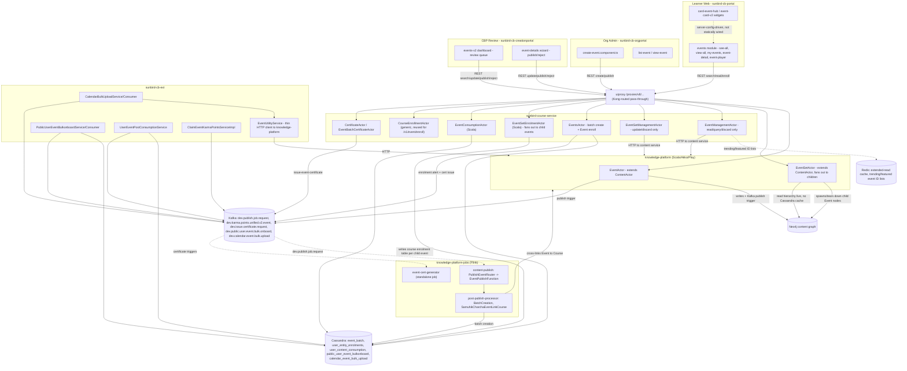

# Events Hub — HLD

Reverse-engineered from `sunbird-cb-portal`, `sunbird-cb-orgportal`,
`sunbird-cb-creationportal`, `sunbird-cb-uiproxy`, `sunbird-cb-ext`,
`sunbird-course-service`, `knowledge-platform`, `knowledge-platform-jobs`.

## A naming collision worth flagging up front

The three portal frontends each contain **two unrelated features** that
share a similarly-named folder:

- **"Event Hub" proper** (`app/event-hub`, `pageId: 'app/event-hub'`) — the
  content-type-driven system this document covers: search/browse,
  enroll, consume, certify, plus role-split authoring/review.
- **`app-event` ("meetup")** — a small, single-external-API microsite
  (`event-external` proxy, `<EXTERNAL_SITE>`) with no enrollment and no
  data-model relationship to Event/EventSet content. It is not called
  "Event Hub" anywhere in its own code, and in two of the three portals
  its route is either unreachable (Org Portal — shadowed by a duplicate
  route declaration) or disabled outright (Creation Portal — commented
  out). **Out of scope** for the rest of this documentation set.

## Topology

## Responsibilities

| Component | Owns | Repo |
|---|---|---|
| `EventActor` | Event content CRUD/publish; enforces "can't modify an Event that belongs to an EventSet" | `knowledge-platform` |
| `EventSetActor` | EventSet CRUD/publish, cascading to child Event nodes it owns | `knowledge-platform` |
| `EventManagementActor` | Read/query/discard *only* — no create or publish; discard is an HTTP call to the content service, not local persistence | `sunbird-course-service` |
| `EventsActor` | Event batch creation + the "v2" plain-Event enrollment path (`user_entity_enrolments`) | `sunbird-course-service` |
| `EventSetEnrolmentActor` | EventSet enrollment — fans out to every child event, writes the **Course** enrolment table, not the Event one | `sunbird-course-service` |
| `EventConsumptionActor` | Attendance/progress tracking, shared Cassandra table with Course consumption | `sunbird-course-service` |
| `CertificateActor` / `EventBatchCertificateActor` | Certificate issuance trigger + template management for event batches | `sunbird-course-service` |
| `EventUtilityService` | Thin HTTP client wrapper — the only way `sunbird-cb-ext` talks to the content service for events | `sunbird-cb-ext` |
| `PublicUserEventBulkonboardConsumer` | Kafka-driven bulk CSV onboarding: enroll, certify, award karma points per row | `sunbird-cb-ext` |
| `UserEventPostConsumptionServiceImpl` | On-demand ops reconciliation of completion/certificates/karma points | `sunbird-cb-ext` |
| `PublishEventRouter` / `EventPublishFunction` | Flink consumer of the publish-instruction Kafka topic; lightweight Event publish side-effects (no ecar packaging, unlike Course) | `knowledge-platform-jobs` |
| `BatchCreation` (post-publish) | Auto-creates the Event's default batch and links cert templates after publish | `knowledge-platform-jobs` |
| `SamuhikCharchaEventLinkCourse` | iGOT-specific: cross-links a published Event back to its linked Course | `knowledge-platform-jobs` |
| `event-cert-generator` | Standalone Flink job dedicated to Event certificate generation | `knowledge-platform-jobs` |
| Event Hub browsing UI (`events` module) | Search/browse/enroll/consume UX | `sunbird-cb-portal` |
| `create-event.component.ts` | Org-admin authoring, auto-publishes on submit | `sunbird-cb-orgportal` |
| `events-v2` dashboard + `event-details` wizard | CBP review queue, publish/reject, course cross-linking | `sunbird-cb-creationportal` |

## Three parallel enrollment paths

The single biggest architectural fact about this feature: **"enrolling in
an event" has three independent implementations**, not one:

1. `POST /v1/event/enroll` → generic `CourseEnrollmentController` /
   `CourseEnrollmentActor` — an Event enrolled exactly like a Course.
2. `POST /v2/event/enroll` → `EventsActor.eventEnroll` — Event-specific,
   writes `UserEventsDao`/`user_entity_enrolments`, carries iGOT-specific
   rules (Bharat Kalp eligibility, Samuhik Charcha linked-course checks, a
   hard-coded campaign end-date cutoff).
3. `POST /v1/eventset/enroll` → `EventSetEnrolmentActor` — fans out to
   every child Event of an EventSet, but writes into the **Course**
   enrolment table (`UserCoursesDao`) per child, not the Event one.

Each has different validation, different tables, and different
side-effects (only path 2 emits a Kafka enrolment alert). "Is this user
enrolled in this event" therefore has no single query — which table to
check depends on which path was used to enroll them.

## Key design decisions

- **Event/EventSet are content nodes, not a separate service.** Both
  extend `ContentActor` and persist through the same Neo4j
  `DataNode`/`GraphService` machinery as Course/Collection — there is no
  bespoke Event datastore in `knowledge-platform`.
- **EventSet's children are full Event nodes, materialized synchronously
  at create/update time**, connected via the same `hasSequenceMember`
  relation type Course→CourseUnit uses — not a lightweight batch/schedule
  table. Every `EventSetActor.update()` tears down and fully re-creates
  all children rather than diffing them.
- **EventSet hierarchy bypasses the Cassandra hierarchy cache** that
  Course/Collection rely on — `getHierarchy` always reads Neo4j relations
  live. A deliberate simplification, not parity with Course.
- **Enrollment, consumption, and certification are each split across
  multiple non-shared implementations** (three enroll paths; two
  independently-written karma-point Kafka producers; two Kafka mechanisms
  for certificate issuance — Course uses the shared `InstructionEvent`
  enum/model, Event hand-builds a JSON string). This is the feature's
  dominant maintenance risk, not a one-off gap.
- **Authoring and review are two unrelated implementations, not
  role-gated views of one flow.** Org Portal's create form and Creation
  Portal's review dashboard were independently written, share only the
  backend `event/v4/*` API family, and disagree on what status a
  freshly-created event should have.

See [LLD](lld.md) for storage detail, state machines, and sequence flows,
and the [Operations Manual](operations-manual.md) for how these decisions
surface in day-2 support.