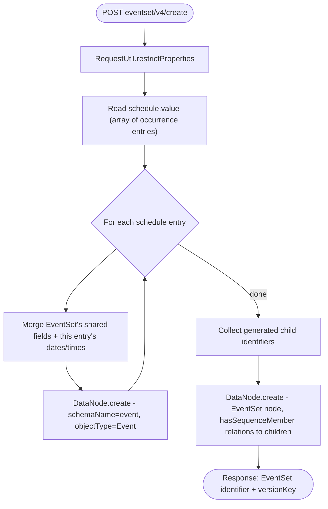
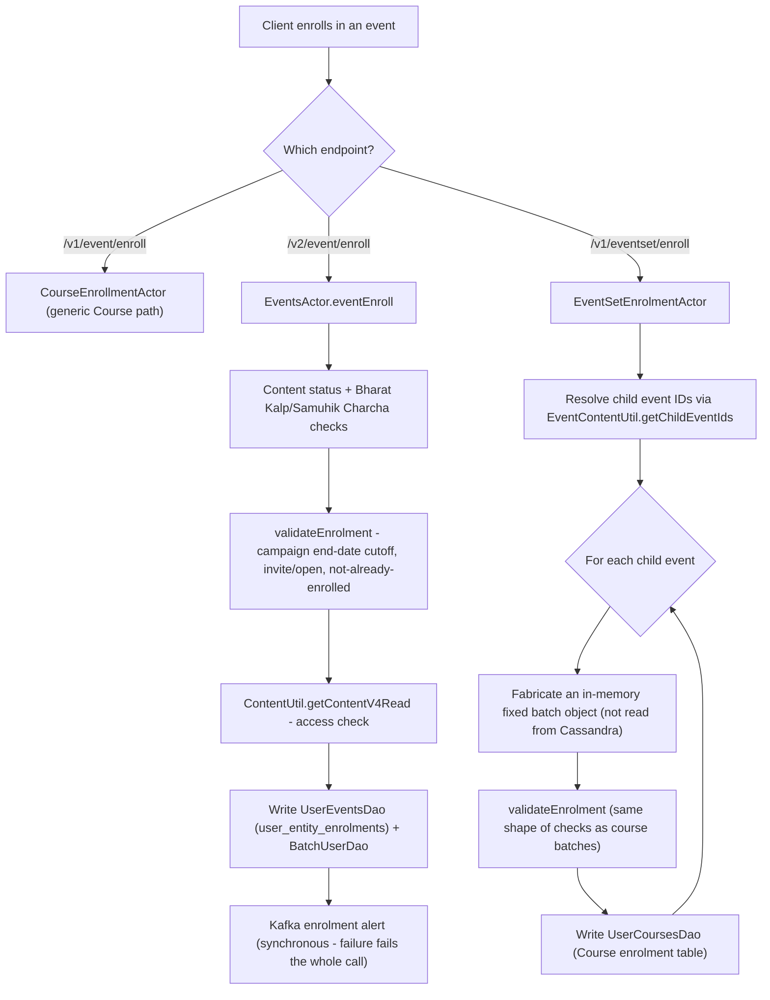
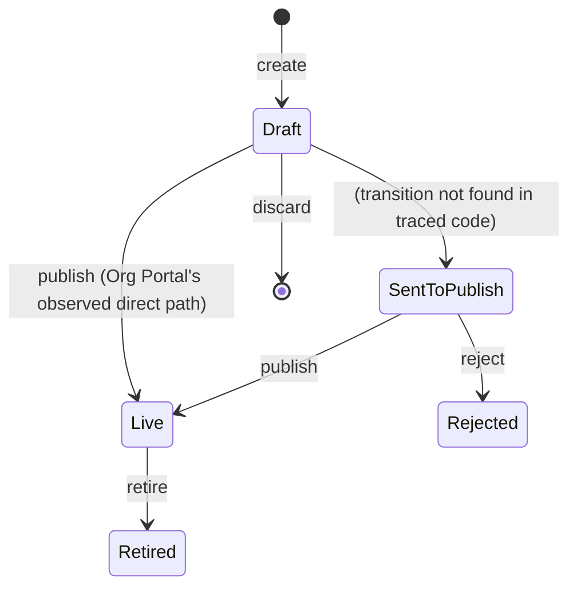
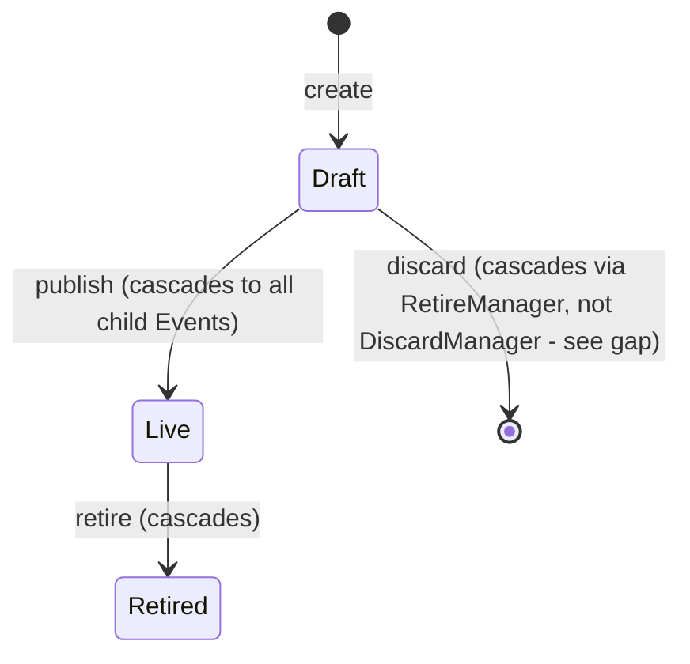

# Events Hub — LLD

Reverse-engineered from code. Where schema and implementation disagree,
both are documented with the mismatch called out explicitly.

## Storage reality

### Content layer (Neo4j, via `knowledge-platform`'s `DataNode`/`GraphService`)

One graph node per Event/EventSet, of `objectType` `"Event"` or
`"EventSet"` — same generic Content node type Course/Collection use.

**Event** (`schemas/event/1.0/schema.json`, required fields marked):

| Field | Type | Notes |
|---|---|---|
| `name`* | string, minLength 5 | |
| `code`* | string | |
| `status`* | enum `Draft, Live, Retired, SentToPublish, Rejected, Cancelled` | default `Draft` |
| `startDate`*/`endDate`* | date | |
| `startTime`*/`endTime`* | time | |
| `registrationStartDate` | date | optional |
| `registrationEndDate`* | date | |
| `eventType`* | enum `Online, Offline, OnlineAndOffline` | |
| `onlineProvider` / `onlineProviderData.meetingLink` | string / url | e.g. Zoom |
| `registrationLink` | url | |
| `venue` | object (untyped) | |
| `trackable` | `{enabled: Yes/No, autoBatch: Yes/No}`, default both `Yes` | governs auto-batch creation in `knowledge-platform-jobs` |
| `audience`, `ageGroup`, `language` | arrays of enum | |
| audit fields | `createdOn/By`, `lastUpdatedOn/By`, `versionDate`, `versionKey` | `versionKey` required on every update |

> **Schema gap**: `EventActor.update()` and base `ContentActor.create()`
> actively read/write `startDateTime`, `endDateTime`,
> `startDateTimeInEpoch`, `endDateTimeInEpoch` — **none of these four
> fields appear in `schema.json`**. Either this logic is vestigial
> (copied from another content type) or the schema is incomplete.

**EventSet** (`schemas/eventset/1.0/schema.json`) — same fields as Event
except:

- No top-level `startTime`/`endTime` — instead a required **`schedule`**
  object: `{type: "NON_RECURRING" (only value supported), nonRecurringDetails: [...]}`
  per the schema. **`EventSetActor.formChildEvents` actually reads
  `schedule.value`, not `schedule.nonRecurringDetails`** — a genuine
  schema/code field-name mismatch; test fixtures consistently use
  `"value"`, suggesting the schema is the stale side.
- `status` enum is narrower: `Draft, Live, Retired` only — no review/reject
  states, matching the simpler Draft→Live-only `publish()` flow.
- `contentType` enum is `["Event"]` — **should almost certainly say
  `"EventSet"`**; a likely copy-paste bug from the Event schema. (`config.json`'s
  `objectType` is correctly `"EventSet"`.)
- `version: "disable"` (versioning off), vs. Event's `"enable"`.

**Relations** (`config.json`): Event has an **incoming**
`hasSequenceMember` relation from `EventSet`; EventSet has the mirrored
**outgoing** `hasSequenceMember` relation to `Event`. Resolved by ID via
`DataNode.read` at hierarchy-read time — not a Cassandra hierarchy blob.

### Cassandra (`sunbird-course-service`, keyspace `sunbird_courses`)

| Table | Written by | Purpose |
|---|---|---|
| `event_batch` | `EventBatchDaoImpl.create` | Batch metadata: `eventId`, `batchId`, dates, `enrollmentType`, `mentors`, `certTemplates` (map column), `batchAttributes` (JSON string). **No `update()` method exists** — only create + cert-template map mutation |
| `user_entity_enrolments` | `UserEventsDaoImpl` (via `EventsActor.eventEnroll`, path 2 only) | Per-user Event+batch enrollment, keyed by `{user_id, content_id=eventId, context_id=eventId, batch_id}` |
| Course enrolment table (`UserCoursesDao`) | `EventSetEnrolmentActor` (path 3) | EventSet enrollment reuses this table, keyed by `eventId` treated as `courseId` — **not** `user_entity_enrolments` |
| `user_content_consumption` | `EventConsumptionActor` | Attendance/progress — same table used for Course content consumption |
| `user_entity_consumption` | Read-only, `EventEnrolmentDaoImpl.getUserEventConsumption` | Used to enrich `EventManagementActor` list/get responses — **no code found writing to this table**, so this enrichment may always return empty in production |

### Cassandra (`sunbird-cb-ext`)

| Table | Purpose |
|---|---|
| `public_user_event_bulkonboard` | Bulk-onboard job status tracking |
| `calendar_event_bulk_upload` | Calendar bulk-upload job status tracking |

### Redis

| Key pattern | Written/read by | Purpose |
|---|---|---|
| `{identifier}:user-event-enrolments` | `EventActor` (delete on retire) | Cache invalidation |
| Trending/featured event ID lists | `EventManagementActor.getTrendingEvent`/`getFeatureEvent` | Read-only from this repo's perspective — populated by an external job not traced |

### Kafka topics

| Topic | Producer | Consumer |
|---|---|---|
| `dev.publish.job.request` | `EventActor.pushInstructionEvent` | `knowledge-platform-jobs` `PublishEventRouter` |
| `dev.karma.points.unified.v2.event` | **Two independent producers**: `ClaimEventKarmaPointsServiceImpl` (cb-ext) and `UserEventPostConsumptionServiceImpl` (cb-ext, duplicated logic) | Not found in any repo traced |
| `dev.issue.certificate.request` | `PublicUserEventBulkonboardConsumer`, `UserEventPostConsumptionServiceImpl` (cb-ext); `CertificateActor` uses a **different** topic (`user_issue_certificate_for_event`) for the same purpose | Not traced (external cert-registry service) |
| `dev.public.user.event.bulk.onboard` | `PublicUserEventBulkonboardServiceImpl` | `PublicUserEventBulkonboardConsumer` (same repo) |
| `dev.calendar.event.bulk.upload` | `CalendarBulkUploadServiceImpl` | `CalendarBulkUploadConsumer` (same repo) |

## Sequence: EventSet create (schedule fan-out)

## Sequence: three enrollment paths compared

## State machines

**Event status** (from schema enum + actor code):

> The `Draft → SentToPublish` transition that the Creation Portal's review
> dashboard depends on was not found in any traced create/update code path
> — see [As-Built Requirements](as-built-requirements.md#known-deviations)
> for the full discussion.

**EventSet status** (simpler — no review states):

**Event-belongs-to-EventSet guard**: any Event with an inbound `EventSet`
relation rejects direct `update`/`publish`/`retire`/`discard` with a
client error — enforced in `EventActor.verifyStandaloneEventAndApply`,
checked on every one of those four operations before delegating to the
underlying `ContentActor` logic.

## Validation reality

| Rule | Enforced | Where |
|---|---|---|
| Event `contentType` cannot be client-set | Backend | `EventController.create` / `EventSetController.create` |
| EventSet `status` cannot be set via update | Backend, explicit controller check | `EventSetController.update` |
| Event `status` cannot be set via update | Backend, but **no visible controller-level guard** — must be schema/pipeline-level | `EventController.update` (inconsistent with EventSet's explicit check) |
| EventSet update requires `Draft` status | Backend | `EventSetActor.update` |
| Event/EventSet blocked from update/discard if it has active enrollments | Backend | `EventManagementActor.validateNoEnrollments`, `EventSetManagementActor.validateNoEventEnrollments` |
| Event batch create rejects a `participants` field in the request | Backend | `EventsActor.createEventBatch` |
| `enrollmentEndDate` on batch create | **Explicitly commented out** | `CourseBatchRequestValidator.validateCreateEventBatchRequest:366,369` |
| Past `startDate` on event batch create | **Allowed for events** (disallowed for Course batches) | `validateStartDate(startDate, isEvent=true)` |
| Org create-form field validation (title length, required fields, URL pattern) | Frontend only (Angular `Validators`) | `create-event.component.ts` |
| `milestones`-equivalent structural integrity (schedule payload) | **Not enforced anywhere** — schema and actor code even disagree on the field name | — |

> **Verification boundary:** facts above are read from the 8 repos listed
> in [index.md](index.md). Not analysed from source: the Kong gateway's
> path-rewrite rules; any consumer of the karma-points or
> issue-certificate Kafka topics; the actual runtime values of
> environment-driven config flags (whitelist checks, Redis key
> population); and four Creation Portal wizard steps
> (`competencies`, `course-linked`, `pre-event-setup`, `preview`) that
   were identified and routed but not read line-by-line for field-level
   validation rules.