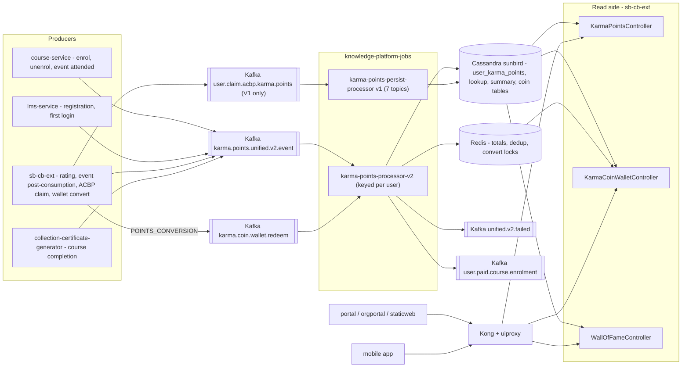

# Karma Points — HLD

Reverse-engineered from `knowledge-platform-jobs`, `sunbird-cb-ext`,
`sunbird-course-service`, `sunbird-lms-service`, `sunbird-cb-portal`,
`sunbird-cb-orgportal`, `sunbird-cb-staticweb`, `sunbird-cb-uiproxy`,
`igot_karmayogi_mobile`, `sunbird-devops`.

## Topology

Karma Points is an **event-sourced ledger**: producers emit, one job writes,
cb-ext reads.

## Responsibilities

| Component | Owns | Repo |
|---|---|---|
| `InstructionEventGenerator` (course) | `FIRST_ENROLMENT`, `UNENROLMENT`, `EVENT_ATTENDED` emission | `sunbird-course-service` |
| `InstructionEventGenerator` + `UserBaseActor` (LMS) | Registration and first-login events | `sunbird-lms-service` |
| `KarmaPointsServiceImpl` | History, per-course, total read; ACBP claim emit | `sunbird-cb-ext` |
| `KarmaCoinWalletServiceImpl` | Wallet summary, transactions, convert (validate + lock + emit) | `sunbird-cb-ext` |
| `WallOfFameServiceImpl` | MDO and learner leaderboards | `sunbird-cb-ext` |
| `KarmaPointsProcessorFnV2` + per-event handlers | The only ledger/summary/wallet writer | `knowledge-platform-jobs` |
| `karma-wallet`, `profile-karmapoints`, `karma-leaderboard-v2` | Web UI | `sunbird-cb-portal` |
| `hall-of-fame`, `rank-podium` | Public MDO Hall of Fame | `sunbird-cb-staticweb` |
| `proxies_v8.ts` / Kong routes | Routing and access | `sunbird-cb-uiproxy`, `sunbird-devops` |

## Key design decisions

- **One writer.** Every point and coin write happens in the Flink job, which keys
  the stream by user so its read-before-write dedup and non-atomic summary update
  are ordered per user (V1 relied on parallelism = 1 for the same safety).
- **Event envelope, uneven payloads.** All producers use `{eventType, data, version}`
  but the userId sits in a different place per type — the job's
  `KarmaPointsKeySelector` encodes that map. Fragile, but contained.
- **Wallet is a Kafka round-trip.** cb-ext validates and locks, returns `202`; the
  job applies a frozen conversion plan with a Cassandra LWT claim and Redis dedup.
- **Leaderboards are precomputed.** cb-ext reads tables populated elsewhere; monthly
  refresh is stated in the UI copy.
- **V1 and V2 both deploy.** Different input topics; which producers still feed V1
  cannot be determined from these repos.

See [LLD](lld.md) for tables, state, and flows, and the
[Operations Manual](operations-manual.md) for day-2 support.
