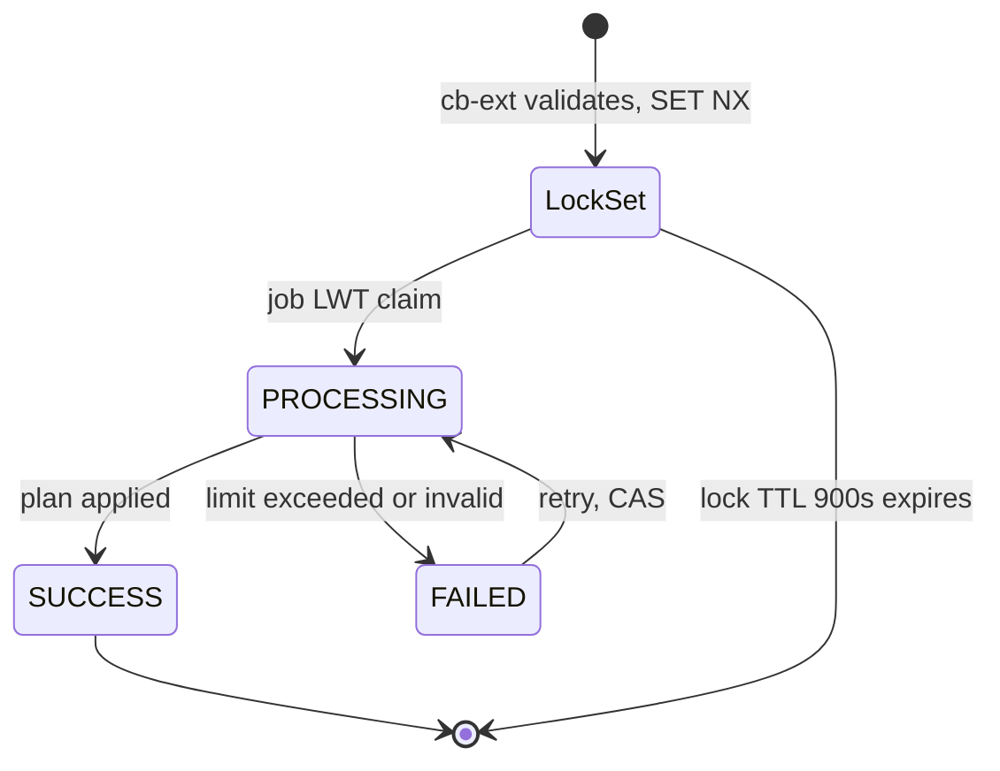

# Karma Points — LLD

Reverse-engineered from code. No CQL DDL exists in any repo traced, so primary keys
below are **inferred** from query builders and marked as such.

## Storage

**Cassandra** (keyspace `sunbird` unless noted):

| Table | Columns used | Notes |
|---|---|---|
| `user_karma_points` | `userid, credit_date, context_type, operation_type, context_id, addinfo, points` | Per-credit ledger. PK inferred `(userid, credit_date, context_type, operation_type, context_id)` |
| `user_karma_points_credit_lookup` | `user_karma_points_key, operation_type, credit_date` | Dedup index. Key `userId\|contextType\|contextId`, or a handler-specific key. PK inferred `(key, operation_type)` |
| `user_karma_points_summary` | `userid, total_points, addinfo` | `addinfo` JSON: `claimedNonACBPCourseKarmaQuota`, `formattedMonth` (`yyyy\|MM`), `curatedProgramMonthlyCount`, `curatedProgramFormattedMonth`, last streak dates |
| `user_karma_coin_wallet` | `userid, total_earned, total_redeemed` | Balance = earned − redeemed |
| `user_karma_coin_monthly_summary` | `userid, year_month, points_converted, updated_on` | Cap tracking |
| `user_karma_coin_transactions` | `userid, created_at, transaction_id, type, amount, balance_after, action_type, context_type, context_id, addinfo` | PK `(userid, created_at, transaction_id)` |
| `user_karma_coin_lookup` | `user_karma_coin_key, operation_type, credit_date, addinfo` | Key `userId\|POINTS_CONVERSION\|requestId`; `addinfo.status` PROCESSING / FAILED / SUCCESS plus the frozen plan |
| `mdo_karma_points`, `learner_leaderboard(_lookup)`, `mdo_top_learners`, `nlw_mdo_leaderboard` | leaderboard reads | Populated outside these repos |

**Postgres** (read by cb-ext): `nlw_user_leaderboard`, `slw_mdo_leaderboard`,
`slw_mdo_top_learners`.

**Redis:**

| Key | DB | Purpose |
|---|---|---|
| `user:karmaPoints:<userId>` | 0 | Mirror of `total_points` |
| `user:karmaCoins:<userId>` | 0 | Wallet JSON, TTL 3600 |
| dedup `userId\|contextType\|contextId` | 0 | First-level dedup, TTL `requestClaimTtlSeconds` |
| `CB_EXT_karmaCoinConvertLock:<userId>:<requestId>` | 0 | In-flight conversion; written by cb-ext (TTL 900) |
| `pendingEnrolment_<userId>_<contextId>` | 1 | Paid-course enrolment status, TTL 5 s |
| `karmaWalletBalance_<userId>` | 1 | Balance mirror (owner: enrollment-service); `INCRBY` on conversion |
| `learnerLeaderboard_<rootOrgId>_<userId>` | 2 | Leaderboard cache, TTL 3600 |

## Event handling (job V2)

`KarmaPointsKeySelector` extracts the userId per event type; `KarmaPointsProcessorFnV2`
dispatches to a handler extending the `EventHandler` trait. Standard credit:

1. Validate fields (missing → `DataQualityException`).
2. Check the lookup (`doesEntryExist`); skip if present.
3. `insertKarmaPoints` — ledger row, then lookup row.
4. `updateKarmaSummary` — read `total_points`, write `+delta`.
5. Mirror total to Redis (best-effort).

### Points formulas (V2)

- **Course completion** = `courseCompletion (5)`; Learning Pathway = `10`;
  `+ acbp (5)` if the course is on the user's ACBP plan, minus
  `min(monthsLate, 5)` if past the plan end date, where
  `monthsLate = years*12 + months + 1`.
- Non-ACBP completion is skipped when capping is on and the monthly count ≥ 4.
- **Curated Program** = 10, skipped at monthly count ≥ 2.
- **ACBP claim** = `+5` on the existing completion row (or a new row with
  `COURSE_COMPLETION=false`), quota −1.
- **Assessment high score** only when `score > 75`.

### Reversal

`UNENROLMENT` → set the `FIRST_ENROLMENT` row's points to 0 (`addinfo.UNENROLMENT=true`)
and subtract the old points from the summary. A later `FIRST_ENROLMENT` on the same
course re-awards on the same row (`REENROLMENT=true`) only if no active first-enrolment
credit exists.

## Wallet convert, step by step

**cb-ext (`KarmaCoinWalletServiceImpl.redeem`)**

1. Token → userId (401); role in authorized set (403).
2. `pointsToConvert` Number > 0, `requestId` non-blank.
3. Read wallet, monthly row, summary at QUORUM; subtract other in-flight lock points.
4. `unredeemed = max(0, total − earned − otherPending)`;
   `remainingCap = max(0, 300 − convertedThisMonth − otherPending)`.
5. `> unredeemed` → 400 `INSUFFICIENT_KARMA_POINTS`; `> min(cap, unredeemed)` → 400 `MONTHLY_CAP_EXCEEDED`.
6. `SET NX EX 900` lock; failure → 409.
7. Emit `POINTS_CONVERSION` to `karma.coin.wallet.redeem`; return `202`.

**Job (`PointsConversionHandler`)**

1. Validate (`contextType=POINTS_CONVERSION`, `operation=CREDIT`, `pointsToConvert>0`).
2. Redis dedup (SET NX); Cassandra LWT `INSERT … IF NOT EXISTS` into `user_karma_coin_lookup`
   with PROCESSING. SUCCESS → skip; FAILED → CAS back to PROCESSING; PROCESSING with a
   frozen plan → resume it.
3. Compute `unconverted = max(0, lifetimeKP − total_earned)`, remaining cap
   (300 − `points_converted`, month in Asia/Kolkata); over the maximum → FAILED
   `CONVERSION_LIMIT_EXCEEDED`, lock deleted, event to failed topic.
4. Freeze plan; `applyConversionPlan`: wallet → monthly summary → CREDIT transaction →
   lookup SUCCESS → Redis wallet cache → `INCRBY karmaWalletBalance` → delete lock.

## State machine — conversion

## Coin redemption and reaward (job)

- **COINS_REDEMPTION**: requires `operation=DEBIT`, `actionType=POINTS_REDEMPTION`,
  `coinsToRedeem ≤ total_earned − total_redeemed` else FAILED `INSUFFICIENT_BALANCE`;
  writes wallet (`total_redeemed` up), DEBIT transaction, publishes
  `EXT_COURSE_ENROLLMENT` payload to `user.paid.course.enrolment` (send not awaited).
- **COINS_REAWARD**: finds the original DEBIT transaction, checks amounts match,
  `total_redeemed −= coinsToReaward` (must stay ≥ 0), writes a CREDIT row.

## Module map

| Area | Key files |
|---|---|
| Producers | `InstructionEventGenerator.java` (course, LMS); `ContentConsumptionActor.scala:630-744`; `UserBaseActor.java:325-374` |
| cb-ext | `karmapoints/`, `karmacoinwallet/`, `walloffame/`, `nlw/ClaimEventKarmaPointsServiceImpl`, `ratings/RatingServiceImpl` |
| Job V2 | `karma-points-processor-v2/…/v2/{task,functions,handlers,exceptions,config}` |
| Job V1 | `karma-points-persist-processor/…/{functions,util/Utility.scala}` |
| Portal | `profile-v2/routes/{karma-wallet,profile-karmapoints}`, `karma-leaderboard-v2`, `profile-card-stats` |
| Mobile | `features/toc/…/about_tab/{claim_karmapoint,widgets/message_card}.dart`, `karmapoint_overview.dart`, `profile_data_strip.dart` |
| Staticweb | `shared/components/{hall-of-fame,rank-podium}` |

## Verification boundary

Column types and primary keys are inferred. `generateInstructionEventMetadata` (the
`UNENROLMENT` envelope), wallet terminal-status writes beyond the job code shown, and
the leaderboard-populating jobs were not read.
