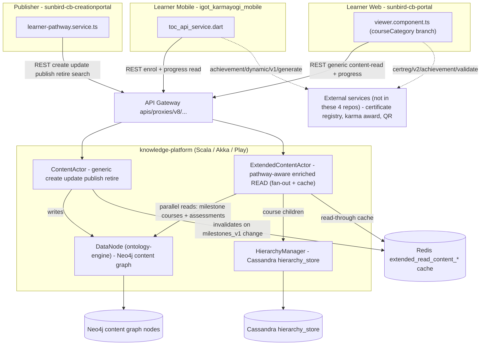

# Learning Pathway — HLD

Reverse-engineered from `sunbird-cb-creationportal`, `sunbird-cb-portal`,
`igot_karmayogi_mobile`, `knowledge-platform`.

## Topology

Learning Pathway is a **content-model overlay**, not a standalone service —
there is no box below labelled "Pathway Service" because none exists; the
only pathway-aware code sits inside two actors of the generic content
service.

Course, Collection, and Learning Pathway are the same underlying `Content`
object type, differentiated only by `courseCategory`. Assessment
configuration is delegated to the existing questionset content type and its
own hierarchy API. Certificate/achievement issuance points at services
outside the four repos scoped (dashed arrows mark that boundary).

## Responsibilities

| Component | Owns | Repo |
|---|---|---|
| `learner-pathway.service.ts` | Sole HTTP boundary for authoring: create/update/publish/retire/search | `sunbird-cb-creationportal` |
| `viewer.component.ts` + top-bar components | Milestone-locking computation, mandatory-only progress, milestone-completion popup, on web | `sunbird-cb-portal` |
| `toc_helper.dart` (`_calculateMilestoneProgress`) | The entire unlock/progress derivation engine on mobile | `igot_karmayogi_mobile` |
| `ContentActor` | Generic create/update/publish/retire; the only pathway-aware behaviour is cache invalidation when `milestones_v1`/`preliminaryAssessment` change | `knowledge-platform` |
| `ExtendedContentActor` | The sole pathway-specific backend component — enriched read, fanning out to resolve each milestone's referenced courses/assessments, Redis-cached | `knowledge-platform` |
| `content-strip-multiple` + `curated-courses` module | Org-targeted curated strips and a "Curated Collections" explorer that pathway content *can* ride on, if remote config includes it | `sunbird-cb-portal` |

**Not found in any of the four repos** (external, out of scope for this
trace): a bespoke "pathway cards" frontend component, attempt-count/cool-off
enforcement, and the certificate/QR/karma-award service implementations.

## Key design decisions

- **No pathway microservice, by construction.** Every write reuses the
  generic Content CRUD actors and routes; the only pathway-aware backend
  logic is a read-side enrichment layer (`ExtendedContentActor`) and a cache
  invalidation rule. This keeps the feature cheap to add but means it has no
  independent scaling, validation, or query surface of its own.
- **Unlock state is always client-derived, never server-pushed.** Both web
  and mobile independently recompute milestone lock/complete state from
  generic progress data on every relevant event (RxJS subjects on web,
  `ChangeNotifier`/`Selector` on mobile). This satisfies "unlock without
  refresh" for the acting learner's own session but doesn't reflect another
  concurrent session's completion in real time, and there is no shared code
  between the two clients' unlock engines — they're structurally similar,
  independently written.
- **Config-not-code for two whole subsystems.** Learner-facing access control
  (role/org/group visibility rules) and the discovery surfaces' actual
  content filters both come from remotely-hosted JSON/page configuration, not
  from anything in these repos — meaning their real behaviour in production
  can differ from what static code review can confirm.
- **Milestone data has no schema, by omission not design.** `milestones_v1`
  is an opaque JSON blob with no JSON Schema in `knowledge-platform/schemas/`
  and no server-side structural validation — the backend stores whatever a
  client sends.

See [LLD](lld.md) for the storage reality, state machines, and sequence
flows, and the [Operations Manual](operations-manual.md) for how these
decisions show up in day-2 support.
