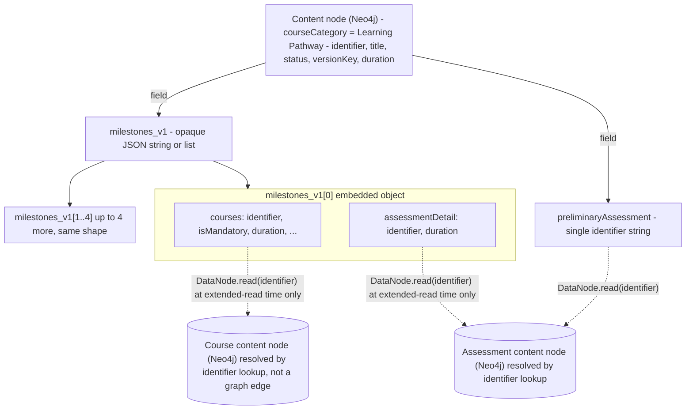
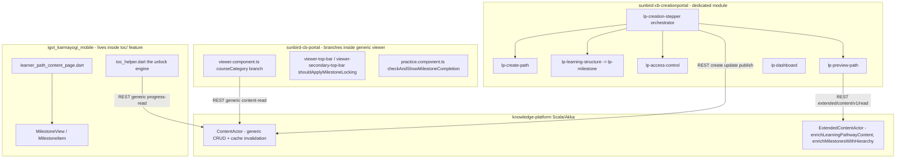
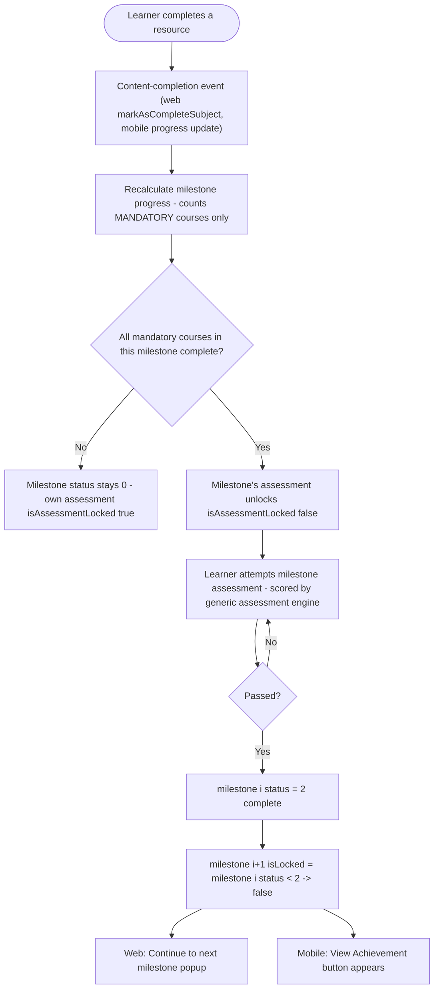
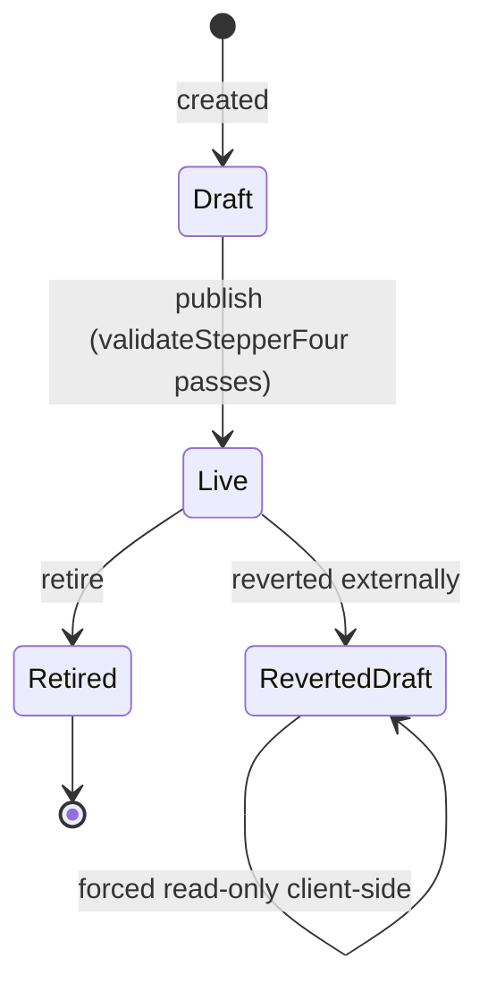
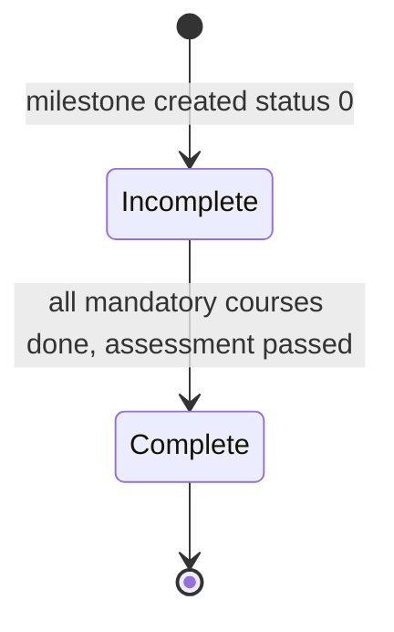

# Learning Pathway — LLD

Reverse-engineered from code. Where an assumed relational schema doesn't
match reality, the as-built structure is documented instead, with the
mismatch called out explicitly.

## Storage reality

There are no dedicated tables — no `learning_pathway`, `pathway_milestone`,
`milestone_course`, `learner_pathway_progress`, or `learner_milestone_progress`
anywhere in the four repos traced. This is the single biggest deviation from
what a "pathway feature" would normally look like.

**Neo4j (ontology-engine, via `DataNode`)** — one graph node per pathway, of
generic type `Content`:

| Property | Type | Notes |
|---|---|---|
| `identifier` | string | node ID |
| `contentType` | string | `"Course"` |
| `primaryCategory` | string | `"Course"` |
| `courseCategory` | string | `"Learning Pathway"` — the sole discriminator |
| `mimeType` | string | `"application/vnd.ekstep.content-collection"` |
| `title`, `description`, `purpose` | string | learning outcome stored in `purpose` |
| `appIcon`, `posterImage`, `creatorLogo` | string (URL) | |
| `milestones_v1` | string (JSON) or list | opaque JSON |
| `preliminaryAssessment` | string | assessment content identifier |
| `accessSettingsEnabled` | boolean | |
| `duration` | number | computed client-side, stored server-side |
| `status`, `prevStatus` | string | `Draft` / `Live` / retired (unconfirmed) |
| `versionKey` | string | optimistic-concurrency token, required on every PATCH |

**Cassandra (`hierarchy_store`, via `HierarchyManager`)** stores the generic
content-hierarchy tree for referenced Course nodes' own children — it is
**not** used for pathway↔milestone↔course relationships, which live inside
the `milestones_v1` JSON instead.

**Redis** is a cache only, key `extended_read_content_{identifier}`, TTL
configurable (default 86400s) — not a source of truth.

**Milestone** (embedded object inside `milestones_v1`, no table):

```jsonc
{
  "id": "uuid",
  "index": 1,
  "name": "string, <=70 chars",
  "description": "string, <=1000 chars",
  "courses": [
    { "identifier": "string", "name": "string", "isMandatory": true,
      "appIcon": "url", "posterImage": "url", "lastPublishedOn": "iso-date",
      "description": "string", "duration": 0 }
  ],
  "assessmentDetail": { "identifier": "string", "duration": 0 }
}
```

There is nothing to relate below the single pathway node — everything is
embedded JSON, not rows. The one real edge in the whole structure is a plain
string `identifier`, resolved by ID lookup at read time, never by a foreign
key or graph edge:



Dashed arrows are resolved on demand by ID lookup, not a persisted
relationship — there is no reverse index, so "which pathways reference
course X" requires a full scan, and a milestone can reference a since-deleted
course with no referential-integrity check catching it.

## API detail

### Update (generic, used for every field group)

```plaintext
PATCH action/content/v3/update/{id}
Body: { request: { content: { versionKey, ...changedFields } } }
```

Used for metadata edits, `milestones_v1` array replacement (whole-array PUT
semantics — no partial-milestone update endpoint), `preliminaryAssessment`
id, `accessSettingsEnabled`, and asset linking.

### Backend extended-read, step by step

```plaintext
GET /content/v1/extended/read/:identifier
  -> ExtendedContentController.extendedRead
  -> ExtendedContentActor ! Request(operation="extendedReadContent")
  -> extendedRead():
      1. read(identifier) via generic ContentActor read path (Neo4j DataNode.read)
      2. if courseCategory == "Learning Pathway":
           parseMilestones(metadata["milestones_v1"])
           for each milestone (parallel):
             fetchCourseWithHierarchy(courseId) -> DataNode.read (Neo4j) + HierarchyManager.getHierarchy (Cassandra)
             fetchAssessmentRead(assessmentId) -> DataNode.read (Neo4j, no hierarchy, leaf node)
           merge results back into milestone.courses[] / milestone.assessmentDetail
           enrichPreliminaryAssessment() - same pattern, single identifier
      3. cache result in Redis (extended_read_content_{id}, TTL from config)
```

No pagination, partial-field selection, or filtering exists on this
endpoint — it always returns the full enriched tree.

## Module map



No shared library exists between the four repos for pathway logic — each
client independently reimplements its own read of `courseCategory` /
`milestones_v1` and its own unlock computation.

## Sequence: milestone unlock (the load-bearing mechanism)

This is entirely client-computed on both platforms — there is no server-side
"unlock" call anywhere in this chain.



## State machine

**Pathway status** (informal, string-literal-based — no enum found in code):



`RevertedDraft` (`prevStatus = Live`, `status = Draft`) is a real, distinct
state discovered in `isLearningPathwayReadOnly()` — not documented in any
requirements summary, and no path back to fully editable was found.

**Milestone status** (mobile, binary only):



No "in progress" (status 1) state is ever emitted — partial completion looks
identical to not-started.

The two lock flags on a milestone are independent: `isLocked` depends on the
**previous** milestone's status; `isAssessmentLocked` depends on **this**
milestone's own mandatory-course completion. A milestone can be unlocked
while its own assessment is still locked.

> **Verification boundary:** facts above are read from
> `sunbird-cb-creationportal`, `sunbird-cb-portal`, `igot_karmayogi_mobile`,
> and `knowledge-platform`. Not analysed from source: the certificate
> registry, karma-points award, and QR-generation services — their
> behaviour is only visible as calls made *into* them from the traced
> clients. Attaching those repos would close the gap, as would the assessment
> config's external `@sunbird-cb/consumption` package (numeric bounds for
> attempts/passing-score are delegated there and unverified) and the remote
> JSON config that drives access control and discovery filtering.
