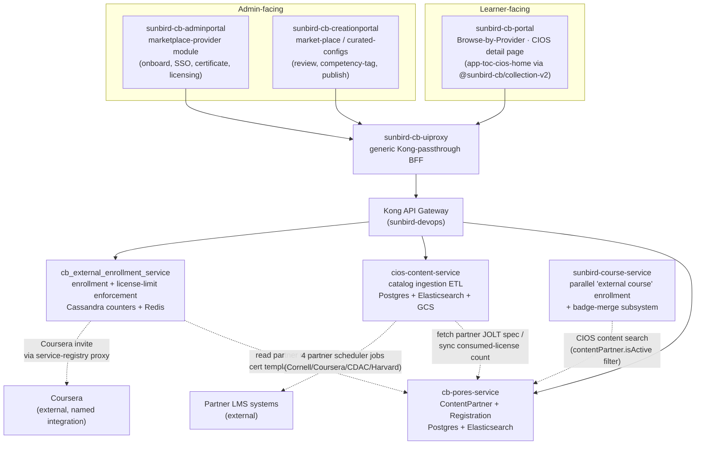

# Marketplace — HLD

Verified from the 9 repos listed in [index.md](index.md).

## Topology

## Service responsibilities

| Service | Owns | Does NOT own |
|---|---|---|
| `cb-pores-service` | `ContentPartner` master record, `ContentPartnerRegistration`, partner licensing config (`licenseType`, limits — as configuration, not enforcement), partner SSO config, partner-scoped notification emails | License-limit enforcement, catalog content, enrollment |
| `cios-content-service` | Catalog ingestion pipeline (Excel → GCS → Kafka → JOLT transform → Postgres + ES), partner progress-sync scheduler jobs, SSO client provisioning in Keycloak | Partner master data (fetches it from `cb-pores-service`), enrollment |
| `cb_external_enrollment_service` | The actual enrollment write, per-partner license-limit enforcement (overall/user-wise/concurrent/course-level), a local `CiosContentEntity` mirror, Coursera invite integration | Catalog ingestion, partner master data |
| `sunbird-course-service` | A **second, independent** external-course enrollment path (`externalCoursesEnrolment_db`) and badge/cert merge for external completions | Nothing marketplace-specific is delegated to it — it duplicates rather than calls `cb_external_enrollment_service` |
| `sunbird-cb-uiproxy` | Generic Kong-passthrough for every marketplace/CIOS/partner path | Any marketplace-specific base-URL config — routing is entirely Kong's job |
| `sunbird-devops` | Kong route/plugin definitions, Helm charts, CI/CD pipelines for the above services | — |
| `sunbird-cb-adminportal` | Partner onboarding/licensing/SSO/certificate UI | Catalog curation UI (that's Creation Portal) |
| `sunbird-cb-creationportal` | Catalog review/curation/competency-tagging/publish UI | Partner master-data UI (that's Admin Portal) |
| `sunbird-cb-portal` | Learner discovery (provider directory, spotlight card, see-all Providers tab), CIOS detail/enroll page, competency-passbook Marketplace tab | Enrollment logic itself (delegates to `cb_external_enrollment_service` via the `@sunbird-cb/collection-v2` library) |

## Three independent enrollment/entitlement code paths

> **The one decision that defines the feature**, restated for HLD: there is
> no single service that is "the" marketplace enrollment engine.

1. **`cb_external_enrollment_service`** (`/cios-enroll/v1/create`) — the
   path the learner-facing UI actually calls. Enforces license limits via
   Cassandra counters + Redis; local `CiosContentEntity` cache
   (`partnerId`-scoped).
2. **`sunbird-course-service`'s external-course subsystem**
   (`CourseEnrolmentActorV3`/`ExtendedCourseEnrollmentActor`) — a
   completely separate Cassandra table (`externalCoursesEnrolment_db`),
   its own eligibility check (`isExternalCourseEligible`, driven by a
   locally-cached CIOS content fetch), and its own badge-merge logic. No
   code path found in either service that calls the other.
3. **The native Course enrollment pipeline** in the same
   `sunbird-course-service` repo, which marketplace content rides
   *underneath* wherever it's represented as ordinary platform content
   (not confirmed as a common case — most marketplace content appears to
   stay in the CIOS-specific paths above).

This is a real architectural inconsistency, not a documentation gap — each
path was independently implemented against its own storage.

## Data-store map

| Store | Owner | What lives there |
|---|---|---|
| Postgres (`sunbird` DB) | `cb-pores-service` | `content_partner`, `content_partner_registration` (JSONB) |
| Postgres (separate schema) | `cios-content-service` | `file_information_entity`, `cios_log_info`, `cornell_content_entity` (generic despite the name — holds all partners' ingested content) |
| Elasticsearch | `cb-pores-service` | `content_provider_alias`, `content_provider_registration_alias` |
| Elasticsearch | `cios-content-service` | Its own CIOS content index (driven by `esRequiredFieldsJsonFilePath.json`) — a **different** index from `cb-pores-service`'s |
| Cassandra (`sunbird_courses` keyspace) | `cios-content-service` (scheduler jobs), `cb_external_enrollment_service` | `user_external_enrolments` (progress reconciliation) |
| Cassandra | `cb_external_enrollment_service` | Per-partner enrollment/license counters |
| Cassandra (separate table) | `sunbird-course-service` | `externalCoursesEnrolment_db` — **not** the same table as above |
| Redis | `cb-pores-service`, `cb_external_enrollment_service` | Provider record cache, search-result cache, license-counter cache |
| GCS | `cios-content-service` | Uploaded catalog/progress files, generated logs |
| Kafka | `cb-pores-service`, `cios-content-service`, `cb_external_enrollment_service` | Registration notifications, partner activate/deactivate cascade, content onboarding, enrollment counter updates, progress-from-partner, certificate generation |

> **Verification boundary:** the topology above is built from confirmed
> outbound HTTP/Kafka calls in each of the 9 repos. Not verified: Kong's
> internal routing decisions for paths not explicitly sampled in
> [APIs](apis.md), and any service reachable only through the third-party
> `@sunbird-cb/collection-v2` package.
