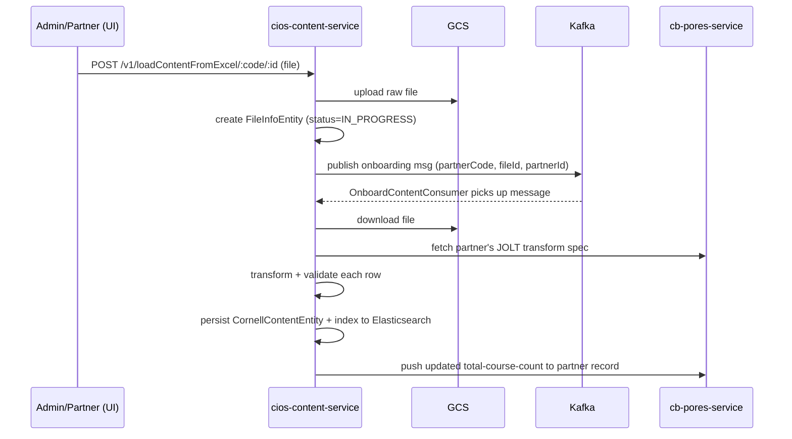
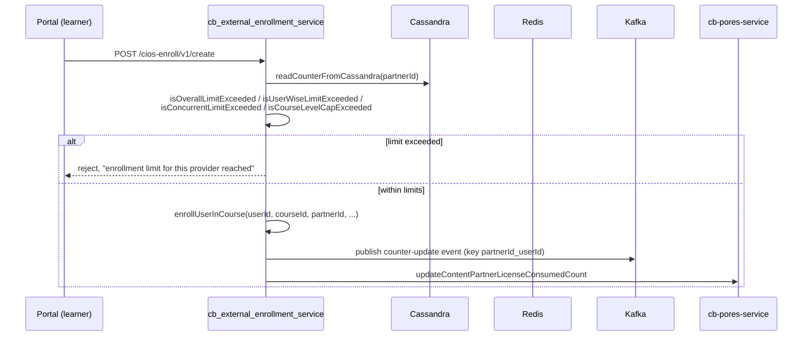

# Marketplace — LLD

Verified from the 9 repos listed in [index.md](index.md).

## Entities

### `ContentPartnerEntity` (`cb-pores-service`, table `content_partner`)

`id` (PK), `data` (JSONB — `partnerCode`, `contentPartnerName`,
`licenseType`, `licenseConsumedCount`, `overAllLimit`,
`userWiseLimitEnabled`, `concurrentLimitEnabled`, `addKarmaPointEnabled`,
`isAuthenticate`, `providerType`, `isTrainingInstitution`, plus CIOS
transform config: `trasformContentJson` [sic — typo present in the field
name itself], `transformContentViaApi`, `transformProgressJson`,
`transformProgressViaApi`), `certificateTemplateUrl`,
`serviceRegistryDetails`, `contentFileValidation`, `isActive`, `createdOn`,
`updatedOn`.

`partnerCode` is generated as `IGOT-<ORGWORD>-<5charRandom>`
(`ContentPartnerServiceImpl.generatePartnerCode`). `licenseType` is
lock-on-set: `updateContentPartner()` throws
`LICENCE_TYPE_CANNOT_BE_CHANGED` if a caller tries to change it after
first configuration.

### `ContentPartnerRegistrationEntity` (`cb-pores-service`, table `content_partner_registration`)

`id` (PK), `data` (JSONB), `applicationId` (unique, not null), `createdOn`,
`updatedOn`. Status lives inside `data` (`PENDING`/`APPROVED`/`REJECTED`),
not as a first-class column.

### `CornellContentEntity` (`cios-content-service`, table `cornell_content_entity`)

Despite the partner-specific name, this is the **generic** ingested-content
table for every partner (Cornell, Coursera, Harvard, CDAC, and any other
onboarded partner) — composite key `externalId`+`partnerId`. Fields:
`externalId`, `partnerId`, `partnerCode`, `ciosData` (JSONB — the fully
transformed content, including `courseType`/`courseEnrolLimit`/
`requiredKarmaPoints`), `sourceData` (JSONB, raw pre-transform row),
`isActive`, `createdDate`, `updatedDate`, `fileId`.

### `CiosContentEntity` (`cb_external_enrollment_service`)

A **separate, third** local mirror of CIOS content: `contentId`,
`externalId`, `ciosData` (JSONB), `isActive`, `createdOn`, `lastUpdatedOn`,
`partnerId`. This service does not read `CornellContentEntity` directly —
it maintains its own copy, fetched via the CIOS read API.

### `FileInfoEntity` / `FileLogInfoEntity` (`cios-content-service`)

Tracks each catalog upload job: `fileId` (PK), `fileName`, `initiatedOn`,
`completedOn`, `status`, `partnerId`, GCS file names. `FileLogInfoEntity`
holds per-file processing logs (`logData` JSONB, `isHasFailure`).

## Licensing model (as configured, and what enforces it)

| Field | Set where | Enforced where |
|---|---|---|
| `licenseType` (`User` / `Course`) | `cb-pores-service`, lock-on-set | Read (not enforced) by `sunbird-cb-creationportal`'s curation wizard to lock course-type/karma-point fields |
| `overAllLimit`, `userWiseLimitEnabled`, `concurrentLimitEnabled` | `cb-pores-service`, defaults zeroed/disabled at partner creation | **Enforced in `cb_external_enrollment_service`** (`isOverallLimitExceeded`, `isUserWiseLimitExceeded`, `isConcurrentLimitExceeded`, `isCourseLevelCapExceeded`), via Cassandra counters read at `readCounterFromCassandra` |
| `licenseConsumedCount` | Incremented in `cb_external_enrollment_service` on enrollment, synced back to `cb-pores-service` via `updateContentPartnerLicenseConsumedCount` | Read by `cb-pores-service` only for display; the counting/decision logic lives entirely in `cb_external_enrollment_service` |
| `courseType`, `courseEnrolLimit`, `requiredKarmaPoints` | `cios-content-service` (validated + indexed on ingest, added in the "Marketplace Enhancements / Partner Licensing Administration" commit) | **Not enforced anywhere found in `cios-content-service`** — confirmed via repo-wide grep, these fields are validated and stored but never read by any business logic in that repo. Enforcement (if any) must happen in `cb_external_enrollment_service` or the curation-portal UI, not in the ingestion service. |

A legacy-field migration exists in `cb_external_enrollment_service`'s
`TransformUtility` for older partner records that used misspelled keys
(`liscenceType`, `licenceConsumedCount`) before the schema was corrected —
handled, not a live bug, but evidence of schema-evolution debt.

## Ingestion pipeline (sequence)

An `else` branch in `saveOrUpdateCornellContent` (when existing content
status is already `live`/`draft`) is an **empty body with a comment**
("kafka changes need to add") — re-ingesting an already-live/draft item is
a confirmed no-op with no event emitted; this is a real, acknowledged gap
in the code itself, not an inferred one.

## Enrollment + license-check sequence (`cb_external_enrollment_service`)

## Known bugs / inconsistencies (LLD-level, confirmed by reading code)

| Repo | File:location | Bug |
|---|---|---|
| `cb-pores-service` | `ContentPartnerRegistrationServiceImpl.read()` (lines 212-238) | Documented as "id OR email" but the actual condition is `applicationId != empty && email != empty` (AND) — a single-param call throws an unhandled `NoSuchElementException`, surfaced as a 500 rather than the intended 400 |
| `cb-pores-service` | `ContentPartnerServiceImpl.getContentDetailsByPartnerCode()` (lines 417-447) | Catch block `return null;` instead of an error `ApiResponse` — the controller wraps this in `HttpStatus.OK`, risking a downstream NPE |
| `sunbird-cb-adminportal` | `market-place-dashboard.component.ts:202-203` | `formateProvidersList()` sets `element.updatedOn` from `element.createdOn` — the "Last Updated On" column always shows creation date |
| `sunbird-cb-adminportal` | `certificate-configuration.component.ts:355` | `processMergeLogo()` has an empty `catch (error: any) {}` — logo-merge failures are silently swallowed, no user feedback |
| `sunbird-cb-creationportal` | `curation-content.component.ts:936` | `await new Promise(resolve => setTimeout(resolve, 200))` before re-searching a just-onboarded course — a comment claims "100ms delay" but the code uses 200ms; a timing hack rather than a state check |
| `sunbird-cb-creationportal` | `curation-content.component.ts:451` | `byProgramIds: 'F3F_2DjnR0Wxf9g45zdFsg'` hardcoded inside the "via API" partner-course fetch — looks like leftover test data |
| `sunbird-cb-uiproxy` | `proxies_v8.ts:1230-1268` | A specific `GET /cios/v1/content/read/:contentId` handler is registered *after* a catch-all `.use('/cios/*', ...)` that never calls `next()` — the specific handler is unreachable dead code |
| `sunbird-cb-uiproxy` | `src/authz.ts:12-20` | `validateKeycloak()` only checks `cookie.includes('access_token')` and returns a hardcoded user id — not real token verification, despite gating partner-course enrollment authorization |
| `cios-content-service` | `DataTransformUtility.java:410-412` | Empty `else` branch, comment "kafka changes need to add" — confirmed no-op on re-ingest of already-live/draft content |
| `sunbird-cb-portal` | `event-detail.component.html:34,35,49,50,216` | Template reads `fromMarketPlace` to swap a certificate icon, but that property is **never declared or assigned anywhere in the repo** — the branch is permanently dead |

## Storage-layer duplication summary

Three separate "local copy of CIOS content" caches exist with no shared
code between them: `CornellContentEntity` (`cios-content-service`, the
ingestion system-of-record), `CiosContentEntity`
(`cb_external_enrollment_service`, fetched via the CIOS read API), and
`ContentCacheHandlerV2`'s external-content cache
(`sunbird-course-service`, fetched via `cb-pores-service`'s CIOS search).
None of the three reads from either of the other two.

> **Verification boundary:** every bug/inconsistency above is a direct
> reading of the cited file, not an inference. Not verified: runtime
> behaviour (none of these were exercised against a live environment —
> this is a static-code analysis pass), and any license-limit enforcement
> that might exist outside the 9 repos traced.
