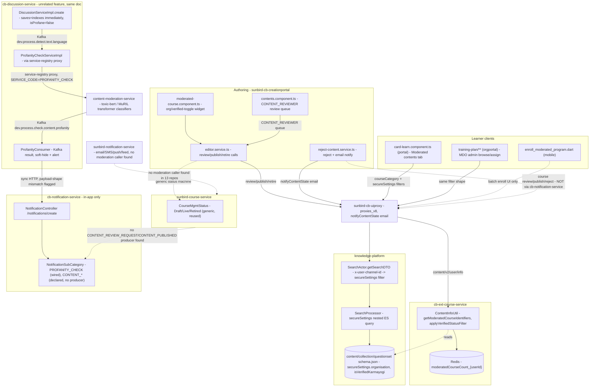

# Moderated Content — HLD

Reverse-engineered from `sunbird-cb-creationportal`, `sunbird-cb-portal`,
`sunbird-cb-orgportal`, `igot_karmayogi_mobile`, `knowledge-platform`,
`sunbird-cb-ext`, `sunbird-course-service`, `cb-ext-course-service`,
`sunbird-cb-uiproxy`, `content-moderation-service`, `cb-discussion-service`,
`cb-notification-service`, `sunbird-notification-service`.

## Topology

## Responsibilities

| Component | Owns | Repo |
|---|---|---|
| `moderated-course.component.ts` | Authoring UI for MDO org-list + verified-Karmayogi toggle, writes `secureSettings.*` | `sunbird-cb-creationportal` |
| `contents.component.ts` | Role-driven review queue (`CONTENT_REVIEWER` sees For Review/Under Publish/Live) — generic to all content, not moderated-content-specific | `sunbird-cb-creationportal` |
| `editor.service.ts` | Generic review/publish/retire/status-change API calls, reused unmodified by moderated content | `sunbird-cb-creationportal` |
| `card-learn.component.ts` | Learner-facing "Moderated contents" tab, MDO + verified-status scoped search, conditionally shown | `sunbird-cb-portal` |
| `SearchActor` / `SearchProcessor` | The actual enforcement point — Elasticsearch nested-query restriction on `secureSettings.organisation`, defaulted from the caller's org header | `knowledge-platform` |
| `ContentInfoUtil` | Backend moderated-content identifier lookup + verified-status filter injection + Redis caching | `cb-ext-course-service` |
| `CourseMgmtStatus` / generic content workflow | Draft/Review/Live/Retired state machine every content type (including moderated) rides on | `sunbird-course-service` |
| `DiscussionServiceImpl` / `ProfanityCheckServiceImpl` / `ProfanityConsumer` | Async text-profanity pipeline for discussion posts/replies — unrelated code path to the above | `cb-discussion-service` |
| `text_profanity_service.py` | Transformer-based (toxic-bert/MuRIL) profanity classification, chunking, aggregation | `content-moderation-service` |
| `NotificationController` / `NotificationSubCategory` | In-app notification store; `PROFANITY_CHECK` has a confirmed producer, `CONTENT_*` subcategories do not | `cb-notification-service` |
| `sunbird-notification-service` | Multi-channel (email/SMS/push/feed) dispatch engine; no confirmed moderation-related caller | `sunbird-notification-service` |

**Not found in any of the 13 repos**: a producer for
`CONTENT_REVIEW_REQUEST`/`CONTENT_PUBLISHED`/`CONTENT_REJECTED`
notifications; a producer for the peer-validation/evaluation
approve-reject Kafka topics; any code tying the discussion-post
profanity pipeline to the course/program moderation workflow — they are
entirely independent systems that happen to share the word "moderation."

## Key design decisions

- **"Moderated" is a `courseCategory` value, not a content type.**
  `Moderated Course`/`Moderated Program`/`Moderated Assessment` are just
  values of the same `courseCategory` field every Sunbird content has;
  `content-type-util.ts` maps all three back to `EContentTypes.COURSE`
  for rendering. There is no dedicated moderated-content schema, table,
  or service — the feature is entirely composed from generic primitives
  (`secureSettings`, the generic review workflow, generic search).
- **MDO restriction is enforced at the search engine, not just the UI.**
  `SearchProcessor`'s nested Elasticsearch query on
  `secureSettings.organisation` means a client that skips the UI filter
  still cannot retrieve out-of-org moderated content through the search
  API — `SearchActor` auto-injects the caller's own org if no explicit
  filter is supplied. This is a real access-control boundary, not
  cosmetic hiding.
- **Review/approval reuses the generic Sunbird content workflow
  verbatim.** The `CONTENT_REVIEWER` review queue, `InReview`/`Reviewed`
  states, and publish/retire endpoints are identical to what every other
  content type uses — moderated content gets no dedicated approval UI,
  API, or role beyond the org-scoping widget itself.
- **Two duplicate implementations of the same moderated-content-fetch
  logic appear to coexist in `cb-ext-course-service`**
  (`ContentInfoUtil` and `CourseAccessServiceImpl`), the latter also
  carrying a generic `AccessSettingRuleCacheMgr` Redis cache whose exact
  relationship to moderated-content scoping (vs. the separate CB-Plan
  targeting feature) was not fully resolved from static reading.
- **Text-profanity moderation is architecturally unrelated to
  course/program moderation.** Different repos, different data model
  (`isProfane` boolean + `profanityCheckStatus` string vs.
  `status`/`reviewStatus`), different notification subcategory
  (`PROFANITY_CHECK` vs. the unfired `CONTENT_*` set), and a
  fundamentally different enforcement pattern (soft-hide-from-listings
  after async detection, vs. pre-publish reviewer gate). Documenting them
  under one "Moderated Content" umbrella follows the task's grouping, not
  a shared implementation.
- **Notification coverage is asymmetric and mostly unconfirmed.** Of all
  the moderation-adjacent notification types the platform's own taxonomy
  implies should exist (course submitted-for-review, approved, rejected;
  peer-validation approved/rejected), only the discussion-profanity alert
  has a fully-traced producer — and even that one has a payload-shape
  mismatch with its receiving endpoint that was not confirmed to work at
  runtime. `sunbird-cb-creationportal`'s own uiproxy-routed email
  notifications for review/publish state changes are a separate,
  parallel mechanism from `cb-notification-service`'s in-app system.

See [LLD](lld.md) for storage detail, precondition chains, and sequence
flows, and the [Operations Manual](operations-manual.md) for how these
decisions show up in day-2 support.
