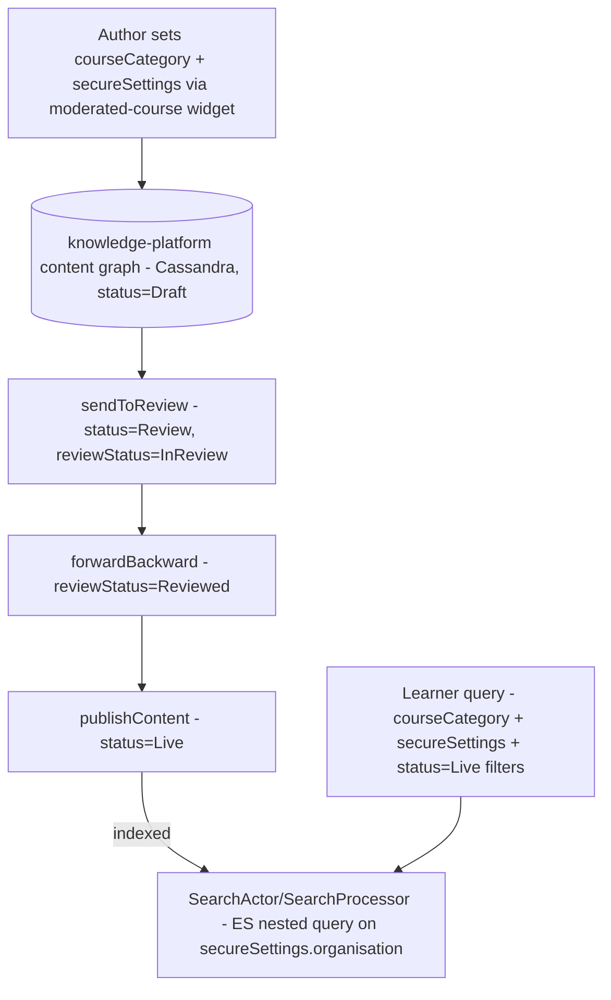
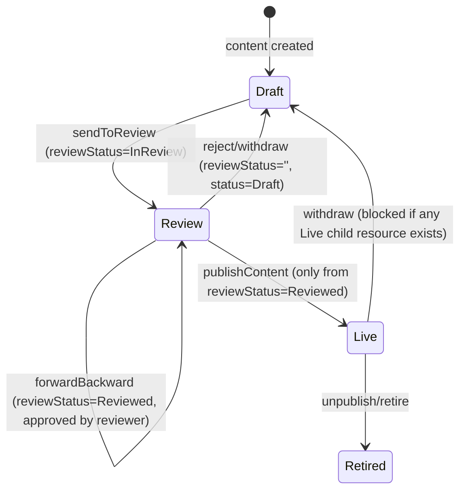
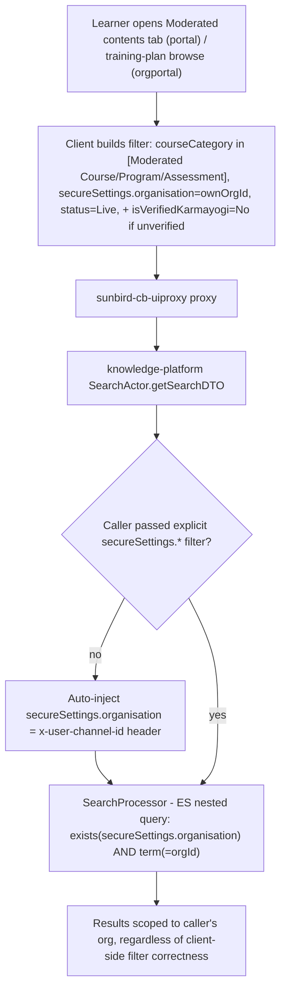
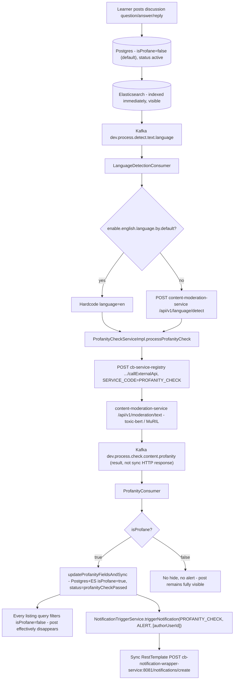

# Moderated Content — LLD

Reverse-engineered from code. Where two implementations of the same logic
appear to coexist, or a producer/consumer pair can't be fully matched,
the as-built reality is documented explicitly rather than assumed.

## Storage reality — access control / review workflow

**No dedicated moderation table.** MDO-scoping and review state live
inside the existing content-graph record (Cassandra-backed in
`knowledge-platform`), as generic properties defined in the
content/collection/questionset JSON schemas:

| Field | Schema location | Values |
|---|---|---|
| `courseCategory` | `schemas/content/1.0/schema.json` | `Moderated Course`, `Moderated Program`, `Moderated Assessment` (among many other category values) |
| `status` | generic content status | `Draft`, `Review`, `Live`, `Retired` |
| `reviewStatus` | generic content status | `''` (none), `InReview`, `Reviewed` |
| `secureSettings.organisation` | `schemas/{content,collection,questionset}/1.0/schema.json` | array/string of MDO org IDs (`sbOrgId`) |
| `secureSettings.isVerifiedKarmayogi` | same | `"Yes"` / `"No"` |

**Redis** — `cb-ext-course-service` caches moderated-content identifier
lookups per user under `moderatedCourseCount_{userId}`
(`Constants.MODERATED_COURSE_COUNT_REDIS_KEY_PREFIX`), and a generic
`AccessSettingRuleCacheMgr`/`CachedAccessSettingRule` Redis cache
(`{contextId, contextIdType, contextData, isArchived}`) used by
`CourseAccessServiceImpl` — **not confirmed** whether the latter is used
for moderated-content scoping specifically or the separate CB-Plan
targeting feature; both reference the same class.

## State model — content review (generic, reused by moderated content)

No moderated-content-specific state exists on top of this — the same
machine every Sunbird content type uses.

## Sequence: learner sees moderated content (search-time enforcement)

**Verification boundary**: query construction traced through
`SearchProcessor.formQueryImpl` (lines 432-494); not traced through a
live Elasticsearch request end-to-end, so the net effect of the
`mustNot(getSecureSettingsSearchDefaultQuery())` branch (used when secure
settings are neither explicitly enabled nor disabled) is inferred from
the query-builder code, not runtime-confirmed.

## Storage reality — discussion text-profanity moderation (unrelated data model)

| Field | Location | Values |
|---|---|---|
| `isProfane` (Boolean) | `DiscussionEntity`, `DiscussionAnswerPostReplyEntity` (Postgres) | `false` (default at create) / `true` |
| `profanityCheckStatus` (String) | same entities | `profanityCheckPassed`, `profanityCheckCallFailed`, `profanityCheckUpdateFailed`, `languageNotDetected`, `languageDetectionCallFailed`, or unset |
| `profanityresponse` (jsonb) | same entities | raw `content-moderation-service` response, for audit/traceability |

Elasticsearch mirrors `isProfane` on the same document; every listing
query hardcodes `isProfane=false` as a post-filter.

## Sequence: discussion post created → async profanity check → soft-hide

**Fail-open on error**: if the outbound registry call throws,
`profanityCheckStatus` is set to `profanityCheckCallFailed` with
`isProfane=false` (line 70-73 of `ProfanityCheckServiceImpl.java`) — the
post stays visible, not hidden pending retry.

**Payload-shape mismatch (flagged, not confirmed broken at runtime)**:
`NotificationTriggerService.sendNotification` posts a flat
`{subCategory, subType, user_ids, message}` body with no `request`
envelope and no `X-Auth-Token` header, while
`cb-notification-service`'s `NotificationController.createNotification`
expects `{request:{...,type}}` plus that header to resolve the userId.

## Module map

```mermaid
flowchart TB
    subgraph Authoring["sunbird-cb-creationportal"]
        A1["moderated-course.component.ts"]
        A2["auth-picker.component.ts"]
        A3["contents.component.ts - review queue"]
        A4["editor.service.ts"]
        A5["reject-content.service.ts"]
    end

    subgraph LearnerWeb["sunbird-cb-portal"]
        L1["card-learn.component.ts"]
        L2["search-filters.component.ts"]
        L3["notifications.service.ts - handleReviewStatus, handleDiscussionRedirection"]
    end

    subgraph OrgAdmin["sunbird-cb-orgportal"]
        O1["training-plan/** - browse/assign moderated content"]
    end

    subgraph Backend["knowledge-platform + sunbird-course-service + cb-ext-course-service"]
        B1["SearchActor / SearchProcessor"]
        B2["CourseMgmtStatus - generic workflow"]
        B3["ContentInfoUtil - moderated identifiers + Redis cache"]
    end

    subgraph TextMod["content-moderation-service + cb-discussion-service - unrelated subsystem"]
        T1["text_profanity_service.py"]
        T2["ProfanityCheckServiceImpl.java"]
        T3["ProfanityConsumer.java"]
    end

    subgraph Notif["cb-notification-service + sunbird-notification-service"]
        N1["NotificationController - in-app, PROFANITY_CHECK wired"]
        N2["sunbird-notification-service - multichannel, no moderation caller found"]
    end

    A1 --> A4
    A2 --> B1
    A3 --> A4
    A5 -->|"uiproxy notifyContentState email"| N2Ext["(uiproxy email, not N1/N2)"]
    L1 --> B1
    L2 --> B1
    O1 --> B1
    B3 -.->|"reads"| B1
    T2 --> T1
    T3 --> N1
    L3 -.->|"consumes PROFANITY_CHECK notification"| N1
```

## Validation / enforcement reality

| Rule | Enforced | Where |
|---|---|---|
| `courseCategory` distinguishes moderated content | Data model only, no runtime validation logic beyond enum values | `ECourseCategory` (creationportal), primary_categories.dart (mobile) |
| MDO org restriction | Backend, search-engine level | `SearchProcessor.getSecureSettingsSearchQuery` |
| Verified-Karmayogi restriction | Backend, conditional (only for unverified callers) | `ContentInfoUtil.applyVerifiedStatusFilter` |
| Content review requires `CONTENT_REVIEWER` role | Frontend (role-gated tabs) + backend route ACL (`sunbird-cb-uiproxy whitelistApis.ts`, ~50 `CONTENT_REVIEWER`-gated routes) | `contents.component.ts`, `whitelistApis.ts` |
| Parent withdraw blocked if child is Live | Frontend only | `reject-content.service.ts.getChildListData` |
| Discussion post profanity check | Backend, async, fail-open on error | `ProfanityCheckServiceImpl`, `ProfanityConsumer` |
| Flagged post hidden from listings | Backend, post-filter on every listing query | `DiscussionServiceImpl` (`IS_PROFANE=false` at every search/feed call site) |
| Flagged post deleted or submission blocked | **Not enforced anywhere** — soft-hide only | — |
| Course/program approval notification | **No confirmed producer** in any of the 13 repos | — |
| Peer-validation/evaluation approval notification | **No confirmed producer** in any of the 13 repos | — |

> **Verification boundary**: facts above are read from the 13 repos
> listed in [index.md](index.md). Not analyzed from source:
> `cb-service-registry`'s actual forwarding implementation (only the
> calling code's routing hint was read); any producer for the
> `CONTENT_*`/peer-validation notification subcategories, which likely
> live in services outside this set; and full resolution of
> `CourseAccessServiceImpl`'s apparent duplication of `ContentInfoUtil`'s
> moderated-content logic.
