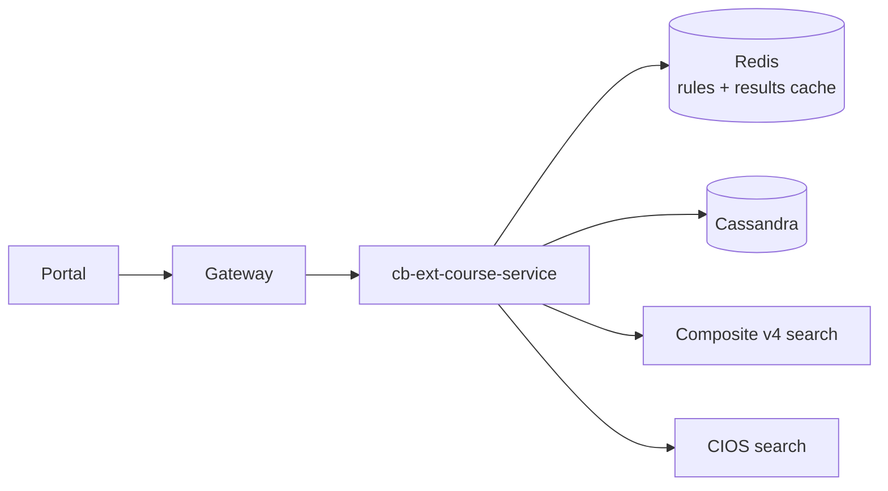

# My Assigned Courses — High-Level Design

Portal → gateway → **cb-ext-course-service**, which fans out to:

- **Redis** — cached access-setting rules and course results
- **Cassandra** — user/enrolment data
- **Composite v4 search** (Sunbird search host) — course resolution
- **CIOS search host** — external partner content

Assignment answers are cache-first; searches are bounded.

