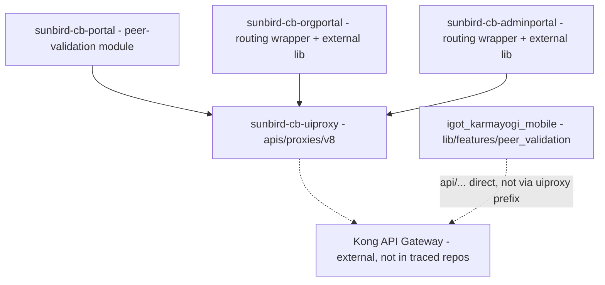
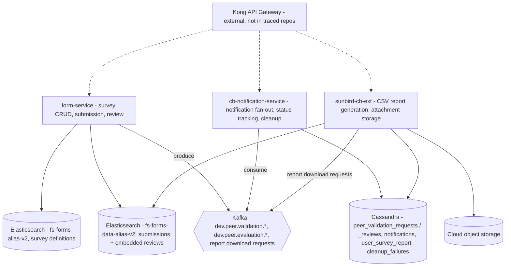

# Peer Validation — HLD

Reverse-engineered from `form-service`, `cb-notification-service`,
`sunbird-cb-ext`, `sunbird-cb-uiproxy`, `sunbird-cb-portal`,
`sunbird-cb-orgportal`, `sunbird-cb-adminportal`, and
`igot_karmayogi_mobile`.

## Topology

There is no single "Peer Validation service." Three backends each own a
slice, correlated only by shared string IDs across different databases —
there is no transactional boundary spanning all three.

Split into two diagrams for readability — client access into the gateway,
then what happens behind it.

**Client access:**

**Backend and storage** (everything downstream of Kong):

Dashed arrows mark the boundary this documentation can't cross: the
uiproxy → Kong hop and Kong → service hop are asserted from gateway-facing
config only — Kong's own routing rules are external to every repo traced.

## Responsibilities

| Component | Owns | Repo |
|---|---|---|
| `FormsServiceImplV2` | Survey state machine, submission handling, review handling, Kafka event production | `form-service` |
| `ValidationServiceV2` | Business-rule validation (trigger window, question caps, org ownership) | `form-service` |
| `NotificationServiceImpl` + 3 Kafka consumers | Notification fan-out, per-user status rows, terminal-state protection | `cb-notification-service` |
| `PeerValidationCleanupServiceImpl` | Daily cleanup, driven by replaying the prior day's Kafka topics rather than querying Cassandra directly | `cb-notification-service` |
| `PeerValidationServiceImpl` + `PeerValidationReportConsumer` | Async CSV report generation | `sunbird-cb-ext` |
| `PeerValidationFileServiceImpl` / `StorageServiceImpl` | Attachment upload, report download, cloud storage abstraction | `sunbird-cb-ext` |
| `PeerValidationModule` (web) | Learner dashboard, survey wizard, review page | `sunbird-cb-portal` |
| Routing wrappers only — real screens ship in `@sunbird-cb/consumption` (two different pinned versions between MDO and SPV) | Admin dashboard/create-edit UI | `sunbird-cb-orgportal`, `sunbird-cb-adminportal` |
| `PeerValidationRepository` + dashboard/wizard/review screens | A fully independent client implementation reaching the same backend contracts via a different path prefix | `igot_karmayogi_mobile` |

## Key design decisions

- **No owning service, by construction.** Survey definitions and
  submissions live in Elasticsearch inside `form-service`; notification and
  approval status live in Cassandra inside `cb-notification-service`;
  reports and attachments live in a third Cassandra table plus cloud storage
  inside `sunbird-cb-ext`. Nothing enforces consistency across the three —
  correlation is by matching `formId`/`notificationId` strings only.
- **Expiry is a read-time calculation, not a state.** Whether a request
  shows "expired" is computed fresh on every list call and never written
  back — the underlying row can sit at `PENDING` indefinitely regardless of
  what the UI displays.
- **Two structurally absent workflows, not oversights.** There is no
  escalation/reminder path for an unreviewed request, and no resubmission
  path after a rejection — both are terminal by the code's design, not
  something that broke.
- **Independent, duplicated client-side enforcement.** The web portal and
  the mobile app each independently re-implement the same 2–3 peer limit and
  the same 2MB/200MB attachment-size caps, with no shared validation code
  between them — and the server enforces looser limits (up to 5 peers) than
  either client allows.

See [LLD](lld.md) for the storage reality, state machines, and sequence
flows, and the [Operations Manual](operations-manual.md) for how these
decisions surface in day-2 support.
