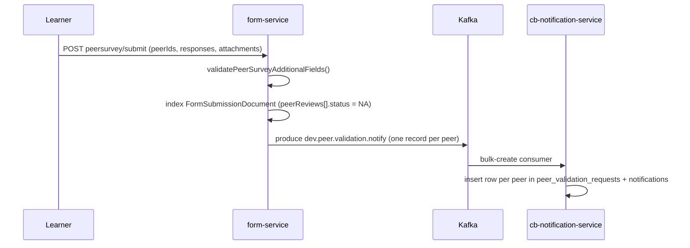
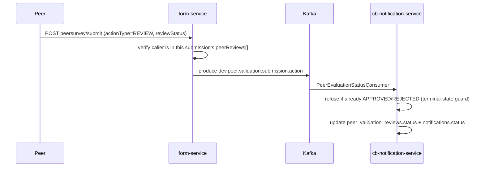
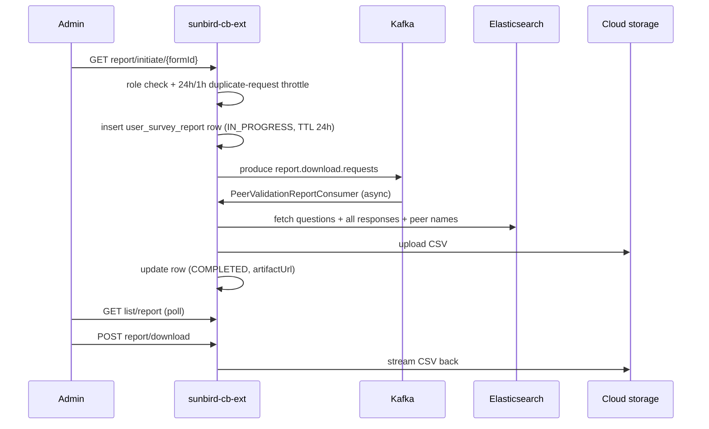
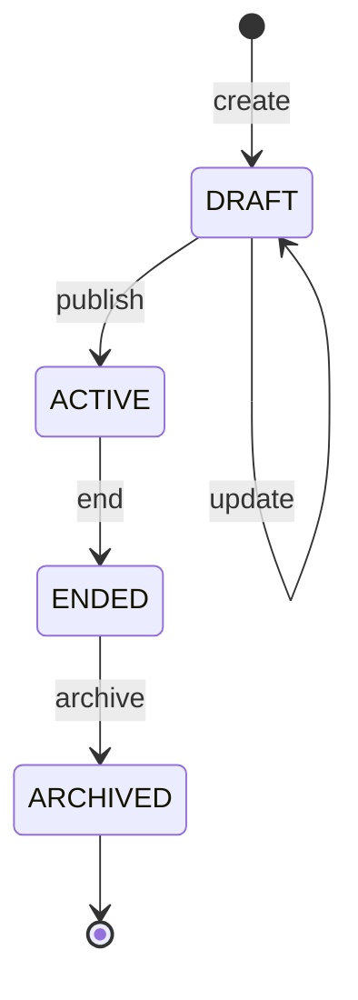
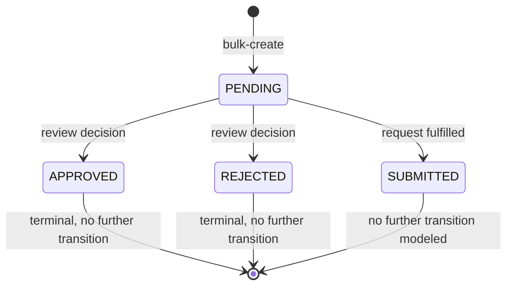

# Peer Validation — LLD

Reverse-engineered from code. No relational schema exists anywhere in this
feature — every store below is either a document store or a generic
key-value/wide-column table reused from elsewhere in the platform.

## Storage reality

**Elasticsearch `fs-forms-data-alias-v2`** — one `FormSubmissionDocument`
per submission:

```plaintext
formId, contextId, contextName, contextOrgId, contextType, version, status
submittedBy, fullName, submittedDate, updatedBy, updatedDate
responses: [QuestionResponse]
attachments: [string URL]
peerReviews: [PeerReview]   // embedded, mutated in place as each peer acts
```

```plaintext
PeerReview: peerId, status (starts "NA"), reviewedAt, designation
```

The review decision lives **inside the submission document**, not as
separate rows — one document is updated in place per peer action.

**Cassandra `peer_validation_requests` / `peer_validation_reviews`**
(`cb-notification-service`, generic map-based operations, no ORM entity):

```plaintext
notification_id, user_id (composite key), survey_end_date, metadata (JSON)
created_at, updated_at, status  // PENDING | SUBMITTED | APPROVED | REJECTED
```

Which table a row lives in (`_requests` vs `_reviews`) is the only thing
encoding whether it's a "you owe a submission" or "you owe a review" row —
`sub_category` itself is stripped before insert.

**Cassandra `notifications`** — the generic per-user feed table, also
written for every peer-validation event, independently of the two tables
above.

**Cassandra `user_survey_report`** (`sunbird-cb-ext`, TTL 24h on every
write):

```plaintext
rootorgid, formid, identifier (composite key, time-based UUID)
status (IN_PROGRESS | COMPLETED | FAILED), createdon, updatedon
totalrecords, successfulrecordscount, failedrecordscount, artifacturl, errormessage
```

The tracking row disappears after 24 hours.

There is no foreign-key or referential-integrity mechanism between a
"request," a "review," and its "submission" — they live in different
databases (Elasticsearch and Cassandra) and are joined only by matching
`formId`/`notificationId`/`user_id` strings at query time.

## Sequence: learner submits, peers get notified



## Sequence: peer decides



No resubmission sequence exists in code — there is no path that lets a
learner submit a new response tied to a rejected request.

## Sequence: admin generates and downloads a report



## Validation reality

| Rule | Enforced | Where |
|---|---|---|
| Trigger window 30–60 days, step 5 | Backend only | `ValidationServiceV2` |
| Content must be a Live, allow-listed course | Backend only | `ValidationServiceV2` |
| Max 2 custom questions beyond system ones | Backend only | `ValidationServiceV2` / `FormsServiceImplV2` |
| Peer count | Both, mismatched limits | Web + mobile clients: 2–3; server: up to 5 |
| Attachment type/size (PDF ≤2MB, MP4 ≤200MB) | Both, independently implemented per client | Web, mobile, and server each check separately |
| A peer can only review a submission they were named on | Backend only | 403 if caller not in `peerReviews[]` |
| Review decision, once set, is terminal | Backend only | Pre-update status check refuses a second write |

## State machines

**Survey lifecycle** (linear, one-way, no reverse transition coded):



**Per-request/review notification-action state:**



`EXPIRED` does not appear on this diagram — it is calculated at read time
by the client-facing list API and never written back to this row, so a row
can sit at `PENDING` forever regardless of what the UI is showing.

> **Verification boundary:** facts above are read from `form-service`,
> `cb-notification-service`, `sunbird-cb-ext`, `sunbird-cb-uiproxy`,
> `sunbird-cb-portal`, and `igot_karmayogi_mobile`. Not analysed from
> source: the actual screen behaviour of the MDO/SPV admin dashboards,
> which ship inside the external, unvendored `@sunbird-cb/consumption`
> library (two different pinned versions between the two portals) —
> attaching that library's source would close this gap. Kong's own routing
> configuration was also not available; only gateway-facing config
> (`KONG_API_BASE`) could be read.
