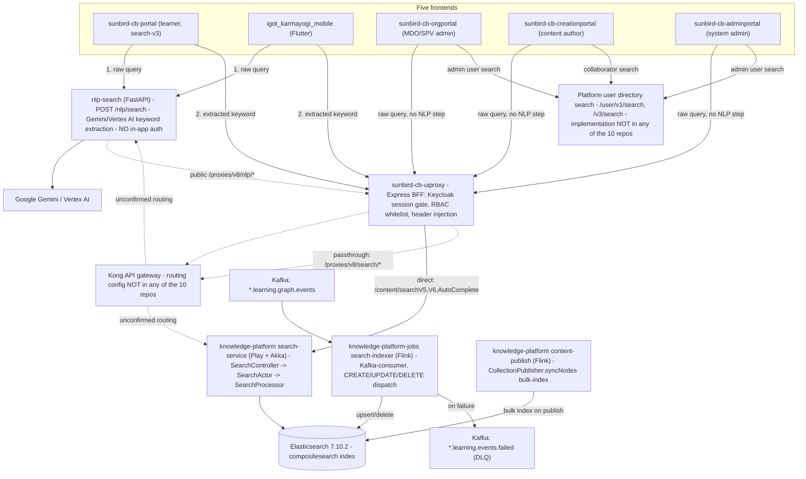

# Search — HLD

Reverse-engineered from all ten repos pinned in [index](index.md).

## Topology

Two independent backends — `nlp-search` (LLM keyword extraction) and
`knowledge-platform`'s `search-service` (Elasticsearch query execution) —
**never call each other**; cross-repo grep for `nlp` in `knowledge-platform`
and `knowledge-platform-jobs` returns zero hits. They are stitched together
only client-side, and only by two of five frontends (web portal, mobile).
`sunbird-cb-uiproxy` fronts both with session/RBAC gating and forwards to
Kong, whose own routing config (outside all ten repos) resolves the actual
downstream host. The Elasticsearch index `search-service` reads is written
by an entirely separate, Kafka-driven pipeline in `knowledge-platform-jobs`
— `search-service` itself contains no index-write code path.

## Component responsibilities

| Component | Owns | Does not own |
|---|---|---|
| `nlp-search` | Turning free text into a ranked keyword list via one LLM call | Anything about what happens to that keyword afterward — it has no knowledge of Elasticsearch, `search-service`, or any client |
| `search-service` | Translating a structured search request into an ES query and returning results | Auth (relies on upstream headers, `/v5`'s JWT is unverified); indexing (read-only against `compositesearch`) |
| `search-indexer` (jobs) | Keeping `compositesearch` current in near-real-time from graph-transaction events | Serving search requests — no HTTP surface at all |
| `uiproxy` | Session auth, RBAC whitelisting, header injection, and a handful of direct search endpoints (`searchV5/V6/AutoComplete`) implemented in-repo | Query construction (delegates to `search-service`), keyword extraction (delegates to `nlp-search`) |
| Each frontend | Deciding *whether* to call `nlp-search` first, building the category-specific search request, rendering facets/results | The search algorithm itself — every client is a thin caller over the two backends above |

## Design decisions worth flagging

- **NLP is opt-in per client, not a platform capability.** There is no
  server-side gate or feature flag forcing every search through
  `nlp-search` — it's simply that two of five client codebases happen to
  call it and three don't. A sixth client written today could go either
  way with no framework guidance either direction.
- **`search-service`'s newer routes trust unverified JWT claims.**
  `/v5/search` and `/v4/bp/search` base64-decode a JWT payload for
  `user_roles`/`org`/`sub` without checking its signature
  (`ExtendedSearchController.scala:76-90`). This is only safe if something
  upstream (Kong, or a signature-verifying middleware not present in this
  repo) has already validated the token — that verification step is not
  visible in any of the ten repos.
- **Two ES-facing indexing paths exist for the same index**, not one:
  the Kafka-driven `search-indexer` job (near-real-time, per-transaction)
  and `content-publish`'s bulk `syncNodes()` call (publish-time,
  per-collection). They share the `compositesearch` index but are
  independent code paths with independent failure handling — the Kafka
  path has a DLQ topic, the bulk path only logs on failure.
- **Autocomplete is not one thing.** `searchAutoComplete` hits Elasticsearch
  directly from `uiproxy` against a *different* index
  (`searchautocomplete_${lang}`) than `compositesearch` — it is not a
  lighter-weight call into `search-service`, it's a parallel, separately
  maintained index that none of the ten repos show being populated (see
  Verification boundary).

## Verification boundary

- **Kong's routing config** — what host `/proxies/v8/nlp/*` and
  `/proxies/v8/search/*` actually resolve to — is not present in any of the
  ten repos. `sunbird-devops` shows `nlp_search_service_url` and
  `search_url` as Kong upstream targets in Ansible defaults
  (`ansible/roles/kong-api/defaults/main.yml:247,231`), which is strong
  circumstantial evidence, but the live Kong declarative config that
  actually wires a route to those upstreams was not located.
- **`searchautocomplete_${lang}` index population** — no code in any of the
  ten repos writes to this index; only `uiproxy`'s read path was found.
- **The platform user-directory search** (`/user/v1/search`, `/v3/search`)
  used by admin user search, collaborator pickers, and training-plan
  assignee search — its implementing service is not one of the ten traced
  repos.
- **`sunbird-cb-creationportal` and `igot_karmayogi_mobile`'s fork status**
  could not be confirmed via GitHub API (private repos, no in-org token
  available); both resolved commits are independently confirmed tagged,
  which is the substantive check the fork rule was protecting against.
