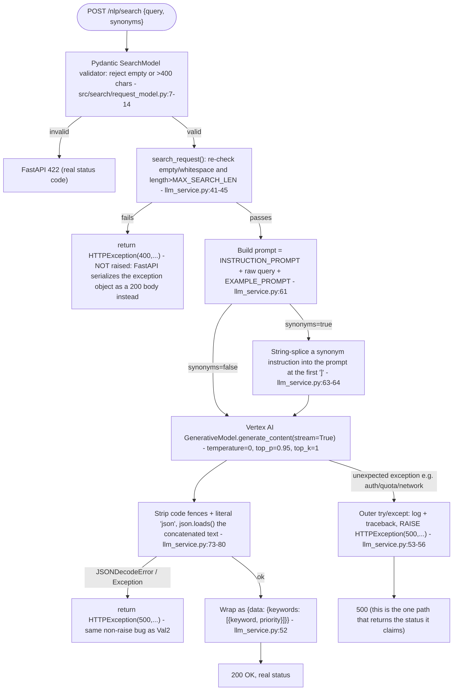
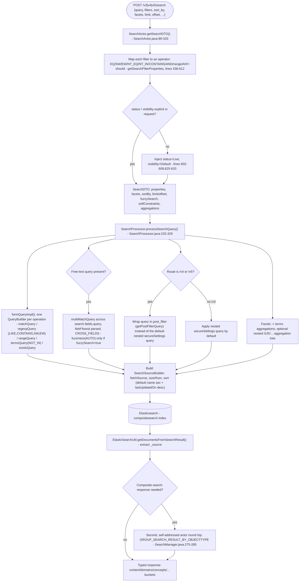
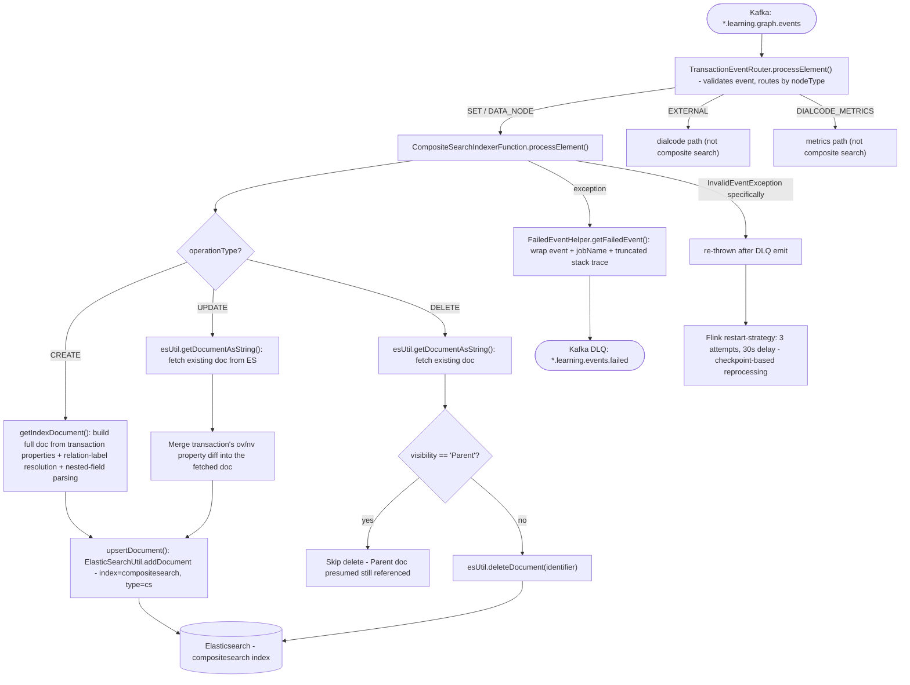
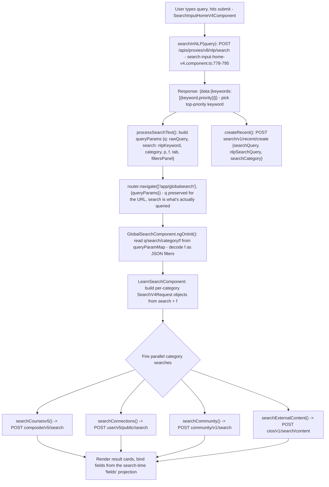

# Search — LLD

## `nlp-search` — keyword extraction mechanics

No `response_model` is declared on the route, so FastAPI does not enforce
the documented response shape on any path — a caller checking only HTTP
status will treat `Bug1`/`Bug2` as success.

- **Prompt construction** (`llm_service.py:61`): the user's raw text is
  interpolated unsanitized between two configured prompt halves (both
  required env vars, no default, `config.py:24-25`).
- **Model call**: `GenerativeModel(settings.MODEL_NAME, system_instruction=[
  "You are a helpful language expert.", "Your mission is to extract search
  keywords from queries."])` (`llm_service.py:23-35`), default model
  `gemini-2.0-flash-lite` (`config.py:17`).
- **Auth to Google**: Vertex AI service-account JSON via
  `GOOGLE_APPLICATION_CREDENTIALS` (`config.py:15`); excluded from git and
  the Docker build context, mounted at deploy time (confirmed in
  `sunbird-devops` as a Kubernetes ConfigMap).
- **No timeout, no retry**: `model.generate_content(...)` has no `timeout=`
  kwarg and no retry wrapper anywhere in the repo — a hung Vertex AI call
  hangs the request indefinitely.

## `search-service` — query DSL construction

- **Secure-settings / eligibility filtering**: org- and
  coordinator-eligibility use `TermsLookup`-based filters against separate
  indices (`org_eligibility_alias`, `user_program_lookup_v1`), built via
  reflective `TermsQueryBuilder` construction
  (`SearchProcessor.java:1075-1109`) — fragile to any ES client library
  version bump that changes that constructor's signature.
- **Result shaping**: the `GROUP_SEARCH_RESULT_BY_OBJECTTYPE` round trip is
  a second actor `ask()` call issued by `SearchManager` after the first
  search completes — not a single-pass operation.

## `search-indexer` (jobs) — indexing mechanics

This is retry-via-infrastructure (Flink checkpoint/restart), not
application-level retry logic. A parallel, independent write path exists:
content-publish's `CollectionPublisher.syncNodes()` bulk-indexes a
collection's child/unit nodes into the same index at publish time — it has
**no DLQ**, failures are only logged.

- **Enrichment before write**: nested-field re-parsing for a configured
  field list (so ES indexes them as `nested` rather than flat text);
  relation-label denormalization (walks `addedRelations`/`removedRelations`,
  resolves each to a human-readable field name); external-property exclusion
  (fields owned by Cassandra content-store are dropped); a 32,000-char
  string-length guard per field.
- **Custom analysis**: `cs_index_analyzer`/`cs_search_analyzer` with an
  ngram filter (`mynGram`, min 1 / max 30 grams) plus a `copy_to: all_fields`
  catch-all field for partial-match full-text search — created once at job
  startup if the index doesn't already exist.

## Frontend keyword-to-search sequence (web portal, the fullest-traced client)

The mobile app follows the identical two-hop shape (`nlpSearch()` →
top-priority keyword → parallel category searches), confirmed in
`igot_karmayogi_mobile:lib/features/search/presentation/widgets/search_result_page.dart:313-324`.
The three admin-facing portals (`orgportal`, `creationportal`,
`adminportal`) skip the `NLP` step entirely — their equivalent flow starts
directly at `Process`, with the user's raw text substituted for `nlpKeyword`.

- **Facet round-trip**: `SearchFiltersComponent` emits selections via
  `appliedFilter`/`constructQueryParam`; these update the `f` query param,
  which `GlobalSearchComponent` re-parses on next navigation — filter state
  lives entirely in the URL, not a service-level store, so a full page
  reload with the same URL reproduces the same filtered search.
- **Non-identical repeat searches**: because `search` (not `q`) is what's
  actually queried, and `nlp-search`'s output is only deterministic-by-
  temperature for a fixed prompt+model version, a bookmarked search URL
  reproduces the *keyword-based* result at the time it was generated — it
  does not re-run NLP extraction on load.

## Verification boundary

- `nlp-search`'s response-shape non-enforcement (no `response_model`) and
  the two `return`-not-`raise` branches were confirmed by static reading
  only — not observed by running the live service (no Vertex AI
  credentials in this environment).
- The reflective `TermsQueryBuilder` construction in `SearchProcessor`
  (`SearchProcessor.java:1075-1109`) was read as written; whether it
  actually succeeds against the pinned Elasticsearch client library version
  was not exercised at runtime.
- Kong's actual routing behavior for `/proxies/v8/nlp/*` and
  `/proxies/v8/search/*` remains unconfirmed (see [HLD](hld.md)).
