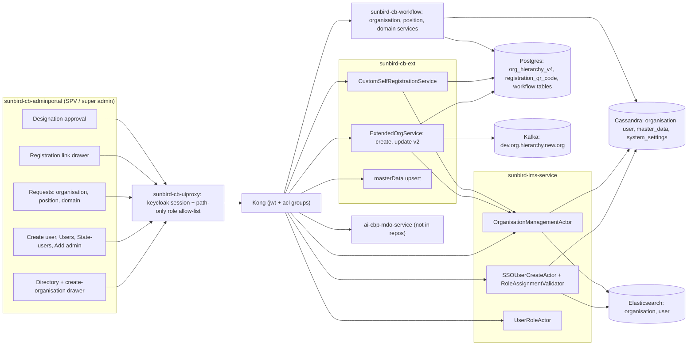

# SPV & Admin Registration — HLD

Reverse-engineered from `sunbird-cb-adminportal`, `sunbird-cb-uiproxy`,
`sunbird-cb-ext`, `sunbird-lms-service`, `sunbird-cb-workflow` and
`sunbird-devops`; `sunbird-cb-orgportal` read for comparison only.

## Topology

The admin portal is one Angular app; every call goes through the uiproxy and
Kong. Three services own the work — **cb-ext** (organisation orchestration,
registration links), the **core user service** (organisations, users, roles)
and the **workflow service** (requests) — and one proxy handler is
STATE_ADMIN-aware.

## Responsibilities

| Component | Owns | Repo |
|---|---|---|
| Admin portal | Directory, create-organisation drawer, legacy create-department forms, Create user, Users / State-users / Roles-users, Add-admin popup, registration-link drawer, Requests, Designation approval, hierarchy mapping | `sunbird-cb-adminportal` |
| uiproxy | Keycloak session, path-only role allow-list, STATE_ADMIN scoping of `org/v1/search`, admin `createUser` orchestration | `sunbird-cb-uiproxy` |
| cb-ext | Organisation create / update v2 with `org_hierarchy` sync and the new-org Kafka event; registration link + QR; designation-master upsert | `sunbird-cb-ext` |
| Core user service | The organisation record (status machine), the user, role assignment and its validator | `sunbird-lms-service` |
| Workflow | Organisation / position / domain request records and transitions; domain approval writes the pre-approved-domain row | `sunbird-cb-workflow` |
| Gateway | Kong routes, ACL groups, rate limits | `sunbird-devops` |
| Outside the repos | Menu / page config, portal-entry roles (`igot_spvrules`), request state graphs, designation-approval service, new-org Kafka consumer | — |

## Key design decisions

**Authorization lives in the proxy, not in the portal.** No admin-portal
route has `requiredRoles`; `GeneralGuard` would honour them but is never
given any, and the SPV check in `DepartmentResolve` is commented out. The
only hard gate is the uiproxy allow-list — by path, regardless of method.
The portal-entry check (`environment.portalRoles`, Helm `igot_spvrules`) is
the one place a role keeps someone out entirely.

**Organisation creation is orchestrated in cb-ext, not the core service.**
`org/ext/v1/create` decides top-level versus child, derives the hierarchy id
(`mapId` with `S_`, `M_`, `D_`, `O_`, `T_`, `X_` prefixes), creates the
organisation in the core service, writes `org_hierarchy_v4` and emits an
event. The older `org/v1/create` used for CBC / CBP providers skips all of
that and talks to the core service directly.

**An organisation is empty on creation.** Nothing assigns an administrator
at create time; the portal navigates to the new organisation's Users page and
the first admin has to be *created* (the Add-admin picker searches existing
users of the organisation only).

**Requests are records, not actions.** Approving an *organisation* or
*position* request only changes its status and notifies; approving a *domain*
request is the one that has an effect (it adds the pre-approved domain).
Request creation is public at the gateway.

**State Admin is a scoped SPV, partially.** The proxy narrows the directory
to the State Admin's state, the drawer fixes category and state, and the
core service lets a State Admin act on organisations whose
`ministryOrStateId` is their own — but several gateway rules and screens
were never extended to State Admin (volunteer status, workflow requests,
profile patch for SPV).

> **Verification boundary:** facts above are read from the repos listed at
> the top. Not analysed from source: the left-menu page configuration, the
> portal's Kong ACL groups, the workflow state graphs, the
> `dev.org.hierarchy.new.org` consumer, `ai-cbp-mdo-service`, and whatever
> serves the legacy `/portal/spv/*` routes.
