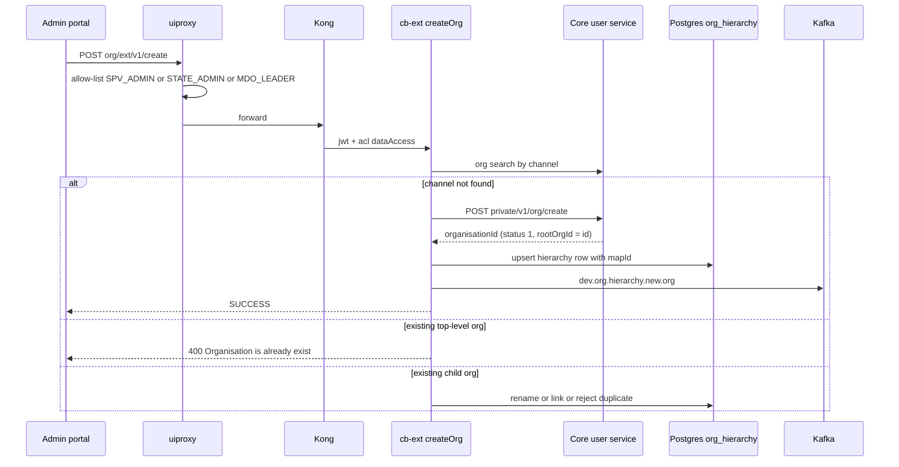
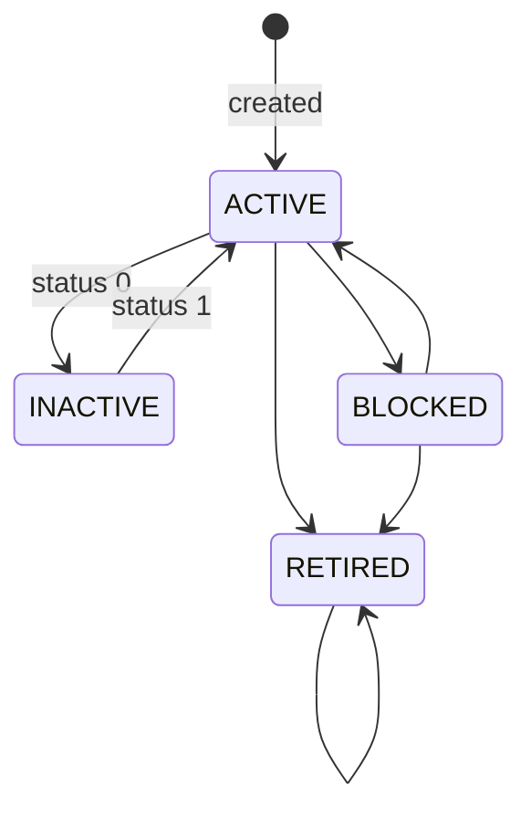

# SPV & Admin Registration — LLD

Reverse-engineered from code. `AP` = `sunbird-cb-adminportal/project/ws/app/src/lib`,
`H` = `AP/routes/home`, `EXT` = `sunbird-cb-ext/src/main/java/org/sunbird`,
`WL` = `sunbird-cb-uiproxy/src/utils/whitelistApis.ts`.

## 1. Portal surfaces

| Surface | Route | Component | Does |
|---|---|---|---|
| Directory | `directory`, `directory/:tab`, `organisation` | `H/routes/directory/directroy.component.ts` | Tabs CBC, CBP Providers, Organisation, hierarchies, volunteer; hosts the create and link drawers |
| Create-organisation drawer | in `directory-table.component.html` | `AP/head/ui-admin-table/create-organisation/…` | Create / edit organisation or volunteer organisation |
| Registration-link drawer | in `directory-table.component.html` | `AP/head/ui-admin-table/custom-self-registration/…` | Link and QR per org |
| Create-department (legacy) | `:department/create-department` | `H/routes/create-mdo/create-mdo.component.ts` | CBC / CBP / state / ministry / department / board forms. MDO and State forms reachable only by URL |
| Create user | `create-user` | `H/routes/create-user/create-user.component.ts` | Create a user in an organisation; role-edit mode |
| Users / State-users / Roles-users | `users`, `state-users`, `roles-users` | `users-view`, `AP/src/app/routes/users/list-user`, `roles-users` | Lists; State-users has the create dialog, migrate, password reset |
| Org-scoped Users page | `app/roles/:department/users` | `AP/routes/create-mdo/routes/users/users.component.ts` | Create user, Add admin, roles, designation master, user transfer |
| Add-admin popup | dialog | `AP/head/ui-admin-table/user-popup`, `user-list-popup` | Search an organisation's users, grant admin role |
| Requests | `requests`, `requests/:type`, `requests/domain`, `requests-approval`, `requests/:type/new` | `onboarding-requests`, `email-domains`, `requests-approval` | Workflow request lists and approval |
| Designation approval | `designation-approval` | `H/routes/designation-approval/*`, `reject-request-form` | AI-CBP designation requests |
| Hierarchy mapping | `directory/orgHierarchies` | `org-hierarchy-mapping.component.ts` | Create framework, bulk upload |

All are children of `app/home` guarded by `GeneralGuard` with no
`requiredRoles` (`AP/src/app/app-routing.module.ts:42-55`). Portal entry:
`init.service.ts:533-534` checks `environment.portalRoles`; failure sends the
user to `apis/reset` (`:581-588`).

## 2. Organisation creation

### 2.1 Request (cb-ext)

`ExtendedOrgController.createOrg` (requires header `x-authenticated-user-token`)
→ `ExtendedOrgServiceImpl.createOrg` (`EXT/org/service/ExtendedOrgServiceImpl.java:69-209`):

1. `validateOrgRequest` (:332-368): `orgName`, `organisationType`,
   `organisationSubType`, `isTenant`, `channel` required; any type other than
   `state` / `ministry` also needs `parentMapId`.
2. `checkOrgExist(channel)` — core org search by channel.
3. Branch:
   - **Not found** → `validateRequestFieldsOrganisationCreate` (a board needs
     `parentMapId`) → `fetchStateOrMinistryDetails` (:1064-1099) fills
     `deptName`, `ministryOrStateName`, `ministryOrStateType` ("GlobalNgo" for an
     autonomous parent) and `ministryOrStateId` → core `POST /private/v1/org/create`.
   - **Found, type `state` / `ministry`** → 400 "Organisation is already exist."
   - **Found, child type** → no `org_hierarchy` row for (name, parent): the
     channel is renamed `<parentChannel>_<name>` (`org.channel.delimitter=_`)
     and created; a row with blank `sbOrgId`: it is linked; a row whose
     `sbOrgId` equals the existing org: 400 "Duplicate Record Found in
     OrgHierarchy. Contact Admin".
4. `org_hierarchy` (Postgres) insert / update. `mapId` from `createMapId`
   (:539): prefixes `S_`, `M_`, `D_`, `O_`, `T_`, `X_` and `<parentMapId>_`;
   counter-based when `map.id.counter.enabled`. `parentMapId` is `SPV` for
   state or ministry.
5. Kafka push to `dev.org.hierarchy.new.org` when a new org or new channel was
   created (:197-200). Consumer not in the repos.

Response quirk: `result.organisationId` and `result.response=SUCCESS` are set
only inside the *new channel* branch; if the org was created while a matching
hierarchy row existed, `result` is empty and the portal shows nothing
(`create-organisation.component.ts:340-344`).

### 2.2 Core service

`OrganisationManagementActor.createOrg` (`:68-157`; validator
`OrgRequestValidator.java:24-48`): requires `organisationType`, `orgName`,
`isTenant`, `channel`; channel uniqueness enforced when `isTenant`; type and
sub-type validated by `OrgTypeValidator`; `ngo` sets `isNgo=true`; status
`ACTIVE(1)`, `rootOrgId` = new id; channel registered; Cassandra + ES write;
telemetry.

### 2.3 Organisation status machine (`OrgServiceImpl:322-348`)

Allowed targets: `ACTIVE(1)` → {1, 0, 2, 3}; `INACTIVE(0)` → {1, 0};
`BLOCKED(2)` → {1, 2, 3}; `RETIRED(3)` → {3}. The portal uses only 0 and 1
(`PATCH org/v1/status/update`, validator requires `status` present and an
`Integer`, `OrgRequestValidator:138-154`). The dialog's claim that inactive
organisations' users cannot log in was not found enforced in the repos.

### 2.4 Edit

`updateV2` (`ExtendedOrgServiceImpl:1102-1127`): `orgId` required; any key
outside `org.updatable.fields=logo,orgName,orgId,description` → 400; renames
the hierarchy row if `orgName` present; core `PATCH /v1/org/update`.
`updateStateOrMinistry` in `H/services/create-mdo.services.ts:103-108` posts
to `org/ext/v1/update`, which cb-ext maps as `@PatchMapping` only
(`ExtendedOrgController:26`), with a body lacking `orgId`; for non-board orgs
the backend would return 200 "Updating ministry,state or department is not
allowed" (`ExtendedOrgServiceImpl.update ~:925-968`).

### 2.5 Legacy create-department forms (`create-mdo.component.ts`)

- **CBC / CBP** (`onSubmit` :442-508): `POST org/v1/create` to the core
  service directly with `{orgName, channel, isTenant:true, organisationType:<tab>,
  organisationSubType:<subtype>, requestedBy}` (no hierarchy write); on
  `SUCCESS` navigates to `/app/roles/<organisationId>/users`. Validator
  `/^[a-zA-Z(), -]*$/` (digits rejected, unlike the newer drawer).
- **State** (`onSubmitState` :628-712): picks from `org/v1/list/state`; if it
  already has `sbOrgId` — "Selected State is already onboarded!", no call.
- **Ministry / department / board** (`onSubmitDepartment` :713-865): creates
  the deepest chosen level through `org/ext/v1/create` (department:
  `parentMapId = ministry.mapId`; board: `parentMapId = department.mapId`);
  STATE_ADMIN adds `sbRootOrgId`. Success text "…Check again after few
  minutes" reflects asynchronous hierarchy and index updates.
- `gotoCreateNew` passes `{needAddAdmin:true}` while the component reads
  `addAdmin` (:163-171), so add-admin mode is never entered from the
  directory.

## 3. Users and roles

### 3.1 Create user

Portal → uiproxy `profile-details.ts:225` → Kong `user/v5/create` → core
`createUserV5ByAdmin` (`SSOUserCreateActor.java:443-450`). Pipeline as in
[User Onboarding LLD](../user-onboarding/lld.md): root org from channel,
roles defaulted to `PUBLIC`, one `MDO_LEADER` per org, profile statuses
`VERIFIED` only when designation **and** group are both present,
`validateRoleAssignment`. Portal-side: email pattern (local part ≤64, domain
≤255), mobile `^((\+91-?)|0)?[0-9]{10}$` max 10, role required; MDO_LEADER
pre-check via `user/v1/search` with `organisations.roles=['MDO_LEADER']` on
every query-param change; State Admin roles forced to
`['STATE_ADMIN','PUBLIC']` and CBC roles hidden.

### 3.2 `RoleAssignmentValidator` (`sunbird-lms-service/.../RoleAssignmentValidator.java:31-300`)

| Rule | Behaviour |
|---|---|
| Requester role | Must hold a role ending `_ADMIN` or `_LEADER` |
| SPV | Requester with a role in `SPV_ROLES` (default `SPV_ADMIN, IGOT_SUPPORT_ADMIN`) skips `validateRoleRestrictions` and `isAuthorizedForOrg` |
| Non-SPV (incl. State Admin) | Must act on its own root org, or on an org whose `ministryOrStateId` equals the requester's root org (:112-132); a target with blank `ministryOrStateId` fails `targetOrgNoMinistryStateId` |
| Restrictions | `STATE_ADMIN` exempt (:288-300); `MDO_LEADER` / `MDO_ADMIN` bound by `ROLE_ASSIGNMENT_RESTRICTIONS` |
| Org-type check | Everyone, SPV included: roles must be in `orgTypeList[…].roles` for the target org's type (:134-286) |

### 3.3 Add admin / role assign

Popup search `POST user/v1/search` with `filters.rootOrgId`; blocks users with
`MDO_ADMIN` or `STATE_ADMIN`. `assignAdminToDepartment` posts the user's
existing roles + `MDO_ADMIN` (or `STATE_ADMIN` when sub-type is `state`).
Core `UserRoleActor.assignRoles` (:81…): user's org ≠ `organisationId` →
**HTTP 200** "User Organisation Id and Assigner organisation Id mismatch"; an
`MDO_LEADER` already present → **HTTP 200** "MDO Leader already exists in
org"; success replaces the user's org roles, syncs ES, emits a
`dev.mentorship.user.update` event. The role-edit flow shows
`data.result.response` in a snackbar, so both rejections look like success.

### 3.4 State-users create dialog (`create-user-dialog.component.ts`)

Validators: `firstName` 2–100 chars `/^[a-zA-Z\s.]+$/`; email
`/^[a-zA-Z0-9._%+-]+@[a-zA-Z0-9.-]+\.[a-zA-Z]{2,}$/`; phone `/^\+?[0-9]{10,15}$/`;
organisation required (search filters `{isTenant,status:1,isMdo:true}`); at
least one role, `PUBLIC` pre-selected and locked. Excluded from the picker:
`CBC_ADMIN, CBC_MEMBER, DASHBOARD_ADMIN, MDO_DASHBOARD_USER,
MDO_REPORT_ACCESSOR, PROGRAM_INSTRUCTOR, STATE_ADMIN, SPV_ADMIN,
SPV_PUBLISHER, WAT_MEMBER`. Three sequential calls (create → role assign →
admin extPatch); if step 2 or 3 fails the dialog still closes with success and
a warning. State scoping: with no organisation chosen the search filters
`profileDetails.ministryOrStateId = <current root org>`.

## 4. SPV and State Admin behaviour

| Aspect | SPV Admin | State Admin |
|---|---|---|
| Directory scope | all (no injected filter) | proxy sets `filters.ministryOrStateId = rootOrgId` (`proxies_v8.ts:565-569`) |
| Directory columns | Organisation, Type, State/Center, Created On | Organisation, Created On |
| Create-organisation | picks state / ministry / autonomous | category forced to `state`, state fixed to own channel, state selector disabled (`create-organisation.component.ts:84-105`); silent return if state not in list (:309-311) |
| Create user | roles from `orgTypeList[name==currentDept]` | `['STATE_ADMIN','PUBLIC']`; CBC roles hidden (`create-user.component.ts:60,257-259,305-309`) |
| Org hierarchy mapping | org selector | org replaced by `org/v1/read` of own `rootOrgId` (`org-hierarchy-mapping.component.ts:78-90`) |
| Designation master | bulk upload shown | bulk upload hidden |
| Gateway gaps | no `extPatch` (`WL:2629`) | no volunteer status (`WL:7963`), no workflow org / position / domain (`WL:2315-2360`) |

## 5. Registration link drawer

Pre-check (`directory-table.component.ts:276-347`): read org, read framework;
no designation associations → modal to `designation_master/import-designation`;
drawer opens only when the modal returns `reviewImporting=false`. List →
`listallqrs`; generate → `customselfregistration`. Server steps are in
[User Onboarding LLD](../user-onboarding/lld.md); the order that matters here
(`CustomSelfRegistrationServiceImpl.java:90-128`): `isRegistrationQRCodeActive(orgId)`
(line 103) marks **every** ACTIVE row for the org `expired` *before*
`isDesignationMappedToOrg` (line 105) can fail. cb-ext performs no role or
org-ownership check on `orgId`. QR URLs are rewritten `portal`→`spv` with a
first-occurrence string replace (`custom-self-registration.component.ts:85,124-125,155-161`).

## 6. Request review

- **List**: `POST workflow/{org|position|domain}/search`, Kong
  `workflowOrgSearch` (`:9710`) → workflow `POST /v1/org/workflow/search`;
  `offset` = page index → `PageRequest.of(offset, limit)`.
- **Create (public)**: Kong create routes carry no jwt (`main.yml:9597-9639`).
  `createOrgWorkFlow` (`OrganisationWorkFlowServiceImpl:49-80`) rejects if
  email, phone or org name exists — a lookup failure also counts as "exists"
  (:98-100). Domain create validates `^[a-zA-Z0-9-]+(\.[a-zA-Z0-9-]+)*$`,
  short-circuits already-approved domains, counts requesters per domain and
  re-opens a REJECTED request.
- **Transition** (`WorkflowServiceImpl.changeStatus` :173): graph fetched per
  service from the LMS system setting (`getWorkFlowConfig` :908). From the
  portal's usage: `IN_PROGRESS` → `APPROVED` on `APPROVE`, → `REJECTED` on
  `REJECT` with `comment`. Each transition saves `wf_status` and publishes
  `workflowNotificationTopic` and `workflowContentTopic`.
- **Effects**: domain `APPROVE` inserts (`userRegistrationPreApprovedDomain`,
  `<domain>`) into `sunbird.master_data` (`processDomainRequest` :200-218); the
  `DOMAIN` case in `ApplicationProcessingServiceImpl.processWfApplicationRequest`
  has no `break` and falls through to `bpWorkFlowService.processWFRequest`.
  Organisation and position `APPROVE` only notify.
- Approval-form validators: organisation `^[a-zA-Z0-9 \w\-\&\(\)]*$`; position
  required, ≤500 with that pattern; domain `([a-zA-z0-9\-]+\.){1,2}[a-z]{2,4}`
  (backslash lost in a template literal; `A-z` range too wide);
  `description` uses `preventHtmlAndJs`. Route resolvers
  (`requests-resolver.service.ts:30-42`) build the call inside `setTimeout` and
  return nothing — the components fetch for themselves.

## 7. Dead and legacy code in the admin portal

1. `AP/head/ui-admin-table/create-mdo.services.ts` `createDepartment` /
   `updateDepartment` (POST / PATCH `portal/spv/department`): never called
   (only a spec). The uiproxy still maps them (`portal-v3.ts:148,208`),
   whitelists them for `SPV_ADMIN` (`WL:984`) and forwards to
   `${SB_EXT_API_BASE_2}/portal/spv/department`; cb-ext's `PortalController`
   has only `/portal/listDeptNames`, `/portal/getAllDept` (throws "not
   implemented"), `/portal/deptSearch`, `/portal/admin/listDeptNames`.
   Likewise `portal/spv/mydepartment`, `deptAction/userrole`.
2. `H/routes/positions` (route commented out); the live way to add a
   designation master is `requests/:type/new`.
3. `updateStateOrMinistry` (see 2.4); the unused `ORG_SEARCH` constant;
   `gotoAddAdmin()` → `/app/roles/<id>/basicinfo` (route does not exist).
4. `RequestsResolve`, `ApprovedRequestsResolve`, `RejectedRequestsResolve`
   no-ops; `GeneralGuard` role arguments unused; `DepartmentResolve` role check
   commented out; commented-out `assignAdminToDepartment` after create.
5. Legacy `app/signup` and `app/auto-signup/:id` — no guard, call
   `/apis/public/v8/signup[/create/:id]`; uiproxy's `publicApi_v8/signup.ts`
   is not imported or mounted anywhere, so these cannot work (and the router
   would be unauthenticated if it were mounted).

## 8. Comparison with the MDO portal (`sunbird-cb-orgportal`)

Same create-organisation payload and `org/ext/v1/create` call (a `MDO_LEADER`
is allowed by the gateway); same custom-registration endpoints with the URL
rewrite `portal`→`mdo`; create user always uses the caller's own channel
(`create-user.component.ts:96,216`); some routes carry
`requiredRoles: ['mdo_leader','community_moderator']` (`home.rounting.module.ts:379`).
State / ministry onboarding, request approval, volunteer status change and
designation approval were not found in the MDO portal.

> **Verification boundary:** facts above are read from the repos named at the
> top of [index.md](index.md). Not analysed from source: the menu page
> configuration, `igot_spvrules`, the workflow state graphs, the new-org
> Kafka consumer, `ai-cbp-mdo-service`, the runtime handler for
> `/portal/spv/*`, whether the portal's Kong credentials hold the needed ACL
> groups, whether LMS enforces "inactive organisation blocks login", whether
> LMS consumes the `sbRootOrgId` the State Admin forms send, and the effective
> SPV result on the State-users page when no organisation is chosen.
