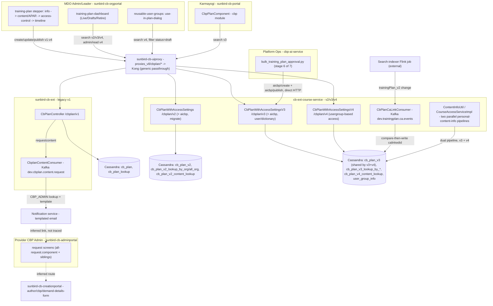

# Training Plan — HLD

Reverse-engineered from `sunbird-cb-ext`, `cb-ext-course-service`,
`sunbird-cb-uiproxy`, `sunbird-cb-orgportal`, `sunbird-cb-portal`,
`sunbird-cb-adminportal`, and `cbp-ai-service`
(`sunbird-cb-creationportal` and `cbp-ai-ui` were checked and found not
functionally connected — see [index.md](index.md)).

## Topology

Dashed arrows mark a link inferred from naming/routing rather than traced
through a shared identifier end to end.

## Responsibilities

| Component | Owns | Repo |
|---|---|---|
| `training-plan` stepper + services | Sole authoring UI: plan metadata, content/APAR/gating selection, Reusable-User-Group targeting, timeline | `sunbird-cb-orgportal` |
| `training-plan-dashboard` | Org-level plan listing/search/publish/retire | `sunbird-cb-orgportal` |
| `use-in-plan-dialog` | Attaches an existing Reusable User Group to a *draft* plan, from the group-management side | `sunbird-cb-orgportal` |
| `CbpPlanComponent` | Learner-facing plan browsing, bucketing, filtering, personal enrolment cross-reference | `sunbird-cb-portal` |
| `CbPlanController` (v1) | Legacy CRUD/workflow + the still-active content-request flow | `sunbird-cb-ext` |
| `CbplanContentConsumer` | Async email notification for content requests | `sunbird-cb-ext` |
| `CbPlanWithAccessSettings`/`V3`/`V4` | Current CRUD/workflow generations, AICBP admin-create/publish, per-user dictionary, CA-eligibility check | `cb-ext-course-service` |
| `CbPlanCaLinkConsumer` | One-way mirror of Comprehensive-Assessment linkage onto a plan's `calinkedid` | `cb-ext-course-service` |
| `ContentInfoUtil` / `CourseAccessServiceImpl` | Two independently-written "how much plan-derived content does this learner have" pipelines (v4-based and v3-based, respectively) | `cb-ext-course-service` |
| `request` screens + `ConfirmationPopupComponent` | Provider-org review/action of content requests, using a generic reusable confirm dialog | `sunbird-cb-adminportal` |
| `bulk_training_plan_approval.py` | Direct-to-backend bulk publish of AI-drafted designation plans | `cbp-ai-service` |
| `proxies_v8` + `whitelistApis` | Generic Kong passthrough for all four `cbplan/*` version families; role-based allow/deny (`MDO_ADMIN`/`MDO_LEADER` write, `PUBLIC` learner read) | `sunbird-cb-uiproxy` |

**Not found in any of the 9 repos**: the Kong gateway's own routing rule
that decides which of the two backend services actually serves a given
`cbplan/vN/...` path; a confirmed data path from the provider-org content
request table into the Admin Portal's `request` screens; and any consumer
of the `calinkedid`-bearing plan record other than the eligibility-check
endpoint itself.

## Key design decisions

- **Bespoke storage, repeated without cleanup.** Training Plan was built as
  a dedicated Cassandra entity (unlike Learning Pathway's generic-Content
  reuse) — a reasonable choice on its own — but the same "build a new plan
  table" decision was then made three more times (v2, v3, and a
  usergroup-access variant on the v3 table called v4) without retiring any
  earlier generation. All four are simultaneously reachable in production
  through the same proxy path family today.
- **v4 is an access-control upgrade, not a data migration.** Config
  (`cbplan.v4.plan.table=cb_plan_v3`) confirms v3 and v4 share one physical
  table; only the content-lookup side got a genuinely new `_v4_` table. The
  real generational breaks are v1→v2→v3, not v3→v4.
- **Assignment fan-out happens once, at publish time.** Every generation
  builds a `*_lookup*` table keyed by assignee (user id, designation, "all
  org", or user-group) so a learner's "plans assigned to me" read is a
  direct lookup, not a scan-and-filter over every plan in the org. This is
  the one architectural idea that survived unchanged across all four
  generations.
- **APAR and Comprehensive Assessment gating are additive flags, not a
  separate plan type.** `isApar` and the CA-link (`calinkedid`) both live
  on the same plan row as ordinary content — a plan is simultaneously an
  assignment mechanism and, when flagged, a gate in front of a completely
  different feature (Comprehensive Assessment Program).
- **The AI/bulk pipeline is architecturally separate from human authoring.**
  `cbp-ai-service` talks directly to `cb-ext-course-service`'s `aicbp/*`
  endpoints over plain HTTP — it does not go through the Org Portal.

See [LLD](lld.md) for the storage reality, state machines, and sequence
flows, and the [Operations Manual](operations-manual.md) for how these
decisions show up in day-2 support.
