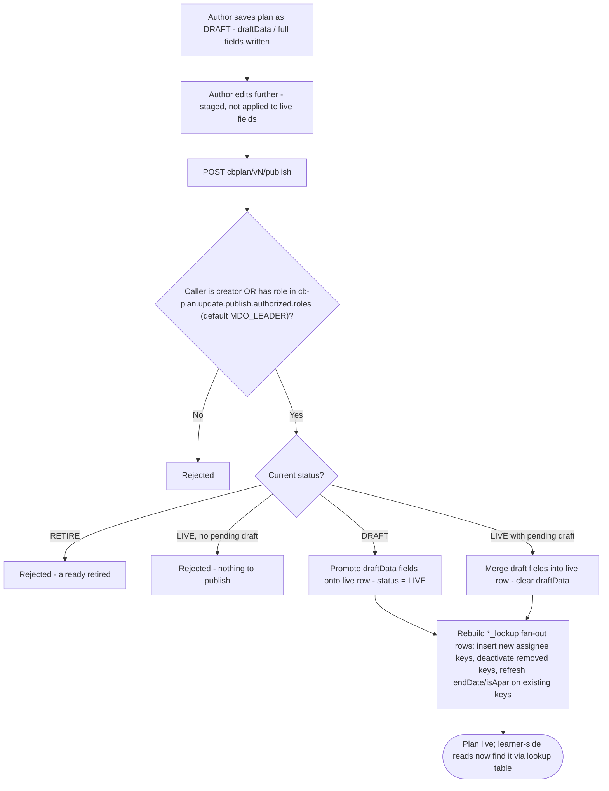
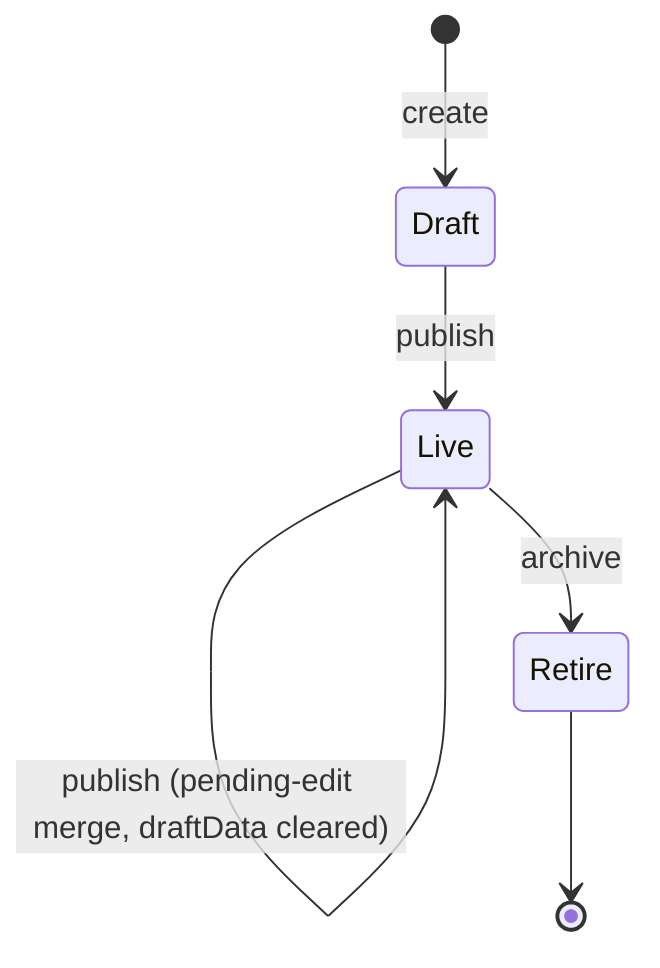
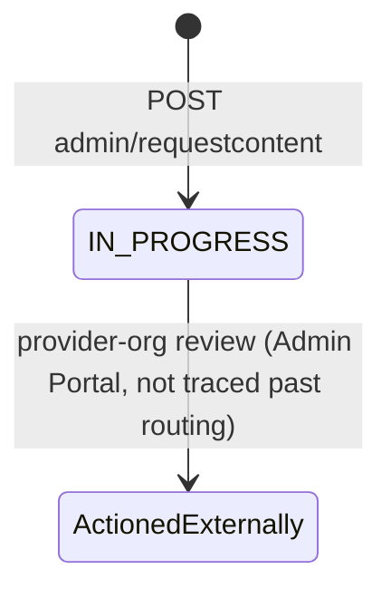

# Training Plan — LLD

Reverse-engineered from code across `sunbird-cb-ext` and
`cb-ext-course-service`. Four generations of storage exist; each is
documented separately below rather than collapsed into one assumed schema.

## Storage reality — four generations, three genuinely distinct data sets

| Generation | Repo | Plan table | Lookup table(s) | Content-lookup table |
|---|---|---|---|---|
| v1 | `sunbird-cb-ext` | `cb_plan` | `cb_plan_lookup` (composite key `orgId`, `cbPlanId`, `assignmentTypeInfoKey`) | — |
| v2 | `cb-ext-course-service` | `cb_plan_v2` | `cb_plan_v2_lookup_by_org`, `cb_plan_v2_lookup_by_all_org` | `cb_plan_v2_content_lookup` |
| v3 | `cb-ext-course-service` | `cb_plan_v3` | `cb_plan_v3_lookup_by_org`, `cb_plan_v3_lookup_by_all_org`, `cb_plan_v3_lookup_by_ministryorstateid` | `cb_plan_v3_content_lookup` |
| v4 | `cb-ext-course-service` | `cb_plan_v3` (same table as v3 — `cbplan.v4.plan.table=cb_plan_v3`) | Same lookup tables as v3, plus `user_group_info` for group resolution | `cb_plan_v4_content_lookup` (the one table that is genuinely v4-named) |

Keyspace for all four: `sunbird` (`cbplan.v4.keyspace=sunbird`; v1's exact
keyspace constant wasn't located as a printed string — inferred to be the
same platform keyspace by usage pattern, not confirmed).

No SQL/CQL DDL files were found for any of these tables in any of the 9
repos — structure below is inferred entirely from Java field/column usage,
not from schema definitions.

### v1 row shape (`CbPlan.java`, `sunbird-cb-ext`)

| Field | Type | Notes |
|---|---|---|
| `id` | UUID | |
| `orgId` | string | |
| `name` | string | |
| `contentType` | string | |
| `contentList` | List\<string\> | content identifiers |
| `assignmentType` | string | `allUser` \| `customUser` \| `designation` |
| `assignmentTypeInfo` | List\<string\> | user ids / designations, per `assignmentType` |
| `endDate` | Date | |
| `status` | string | `DRAFT` / `LIVE` / `RETIRE` |
| `createdBy`, `createdAt`, `updatedBy`, `updatedAt`, `publishedBy`, `publishedAt` | | audit fields |
| `draftData` | string (JSON) | staged edits pending publish |
| `comment` | string | optional, recorded on publish/retire |
| `isApar` | boolean | mandatory/performance-linked flag; cannot be un-set once true on a `LIVE` plan |

`cb_plan_lookup` row (fan-out, one per assignee key): `orgId`,
`assignmentTypeInfoKey` (a single user id / designation / the literal
`"AllUser"`), `cbPlanId`, `assignmentType`, `contentType`, `contentList`,
`isActive` (boolean), `endDate`.

### v3/v4 shape (`cb-ext-course-service`, inferred from service/config code — not read field-by-field from a model class in agent traces)

Confirmed fields via API/config: `id`, `name`, `endDate`, `isApar`,
`contextData` (holds `accessControl.userGroups` for the AICBP path and,
per v4, a `userGroupId` reference resolved against `user_group_info`),
`contentList`, `calinkedid` (Comprehensive Assessment link, written only by
`CbPlanCaLinkConsumer` or the matching update API), `planType` (`"AICBP"`
for AI-bulk-created plans), `planYear`/reporting year (used by the
per-user dictionary and the dashboard's APAR-year filter).
`cbplan.allowed.fields.update=name,endDate,isApar,contextData,contentList`
(config) defines the exact update-able field set for this generation.

> **Verification boundary:** the v3/v4 row shape above is reconstructed from
> API/config/controller code, not from a single model class read in full —
> unlike v1's `CbPlan.java`, which an agent read directly. Treat the v3/v4
> field list as a lower bound, not a complete schema.

## Sequence: publish (any generation)

## State machine

**Plan status** (v1, explicit in code — v3/v4 status vocabulary not
independently confirmed beyond `Live`/`draft`/`RETIRE` string comparisons
seen in the Org Portal frontend):

`Retire` is terminal on every generation traced — both v1's `retireCbPlan`
and the Org Portal's row-action gating explicitly disable further edits
once a plan is `RETIRE`d.

**Content-request lifecycle** (v1, `cb_content_request` table):

No code in any of the 9 repos was found transitioning a content-request row
out of `IN_PROGRESS` — the Admin Portal's review action was not confirmed to
write back to this same table (see verification boundary in [HLD](hld.md)).

## Validation reality

| Rule | Enforced | Where |
|---|---|---|
| Plan title required, ≤70 chars | Frontend only | Org Portal Angular validators (`add-plan-information`) |
| `name`, `contentType`, `contentList`, `assignmentType`, `assignmentTypeInfo`, `endDate` required (v1) | Backend, bean validation | `CbPlanDto` `@NotBlank`/`@NotNull` annotations |
| Update/publish/retire authorization (creator or authorized role) | Backend | Identical rule across all 4 generations' controllers |
| `isApar` cannot be un-set on a `LIVE` plan | Backend | v1 `CbPlanServiceImpl` explicit check |
| `>25` mandatory (gating) courses triggers a warning | Frontend only, non-blocking | `gating-courses.component.ts` |
| Update field allow-list on v3/v4 | Backend, config-driven | `cbplan.allowed.fields.update` |
| Access control (user group) required before Timeline step | Frontend only | Org Portal stepper tab-enable gating |
| Content-request table's own review workflow | **Not found in any traced repo** | — |
| `calinkedid` write authorization | Backend, compare-then-write, but no auth beyond internal Kafka trust | `CbPlanCaLinkConsumer` |

> **Verification boundary:** facts above are read from `sunbird-cb-ext`,
> `cb-ext-course-service`, `sunbird-cb-orgportal`, `sunbird-cb-portal`,
> `sunbird-cb-adminportal`, `sunbird-cb-uiproxy`, and `cbp-ai-service`. Not
> independently confirmed: the v3/v4 row shape as a complete field list
> (only fields touched by traced controllers/config are listed above); the
> Kong gateway's routing rule that dispatches `cbplan/vN/*` to the correct
> backend service; and the Admin Portal `request` screens' actual data
> source (whether it reads `cb_content_request` directly or via another
> service). Attaching the DDL/schema repository and the Kong route config
> would close these gaps.
