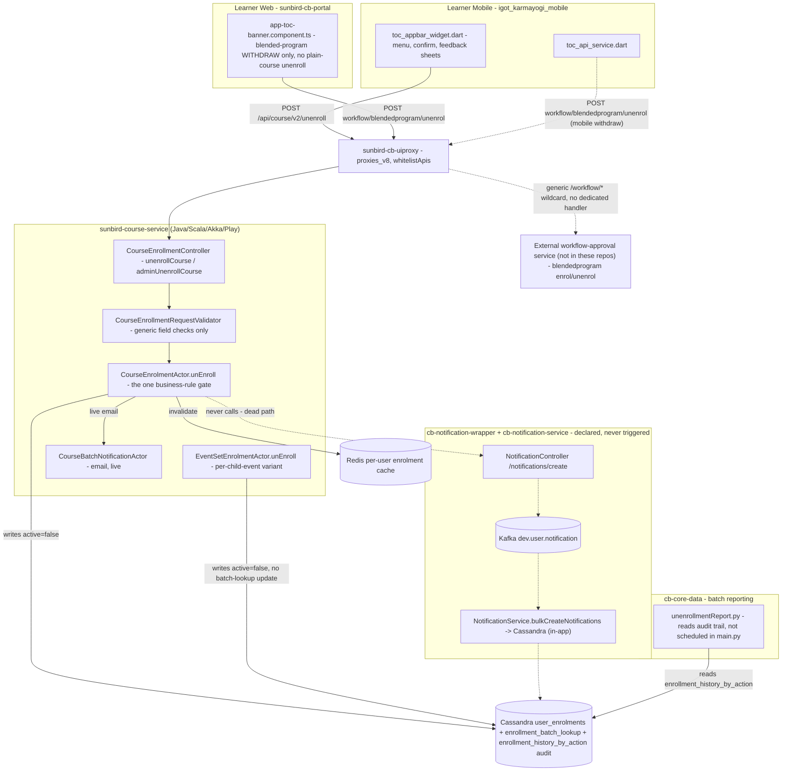

# Unenrollment of Courses — HLD

Reverse-engineered from `sunbird-course-service`, `igot_karmayogi_mobile`,
`sunbird-cb-portal`, `sunbird-cb-uiproxy`, `cb-core-data`,
`cb-notification-service`, `cb-notification-wrapper`.

## Topology

## Responsibilities

| Component | Owns | Repo |
|---|---|---|
| `toc_appbar_widget.dart` + confirm/feedback sheets | The entire learner-facing unenroll UX: eligibility gating, confirmation, mandatory reason capture | `igot_karmayogi_mobile` |
| `app-toc-banner.component.ts` | Web's only unenroll-labelled action — withdrawing a pending **blended-program** enrolment request; no plain-course equivalent exists | `sunbird-cb-portal` |
| `CourseEnrollmentController` / `CourseEnrollmentRequestValidator` | Route handling and generic required-field validation (courseId, batchId, userId) — no unenroll-specific validation at this layer | `sunbird-course-service` |
| `CourseEnrolmentActor.unEnroll` | The single place all real business rules live: batch-state checks, "not enrolled" check, "already completed" check, the actual Cassandra writes, cache invalidation, telemetry, and the (live) email notification trigger | `sunbird-course-service` |
| `EventSetEnrolmentActor.unEnroll` | Same rule shape applied per child event of an event set, with one structural difference — never updates the per-batch lookup table | `sunbird-course-service` |
| `CourseBatchNotificationActor` | The one notification channel that's actually live for unenroll — a plain email | `sunbird-course-service` |
| `NotificationSubCategory.CONTENT_UN_ENROLLED` + its pipeline | A fully-built second notification channel (in-app, Kafka-driven) with message templates, that nothing in any of the ten repos scoped to this feature ever triggers | `cb-notification-service`, `cb-notification-wrapper` |
| `unenrollmentReport.py` | Per-MDO CSV report reconstructing who unenrolled, when, and why, from the same audit trail the actor writes to — but absent from the pipeline's own job orchestrator | `cb-core-data` |

**Not found in any of the seven repos**: the backend implementing
`{KONG_API_BASE}/workflow/blendedprogram/*` (both web and mobile call into
it for the blended-program withdraw flow, but its implementation is out of
scope of this trace); any downstream consumer of the Kafka topics the
notification pipeline would use if it were wired up; any karma-points or
certificate-revocation logic touching unenroll.

## Key design decisions

- **No dedicated unenroll service, by construction.** Unenrolling reuses
  the exact same actor, DAO layer, and Cassandra tables as enrolling —
  the only actor-level difference from `enroll()` is which validation
  branch runs (`isEnrol=false`) and which single field gets written
  (`active: false` instead of `true`). This makes the feature cheap
  wherever it exists, but also means it inherited enroll's asymmetries
  unevenly — enroll fires a Kafka instruction event, unenroll does not,
  with no code comment explaining why.
- **Client-by-client feature parity was never enforced.** Mobile built a
  complete, deliberate UX (impact disclosure, mandatory reason capture,
  telemetry) for unenrolling from a plain course. Web built none of that —
  its only "unenroll" action is a structurally different feature (workflow
  withdrawal for a still-pending blended-program request). A learner using
  the web portal has no way to unenroll from a plain course at all through
  any UI traced in this codebase.
- **Two independent notification systems exist for the same event, one
  live and one dead.** The actor-native email path
  (`CourseBatchNotificationActor`) is wired and gated by a config flag; the
  newer Kafka/in-app taxonomy (`CONTENT_UN_ENROLLED` in
  `cb-notification-service`/`cb-notification-wrapper`) has message
  templates and a full processing pipeline but is never invoked from
  anywhere — the enum value and its template exist purely as declared,
  unused capability.
- **The only hard business rule is course completion, not certification.**
  Unenroll is blocked once the learner's course-completion status is
  `COMPLETED` (reusing the same error message as "batch has ended"), but
  nothing checks whether a certificate was actually issued — a learner
  could in principle be blocked from unenrolling from a course they
  completed but never received a certificate for, and there is no distinct
  error message differentiating the two "batch already completed" causes.
- **The reporting job's orchestration status is unverified.** `cb-core-data
  /jobs/stage-2/unenrollmentReport.py` is complete and self-contained but
  is not imported or called from `jobs/main.py`, unlike its sibling
  `userEnrolment.py`. Whether it runs via some external scheduler outside
  this repo is unknown from static code alone.

See [LLD](lld.md) for storage detail, the precondition chain, and sequence
flows, and the [Operations Manual](operations-manual.md) for how these
decisions show up in day-2 support.
