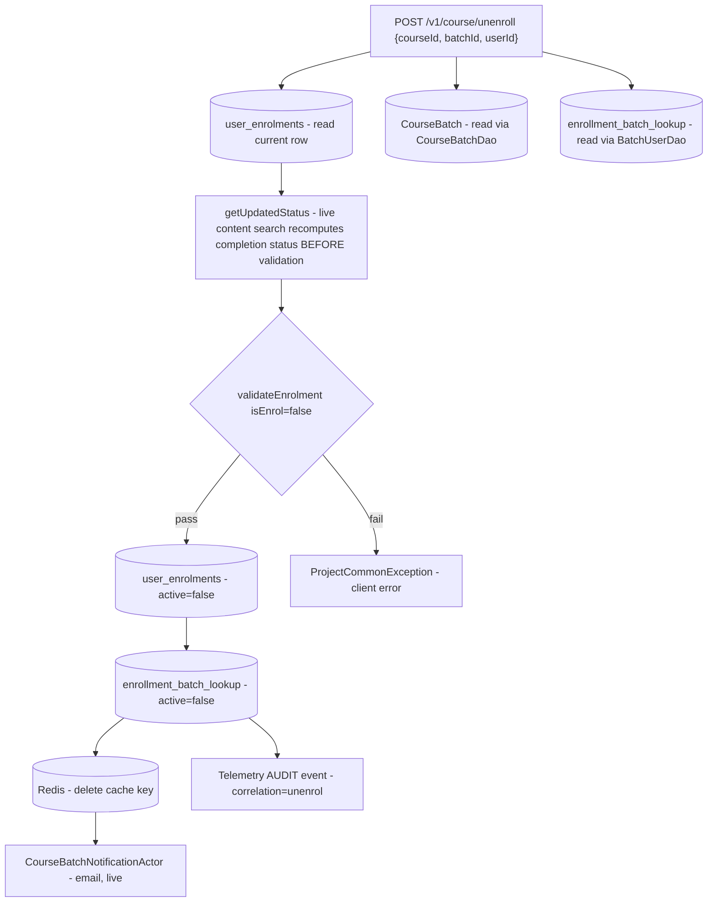
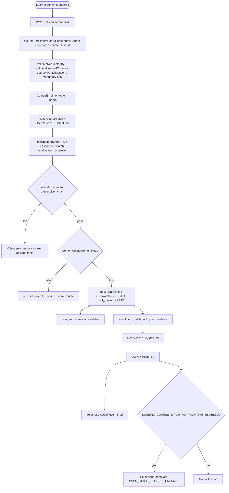
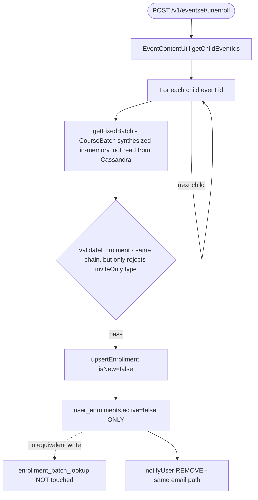
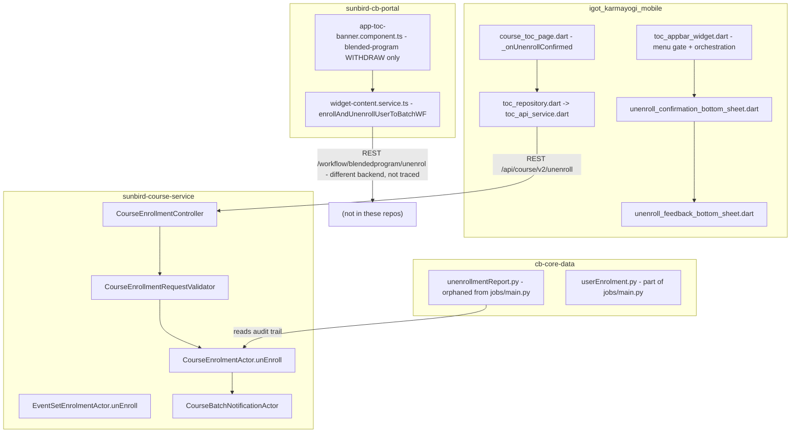
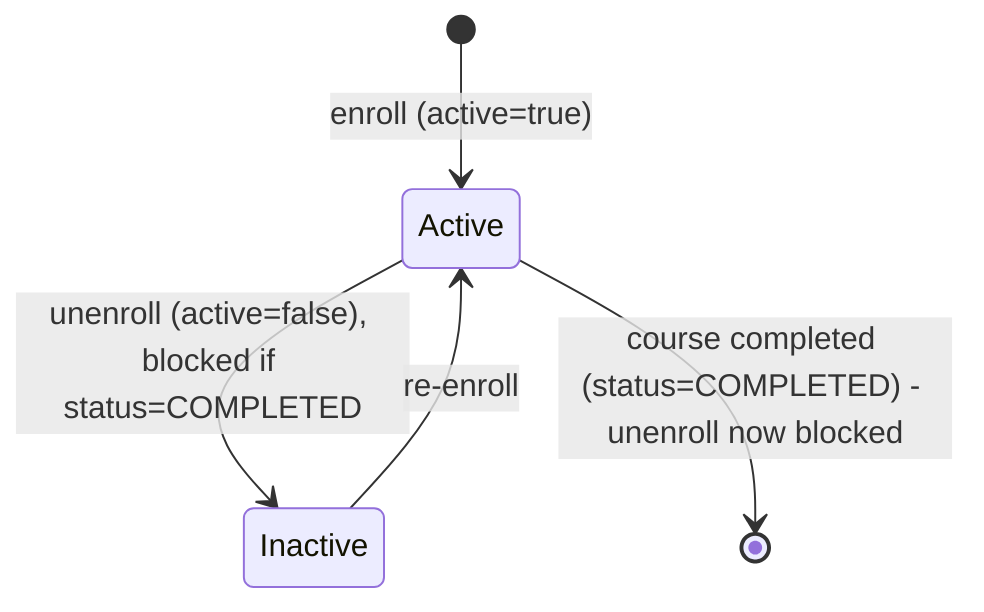

# Unenrollment of Courses — LLD

Reverse-engineered from code. Where a client sends data the backend doesn't
read, or a job exists but isn't scheduled, the as-built reality is
documented explicitly rather than assumed.

## Storage reality

**Cassandra (`sunbird_courses` keyspace)** — no new tables; unenroll writes
to the exact same tables enroll does:

| Table | Constant | Written by unenroll | What changes |
|---|---|---|---|
| `user_enrolments` | `USER_ENROLMENTS` | `UserCoursesDao.updateV2` | `active` → `false` (only field set) |
| `enrollment_batch_lookup` | `ENROLLMENT_BATCH` | `BatchUserDao.updateBatchLookupRecord` | `active` → `false` — **not** written for EventSet unenroll |
| `enrollment_history_by_action` | (audit table, read-only from unenroll's perspective) | — | Presumed source of the `UNENROLL` action rows the reporting job reads; the write path into this table was not located inside `CourseEnrolmentActor.unEnroll` itself — it is written by some other component not traced in this pass |

**Redis** — one cache key per user (`<userId>:user-enrolments`), deleted
(not updated) on every unenroll via `cacheUtil.delete`.

**No participant-count field, no certificate table, no karma-points table**
is touched anywhere in the unenroll write path.

## Precondition chain — `validateEnrolment(batchData, enrolmentData, isEnrol=false)`

Evaluated in this order (`CourseEnrolmentActor.scala`):

1. `batchData == null` → `invalidCourseBatchId`
2. Batch `enrollmentType` not `open`/`invite-only` → `enrollmentTypeValidation` (same rule applies to enroll)
3. Batch `status == 2` (Completed) or end date passed → `courseBatchAlreadyCompleted`
4. *(enroll-only, skipped here since `isEnrol=false`)* enrollment-window-closed check
5. `enrolmentData == null || !enrolmentData.isActive` → `userNotEnrolledCourse`
6. `enrolmentData.getStatus == COMPLETED (2)` → `courseBatchAlreadyCompleted` (same message as step 3 — no distinct code for "you already finished this course")

Then, outside `validateEnrolment` but still gating the write:
`ContentUtil.getContentRead(courseId, headers)` must return `true`, else
`accessDeniedToEnrolOrUnenrolCourse`.

**No check exists** for certificate-issued state, attempt limits, or a
cool-off period anywhere in this chain.

## Sequence: course unenroll, end to end

Note the complete absence of a Kafka `InstructionEventGenerator` call in
this chain — `enroll()` has one (to `kafka_user_enrolment_event_topic`),
`unEnroll()` does not, visible directly by their code being adjacent in the
same file.

## Sequence: EventSet unenroll (structural difference)

## Module map

No shared library exists between mobile and web for unenroll — they aren't
even the same feature on the two clients (mobile: plain-course unenroll;
web: blended-program workflow withdrawal).

## State model

**Enrolment `active` flag** (the entire state machine — no richer enum
exists):

**Course-completion status**, read (not written) by unenroll's
precondition check: `NOT_STARTED (0)` / `IN_PROGRESS (1)` /
`COMPLETED (2)` — recomputed live via `getUpdatedStatus` immediately before
the precondition check runs, so it reflects a fresh calculation, not
necessarily the value most recently persisted.

**Blended-program workflow status** (separate state machine entirely,
governing UC-6/UC-7's "withdraw", not this feature's core `active` flag):
`SEND_FOR_MDO_APPROVAL` / `SEND_FOR_PC_APPROVAL` / `APPROVED` / `REJECTED`
/ `REMOVED` / `WITHDRAWN` — withdraw is offered only pre-`APPROVED`, and
disabled mid-flight in a two-step approval chain while sitting at the
other approver's stage. The service that owns this state machine is
external to all seven repos traced.

## Validation reality

| Rule | Enforced | Where |
|---|---|---|
| courseId/collectionId, batchId, userId required | Backend | `CourseEnrollmentRequestValidator.commonValidations` |
| Batch exists | Backend | `validateEnrolment` step 1 |
| Batch enrollmentType open/invite-only | Backend | `validateEnrolment` step 2 |
| Batch not completed / not past end date | Backend | `validateEnrolment` step 3 |
| Currently actively enrolled | Backend | `validateEnrolment` step 5 |
| Course not already completed by learner | Backend | `validateEnrolment` step 6 |
| Content access granted | Backend | `ContentUtil.getContentRead` |
| Certificate not yet issued | **Not enforced anywhere** | — |
| Reasons/comments format or presence | Frontend only (mobile) | `unenroll_feedback_bottom_sheet.dart` — not read by backend |
| Attempt limit / cool-off before re-unenrolling | **Not found on any tier** | — |
| Menu-item eligibility (completed/player/featured/category) | Frontend only (mobile) | `toc_appbar_widget.dart._buildActions` |

> **Verification boundary:** facts above are read from
> `sunbird-course-service`, `igot_karmayogi_mobile`, `sunbird-cb-portal`,
> `sunbird-cb-uiproxy`, `cb-core-data`, `cb-notification-service`, and
> `cb-notification-wrapper`. Not analysed from source: the write path that
> actually populates `enrollment_history_by_action` (only its read side is
> traced, via the reporting job), and the external
> `{KONG_API_BASE}/workflow/blendedprogram/*` service backing the
> blended-program withdraw flow used by both web and mobile. Attaching
> those would close the two biggest remaining gaps in this trace.
