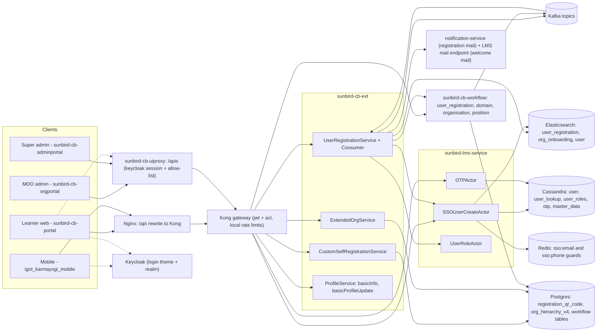

# User Onboarding — HLD

Reverse-engineered from `sunbird-cb-portal`, `sunbird-cb-orgportal`,
`sunbird-cb-adminportal`, `sunbird-cb-uiproxy`, `igot_karmayogi_mobile`,
`sunbird-cb-ext`, `sunbird-lms-service`, `sunbird-cb-workflow` and
`sunbird-devops`. Five further repos were analysed and carry no onboarding
logic (see Responsibilities).

## Topology

There is no "onboarding service". The feature is a pipeline spread across
`sunbird-cb-ext` (registration orchestration, custom links, org creation),
`sunbird-lms-service` (the account itself, OTP) and `sunbird-cb-workflow`
(approval), reached through two different front doors.

## Responsibilities

| Component | Owns | Repo |
|---|---|---|
| Learner portal | Public sign-up, registration-link page, welcome form, SSO landing | `sunbird-cb-portal` |
| MDO portal | Individual user creation, registration link / QR generation | `sunbird-cb-orgportal` |
| Admin portal | Organisation creation, org / designation / email-domain request review | `sunbird-cb-adminportal` |
| Mobile app | Intro screens, direct and link registration, Parichay first login, fail-open OTP wrappers | `igot_karmayogi_mobile` |
| uiproxy | Keycloak-session BFF for `/apis`, role allow-list, admin create-user orchestration (create, reset link, welcome mail), SSO auto-create at Parichay / OIL / NTPC callback | `sunbird-cb-uiproxy` |
| cb-ext | Register endpoint, registration record (ES), Kafka consumers, auto-org creation, welcome and registration mail, custom link / QR, org creation and hierarchy, basic-info / basic-profile-update, NLW event bulk-onboard | `sunbird-cb-ext` |
| Core user service | The account: `user`, `user_lookup`, `user_login`, `user_roles`, `user_organisation`; OTP; the `PUBLIC`-only role-assign; no Keycloak user creation | `sunbird-lms-service` |
| Workflow | Generic state machine; `user_registration` approval, `domain`, `organisation`, `position` request services; state config loaded from system setting `wfUserRegServiceConfig` | `sunbird-cb-workflow` |
| Gateway / infra | Kong routes, rate limits, ACLs; Nginx `/api` rewrite; Keycloak realm and login theme; sb-cb-ext config templates | `sunbird-devops` |
| No onboarding logic | `cb-ext-userprofile-service` (extended profile, password-reset helper), `cb-ext-config-service` (generic form-config store), `form-service` (generic forms), `cb-notification-service` (in-app notifications), `cb-notification-wrapper` (notification create API) | — |

## Key design decisions

**Registration is asynchronous by construction.** `register` writes a
registration document to Elasticsearch and pushes it to Kafka; the HTTP
caller only ever learns "202 accepted". Account creation, org auto-creation,
role assignment, activation link and welcome email all happen later in a
consumer.

**Trust is decided by the entry route, not by a flag.** A registration that
carries a `registrationLink`, or whose email domain is in the pre-approved
domain list, goes to the *auto-create* topic. Anything else goes to the
*approval* topic and the workflow. The link is therefore a bearer
credential for the organisation: it replaces both the domain check and the
approval step.

**Verification is the client's job.** OTP generate / verify live in the core
service, but no create or register route checks that an OTP was verified.
The web and mobile clients gate their own Register buttons; the mobile
wrappers even treat a failed verify call as success.

**The core service stores the account but does not authenticate it.** Users
are rows in Cassandra; Keycloak sees them as federated users. The core
service only sets a password or a required action on that federated user. A
user with no password has to use the set-password link generated by the
caller.

**Welcome mail is the caller's responsibility.** The core service sends its
onboarding mail only when a `callerId` is set, which only the bulk-upload
job does. Self-registered users get theirs from `sunbird-cb-ext`
(`iGotWelcome_v3`), admin-created users from uiproxy (`iGotWelcome_v4`).

**Approval logic is configuration.** `sunbird-cb-workflow` holds no
user-registration states in code; it fetches the state machine from a
platform setting at runtime, so approvers and states can change without a
release — and cannot be read from the repositories.

**Two front doors.** Admin screens go browser → `/apis` → uiproxy → Kong.
The public portal and mobile app go `/api` → Nginx → Kong with no uiproxy.
The same backend therefore enforces different authentication depending on
who is asking: uiproxy requires a Keycloak session for `/proxies/v8` and
`/protected/v8`, while the Kong routes for register, OTP v1, link check,
org hierarchy and groups carry no jwt plugin.

> **Verification boundary:** facts above are read from the repos listed at
> the top. Not analysed from source: the workflow state machine for
> `user_registration`, the Keycloak user-federation provider, the deployed
> Keycloak realm (only the template in `sunbird-devops` was read), the
> Kubernetes ingress rule for `/apis`, and notification-service internals
> (the registration mail is a POST to its `/v1/notification/send/sync`;
> its template is not in the repos read).
