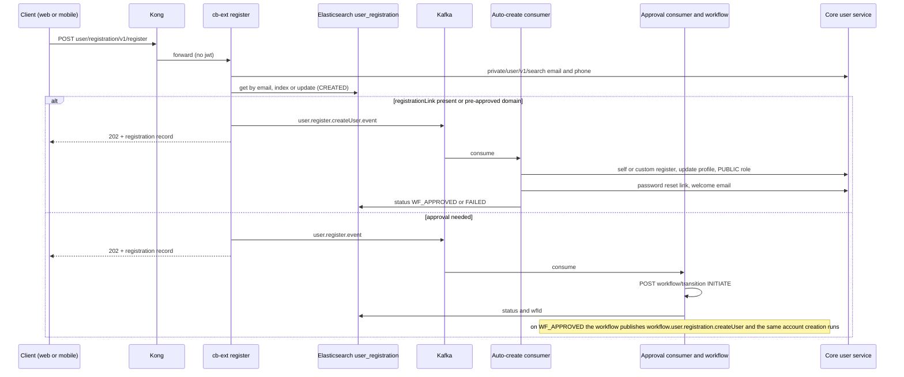
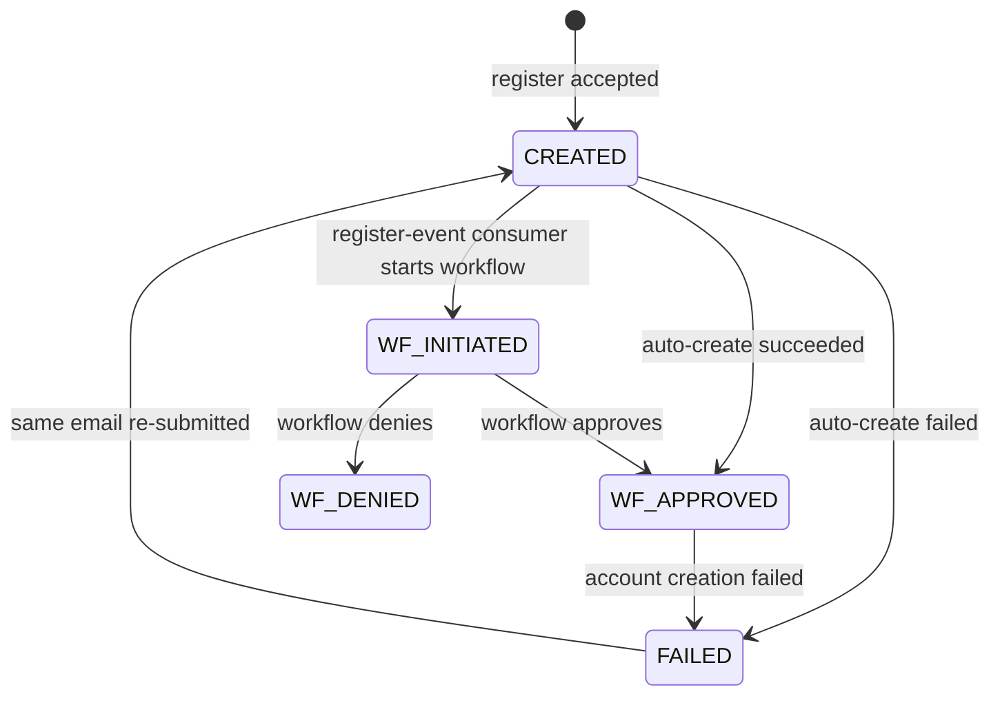

# User Onboarding — LLD

Reverse-engineered from code. Paths are relative to each repo;
`SE` = `sunbird-cb-ext/src/main/java/org/sunbird`.

## 1. Registration pipeline

### 1.1 Register request (cb-ext)

`UserRegistrationServiceImpl.registerUser` (`SE/user/registration/service/UserRegistrationServiceImpl.java:95-170`):

1. `validateRegisterationPayload` (:376-421): mandatory `FirstName, Email,
   (sbOrgId or mapId), OrgName, Group, Source, Phone`; email via
   `emailValidation(email, linkBlank)` — the **domain check runs only when
   `registrationLink` is blank**; phone via `validateContactPattern`; `group`
   in `user.bulk.upload.group.value`.
2. `isUserExist` for email and for phone (LMS `private/user/v1/search`).
3. Look up the ES `user_registration` document by `email`; proceed only if
   none exists or its status is `FAILED`.
4. If `registrationLink` is present: `validateRegistrationDates` (:651-680).
5. Create the document (status `CREATED`, code `iGOT-<mapId>-<8 random
   alphanumerics>`) or, for a `FAILED` one, overwrite org fields only.
6. Branch: `registrationLink` present **or** email's domain is in
   `userRegistrationPreApprovedDomain` → push to the auto-create topic;
   otherwise → push to the approval topic. Respond **202**.

The email-exists and phone-exists checks are not chained: when the email
exists but the phone does not, the else-branch still executes the ES write
and Kafka push, then the final `errMsg` overwrites the response with 400.

### 1.2 Registration status

`UserRegistrationStatus`: `CREATED(1)`, `WF_INITIATED(2)`, `WF_APPROVED(3)`,
`WF_DENIED(4)`, `FAILED(5)`. The workflow-returned status string is stored
as-is. Only the register-event consumer sends a registration email
(`user-registration` template, subject `iGOT-Registration`): `WF_INITIATED`
→ "Please use the code {regCode}…", `WF_APPROVED` → "Click here" button to
`user.registration.domain.name`, `WF_DENIED` → title and status, `FAILED` →
"Please try again later". Other statuses send nothing.

### 1.3 Consumers

| Topic | Consumer group | Action |
|---|---|---|
| `{env}.user.register.event` | `userRegistrationRegisterEventTopic-consumer` | Build a `WfRequest` (state = action = `INITIATE`, random UUID as user and actor, `applicationId` = registration code, `serviceName` `user_registration`, `updateFieldValues [{}]`), POST `${wf.service.host}v1/workflow/transition` with headers `rootOrg=igot, org=dopt`, store `status` and `wfIds[0]`, send registration mail |
| `{env}.workflow.user.registration.createUser` | `userRegistrationTopic-consumer` | Workflow-approved path → `initiateCreateUserFlow(applicationId)` |
| `{env}.user.register.createUser.event` | `userAutoRegistrationTopic-consumer` | `initiateCreateUserFlow`; if a link is present, increments `registration_qr_code.numberofusersonboarded` (non-atomic read-modify-write, runs even if creation failed) |

### 1.4 `initiateCreateUserFlow` (`UserRegistrationServiceImpl.java:271-335`)

1. If `sbOrgId` is blank or the string `"null"`: `createOrgForUserRegistration`
   (returns the existing org for that channel or creates one and records
   `sbOrgId` in the hierarchy row), then `Thread.sleep(1000)`.
2. Blank link → `selfRegisterUser`; otherwise → `customRegisterUser`
   (`UserUtilityServiceImpl:1144-1208`): POST
   `{request:{email, channel, firstName, emailVerified:true, phone, phoneVerified:true}}`
   to the core service's `/v5/cb/user/self/register` or `/custom/register`;
   read the user back.
3. `updateUser` PATCH `/private/user/v1/update` with `profileDetails`:
   `mandatoryFieldsExists=false`, `employmentDetails.departmentName`,
   `personalDetails{firstname, primaryEmail, mobile, phoneVerified}`,
   `profileStatus` / `profileGroupStatus` / `profileDesignationStatus` all
   `NOT-VERIFIED`, `professionalDetails[0]{organisationType:"Government",
   designation, group}`, `additionalProperties{group, tag, externalSystemId,
   externalSystem}`, `isWhatsappConsent`.
4. `assignRole`: POST `/v1/user/public/role/assign` with `["PUBLIC"]`.
5. `createNodeBBUser` calls only `getActivationLink` — the NodeBB call is
   commented out.
6. `getActivationLink`: POST `/private/user/v1/password/reset`
   `{userId, key:"email", type:"email"}`.
7. `sendWelcomeEmail`: POST `/private/user/v1/notification/email`, template
   `iGotWelcome_v3`, subject "Welcome to iGOT Karmayogi... Activate your
   account now!", `setPasswordLink:true`.
8. Final status `WF_APPROVED` on success, `FAILED` otherwise (the welcome
   email counts toward success).

### 1.5 Pre-approved domains and the domain workflow

`master_data` rows with context type `userRegistrationDomain` and
`userRegistrationPreApprovedDomain` are the allow-lists; the approved-domains
API returns their union (500 if empty). `user.registration.domain=gmail.com`
and `user.registration.preApproved.domain=yopmail.com` exist in
`application.properties:271-272`, but the validation code reads the DB only;
the helm template hard-codes `user.registration.domain=yopmail.com`
(`sb-cb-ext-service-env.j2:204`).

Domain request workflow (`sunbird-cb-workflow`, headers `rootOrg`, `org`):
`POST /v1/domain/workflow/{create,update,search}`, `GET …/read/{wfId}/{applicationId}`.
The domain must match `^[a-zA-Z0-9-]+(\.[a-zA-Z0-9-]+)*$`. Messages:
`Domain is already approved`, request-created, request-already-raised
(HTTP 202), request-rejected (a rejected domain can be requested again).
`WfDomainUserInfo` and `WfDomainLookup` entities hold the requester and the
`noOfRequest` counter. On `APPROVE`, `processDomainRequest` inserts
(`contextType=userRegistrationPreApprovedDomain`, `contextName=<domain>`)
into `sunbird.master_data`.

## 2. Account creation in the core user service

`SSOUserCreateActor` (`service/…/actor/user/SSOUserCreateActor.java`) —
`onReceive` dispatch (:72-96): `createUser`/`createSSOUser`,
`createUserV5` (self-register / custom / support), `createUserV5ByAdmin`,
`oAuthCreateUserV5`, `createBulkUsers`, `createNgoBulkUsers`.

### 2.1 Exact order of side effects (`createSSOUser`, :112-163; `processSSOUser`, :180-263)

1. Lower-case the configured request fields (`source, externalId, userName,
   provider, loginId, email, prevUsedEmail`).
2. Validate (`validateCreateUserRequest`): `firstName` mandatory; email or
   phone required; email / phone / dob format; password regex when supplied;
   `registeredOrgId, rootOrgId, provider, externalId…` are not allowed.
3. **Redis guard**: keys `sso:email:<email>` and `sso:phone:<phone>`, TTL
   `userCreationRedisTTL` (300 s). An existing key throws "Duplicate request:
   This EMAIL was processed recently…". The key is set **before** any other
   check and never deleted on failure.
4. Resolve location codes, then org: channel → root org via ES (`isTenant`,
   `status=1`), mismatch → `parameterMismatch`; channel and root org both
   blank → custodian org from system settings.
5. `setUserDefaultValue`: `status=1`, `isDeleted=false`, username generated
   from the name when absent, otherwise it must be unique.
6. External-id and `user_lookup` uniqueness for email / phone
   ("This EMAIL is already registered with an existing User").
7. Mask email / phone, generate `userId`, encrypt email / phone, upper-case
   roles; `emailVerified` / `phoneVerified` are stripped (the `User` model has
   no such field — every read returns `true`).
8. `flagsValue`: `STATE_VALIDATED` bit = (`rootOrgId` ≠ custodian org id).
9. `createUserAndPassword` (:94-120), all in one try/catch that **swallows**
   exceptions: INSERT `sunbird.user` → `user_lookup` rows → `user_login`
   `{firstLogin=now, lastLogin=now}` → Keycloak password update (only when a
   `password` is present).
10. Roles: INSERT `user_roles` with `scope=[{organisationId: rootOrgId}]`.
11. `saveUserAttributes`: external ids, then `user_organisation` rows for the
    organisation and the root org (`associationType` `SSO`).
12. Synchronous Elasticsearch save, then reply.
13. Onboarding mail / SMS — **only if `callerId` is set** (bulk-upload job).
14. Telemetry.

No Kafka event is emitted on any v5 create path. `emailVerified` /
`phoneVerified` sent by callers are discarded.

### 2.2 Variant pre-steps

| Variant | Route(s) | Pre-steps |
|---|---|---|
| Self / custom / support | `/v5/cb/user/{self,custom}/register`, `/v5/cb/support/user/create` | Force role `PUBLIC`; build `profileDetails` JSON: `departmentName` = channel, three statuses `NOT-VERIFIED`, `mandatoryFieldsExists=false`, ministry fields from the channel's org |
| Admin | `/v5/cb/user/create` | Find root org (inactive → error), roles default `PUBLIC`, `MDO_LEADER` uniqueness per org, statuses from request (default `NOT-VERIFIED`), `validateRoleAssignment` |
| OAuth | `/v5/cb/user/{parichay,oilindia,ntpc}/create` | Role `PUBLIC`; channel forced from config; `emailVerified`/`phoneVerified` set true but discarded |
| Signup (SSU) | `/v1/user/signup`, `/v2/user/signup` | Custodian org forced; no Redis guard, no `user_login`, no `user_roles`, no `profileDetails`; Keycloak password and ES save run in parallel unless `sunbird_user_create_sync_type=kafka` |

`validateRoleAssignment`: requester must hold a role ending `_ADMIN` /
`_LEADER` or `SPV_PUBLISHER` (`admin_role_suffixes`); `spv_roles`
(`SPV_ADMIN, IGOT_SUPPORT_ADMIN`) skip restrictions;
`role_assignment_restrictions` = `{"MDO_LEADER":["MDO_LEADER"],
"MDO_ADMIN":["MDO_ADMIN","MDO_LEADER"]}` unless the requester is a
`STATE_ADMIN`; the target org must be the requester's org or have the
requester's org as its ministry/state; roles must exist in the system
settings `orgTypeConfig` / `orgTypeList`.

### 2.3 Public role assign

`POST /v1/user/public/role/assign` (public route, `userId` and
`organisationId` mandatory). If the user's first org differs from the request
the call returns 200 with a mismatch message. Otherwise `assignRole` goes
through the update branch, which **deletes every other role** and writes
`PUBLIC` with scope = the organisation; it then syncs ES and publishes a
`dev.mentorship.user.update` Kafka event.

## 3. OTP

| Aspect | Value (source) |
|---|---|
| Types | `email, phone, prevUsedEmail, prevUsedPhone, recoveryEmail, recoveryPhone` (`OtpRequestValidator`) |
| Length / TTL | 6 digits; `sunbird_otp_expiration` 1800 s in `externalresource.properties` — **learner-service env hard-codes 900 s** (`sunbird_learner-service.env:136`) |
| Rate limit | Hour 5, day 20 per key (`sunbird_otp_hour_rate_limit`, `sunbird_otp_day_rate_limit`) → HTTP 429, code 0059 |
| Attempts | `sunbird_otp_allowed_attempt` = 2; exhausted → code 0076, expired / missing → 0075 |
| Re-issue | An unexpired OTP is re-sent, not regenerated |
| Delivery | Async tell; failure is swallowed — response is `SUCCESS` regardless |
| v3 verify | Returns a JWT `contextToken` (HS256, secret `otpValidationSecretKey`, default `"secretKey"`, 300 s) and does **not** delete the OTP row |
| v4 verify | Inserts `otp_lookup` (TTL 3600 s) for a one-time `verifyFromLookup` |
| Auth | v1 / v2 routes public; v3 / v4 / `verifyFromLookup` need a user token |

cb-ext wraps generate: `POST /user/otp/v1/generate` validates the request,
applies the email-domain check for `type=email`, proxies to the core
`/v1/otp/generate` and maps `responseCode` to HTTP status (429, 400, 500,
404). `OTPValidator` (`lms.otp.verify.path=/v1/otp/verifyFromLookup`) is used
by profile-update flows, **not** by registration.

## 4. Custom registration link / QR

`CustomSelfRegistrationServiceImpl` (`SE/customselfregistration/service/…`):

1. Body requires `orgId`, `registrationStartDate`, `registrationEndDate`
   (epoch ms).
2. All active codes of the org are expired first (one active link per org).
3. Org framework (`organisation.framework_id`) must have an `org` category
   whose first term has non-empty `associations`; otherwise HTTP 200 with
   "Designation is not mapped to the organization".
4. `uniqueId = currentTimeMillis()`; link = `url.custom.self.registration` +
   `/crp/<id>/<orgId>` (the default ends with `/`, so the generated link
   contains `//crp`).
5. PDF and a 750×750 JPG QR are uploaded to container `igot`, folder
   `customselfregistration-qrcodes`.
6. LMS `PATCH /v1/org/update` with `registrationLink` and `qrRegistrationLink`.
7. Row saved to Postgres `registration_qr_code`. The row is saved **before**
   the org-update result is checked.

`registration_qr_code` (JPA `CustomeSelfRegistrationEntity`, key
`(orgid, id)`): `orgid, id, status, url, startdate, enddate, createdby,
createddatetime, numberofusersonboarded, qrcodeimagepath, qrcodelogopath`.
Dates are strings `yyyy-MM-dd HH:mm:ss.SSS` in Asia/Kolkata; the end date is
set to 23:59:59.

`isRegistrationQRActive`: regex `/crp/(\d+)/(\d+)`; errors "Invalid
Organisation is Provided in the Registration Link", "Invalid Unique Code is
Provided in the Registration Link", "Registration link is missing", 400
"Registration link is not active". Active means now strictly between start and
end **and** `status = ACTIVE`. `listAllQRCodes` overwrites every row's
`numberOfUsersOnboarded` with the org-wide sum.

## 5. Client mechanics

### 5.1 Learner web

- `/public/signup` (`public-signup.component.ts`, 2471 lines): two-step
  reactive form; Next sets `currentStep='step2'` in both branches, so step-one
  validation does not block navigation. reCAPTCHA v3 `execute` is called but
  the token is never included in the register body.
- `/crp/:qrCodeId/:orgId`: resolver checks link activity, reads org and
  framework, builds the designation list; the submitted designation must be
  in that list ("Invalid Designation"); reCAPTCHA is commented out.
- Guards: `GeneralGuard` redirects an unauthenticated user to
  `loginV2`; the profile-completion and TnC redirects are commented out.
- `/public/welcome`: `WelcomeUserResolverService` reads `user/basicInfo`; a
  user whose `isUpdateRequired` is false is sent to `/page/home`.
  `profile-v3`'s own welcome redirect is dead (its resolver is commented out).
- Legacy `app/signup` and `app/auto-signup/:id` remain mounted without a
  guard in the learner, MDO and admin portals; the matching uiproxy router
  `publicApi_v8/signup.ts` is **never mounted**.

### 5.2 Mobile

- Launch: splash → `LandingPage._checkCode` (refresh a token with under 4
  hours left) → `OnboardingScreen` (3 intro pages) when there is no valid
  token.
- Link regex `\/crp\/\d+\/\d+$`, must start with the API base URL; the
  organisation id is the last segment; the first number is not read.
- Link mode succeeds the activity check only when `params.errmsg` equals
  "Registration link is active" (case-insensitive); any other string
  (including a status code) shows the "registration closed" sheet.
- Direct mode org lists come from the remote config
  `modules.registrationConfig`, with a hard-coded fallback in
  `app_global_config.dart`.
- OTP wrappers in `profile_repository.dart:652-777` `catch (_) { return ''; }`
  and treat an empty string as success.
- Keycloak login runs in a WebView; the theme's sign-up link
  `${client.baseUrl}public/signup` is intercepted and replaced by the app's
  own register route.
- `Storage.isUserOnboarded` is written (`false` on logout) and never read.

## 6. Data stores and messaging

| Store | Name | Written by |
|---|---|---|
| Elasticsearch | `user_registration` (registration record, keyed by registration code) | cb-ext register + consumers |
| Elasticsearch | `org_onboarding` (org onboarding profile) | cb-ext `org/v1/profile/patch` |
| Elasticsearch | `user` | core service, synchronous at creation |
| Cassandra `sunbird` | `user`, `user_lookup`, `user_login`, `user_roles`, `user_organisation`, `otp`, `otp_lookup`, `rate_limit` | core service |
| Cassandra `sunbird` | `master_data` (domain allow-lists), `system_settings` (`wfUserRegServiceConfig`, `custodianOrgId`, …) | cb-ext reads, workflow writes domains |
| Postgres | `registration_qr_code`, `org_hierarchy_v4` | cb-ext |
| Postgres | `WfStatusEntity`, `WfDomainLookup`, `WfDomainUserInfo` (table names not captured) | workflow |
| Redis | `sso:email:<e>`, `sso:phone:
` (300 s) | core service; also dept-list cache in cb-ext |
| Kafka | `user.register.event`, `user.register.createUser.event`, `workflow.user.registration.createUser`, `workflowContentTopic`, `workflowNotificationTopic`, `dev.org.hierarchy.new.org`, `dev.public.user.event.bulk.onboard`, `dev.mentorship.user.update`, `dev.user.profile.update` | various |

## 7. Configuration

| Property | Default | Where |
|---|---|---|
| `userCreationRedisTTL` | 300 s | core `externalresource.properties:115` |
| `sunbird_pass_regex` | ≥8, digit, lower, upper, special | core |
| `sunbird_otp_*` | see §3 | core + learner env |
| `enable_captcha` | per env | core (exists v2 only) |
| `user.bulk.upload.group.value` | `GROUP A,GROUP B,GROUP C,GROUP D,Contractual Staff,Honorarium-Based,Others` | cb-ext `application.properties:345` |
| `user.registration.dept.exclude.list` | `0133334975707217922` (helm: empty) | cb-ext |
| `user.registration.custodian.orgId` / `.orgName` | `{{reg_orgid}}` / `iGOT` | helm |
| `url.custom.self.registration` | `https://{{domain_name}}` | helm `:498` |
| `qr.custom.self.registration.skip.validation` | `false` (injected, usage not found) | helm `:499-504` |
| `X_CHANNEL_ID` | `0131397178949058560` | uiproxy `env.ts:169` |
| `KC_NEW_USER_DEFAULT_PWD` | `User@123` (legacy route only) | uiproxy `env.ts:52` |
| `PORTAL_API_WHITELIST_CHECK` | `true` | uiproxy / helm `:194` |
| `PORTAL_CREATE_NODEBB_USER` | `false` | uiproxy |
| Keycloak realm template | `registrationAllowed: true`, `verifyEmail: false`, password policy length + upper + lower + digit + special, `passwordHistory(1)` | `keycloak-realm.j2` |

## 8. Known bugs and dead code (observed)

Listed in [As-Built Requirements](as-built-requirements.md) under DEV-001 …
DEV-016.

> **Verification boundary:** facts above are read from the repos named at
> the top of [index.md](index.md). Not analysed from source: the
> `wfUserRegServiceConfig` state machine (so approver roles and the
> `INITIATE` → `WF_APPROVED` transition names are unverified), the
> workflow `workflowTransition` path with `updateFieldValues=[{}]` (a null
> `toValue` is dereferenced at `WorkflowServiceImpl:113-122`; no guard
> seen), `OrgHierarchyForNewOrgConsumer`, the Keycloak federation SPI, the
> deployed values for Jinja variables (`user_reg_domain_name`,
> `preapproved_domain`, `reg_orgid`), and the contents of the registration
> and welcome email templates.
